# Architecture Deep Dive

> Visual + technical walkthrough of every layer, from physical fabric to RAG service.

**Companion files:** [README.md](./README.md) · [ROADMAP.md](./ROADMAP.md) · [docs/](./docs) · [adr/](./adr)

---

## Table of contents

1. [Architectural principles](#1-architectural-principles)
2. [Layered C4-style overview](#2-layered-c4-style-overview)
3. [Physical layer — DSX Air fabric](#3-physical-layer--dsx-air-fabric)
4. [Compute layer — node roles](#4-compute-layer--node-roles)
5. [Storage layer — persistent substrate](#5-storage-layer--persistent-substrate)
6. [Event layer — backbone + CDC](#6-event-layer--backbone--cdc)
7. [Stream processing layer](#7-stream-processing-layer)
8. [Lakehouse layer](#8-lakehouse-layer)
9. [Batch + quality layer](#9-batch--quality-layer)
10. [Serving layer](#10-serving-layer)
11. [AI / RAG layer](#11-ai--rag-layer)
12. [Observability + SLO layer](#12-observability--slo-layer)
13. [Governance + lineage](#13-governance--lineage)
14. [Security boundary](#14-security-boundary)
15. [Chaos engineering surface](#15-chaos-engineering-surface)
16. [Data flow end-to-end](#16-data-flow-end-to-end)
17. [Failure cascade reference](#17-failure-cascade-reference)

---

## 1. Architectural principles

1. **The fabric is part of the lab.** DSX Air's EVPN/VXLAN simulation is treated as a first-class component, not as invisible plumbing.
2. **Streaming for reaction, batch for correctness.** Both exist; neither replaces the other.
3. **Time-multiplexed sessions over kitchen-sink stack.** Run a focused subset, save credits, switch.
4. **Kill your darlings.** Every tool slot has exactly one choice + a documented rejection.
5. **Synthetic data is a feature, not a workaround.** Dirty / late / duplicate / burst are *designed in*.
6. **Document trade-offs as ADRs.** Senior signal = visible thinking, not visible diagrams.
7. **Recovery is the proof.** A platform that hasn't recovered from a documented failure hasn't been verified.

---

## 2. Layered C4-style overview

```mermaid
C4Container
    title Container view — Realtime Data + AI Platform Digital Twin

    Person(user, "User / Analyst / Agent", "BI, dashboards, APIs, RAG")

    System_Boundary(platform, "Data + AI Platform") {

        Container_Boundary(serving, "Serving") {
            Container(api, "FastAPI", "Python", "Edge APIs")
            Container(ch, "ClickHouse", "OLAP", "Realtime aggregates")
            Container(rds, "Redis", "cache", "Online features")
            Container(trino, "Trino", "SQL", "Ad-hoc lakehouse queries")
            Container(graf, "Grafana", "BI", "Dashboards + alerts")
        }

        Container_Boundary(ai, "AI / RAG") {
            Container(qdrant, "Qdrant", "vector DB", "embeddings")
            Container(rag, "RAG service", "FastAPI", "retrieval + LLM")
        }

        Container_Boundary(proc, "Processing") {
            Container(flink, "Flink", "JVM", "stream jobs")
            Container(dagster, "Dagster", "Python", "batch assets")
            Container(ge, "Great Expectations", "Python", "data quality")
        }

        Container_Boundary(lake, "Lakehouse") {
            ContainerDb(minio, "MinIO", "object store", "raw / bronze / silver / gold")
            ContainerDb(iceberg, "Iceberg catalog", "table format", "snapshots + schema evolution")
        }

        Container_Boundary(evt, "Event backbone") {
            Container(rp, "Redpanda", "broker", "topics + DLQ")
            Container(dbz, "Debezium", "connector", "Postgres CDC")
            ContainerDb(sr, "Schema Registry", "Avro/JSON", "contracts")
        }

        Container_Boundary(src, "Sources") {
            ContainerDb(pg, "Postgres OLTP", "RDBMS", "orders, customers, inventory")
            Container(prods, "Producers", "Python", "synthetic events")
        }

        Container_Boundary(obs, "Observability") {
            Container(prom, "Prometheus")
            Container(loki, "Loki")
            Container(otel, "OpenTelemetry collector")
        }

        Container_Boundary(gov, "Governance") {
            Container(marquez, "Marquez", "OpenLineage", "lineage graph")
        }
    }

    Rel(user, api, "queries", "HTTPS")
    Rel(user, graf, "dashboards", "HTTPS")
    Rel(user, rag, "RAG queries", "HTTPS")
    Rel(api, ch, "reads")
    Rel(api, rds, "reads")
    Rel(api, trino, "reads")
    Rel(rag, qdrant, "vector search")
    Rel(rag, trino, "context lookup")
    Rel(flink, rp, "consumes/produces")
    Rel(flink, ch, "sinks")
    Rel(flink, minio, "sinks via Iceberg")
    Rel(dagster, minio, "reads/writes")
    Rel(dagster, ge, "quality checks")
    Rel(dbz, pg, "CDC")
    Rel(dbz, rp, "emits")
    Rel(prods, rp, "produces")
    Rel(trino, iceberg, "queries")
    Rel(iceberg, minio, "metadata + data")
    Rel(marquez, dagster, "lineage events")
    Rel(marquez, flink, "lineage events")
```

---

## 3. Physical layer — DSX Air fabric

A spine-leaf topology with one OOB management plane and one data plane. This is what `topologies/01-data-platform-mvp.json` produces.

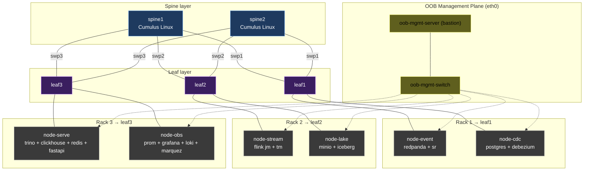

**Design choices:**

- Two spines for ECMP + spine failure testing.
- Three leaves so we can isolate one rack at a time during chaos.
- All compute on data plane (swpX); OOB only for SSH / package pulls.
- EVPN/VXLAN encapsulates tenant traffic — flap a VTEP and watch Kafka ISR react.

See [`docs/03-network-fabric-design.md`](./docs/03-network-fabric-design.md).

---

## 4. Compute layer — node roles

| Node | Role | vCPU | RAM | Disk | Session |
|---|---|---:|---:|---:|---|
| `oob-mgmt-server` | bastion, runs Ansible | 2 | 2 GB | 10 GB | always |
| `node-event` | redpanda + schema registry | 4 | 8 GB | 80 GB | A, B, C |
| `node-cdc` | postgres + debezium + kafka-connect | 4 | 8 GB | 40 GB | A, B |
| `node-stream` | flink jobmanager + 1 taskmanager | 4 | 12 GB | 30 GB | A |
| `node-lake` | minio + iceberg rest catalog | 4 | 8 GB | 200 GB | A, B, C |
| `node-batch` | dagster + great expectations | 2 | 6 GB | 30 GB | B |
| `node-serve` | trino + clickhouse + redis + fastapi | 4 | 12 GB | 40 GB | B, C |
| `node-obs` | prometheus + grafana + loki + marquez | 4 | 8 GB | 50 GB | A, B, C |
| `node-ai` | qdrant + rag service + embeddings worker | 2 | 6 GB | 20 GB | C |

**Session sizing:**

| Session | Active nodes | vCPU | RAM | Compute hr/h |
|---|---|---:|---:|---:|
| Session A — Backbone + Stream | event, cdc, stream, lake, obs | 20 | 44 GB | 25.5 |
| Session B — Batch + Serve | event, cdc, batch, lake, serve, obs | 22 | 50 GB | 28.25 |
| Session C — AI + Governance | event, lake, serve, obs, ai | 18 | 42 GB | 23.25 |

Stays under the 60 vCPU / 60 GiB concurrent ceiling, with headroom.

See [`docs/04-compute-platform.md`](./docs/04-compute-platform.md) · [`docs/19-cost-budget-guardrails.md`](./docs/19-cost-budget-guardrails.md).

---

## 5. Storage layer — persistent substrate

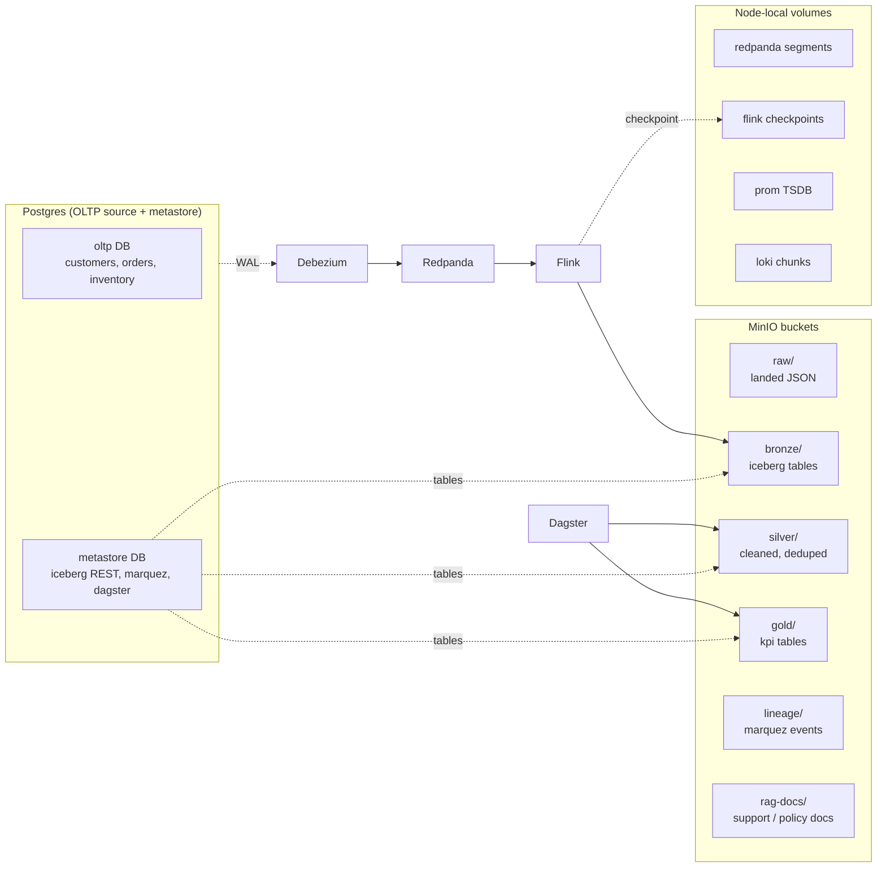

See [`docs/05-storage-layer.md`](./docs/05-storage-layer.md).

---

## 6. Event layer — backbone + CDC

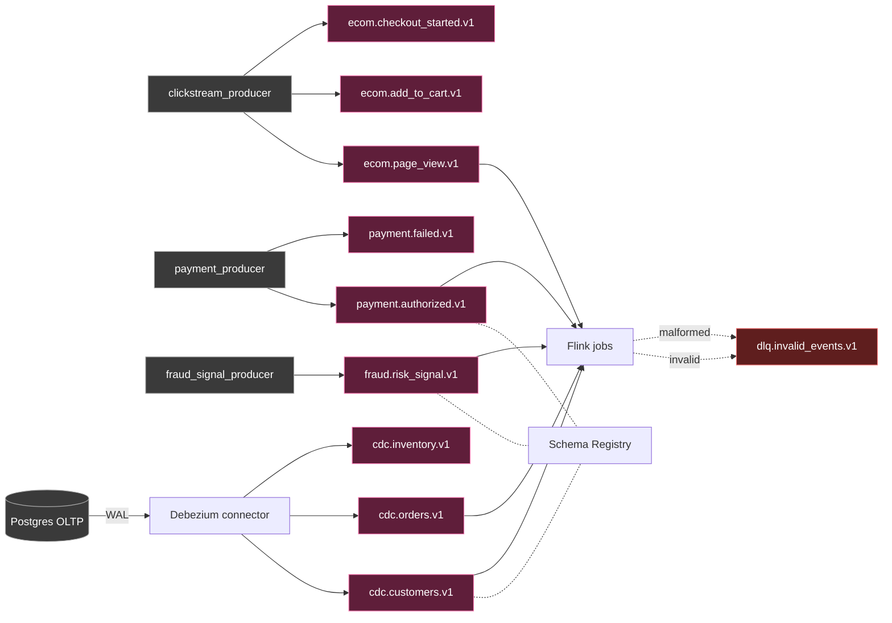

Topic naming convention: `{domain}.{event_type}.v{schema_version}`. Schema lives in [`schemas/`](./schemas/).

See [`docs/06-event-backbone.md`](./docs/06-event-backbone.md) · [`docs/07-cdc-design.md`](./docs/07-cdc-design.md).

---

## 7. Stream processing layer

Four Flink jobs, each with a clear streaming-concept showcase.

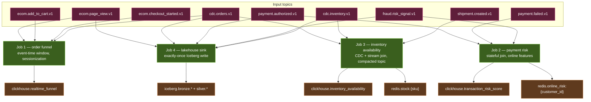

See [`docs/08-stream-processing.md`](./docs/08-stream-processing.md).

---

## 8. Lakehouse layer

Bronze → Silver → Gold with explicit ownership.

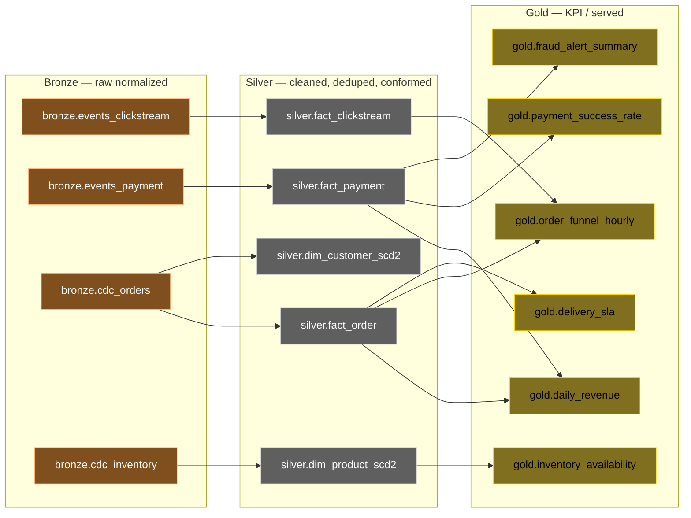

See [`docs/09-lakehouse-design.md`](./docs/09-lakehouse-design.md).

---

## 9. Batch + quality layer

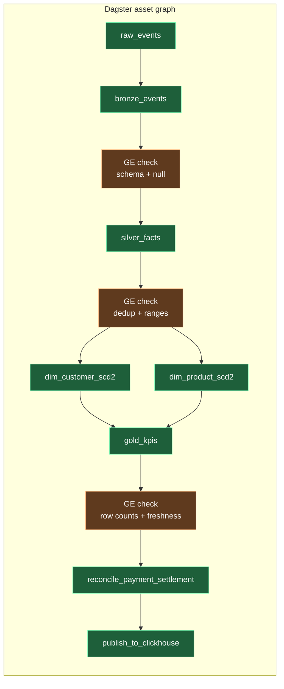

Why Dagster instead of Airflow: assets > tasks for lakehouse work, lighter RAM, native data contracts. See [ADR-0005](./adr/0005-dagster-over-airflow.md).

---

## 10. Serving layer

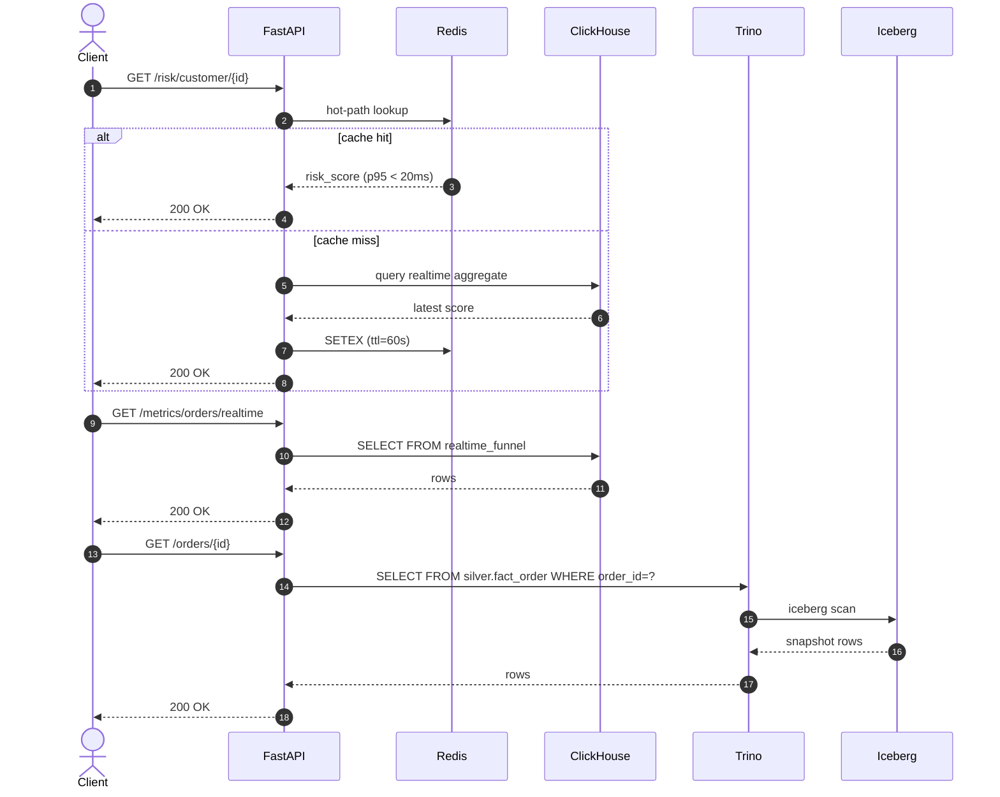

See [`docs/11-serving-layer.md`](./docs/11-serving-layer.md).

---

## 11. AI / RAG layer

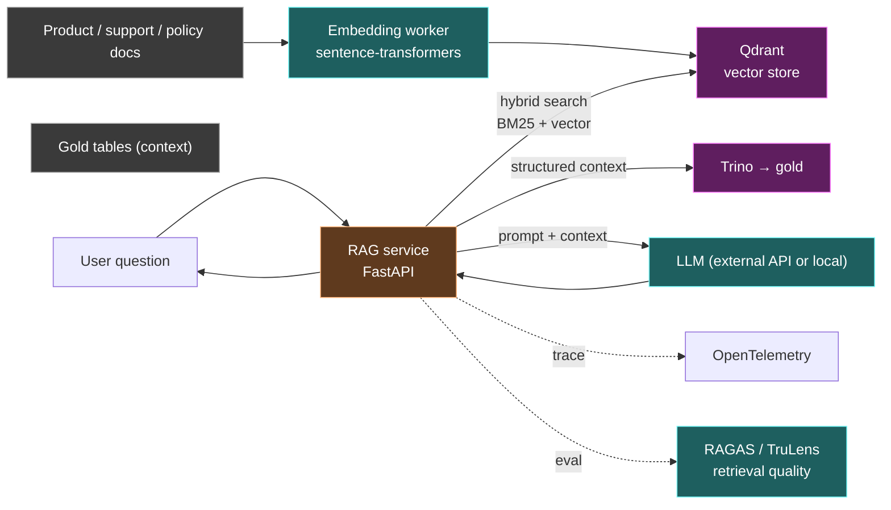

Evaluation framework is mandatory — no half-baked RAG. See [`docs/15-ai-rag-layer.md`](./docs/15-ai-rag-layer.md).

---

## 12. Observability + SLO layer

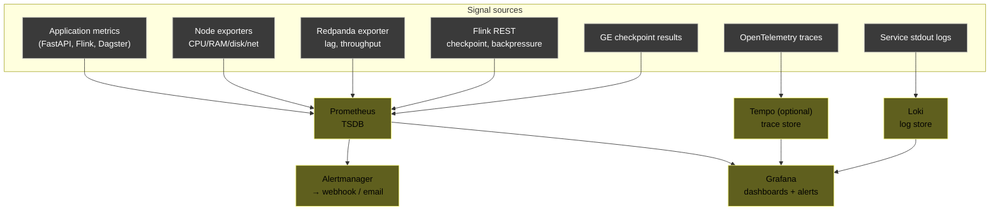

Documented SLOs:
- Pipeline freshness < 60s for realtime metrics
- DAG success > 99% in lab runs
- Data quality pass rate > 98%
- API p95 < 2s
- DLQ rate visible and explained

See [`docs/12-observability-slo.md`](./docs/12-observability-slo.md).

---

## 13. Governance + lineage

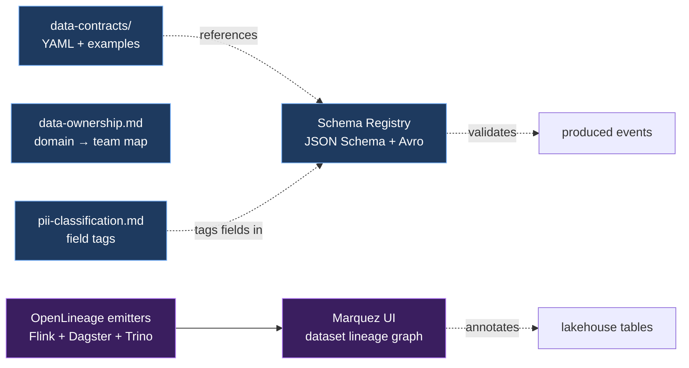

PII path is concrete:
1. `payment.authorized.v1` tags `card_number` as `pii=true, tokenize=true`
2. Flink `lakehouse_sink_job` tokenizes before bronze write
3. Silver / gold never contain raw PAN
4. Marquez tags the dataset as `pii.tokenized=true`

See [`docs/13-governance-lineage.md`](./docs/13-governance-lineage.md).

---

## 14. Security boundary

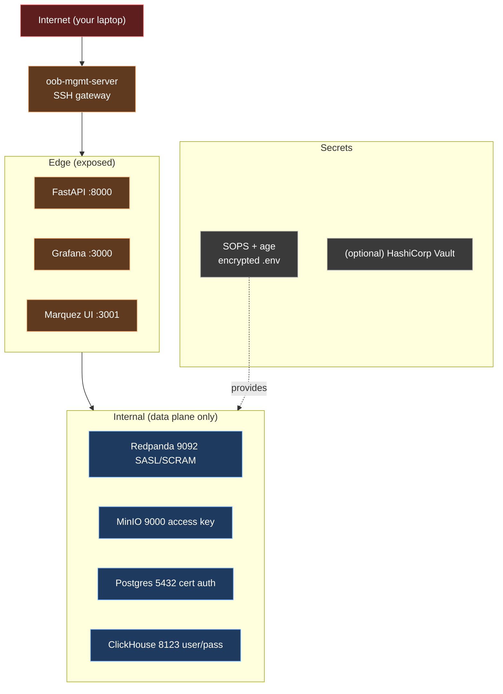

What's enforced:
- Kafka SASL/SCRAM + ACLs per topic per producer
- Trino group-based catalog access
- Dagster RBAC + Fernet key rotation
- Loki audit query log
- PII tokenization documented + tested

See [`docs/14-security-zero-trust.md`](./docs/14-security-zero-trust.md).

---

## 15. Chaos engineering surface

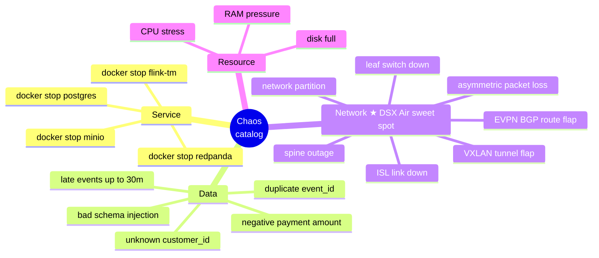

Network-fabric chaos is the differentiator. See [`docs/17-network-failure-storyline.md`](./docs/17-network-failure-storyline.md) and [`chaos/network/`](./chaos/network/).

---

## 16. Data flow end-to-end

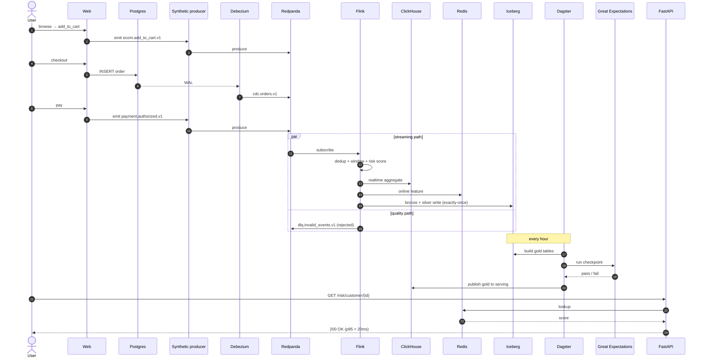

---

## 17. Failure cascade reference

What breaks when *X* fails, and what stays alive.

```mermaid
flowchart TB
    classDef fail fill:#5f1e1e,stroke:#ff7f7f,color:#fff
    classDef degraded fill:#5f5f1e,stroke:#ffff7f,color:#000
    classDef alive fill:#1e5f1e,stroke:#7fff7f,color:#fff

    F1["Redpanda down"]:::fail --> D1["Producers buffer + back off"]:::degraded
    F1 --> D2["Flink job restarts, replays from offset"]:::degraded
    F1 --> A1["ClickHouse keeps serving last data"]:::alive
    F1 --> A2["Lakehouse reads still work via Trino"]:::alive

    F2["Flink TM down"]:::fail --> D3["Stream lag spikes"]:::degraded
    F2 --> D4["Checkpoint recovery on restart"]:::degraded
    F2 --> A3["ClickHouse / lake unaffected"]:::alive

    F3["MinIO down"]:::fail --> D5["Bronze/silver writes fail (DLQ)"]:::degraded
    F3 --> D6["Trino queries error"]:::degraded
    F3 --> A4["Realtime metrics in ClickHouse still served"]:::alive
    F3 --> A5["Redpanda buffers until retention"]:::alive

    F4["Leaf switch down (DSX Air)"]:::fail --> D7["Whole rack offline"]:::degraded
    F4 --> D8["Other racks see partition"]:::degraded
    F4 --> A6["Surviving racks: serving, lake — keep running"]:::alive

    F5["VXLAN flap"]:::fail --> D9["Brief packet loss"]:::degraded
    F5 --> D10["Kafka ISR shrink → restore"]:::degraded
    F5 --> D11["Flink checkpoint may slow"]:::degraded
```

This cascade map drives the runbooks. Each failure mode has a runbook entry in [`runbooks/`](./runbooks/).

---

## See also

- [`ROADMAP.md`](./ROADMAP.md) — phase-by-phase execution plan
- [`docs/17-network-failure-storyline.md`](./docs/17-network-failure-storyline.md) — the differentiator
- [`adr/`](./adr/) — every kill-your-darling decision
- [`runbooks/`](./runbooks/) — what to do when the cascade fires
