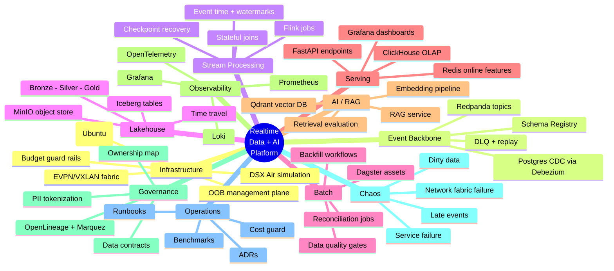
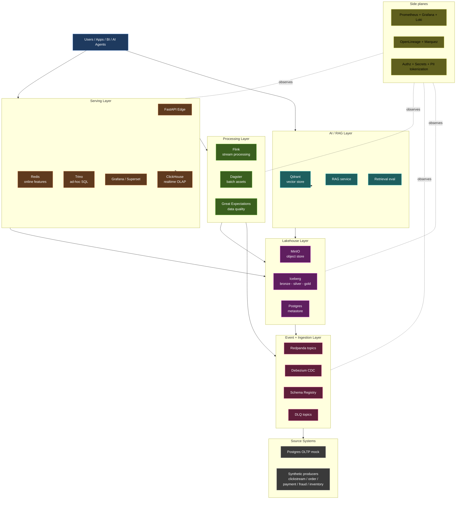
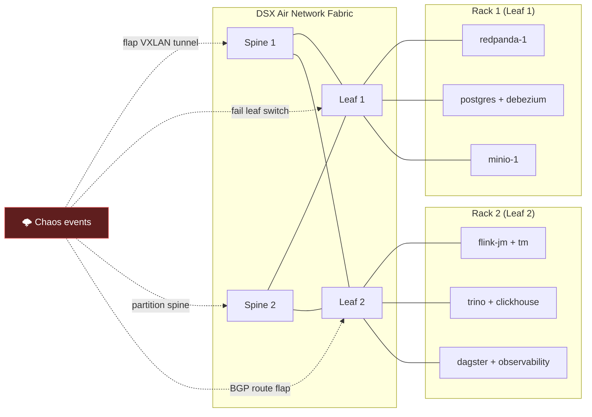
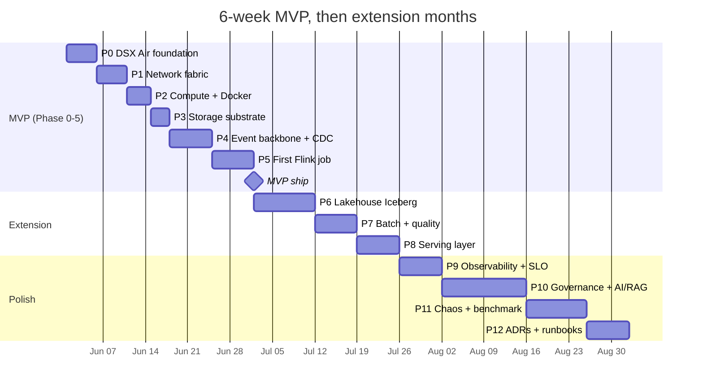
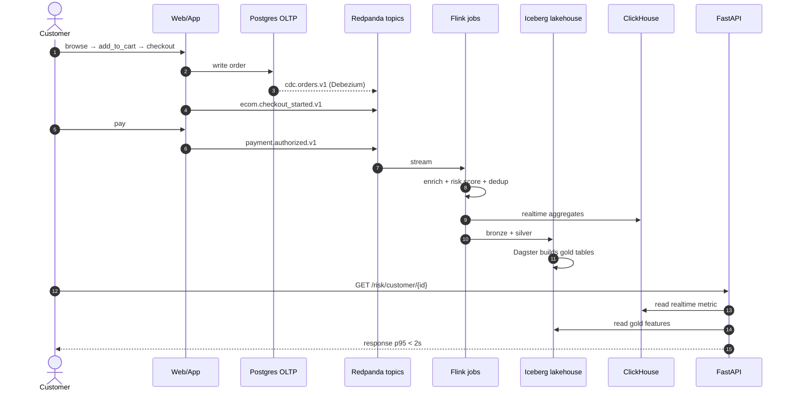

<div align="center">

# Realtime Data + AI Platform Digital Twin
### on NVIDIA DSX Air — a Network-Fabric-Aware Lab

[]()
[]()
[]()
[]()
[]()
[]()

**A production-inspired data + AI platform lab where the network fabric itself is part of the experiment.**

[Architecture](./ARCHITECTURE.md) · [Roadmap](./ROADMAP.md) · [ADRs](./adr) · [Runbooks](./runbooks) · [Chaos Catalog](./chaos) · [Benchmarks](./benchmarks)

</div>

---

## Why this repo exists

Most "modern data platform" GitHub projects stop at `docker compose up`. That proves you can install tools — not that you understand how a platform **behaves** under realistic stress, dirty data, late events, and **network fabric failure**.

This repo treats the **NVIDIA DSX Air simulation** as a **network-fabric digital twin** and layers a realistic event-driven data + AI platform on top of it. The differentiator: when other labs `docker stop kafka`, we **flap a VXLAN, fail a leaf switch, partition the EVPN underlay** and measure what the data platform actually does.

> **Build the platform → feed it realistic synthetic data → stress it with controlled scenarios → break the fabric beneath it → measure → recover → document.**

---

## What you'll see in this repo



---

## High-level architecture



---

## The differentiator: network-fabric chaos

The story most labs miss. DSX Air gives us a **simulated EVPN/VXLAN fabric** between compute nodes. We can fail it deliberately and watch the data platform react.



See [`docs/17-network-failure-storyline.md`](./docs/17-network-failure-storyline.md) and [`chaos/network/`](./chaos/network/).

---

## Build phases (bottom-up)

```mermaid
flowchart BT
    P0["Phase 0 — DSX Air foundation<br/>simulation, OOB, budget guard"]
    P1["Phase 1 — Network fabric<br/>EVPN + VXLAN + leaf/spine"]
    P2["Phase 2 — Compute platform<br/>Ubuntu nodes + Docker + Ansible"]
    P3["Phase 3 — Storage substrate<br/>MinIO + Postgres + persistent vols"]
    P4["Phase 4 — Event backbone<br/>Redpanda + CDC + Schema Registry + DLQ"]
    P5["Phase 5 — Stream processing<br/>Flink: funnel, risk, inventory"]
    P6["Phase 6 — Lakehouse<br/>Iceberg + Trino + bronze/silver/gold"]
    P7["Phase 7 — Batch + quality<br/>Dagster assets + GE + reconciliation"]
    P8["Phase 8 — Serving<br/>ClickHouse + Redis + FastAPI"]
    P9["Phase 9 — Observability + SLO<br/>Prometheus + Grafana + Loki"]
    P10["Phase 10 — Governance + AI<br/>contracts + lineage + Qdrant + RAG eval"]
    P11["Phase 11 — Chaos + benchmark<br/>service + data + network failure"]
    P12["Phase 12 — Packaging<br/>ADRs + runbooks + portfolio polish"]

    P0 --> P1 --> P2 --> P3 --> P4 --> P5 --> P6 --> P7 --> P8 --> P9 --> P10 --> P11 --> P12

    style P0 fill:#1e3a5f,color:#fff
    style P1 fill:#1e3a5f,color:#fff
    style P2 fill:#1e3a5f,color:#fff
    style P3 fill:#5f1e5f,color:#fff
    style P4 fill:#5f1e3a,color:#fff
    style P5 fill:#3a5f1e,color:#fff
    style P6 fill:#5f1e5f,color:#fff
    style P7 fill:#3a5f1e,color:#fff
    style P8 fill:#5f3a1e,color:#fff
    style P9 fill:#5f5f1e,color:#000
    style P10 fill:#1e5f5f,color:#fff
    style P11 fill:#5f1e1e,color:#fff
    style P12 fill:#3a3a3a,color:#fff
```



The first **6 phases** = MVP (shippable portfolio). See [`ROADMAP.md`](./ROADMAP.md).

---

## MVP-first timeline (Gantt)



---

## Domain modeled

E-commerce + payment + fraud, with banking-grade correctness expectations.



---

## Stack — kill-your-darlings choices

Each row has an ADR explaining what was rejected and why.

| Slot | Choice | Rejected | ADR |
|---|---|---|---|
| Event backbone | **Redpanda** | Kafka, NATS JetStream | [ADR-0002](./adr/0002-redpanda-over-kafka.md) |
| Stream processing | **Flink** | Spark Structured Streaming, Kafka Streams | [ADR-0003](./adr/0003-flink-over-spark-streaming.md) |
| Lakehouse table | **Iceberg** | Delta, Paimon, Hudi | [ADR-0004](./adr/0004-iceberg-over-delta-paimon.md) |
| Batch orchestrator | **Dagster** | Airflow, Prefect | [ADR-0005](./adr/0005-dagster-over-airflow.md) |
| Lineage | **OpenLineage + Marquez** | DataHub, OpenMetadata | [ADR-0006](./adr/0006-marquez-over-datahub.md) |
| Realtime OLAP | **ClickHouse** | Apache Pinot, Druid | [ADR-0007](./adr/0007-clickhouse-for-realtime-serving.md) |
| CDC | **Debezium → Redpanda** | Fivetran, Airbyte | covered in ADR-0002 |
| Vector DB | **Qdrant** | Weaviate, Milvus, pgvector | — |
| Query | **Trino** | Presto, DuckDB | — |
| Online cache | **Redis** | Memcached, DragonflyDB | — |

---

## Repository layout

```text
.
├── README.md                    ← you are here
├── ARCHITECTURE.md              ← deep dive with all diagrams
├── ROADMAP.md                   ← MVP-then-extend timeline
├── docs/                        ← per-layer design docs (20 files)
├── adr/                         ← 10 architecture decision records
├── topologies/                  ← DSX Air topology JSON files
├── dsx-air/                     ← DSX Air SDK scripts + budget guard
├── infra/                       ← Ansible playbooks + bootstrap scripts
├── platform/                    ← docker-compose per session
├── producers/                   ← synthetic event generators
├── schemas/                     ← JSON Schema + event contracts
├── streaming/flink/             ← 4 Flink jobs
├── batch/dagster/               ← Dagster assets + jobs
├── lakehouse/                   ← Iceberg DDL + SQL
├── serving/                     ← FastAPI + ClickHouse DDL + Redis config
├── ai/                          ← Qdrant + RAG + evaluation
├── observability/               ← Prometheus + Grafana dashboards + Loki
├── governance/                  ← data contracts + ownership + PII + lineage
├── quality/                     ← Great Expectations suites
├── chaos/
│   ├── service/                 ← docker stop X
│   ├── data/                    ← dirty / late / duplicate injection
│   └── network/                 ← VXLAN flap, leaf-down, EVPN reroute  ← differentiator
├── runbooks/                    ← incident response playbooks
├── tests/                       ← connectivity / unit / integration
├── benchmarks/                  ← scenarios + results
└── .github/workflows/           ← CI / schema + topology validation
```

Full breakdown: [`docs/02-architecture-layers.md`](./docs/02-architecture-layers.md).

---

## Quickstart

```bash
# 1. clone + env
git clone <this-repo>
cd realtime-data-ai-platform-digital-twin
cp .env.example .env

# 2. provision DSX Air simulation (uses nv-air-sdk)
make sim-create TOPOLOGY=topologies/01-data-platform-mvp.json
make sim-start

# 3. bootstrap nodes (Docker, base packages)
make bootstrap

# 4. launch session A (event backbone + streaming)
make session-a-up

# 5. produce synthetic events
make produce-normal       # 100 eps for 10m
make produce-burst        # 1000 eps for 2m
make produce-dirty        # 5% invalid, 10m
make produce-late         # late events up to 30m

# 6. observe
make grafana              # opens dashboards

# 7. break things
make chaos-redpanda-down
make chaos-vxlan-flap     # network-level chaos
make chaos-leaf-down      # rack isolation

# 8. always tear down to save credits
make sim-stop
make budget-status        # how many compute hours left
```

Full Makefile reference: [`docs/04-compute-platform.md`](./docs/04-compute-platform.md).

---

## Non-goals (honest)

This is a **lab**, not production. It does not claim:

- Production-scale throughput. ClickHouse on a sim node ≠ ClickHouse on bare metal.
- Real benchmark numbers. Network is simulated; absolute latencies are not comparable.
- Hardened security or compliance. PII tokenization is **demonstrated**, not certified.
- Real-world data. All events are synthetic.
- 24/7 uptime. Simulation is stopped between sessions to save credits.

Full statement: [`docs/99-limitations-and-honesty.md`](./docs/99-limitations-and-honesty.md).

---

## Cost guard rails

DSX Air trial = 10,000 compute hours over 1 year. A forgotten weekend can burn 9% of budget. We solve this with:

- [`dsx-air/scripts/budget_guard.py`](./dsx-air/scripts/budget_guard.py) — cron auto-stops sim when daily burn > threshold.
- [`docs/19-cost-budget-guardrails.md`](./docs/19-cost-budget-guardrails.md) — the math + monitoring.

---

## References

NVIDIA DSX Air official:
- [User Guide](https://docs.nvidia.com/networking-ethernet-software/nvidia-air-v2/)
- [Account Setup + billing](https://docs.nvidia.com/networking-ethernet-software/nvidia-air-v2/Account-Setup/)
- [Custom Topology](https://docs.nvidia.com/networking-ethernet-software/nvidia-air-v2/Custom-Topology/)
- [Simulation Management](https://docs.nvidia.com/networking-ethernet-software/nvidia-air-v2/Simulation-Management/)
- [API / SDK](https://docs.nvidia.com/networking-ethernet-software/nvidia-air-v2/API-SDK/) · [`nv-air-sdk`](https://pypi.org/project/nv-air-sdk/)

OSS:
[Redpanda](https://redpanda.com) · [Debezium](https://debezium.io) · [Flink](https://flink.apache.org) · [Iceberg](https://iceberg.apache.org) · [Trino](https://trino.io) · [ClickHouse](https://clickhouse.com) · [MinIO](https://min.io) · [Dagster](https://dagster.io) · [Great Expectations](https://greatexpectations.io) · [OpenLineage](https://openlineage.io) · [Marquez](https://marquezproject.ai) · [Qdrant](https://qdrant.tech) · [Prometheus](https://prometheus.io) · [Grafana](https://grafana.com) · [FastAPI](https://fastapi.tiangolo.com)

---

<div align="center">

Built for Senior / Lead **Data + AI Platform Architect** portfolio.<br/>
[License: MIT](./LICENSE) · [Changelog](./CHANGELOG.md) · [Contributing](./CONTRIBUTING.md)

</div>
