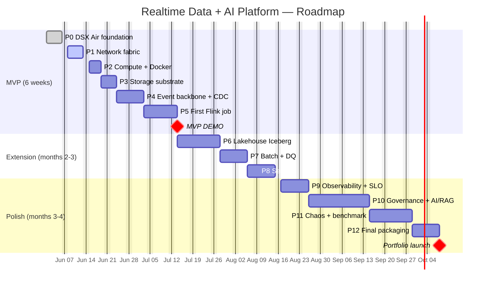
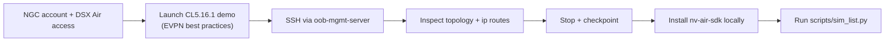
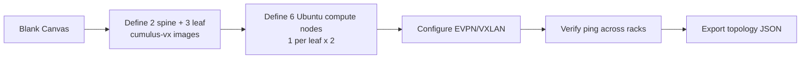
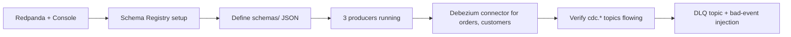
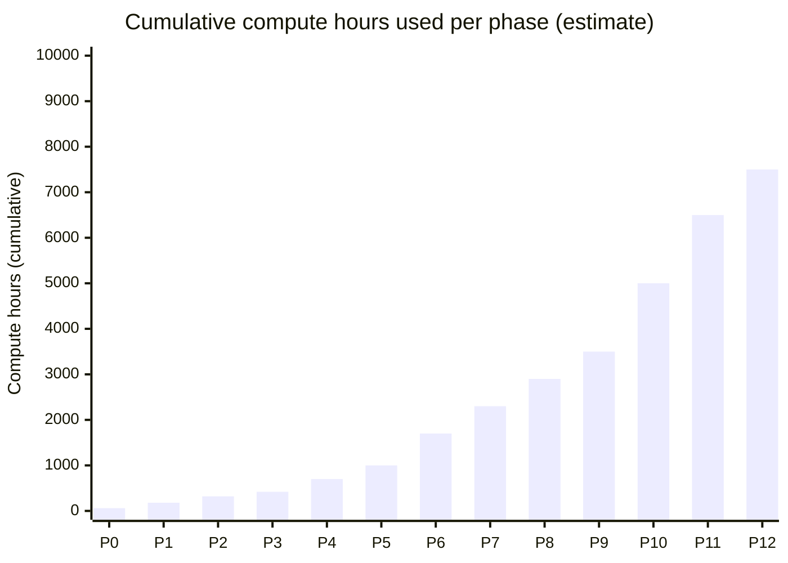

# Roadmap — MVP-first, then extend

> Philosophy: **shippable MVP in 6 weeks**, polish over the next 4 months. Avoid the 12-weeks-and-half-done trap.

**Related:** [README.md](./README.md) · [ARCHITECTURE.md](./ARCHITECTURE.md) · [adr/](./adr/)

---

## Timeline at a glance



---

## MVP — Phase 0 → 5 (≈ 6 weeks)

The MVP is **the demo-able portfolio piece**. Even if life happens after, you have something to show.

### MVP Definition of Done

```text
[ ] DSX Air simulation with 3-leaf, 2-spine topology running
[ ] OOB management plane functional, bastion SSH-able
[ ] 6 Ubuntu compute nodes bootstrapped with Docker via Ansible
[ ] Postgres OLTP source with synthetic schema + seed data
[ ] Redpanda 1-broker (lab scale) with Schema Registry
[ ] Debezium CDC streaming orders, customers, inventory
[ ] 3 synthetic producers: clickstream, payment, fraud
[ ] 1 Flink job: order funnel (event-time window + late event handling)
[ ] DLQ topic with rejected events
[ ] Prometheus + Grafana with consumer lag dashboard
[ ] 1 chaos test executed + documented: VXLAN flap on data plane
[ ] README + ARCHITECTURE + 1 ADR + 1 runbook
[ ] budget_guard.py running as cron, auto-stops sim at threshold
[ ] Total compute used < 1500 hours
```

### MVP detailed phases

#### Phase 0 — DSX Air foundation (5 days)



| Day | Output |
|---:|---|
| 1 | NGC org, trial activated, billing dashboard bookmarked |
| 2 | Launch EVPN demo, SSH all nodes, document `ip addr` of each |
| 3 | Install `nv-air-sdk`, run list/start/stop programmatically |
| 4 | Write `dsx-air/scripts/budget_guard.py` + cron setup |
| 5 | `docs/01-dsx-air-foundations.md` complete |

**Files produced:** `dsx-air/scripts/*.py`, `docs/01-dsx-air-foundations.md`, `.env.example` populated.

#### Phase 1 — Network fabric (5 days)



| Day | Output |
|---:|---|
| 1-2 | Topology JSON, OOB wired, deploy via SDK |
| 3 | EVPN configured on spines; VXLAN VNI 10100 between leaves |
| 4 | Verify ECMP + ping across racks; document `ip route` |
| 5 | `topologies/01-data-platform-mvp.json` + `docs/03-network-fabric-design.md` |

#### Phase 2 — Compute platform (4 days)

| Day | Output |
|---:|---|
| 1 | `infra/ansible/inventory.ini` from topology export |
| 2 | `playbooks/00-bootstrap.yml` — hostnames, users, sudo, NTP |
| 3 | `playbooks/01-docker.yml` — docker engine + compose plugin |
| 4 | Smoke test: `nginx-hello` on each node, reachable via OOB |

#### Phase 3 — Storage substrate (3 days)

| Day | Output |
|---:|---|
| 1 | MinIO single-node on `node-lake`, 200GB volume, root + readonly users |
| 2 | Postgres on `node-cdc` with `wal_level=logical`, replication slots |
| 3 | Postgres on `node-batch` as metastore; seed schema for OLTP + iceberg + marquez + dagster |

#### Phase 4 — Event backbone + CDC (7 days)



| Day | Output |
|---:|---|
| 1-2 | Redpanda up, topics created, Schema Registry healthy |
| 3 | JSON Schema for 5 event types in `schemas/` |
| 4-5 | Clickstream, payment, fraud producers — normal + burst + dirty + late modes |
| 6 | Debezium connector for `customers`, `orders`, `inventory` |
| 7 | DLQ topic + invalid event test |

#### Phase 5 — First Flink job (7 days)

| Day | Output |
|---:|---|
| 1-2 | Flink session cluster (1 JM + 1 TM), checkpointing to MinIO |
| 3-4 | `order_funnel_job` consuming 4 topics, event-time window 5min |
| 5 | Late event handling: 30-min allowed lateness, side output to lateness topic |
| 6 | Sink to ClickHouse table `realtime_funnel` |
| 7 | Chaos test #1: VXLAN flap → document checkpoint behavior |

**MVP demo:** record a 5-min screencast showing producers → Redpanda → Flink → ClickHouse → Grafana dashboard updating in real time, then trigger `chaos-vxlan-flap` and show recovery.

---

## Extension — Phase 6 → 8 (months 2-3)

### Phase 6 — Lakehouse Iceberg (10 days)

| Sub-phase | Output |
|---|---|
| 6a — Iceberg REST catalog | catalog up, Postgres metastore wired |
| 6b — Bronze tables | Flink `lakehouse_sink_job` writes `bronze.events_*` |
| 6c — Silver via Dagster | Spark-less Python writers using `pyiceberg` |
| 6d — Trino integration | Trino queries `iceberg.silver.*` |
| 6e — Time travel demo | snapshot rollback documented |

### Phase 7 — Batch + data quality (7 days)

| Sub-phase | Output |
|---|---|
| 7a — Dagster project | assets + jobs structure |
| 7b — Gold tables | revenue, funnel, success_rate, fraud_summary |
| 7c — Great Expectations | 3 suites: bronze schema, silver dedup, gold ranges |
| 7d — Reconciliation | stream-vs-batch revenue diff < 0.5% |

### Phase 8 — Serving (7 days)

| Sub-phase | Output |
|---|---|
| 8a — ClickHouse | materialized views over Iceberg via S3 engine |
| 8b — Redis online features | TTL 60s, populated by Flink |
| 8c — FastAPI | 6 endpoints, OpenAPI docs, JWT auth stub |
| 8d — Grafana | 6 dashboards: funnel, payment, fraud, inventory, infra, freshness |

---

## Polish — Phase 9 → 12 (months 3-4)

### Phase 9 — Observability + SLO (7 days)

| Sub-phase | Output |
|---|---|
| 9a — OTEL collector | traces from FastAPI + Flink |
| 9b — Loki | log aggregation per service |
| 9c — SLO docs | targets + burn-rate alerts |
| 9d — Alert rules | 12 alerts mapped to runbooks |

### Phase 10 — Governance + AI/RAG (14 days)

| Sub-phase | Output |
|---|---|
| 10a — Data contracts | YAML in `governance/data-contracts/` |
| 10b — OpenLineage | emitters in Flink + Dagster + Trino |
| 10c — Marquez | UI on `node-obs:3001` |
| 10d — PII tokenization | concrete Flink transform on `card_number` |
| 10e — Qdrant + embeddings | small sentence-transformers model |
| 10f — RAG service | FastAPI, hybrid BM25 + vector |
| 10g — RAG evaluation | RAGAS / TruLens suite + report |

### Phase 11 — Chaos + benchmark (10 days)

| Sub-phase | Output |
|---|---|
| 11a — Service chaos | 4 scenarios, each → runbook |
| 11b — Data chaos | dirty / late / duplicate at scale |
| 11c — Network chaos | 6 fabric-level failures (the differentiator) |
| 11d — Benchmark | 7-scenario matrix, results in `benchmarks/results/` |

### Phase 12 — Final packaging (7 days)

| Sub-phase | Output |
|---|---|
| 12a — All 10 ADRs reviewed | final + cross-linked |
| 12b — Runbooks complete | 8 runbooks indexed |
| 12c — Benchmark write-up | `docs/18-benchmark-strategy.md` + results |
| 12d — README polish | badges, screencast, hero image |
| 12e — CV / LinkedIn copy | `docs/portfolio-positioning.md` |

---

## Compute budget per phase



Target: **end of P12 at ~7500 hours**, leaving 2500 hr buffer for re-runs, demos, and screen-recording sessions.

---

## Risk register

| Risk | Probability | Impact | Mitigation |
|---|---|---|---|
| Forget to stop sim overnight | High | 100-200 ch/incident | `budget_guard.py` cron + idle auto-stop |
| Phase slips by 2x | High | Timeline drift | MVP-first; extension is optional |
| DSX Air sim node OOM under burst | Medium | Hours of re-debug | Use Resource-constrained profile + smaller burst |
| Storage 10GB default exceeded | Medium | Service crash | Declare disk in topology JSON upfront |
| RAGAS scope creeps | Medium | Quality dilution | Cap AI to 2 weeks; cut if needed |
| Trial expires mid-build | Low (1yr) | Total loss | Phase 12d export-everything-locally |

---

## What "done" looks like

A recruiter or interviewer opening the repo should within 5 minutes see:

1. README with hero diagram + clear scope/non-goals
2. ARCHITECTURE.md with C4 + flow + sequence diagrams
3. ROADMAP.md with Gantt and phase checklist
4. ADRs that show *what you chose not to build* and why
5. A network-chaos screencast / GIF — the moment they say "wait, the network is part of this?"
6. Benchmark results with honest numbers
7. Runbooks that read like a real on-call playbook

If any of those is missing or weak, the project is not done.
