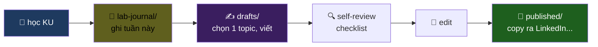

# Blogs — Writing Lab

> Học → ghi → viết → publish. Viết là cách test hiểu thực sự.

---

## 📂 Cấu trúc

```
blogs/
├── README.md             ← bạn ở đây
├── drafts/               ← bản nháp đang viết
├── published/            ← bản đã sẵn sàng public (LinkedIn / Medium / Dev.to)
├── series/               ← multi-part blog series
└── templates/
    ├── deep-dive-template.md
    ├── lessons-learned-template.md
    └── adr-recap-template.md
```

---

## 3 loại blog template

### 1. Deep-dive (~2000 từ)
Giải thích sâu 1 concept. Dùng cho: VXLAN flap, exactly-once Flink, Iceberg time-travel.

### 2. Lessons learned (~1200 từ)
Từ 1 chaos experiment hoặc 1 phase build. "Tuần này tôi thử failover EVPN, học được X / Y / Z."

### 3. ADR recap (~800 từ)
Biến 1 ADR thành blog kể chuyện. "Vì sao tôi chọn Redpanda thay vì Kafka cho lab của mình."

---

## Workflow



---

## Style guide

- **Tiếng Việt** là chính. Tiếng Anh chỉ cho thuật ngữ.
- **Mở bài 3 dòng**, hút trong 5 giây.
- **Câu chuyện trước, kỹ thuật sau.** Người đọc phải care trước khi học.
- **Diagram** ít nhất 1 — Mermaid.
- **Mã** chỉ khi cần, snippet ngắn.
- **CTA cuối:** mời đọc repo, follow GitHub, tag bạn quan tâm.

---

## Self-review checklist (trước khi publish)

- [ ] Bài có hook đủ mạnh trong 3 dòng đầu?
- [ ] Bài có ít nhất 1 analogy đời sống?
- [ ] Bài có ít nhất 1 diagram Mermaid?
- [ ] Trade-off / khi-nào-không-dùng có không?
- [ ] Có link về repo / về KU gốc?
- [ ] Title có < 70 ký tự?
- [ ] Subtitle 1 dòng + emoji nhẹ?
- [ ] Tôi đã đọc to bài và không vấp chỗ nào?

Tất cả check → publish.
