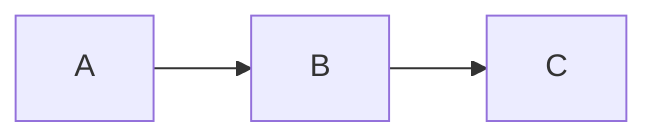

# <Title — tối đa 70 ký tự, không click-bait>

**TL;DR (3 dòng):**
- ...
- ...
- ...

**Đọc trong:** ~10 phút · **Cấp độ:** intermediate

---

## Mở bài (hook)

3 dòng — phải hút trong 5 giây.

Mẫu hook:
> "Tuần trước tôi flap 1 cái VXLAN tunnel và Kafka mất 5 giây ack. Đây là câu chuyện về tại sao chuyện đó xảy ra, và tại sao nó không phải bug."

---

## Bối cảnh

Tôi đang làm gì, đang thấy gì? 1 đoạn ngắn.

---

## Nói về <concept>

Analogy đời sống mở đầu. Sau đó technical.

---

## Nó vận hành ra sao

Step by step. Code minimal nếu có.

---

## Trade-off / Khi nào KHÔNG dùng

Quan trọng. Bài viết không có cái này = bài sách giáo khoa.

| ✅ Dùng | ❌ Không dùng |
|---|---|
| ... | ... |

---

## Tôi đã thử

Snippet 1 chaos run / 1 benchmark. Bảng kết quả.

---

## Bài học

3 dòng take-away.

---

## Đọc thêm

- KU gốc trong repo của tôi: [link]
- Tài liệu chính thống: [link]

---

**Repo:** github.com/<user>/realtime-data-ai-platform-digital-twin
**LinkedIn:** ...
**Series:** part X/Y
