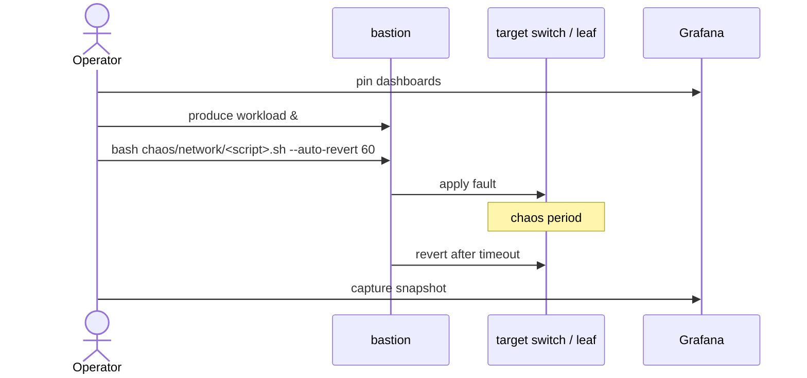

# chaos/network/ ★

The differentiator. These scripts target the DSX Air-simulated EVPN/VXLAN fabric.

## Scripts

| Script | Scenario | Default duration | Affected component |
|---|---|---:|---|
| `vxlan_flap.sh` | flap data-plane VXLAN tunnel | 5s | leaf1 → all hosts on rack 1 |
| `leaf_switch_down.sh` | bring leaf1 down | 60s | whole rack 1 |
| `isl_link_down.sh` | drop one spine-leaf link | until restored | partial bandwidth |
| `evpn_route_flap.sh` | BGP soft-clear on a leaf | n/a | brief blackhole |
| `spine_down.sh` | bring spine1 down | 60s | half ECMP bandwidth |
| `async_packet_loss.sh` | netem 5% loss on swp1 | 5m | sneaky degradation |

## Operating model

## Required env

`CHAOS_SSH_KEY=path/to/private` — must be the key that authorises root on the simulation switches via OOB.

`OOB_MGMT_USER=cumulus` (or `admin` on SONiC).

See [`docs/17-network-failure-storyline.md`](../../docs/17-network-failure-storyline.md) for the full story arc and expected platform reactions.
