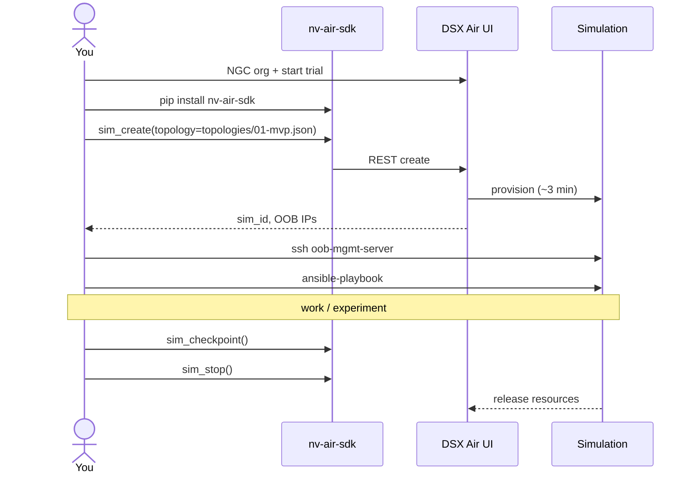

# 01 — DSX Air foundations

> What DSX Air is, what it's good at, and how we use it.

## What DSX Air is (verified)

A cloud-hosted simulation platform for AI factory data center infrastructure. Native focus: NVIDIA Spectrum-X Ethernet, NVLink, Cumulus Linux, SONiC. Server nodes run Ubuntu and can host arbitrary Docker workloads.

| Trial spec | Value | Source |
|---|---:|---|
| Concurrent vCPU | 60 | [docs.nvidia.com](https://docs.nvidia.com/networking-ethernet-software/nvidia-air-v2/Account-Setup/) |
| Concurrent RAM | 60 GiB | same |
| Compute hours | 10,000 | same |
| Duration | 1 year | same |
| Billing unit | compute hour, by minute | same |

**Compute hour formula:** `ch_per_hour = vCPU + RAM_GB / 8`. See [`docs/19-cost-budget-guardrails.md`](./19-cost-budget-guardrails.md).

## What it's good for in this project

- Network fabric simulation (EVPN, VXLAN, BGP, ECMP) — see [`docs/03-network-fabric-design.md`](./03-network-fabric-design.md).
- General-purpose Ubuntu nodes hosting Docker → all our data services.
- Programmatic sim lifecycle via `nv-air-sdk`.
- Persistent storage on nodes (default 10 GB, configurable up to 200+ GB).

## What it's NOT for

- 24/7 hosting (credits run out).
- Production benchmarking (simulated network ≠ bare metal).
- GPU model training (no real GPU; DSX simulates DPUs/SuperNICs, not compute GPUs).
- Long-lived stateless apps (Hetzner / Oracle free tier is cheaper for that).

## Workflow

## Key references

- [User Guide](https://docs.nvidia.com/networking-ethernet-software/nvidia-air-v2/)
- [Account Setup](https://docs.nvidia.com/networking-ethernet-software/nvidia-air-v2/Account-Setup/) — trial specs + billing
- [Quick Start](https://docs.nvidia.com/networking-ethernet-software/nvidia-air-v2/Quick-Start/)
- [Pre-built Demos](https://docs.nvidia.com/networking-ethernet-software/nvidia-air-v2/Pre-Built-Demos/)
- [Custom Topology](https://docs.nvidia.com/networking-ethernet-software/nvidia-air-v2/Custom-Topology/)
- [OOB Management Network](https://docs.nvidia.com/networking-ethernet-software/nvidia-air-v2/OOB-Management-Network/)
- [Simulation Management](https://docs.nvidia.com/networking-ethernet-software/nvidia-air-v2/Simulation-Management/)
- [API/SDK](https://docs.nvidia.com/networking-ethernet-software/nvidia-air-v2/API-SDK/)
- [`nv-air-sdk` on PyPI](https://pypi.org/project/nv-air-sdk/)
