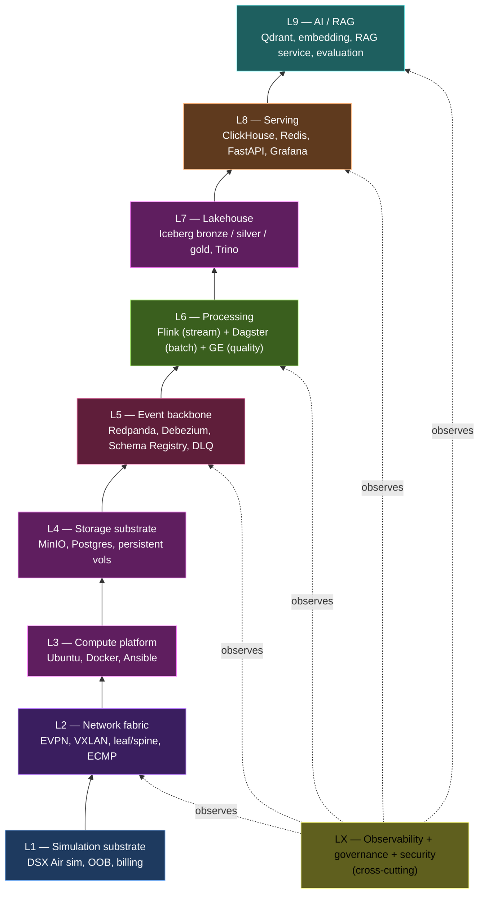

# 02 — Architecture layers (bottom-up)

> Read this once, top-down, and you'll know where every directory in the repo belongs.

---

## L1 — Simulation substrate

- **What:** the DSX Air simulation itself, the OOB management plane, billing/credit limits.
- **Where in repo:** [`dsx-air/`](../dsx-air/), [`topologies/`](../topologies/), [`docs/01-dsx-air-foundations.md`](./01-dsx-air-foundations.md), [`docs/19-cost-budget-guardrails.md`](./19-cost-budget-guardrails.md)
- **Key artifacts:** sim manifests, OOB SSH config, budget guard script.

## L2 — Network fabric

- **What:** the EVPN/VXLAN underlay between compute nodes — the unique surface for chaos.
- **Where in repo:** [`topologies/01-data-platform-mvp.json`](../topologies/), [`docs/03-network-fabric-design.md`](./03-network-fabric-design.md), [`chaos/network/`](../chaos/network/)
- **Tools:** Cumulus Linux (on switches), FRR / vtysh, `iproute2`, `tc netem`.

## L3 — Compute platform

- **What:** the Ubuntu nodes provisioned with Docker. Foundation for every running service.
- **Where in repo:** [`infra/ansible/`](../infra/ansible/), [`infra/scripts/`](../infra/scripts/), [`docs/04-compute-platform.md`](./04-compute-platform.md)
- **Tools:** Ansible, Docker Engine, Compose plugin.

## L4 — Storage substrate

- **What:** MinIO for object storage; Postgres for OLTP + metastores; node-local volumes for service state.
- **Where in repo:** [`platform/docker-compose.session-a.yml`](../platform/), [`docs/05-storage-layer.md`](./05-storage-layer.md)

## L5 — Event backbone

- **What:** Redpanda topics, Debezium CDC, Schema Registry, DLQ. The connecting fabric of the data plane.
- **Where in repo:** [`producers/`](../producers/), [`schemas/`](../schemas/), [`docs/06-event-backbone.md`](./06-event-backbone.md), [`docs/07-cdc-design.md`](./07-cdc-design.md)

## L6 — Processing

- **What:** Flink stream jobs + Dagster batch assets + Great Expectations gates.
- **Where in repo:** [`streaming/flink/`](../streaming/flink/), [`batch/dagster/`](../batch/dagster/), [`quality/`](../quality/), [`docs/08-stream-processing.md`](./08-stream-processing.md), [`docs/10-batch-orchestration.md`](./10-batch-orchestration.md)

## L7 — Lakehouse

- **What:** Iceberg tables, bronze→silver→gold zone model, time travel, Trino federation.
- **Where in repo:** [`lakehouse/`](../lakehouse/), [`docs/09-lakehouse-design.md`](./09-lakehouse-design.md)

## L8 — Serving

- **What:** the part users hit — ClickHouse OLAP, Redis online features, FastAPI APIs, Grafana dashboards.
- **Where in repo:** [`serving/`](../serving/), [`observability/grafana/`](../observability/grafana/), [`docs/11-serving-layer.md`](./11-serving-layer.md)

## L9 — AI / RAG

- **What:** Qdrant vector store, embedding pipeline, RAG service, retrieval-quality evaluation.
- **Where in repo:** [`ai/`](../ai/), [`docs/15-ai-rag-layer.md`](./15-ai-rag-layer.md)
- **Note:** evaluated for cuts in MVP; full delivery in Phase 10.

## LX — Cross-cutting

| Concern | Where |
|---|---|
| Observability + SLO | [`observability/`](../observability/), [`docs/12-observability-slo.md`](./12-observability-slo.md) |
| Governance + lineage | [`governance/`](../governance/), [`docs/13-governance-lineage.md`](./13-governance-lineage.md) |
| Security boundary | [`docs/14-security-zero-trust.md`](./14-security-zero-trust.md) |
| Chaos catalog | [`chaos/`](../chaos/), [`docs/16-failure-chaos-catalog.md`](./16-failure-chaos-catalog.md) |
| Cost guard | [`dsx-air/scripts/budget_guard.py`](../dsx-air/scripts/budget_guard.py), [`docs/19-cost-budget-guardrails.md`](./19-cost-budget-guardrails.md) |

---

## How to read a phase in `ROADMAP.md`

Every phase delivers **one or two layers** end-to-end before moving on:

| Phase | Primary layer(s) | Secondary touches |
|---|---|---|
| P0 | L1 | budget guard, SDK scripts |
| P1 | L2 | OOB plane |
| P2 | L3 | Ansible inventory |
| P3 | L4 | initial persistent vols |
| P4 | L5 | DLQ + Schema Registry |
| P5 | L6 (streaming) | + sink to L8 (ClickHouse table) |
| P6 | L7 | Flink Iceberg sink connector |
| P7 | L6 (batch) | quality gates wired to L6+L7 |
| P8 | L8 | Trino federation |
| P9 | LX (observability) | dashboards over L5+L6+L8 |
| P10 | LX (governance) + L9 | lineage emitters across L6 |
| P11 | LX (chaos) | exercises L2 + L5 + L6 |
| P12 | packaging | ADRs, runbooks, benchmark |
