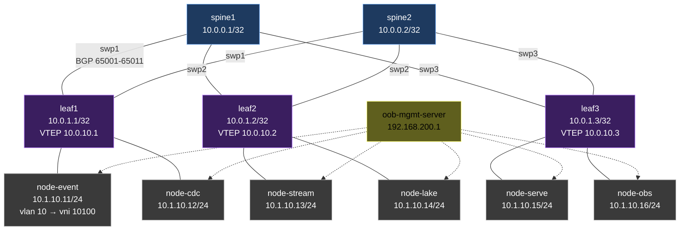

# 03 — Network fabric design

> The leaf-spine EVPN/VXLAN fabric that everything else runs on.

## Target topology



## Address plan

| Plane | Subnet | Purpose |
|---|---|---|
| Loopbacks | `10.0.0.0/16` | router IDs |
| P2P fabric | `10.0.100.0/24` /31 between spine-leaf | underlay |
| VTEP | `10.0.10.0/24` | VXLAN endpoints |
| Tenant data (VNI 10100) | `10.1.10.0/24` | platform data plane |
| OOB management | `192.168.200.0/24` | SSH + Ansible |

## Routing

- **Underlay:** eBGP unnumbered, AS per device (spines 65001-65002, leaves 65011-65013).
- **Overlay:** BGP EVPN (L2VPN/EVPN AFI), VXLAN VNI 10100, all tenants in one L2 broadcast domain for MVP.
- **ECMP:** active on all spines for equal-cost paths.

## Concept demo per chaos scenario

| Concept | Demonstrated by chaos |
|---|---|
| ECMP rehash | N3 ISL down |
| VTEP MAC learning | N1 VXLAN flap |
| BGP convergence time | N4 EVPN route flap |
| Asymmetric failure | N6 packet loss |
| Failure domain isolation | N2 leaf down |
| ECMP fallback | N5 spine outage |

## Verification commands (post-deploy)

```bash
# from any leaf
sudo vtysh -c "show bgp summary"
sudo vtysh -c "show bgp l2vpn evpn summary"
ip route show
bridge fdb show

# from a host
ping -c 3 <host-in-other-rack>
traceroute <host-in-other-rack>
ip neigh
```

## Topology JSON

Generated by `dsx-air/scripts/sim_create.py` and committed at [`topologies/01-data-platform-mvp.json`](../topologies/).
