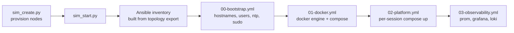

# 04 — Compute platform

> How we go from "6 Ubuntu boxes" to "Docker-ready nodes with Ansible-managed config."

## Node inventory (Session A example)

| Hostname | vCPU | RAM (GB) | Disk (GB) | Services |
|---|---:|---:|---:|---|
| `oob-mgmt-server` | 2 | 2 | 10 | bastion, Ansible controller |
| `node-event` | 4 | 8 | 80 | redpanda, rp-console, schema-registry |
| `node-cdc` | 4 | 8 | 40 | postgres-oltp, debezium |
| `node-stream` | 4 | 12 | 30 | flink-jm, flink-tm |
| `node-lake` | 4 | 8 | 200 | minio, iceberg-rest |
| `node-obs` | 4 | 8 | 50 | prometheus, grafana, loki, marquez |

Disk sizes are declared in `topologies/01-data-platform-mvp.json`. **Do not rely on the 10 GB default** — services like MinIO and Prometheus will exceed it within a day.

## Bootstrap flow



## Ansible layout

```text
infra/ansible/
  inventory.ini.example
  group_vars/
    all.yml                # ssh_user, docker_version, ntp servers
    event.yml              # redpanda heap, retention
    stream.yml             # flink JM/TM memory
    lake.yml               # minio access keys via vault
  playbooks/
    00-bootstrap.yml
    01-docker.yml
    02-platform.yml
    03-observability.yml
  roles/
    common/                # users, sudo, ntp, sysctl
    docker/                # docker engine + compose plugin
    compose-deploy/        # render + up per-session compose
    secrets/               # SOPS-encrypted .env materialization
```

## Makefile entry points

```text
make bootstrap          # = 00 + 01 against all hosts
make session-a-up       # = 02 with session-a compose
make session-b-up       # = 02 with session-b compose
make session-c-up       # = 02 with session-c compose
make observability-up   # = 03
```

## Bootstrap idempotency

All playbooks are idempotent — re-running on a partially configured node converges, doesn't error. CI runs `--check` mode on every PR (see `.github/workflows/ci.yml`).
