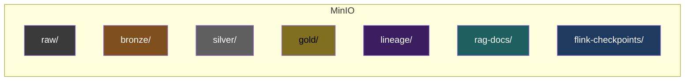

# 05 — Storage substrate

## Layout

| System | Where | Purpose |
|---|---|---|
| MinIO | `node-lake:9000` | S3-compatible object store; buckets: `raw`, `bronze`, `silver`, `gold`, `lineage`, `rag-docs`, `flink-checkpoints` |
| Postgres OLTP | `node-cdc:5432` | source-of-truth for CDC: customers, products, inventory, orders |
| Postgres metastore | `node-batch:5432` (or `node-obs`) | metastore for Iceberg REST, Dagster, Marquez |
| Node-local volumes | each node | Redpanda segments, Flink TM tmp, Prometheus TSDB |

## MinIO buckets



## Bucket policies

- `raw` — write-once from producers / Debezium
- `bronze` — Flink + Dagster write; everyone reads
- `silver` — Dagster writes, Trino reads
- `gold` — Dagster writes, ClickHouse + Trino read
- `lineage` — Marquez emitters write
- `rag-docs` — Embedder reads, indexer reads
- `flink-checkpoints` — Flink only

## Postgres OLTP schema (excerpt)

```sql
CREATE TABLE customers (
  customer_id TEXT PRIMARY KEY,
  email TEXT,
  created_at TIMESTAMP DEFAULT now()
);

CREATE TABLE orders (
  order_id TEXT PRIMARY KEY,
  customer_id TEXT REFERENCES customers,
  amount NUMERIC(12,2),
  currency TEXT,
  created_at TIMESTAMP DEFAULT now(),
  status TEXT
);

CREATE TABLE inventory (
  sku TEXT PRIMARY KEY,
  quantity INT,
  updated_at TIMESTAMP DEFAULT now()
);

-- enable logical replication for Debezium
ALTER SYSTEM SET wal_level = logical;
CREATE PUBLICATION debezium FOR TABLE customers, orders, inventory;
```

## Backup strategy (lab-level)

- Postgres: `pg_dump` to MinIO daily via Dagster job.
- MinIO: critical buckets mirrored to a second prefix daily.
- Redpanda: rely on topic retention; backup config (broker/topic) to MinIO.
- Checkpoints: Flink checkpoints in MinIO survive container restarts.

For trial-end portability, see [`docs/20-exit-portability-plan.md`](./20-exit-portability-plan.md).
