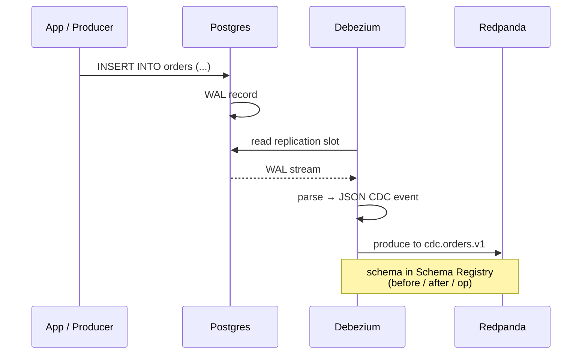

# 07 — CDC design

## Components

- **Source:** Postgres OLTP on `node-cdc:5432` (logical replication, `wal_level=logical`).
- **Connector:** Debezium 2.x running on Kafka Connect on `node-cdc`.
- **Sink:** Redpanda topics `cdc.*.v1`.

## Sequence



## Event shape

```json
{
  "op": "c",                  // c=create, u=update, d=delete, r=snapshot
  "ts_ms": 1716192900000,
  "source": { "db": "oltp", "table": "orders", "lsn": "0/1234ABCD" },
  "before": null,
  "after": {
    "order_id": "ord_789",
    "customer_id": "cus_001",
    "amount": 249.99,
    "status": "created"
  }
}
```

## Snapshot strategy

- Initial snapshot for new connectors.
- Incremental snapshots (Debezium 2.x signal-table-driven) for backfill of pre-existing rows after schema changes.

## Failure modes (and runbooks)

| Failure | Symptom | Runbook |
|---|---|---|
| Postgres down | Debezium connector "DISCONNECTED" | [`runbooks/postgres-cdc-lag.md`](../runbooks/postgres-cdc-lag.md) |
| Replication slot full | WAL retention grows; disk fills | [`runbooks/postgres-cdc-lag.md`](../runbooks/postgres-cdc-lag.md) |
| Redpanda down | Connector errors writing | [`runbooks/redpanda-down.md`](../runbooks/redpanda-down.md) |
| Schema drift | Debezium emits new column; downstream Flink fails | manual schema evolution + replay |

## Compaction + tombstones

`cdc.customers.v1` is **compacted** (latest state per `customer_id`). Delete operations emit a tombstone (null value). Downstream consumers must handle tombstones (Flink `KeyedDeserializer` checks for null payload).
