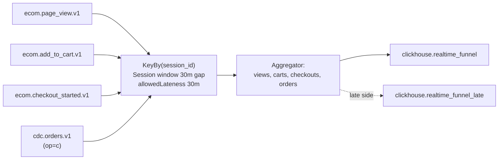
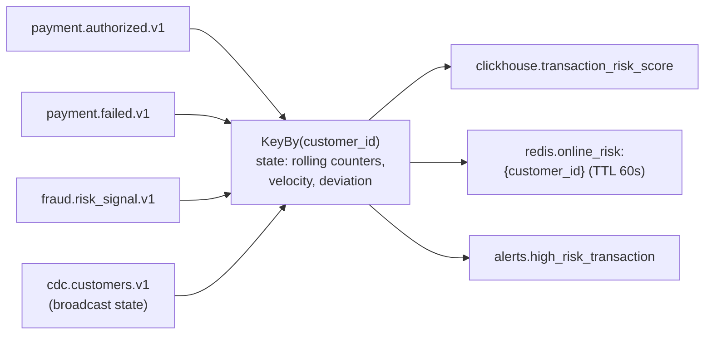
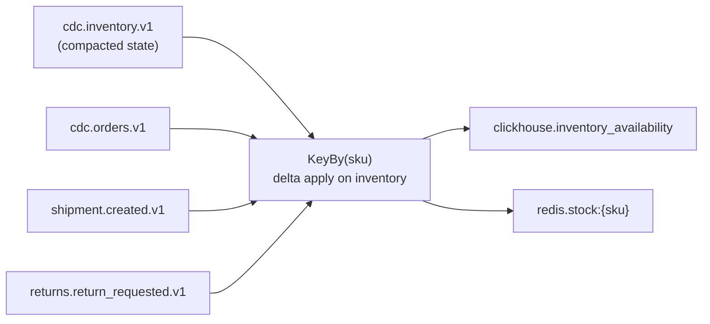
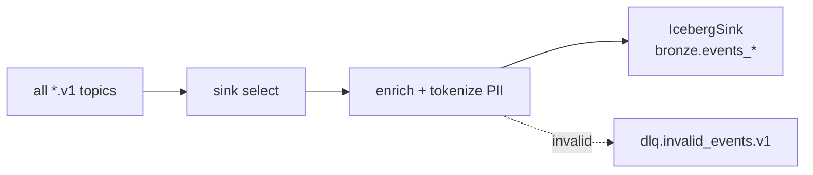

# 08 — Stream processing (Flink)

Four jobs. Each owns one concept worth demonstrating.

## Cluster shape

- 1 JobManager + 1-2 TaskManagers on `node-stream`.
- State backend: RocksDB.
- Checkpoint store: MinIO `flink-checkpoints/` bucket.
- Checkpoint interval: 60s, minPauseBetween: 30s, maxConcurrent: 1.
- Restart strategy: `failure-rate`, 3 failures in 10 min → fail.

## Jobs

### Job 1 — `order_funnel_job`

**Concept:** event-time windows + sessionization + late-event handling.

### Job 2 — `payment_risk_job`

**Concept:** stateful streaming join + online features + low-latency decision.

### Job 3 — `inventory_availability_job`

**Concept:** CDC + stream join, compacted topic semantics.

### Job 4 — `lakehouse_sink_job`

**Concept:** exactly-once write to Iceberg (2PC), schema evolution.

## Watermark policy

- Event time = `event_time` field from payload.
- Bounded out-of-orderness: 5 minutes.
- Allowed lateness: 30 minutes (then to side output).

## Metrics exported

- `flink_jobmanager_job_uptime`
- `flink_taskmanager_job_task_operator_records_in`
- `flink_jobmanager_job_lastCheckpointDuration`
- `flink_jobmanager_job_numRestarts`
- `flink_taskmanager_job_task_operator_backpressure_ratio`

All scraped by Prometheus on `node-obs`. Grafana panels live in `observability/grafana/dashboards/flink.json`.
