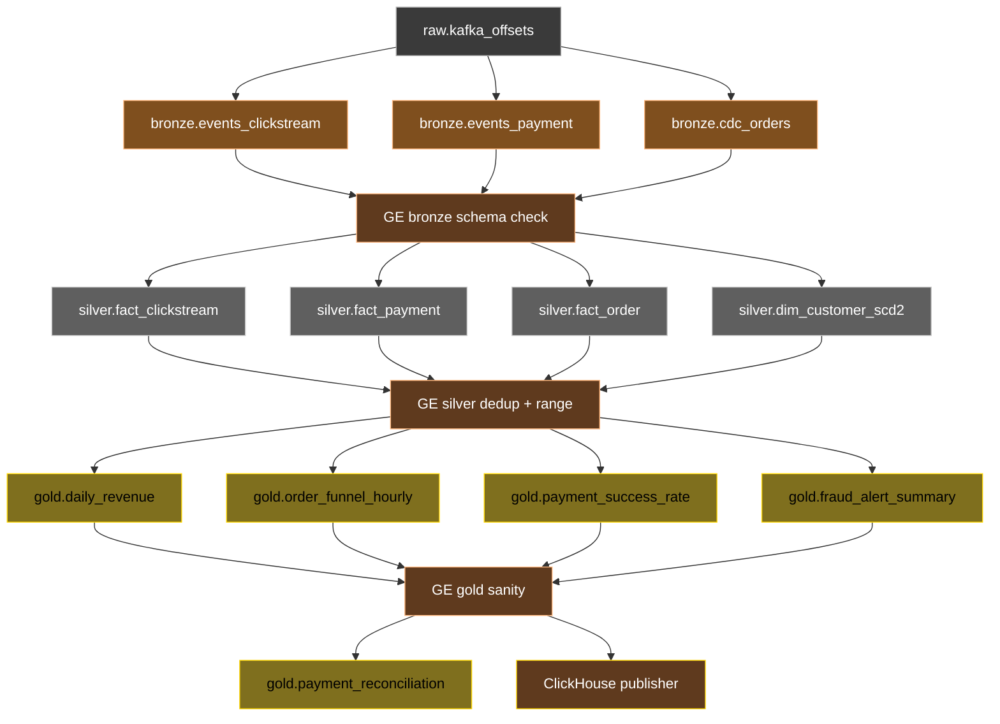

# 10 — Batch orchestration (Dagster + GE)

> Why Dagster: see [ADR-0005](../adr/0005-dagster-over-airflow.md).

## Asset graph



## Schedules

| Asset group | Schedule | Trigger |
|---|---|---|
| Bronze (Flink sinks) | continuous | streaming, not Dagster |
| Silver | hourly | sensor on bronze partition arrival |
| Gold | daily 02:00 UTC | cron |
| Reconciliation | daily 03:00 UTC | cron, after gold |
| Maintenance | nightly 04:00 UTC | cron |

## Resources (`batch/dagster/resources.py`)

- `postgres_metastore` — for Dagster's run history
- `minio` — S3 client for MinIO
- `iceberg_catalog` — `pyiceberg.Catalog` instance
- `clickhouse` — for publishers
- `great_expectations` — checkpoint runner

## Great Expectations suites

- `bronze_schema` — column types match contract
- `silver_dedup` — no duplicate `event_id` in window
- `silver_ranges` — amount > 0, currency in {USD, EUR, ...}
- `gold_sanity` — row count > expected_min, freshness < 25h

Suites live at `quality/great_expectations/expectations/`.

## Reconciliation example

```python
# gold.payment_reconciliation
# Compare: stream-derived revenue today vs batch settlement file
discrepancy = abs(stream_revenue - batch_settlement) / batch_settlement
assert discrepancy < 0.005, f"Discrepancy {discrepancy:.4f} exceeds 0.5%"
```

Output table:
```text
event_date | stream_revenue | settlement | discrepancy_pct | status
2026-05-19 | 124318.50      | 124355.00  | 0.029           | OK
```
