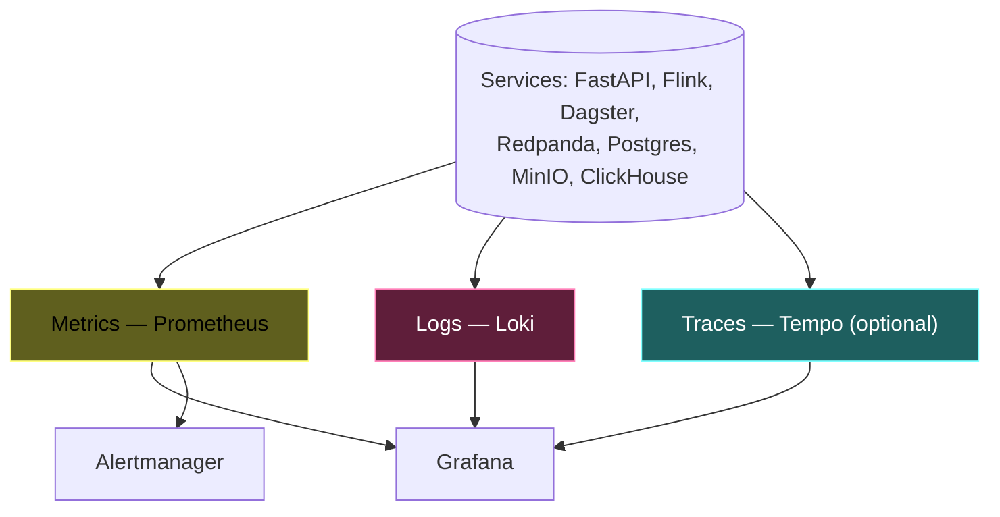

# 12 — Observability + SLO

## The three pillars



## SLO catalog

| SLO | Target | Source metric |
|---|---|---|
| Pipeline freshness (realtime) | p95 < 60s | `pipeline_event_lag_seconds` |
| DAG success rate | > 99% | Dagster runs |
| Data quality pass rate | > 98% | GE checkpoint results |
| API p95 latency | < 2s | FastAPI histogram |
| Consumer lag burn | < 5 min recovery from burst | Redpanda lag |
| Flink checkpoint duration | p95 < 30s | Flink REST |
| MinIO availability | 99.9% in-session | Prom blackbox |

## Alert rules (excerpt)

```yaml
groups:
- name: data-platform
  rules:
  - alert: RedpandaConsumerLagHigh
    expr: redpanda_kafka_max_offset_lag > 100000
    for: 5m
    annotations:
      runbook: runbooks/consumer-lag-spike.md

  - alert: FlinkCheckpointFailure
    expr: increase(flink_jobmanager_job_numberOfFailedCheckpoints[5m]) > 0
    annotations:
      runbook: runbooks/flink-job-failed.md

  - alert: PipelineFreshnessTooHigh
    expr: pipeline_event_lag_seconds > 120
    for: 3m

  - alert: DLQSpike
    expr: rate(dlq_events_total[5m]) > 1
    for: 5m

  - alert: DataQualityFailed
    expr: ge_checkpoint_passed == 0
```

Full rules: [`observability/prometheus/alerts.yml`](../observability/prometheus/alerts.yml).

## Burn-rate alerts

For each SLO, a burn-rate alert per [Google SRE workbook](https://sre.google/workbook/alerting-on-slos/):

- Fast burn (2% of budget in 1h) → page
- Slow burn (10% in 24h) → ticket

## Dashboards (Phase 9 outputs)

| Dashboard | Owner panel |
|---|---|
| `infra-overview` | node CPU, RAM, disk, network |
| `redpanda` | throughput, lag per consumer group, ISR |
| `flink` | checkpoint duration, backpressure, restarts |
| `data-quality` | GE pass rate, DLQ rate |
| `pipeline-freshness` | event lag by topic / dataset |
| `api` | RED metrics + p50/p95/p99 latency |
| `serving` | ClickHouse query latency, Redis hit rate |
| `rag` | retrieval latency, score |
