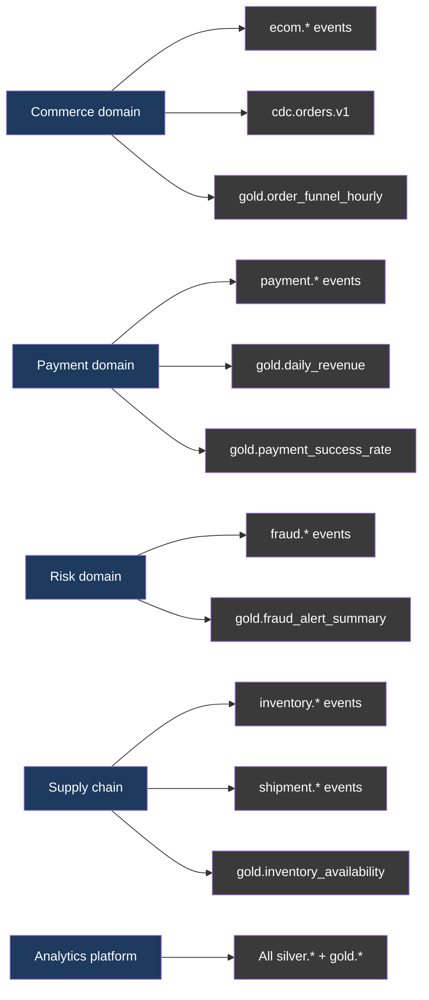
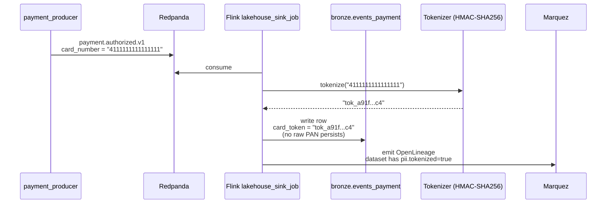

# 13 — Governance + lineage

## What "governance" means in this lab

Four artifacts a senior reviewer expects to see:

1. **Data contracts** — machine-readable schemas with semantic metadata.
2. **Ownership map** — which domain owns what.
3. **PII handling** — concrete, demonstrable, not just a checklist.
4. **Lineage** — automatic, visible end-to-end.

## Data contracts

Each event topic has a YAML contract in [`governance/data-contracts/`](../governance/data-contracts/):

```yaml
# governance/data-contracts/payment.authorized.v1.yaml
name: payment.authorized.v1
domain: payment
owner: payment-team
sla:
  freshness_p95_s: 30
  schema_compat: BACKWARD
schema: schemas/payment/payment.authorized.v1.json
fields:
  - name: customer_id
    pii: false
  - name: card_number
    pii: true
    tokenize: true
    retention_days: 0   # never persisted raw
  - name: amount
    pii: false
  - name: risk_score
    pii: false
quality:
  - rule: amount > 0
  - rule: currency in {USD, EUR, VND, GBP, JPY}
examples:
  good: schemas/payment/payment.authorized.v1.examples/good.json
  bad: schemas/payment/payment.authorized.v1.examples/bad.json
```

CI validates that every produced topic has a contract (`validate-contracts.yml`).

## Ownership map



Full table: [`governance/data-ownership.md`](../governance/data-ownership.md).

## PII handling — concrete flow



Properties:
- Raw PAN never persists to bronze / silver / gold.
- Token is deterministic per HMAC key → joins still work.
- Key rotation: documented in runbook.

## Lineage — OpenLineage + Marquez

Emitters:
- Flink: `openlineage-flink` listener
- Dagster: built-in emitter
- Trino: `openlineage-trino` plugin

Marquez UI:
- `http://node-obs:3001`
- Dataset graph, run-level lineage, schema history
- Tags propagate: `pii.tokenized`, `domain.payment`

## Why not DataHub

See [ADR-0006](../adr/0006-marquez-over-datahub.md). DataHub is heavier (~6 GB RAM); for lab-scale lineage-only need, Marquez is the right call.
