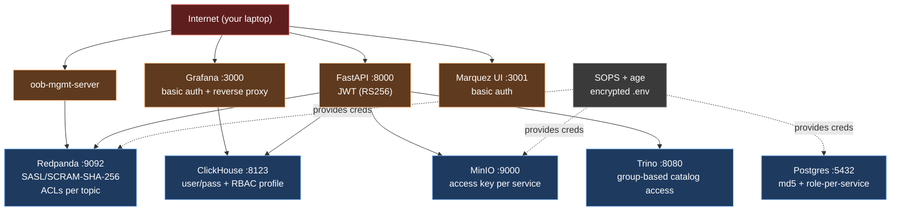

# 14 — Security boundary

> Lab-grade demo, not certified. The point is to show *patterns*, not pass an audit.

## Layered model



## Per-component controls

| Component | Authn | Authz | Secrets |
|---|---|---|---|
| Redpanda | SASL/SCRAM-SHA-256 | ACLs per topic per principal | SOPS |
| MinIO | access key | per-bucket policy JSON | SOPS |
| Postgres | md5 + cert option | role per service | SOPS |
| ClickHouse | user/pass | RBAC profile (`profiles.xml`) | SOPS |
| Trino | password file | group-based catalog rules | SOPS |
| FastAPI | JWT (RS256) | route-level scopes | SOPS |
| Dagster | basic auth + RBAC | role-per-tenant | SOPS |
| Grafana | basic auth + viewer/editor | per-folder | SOPS |

## Secrets management

`.env` is **never** committed in plaintext. Stored as `.env.sops.yaml` (SOPS + age). To decrypt:

```bash
sops -d platform/env/.env.sops.yaml > platform/env/.env
```

Public age recipient lives at `infra/secrets/age.pub`. Private key lives in 1Password / OS keychain.

## PII handling

Concrete tokenization flow documented in [`docs/13-governance-lineage.md`](./13-governance-lineage.md). Raw PAN never lands in any lakehouse table or DLQ.

## Audit trail

- Loki ingests `service=` logs from every container.
- `dagster-audit.log` ships to Loki.
- Marquez UI shows who ran what when (lineage = audit complement).

## What's intentionally *not* in scope

- Real RBAC for a multi-tenant platform.
- Real disaster recovery on credential compromise.
- mTLS between every service (Redpanda mTLS planned for Phase 10 stretch).
- Compliance certification.

See also [`docs/99-limitations-and-honesty.md`](./99-limitations-and-honesty.md).
