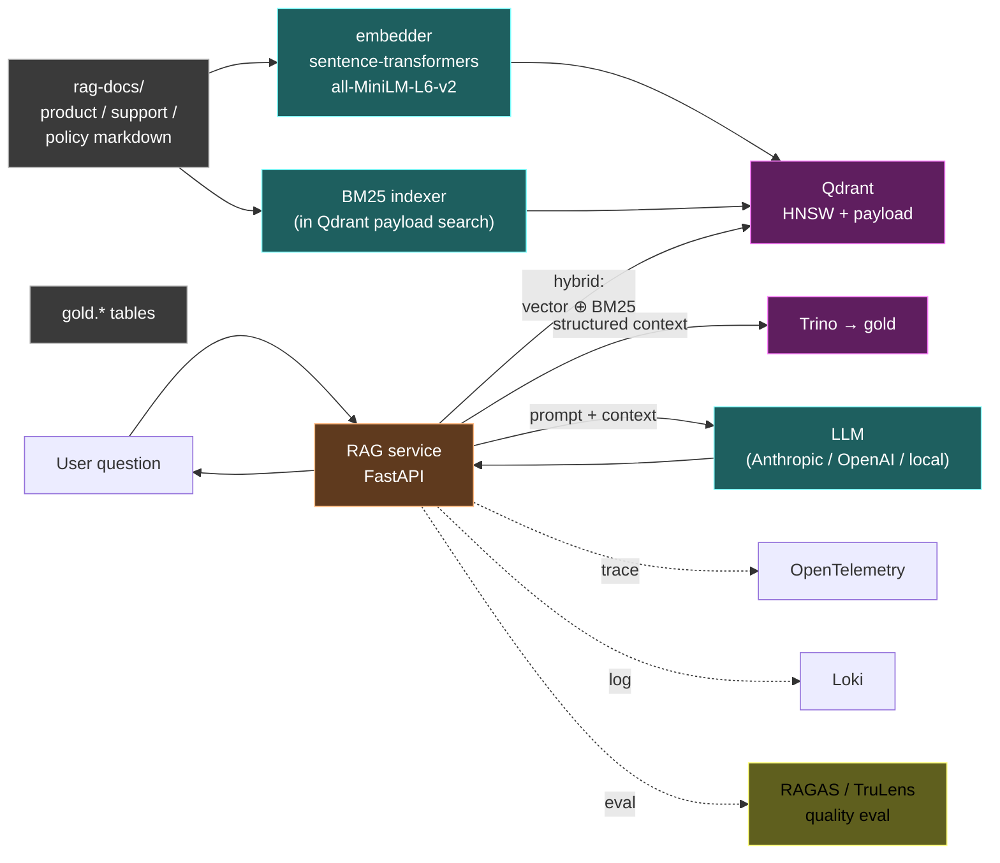

# 15 — AI / RAG layer

> Either do it well or cut it. We chose: do it well.

## Architecture

## Use cases

1. "What's the return policy for category X?" → docs RAG
2. "Why did order_123 fail?" → join docs + gold tables
3. "Summarize today's fraud alerts" → gold-only summarization
4. "Batch score: which SKUs are at stockout risk this week?" → batch RAG / scoring

## Evaluation framework

| Metric | Tool | Threshold |
|---|---|---|
| Faithfulness | RAGAS | > 0.85 |
| Answer relevancy | RAGAS | > 0.80 |
| Context precision | RAGAS | > 0.75 |
| Context recall | RAGAS | > 0.70 |
| Latency p95 | OTEL | < 4s |

Eval suite lives at `ai/evaluation/`. Reports published to `benchmarks/results/rag-runs/`.

## Retrieval strategy

- **Hybrid:** vector cosine (HNSW) ⊕ BM25 sparse, weighted 0.7 / 0.3.
- **Reranker:** Optional cross-encoder (Phase 10 stretch).
- **Top-k:** 20 retrieved → 5 after rerank.

## Why we are NOT building

- Custom fine-tuned model (out of scope; no GPU).
- Conversational memory (single-turn lab).
- Multi-modal (text-only).
- Agent loop with tools (Phase 11 stretch maybe).

## Cost note

If using a hosted LLM API (Anthropic / OpenAI), this is the only off-DSX-Air spend. Document the API cost line item.
