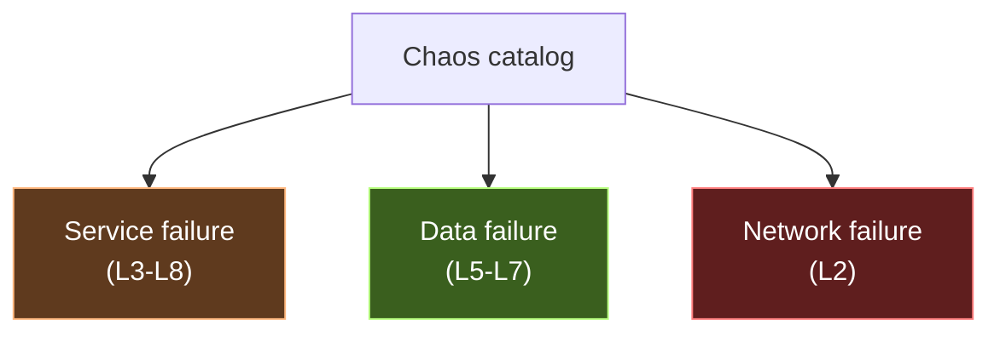
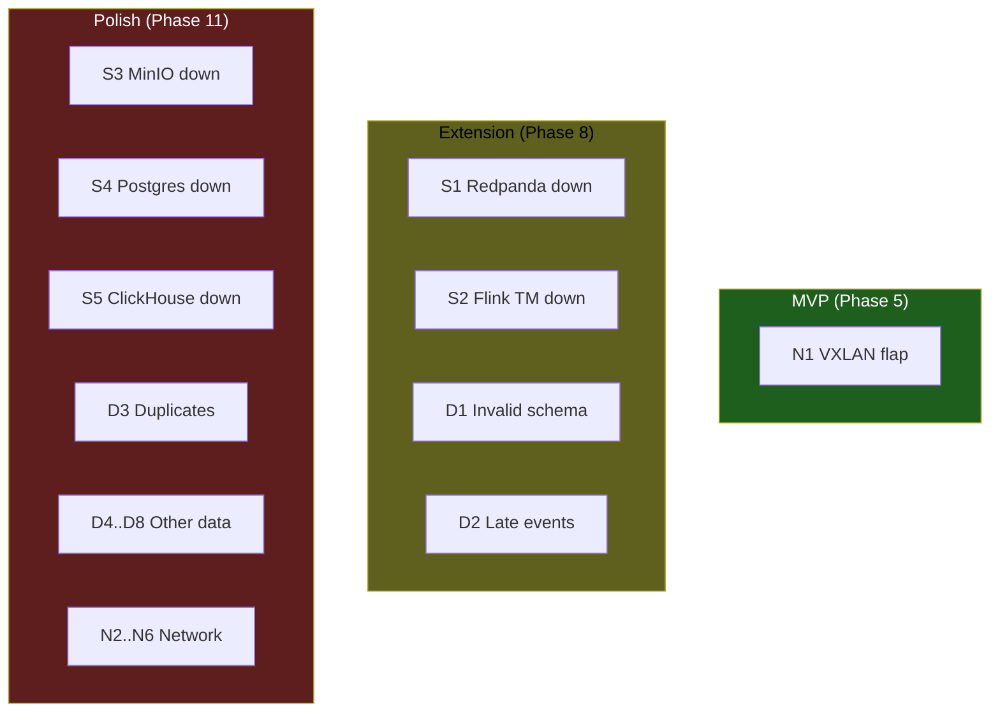

# 16 — Failure & chaos catalog

> Every failure that this platform survives is documented here. If a failure isn't in this list, it hasn't been tested.

**Related:** [`chaos/`](../chaos/) · [`runbooks/`](../runbooks/) · [`docs/17-network-failure-storyline.md`](./17-network-failure-storyline.md)

## Three families



## Service failure family

| ID | Scenario | Script | Runbook | Expected recovery |
|---|---|---|---|---|
| S1 | Redpanda broker down | `chaos/service/redpanda_down.sh` | [`runbooks/redpanda-down.md`](../runbooks/redpanda-down.md) | Producers buffer + retry; consumers resume from offset |
| S2 | Flink TaskManager down | `chaos/service/flink_restart.sh` | [`runbooks/flink-job-failed.md`](../runbooks/flink-job-failed.md) | Job restarts from last checkpoint |
| S3 | MinIO down | `chaos/service/minio_down.sh` | [`runbooks/minio-unavailable.md`](../runbooks/minio-unavailable.md) | Lakehouse writes fail to DLQ; reads error |
| S4 | Postgres source down | `chaos/service/postgres_down.sh` | [`runbooks/postgres-cdc-lag.md`](../runbooks/postgres-cdc-lag.md) | Debezium reconnects; LSN replay |
| S5 | ClickHouse down | `chaos/service/clickhouse_down.sh` | [`runbooks/clickhouse-down.md`](../runbooks/clickhouse-down.md) | Realtime aggregates stale; lakehouse alt path |

## Data failure family

| ID | Scenario | Producer mode | Expected behavior |
|---|---|---|---|
| D1 | Invalid schema | `--invalid-rate 0.05` | Routed to `dlq.invalid_events.v1` |
| D2 | Late events (up to 30m) | `--late-events true --max-late-minutes 30` | Watermark-handled; late side output |
| D3 | Duplicate event_id | `--duplicate-rate 0.02` | Deduplicated by Flink stateful op |
| D4 | Negative payment amount | `--invalid-mode negative_amount` | DLQ + quality check fail |
| D5 | Unknown customer_id | `--invalid-mode unknown_customer` | Enrichment fails → DLQ |
| D6 | Future timestamp | `--invalid-mode future_ts` | Watermark guard rejects |
| D7 | Malformed JSON | `--invalid-mode malformed` | Deserialization fail → DLQ |
| D8 | Schema-version skew | `--invalid-mode wrong_version` | Schema Registry rejects |

## Network failure family ★

See [`docs/17-network-failure-storyline.md`](./17-network-failure-storyline.md) for full detail.

| ID | Scenario | Script | Runbook |
|---|---|---|---|
| N1 | VXLAN tunnel flap | `chaos/network/vxlan_flap.sh` | [`runbooks/vxlan-flap.md`](../runbooks/vxlan-flap.md) |
| N2 | Leaf switch down | `chaos/network/leaf_switch_down.sh` | [`runbooks/leaf-switch-down.md`](../runbooks/leaf-switch-down.md) |
| N3 | ISL link down | `chaos/network/isl_link_down.sh` | [`runbooks/isl-link-down.md`](../runbooks/isl-link-down.md) |
| N4 | EVPN BGP route flap | `chaos/network/evpn_route_flap.sh` | [`runbooks/evpn-route-flap.md`](../runbooks/evpn-route-flap.md) |
| N5 | Spine outage | `chaos/network/spine_down.sh` | [`runbooks/spine-down.md`](../runbooks/spine-down.md) |
| N6 | Asymmetric packet loss 5% | `chaos/network/async_packet_loss.sh` | [`runbooks/async-loss.md`](../runbooks/async-loss.md) |

## Chaos test matrix (what's run vs what's documented)



## Common runbook structure

Every runbook uses this template:

```markdown
# Incident: <name>

**Severity:** P1 / P2 / P3
**Family:** Service / Data / Network
**Chaos script:** path
**Expected recovery time:** Nm

## Symptoms
- alert that fires
- metric that moves
- user-visible effect

## Detection
- which Grafana panel
- which Prom query
- which Loki query

## Immediate action
1. step
2. step

## Recovery
1. step
2. step

## Data correctness check
- query to run to verify zero loss / zero duplicates

## Prevention
- config change / monitoring improvement
```
