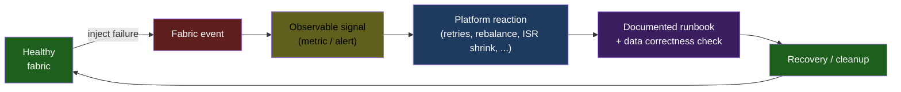
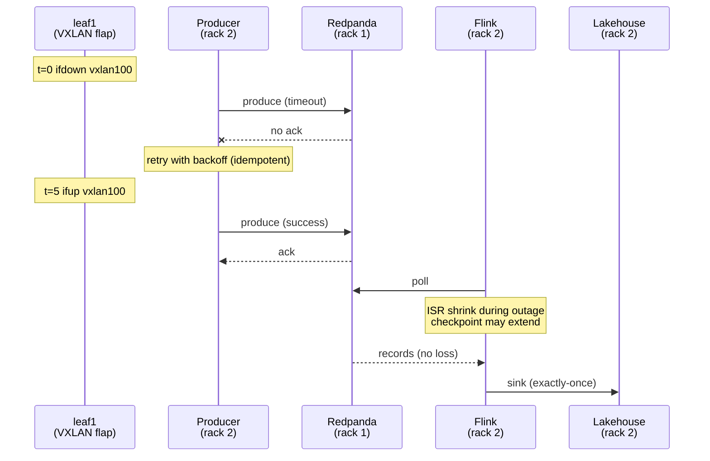
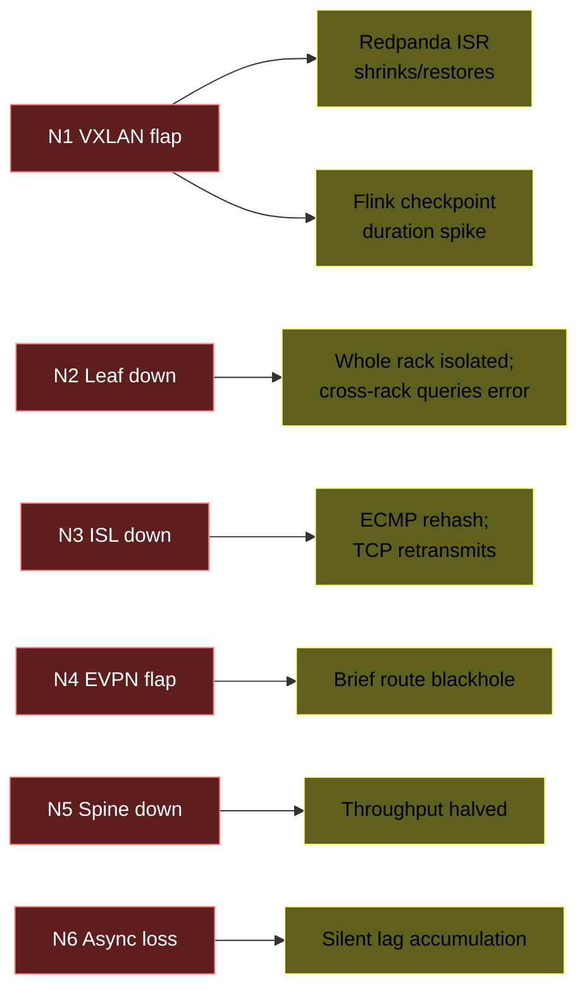

# 17 — Network failure storyline ★

> The differentiator. Everyone can `docker stop kafka`. We failed the fabric beneath it.

**Related:** [ADR-0001](../adr/0001-dsx-air-as-network-fabric-twin.md) · [`chaos/network/`](../chaos/network/) · [`runbooks/`](../runbooks/)

---

## Why this matters

Most "platform reliability" demos test **service failure** — kill a container, watch the platform recover. That's necessary but not sufficient. In real production, the more frequent and more confusing failures are **network-fabric failures**:

- A leaf-spine ISL drops → asymmetric routing → partial connectivity
- A VXLAN tunnel flaps → some packets get through, some don't
- A BGP route flap → some peers reconverge instantly, some take seconds
- A spine outage → ECMP rehash → flows reset
- Asymmetric MTU after a misconfig → mysteriously slow connections

Engineers who only know service-level chaos misdiagnose these. Engineers who know **how their data platform behaves under network-fabric chaos** are senior.

DSX Air gives us a **programmable Cumulus / SONiC fabric** where we can do this. That's the unfair advantage we lean into.

---

## Story arc



Every chaos run produces:
1. A reproducible script in `chaos/network/`
2. A Grafana panel showing the platform reaction
3. A runbook in `runbooks/`
4. A data-correctness check (did we lose / corrupt data?)
5. A benchmark entry (recovery time, RPO, RTO)

---

## The six fabric chaos scenarios

### Chaos N1 — VXLAN tunnel flap (≈5s drop)

**What it simulates:** flapping data-plane tunnel between two leaves (common during firmware updates, MTU misconfig propagation, or under microbursts).

**How:**
```bash
# on leaf1
sudo ifdown vxlan100; sleep 5; sudo ifup vxlan100
```

**Expected platform reactions:**



**What to measure:**
- Producer error count during flap
- Redpanda `under_replicated_partitions` gauge
- Flink checkpoint duration spike
- Data correctness: count(events sent) == count(events landed in bronze)

**Runbook:** [`runbooks/vxlan-flap.md`](../runbooks/vxlan-flap.md)

---

### Chaos N2 — Leaf switch down (whole rack isolated)

**What it simulates:** a leaf failure or a power event isolating one rack.

**How:**
```bash
# from DSX Air SDK
python dsx-air/scripts/sim_node_stop.py --name leaf1
```

**Expected:**
- All nodes attached to `leaf1` become unreachable from the rest of the platform.
- If `redpanda` was on `leaf1` rack → consumers in other racks see broker down.
- If `postgres+debezium` was on `leaf1` rack → CDC stops.
- Services in surviving racks **keep serving stale data** (ClickHouse, lakehouse reads).

**What to measure:**
- Time to alert fire
- Time to detect from outside the rack
- Data freshness during outage
- Data correctness on restoration (any events lost? duplicated?)

**Runbook:** [`runbooks/leaf-switch-down.md`](../runbooks/leaf-switch-down.md)

---

### Chaos N3 — ISL link down (one spine-leaf link)

**What it simulates:** a single inter-switch link failure. With 2 spines and ECMP, traffic should reroute via the surviving spine.

**How:**
```bash
# on spine1
sudo ip link set swp1 down   # link to leaf1
```

**Expected:** brief flow disruption (ECMP rehash), then transparent recovery. Some long-lived TCP connections may need to rebuild.

**What to measure:**
- Reconvergence time (BGP)
- TCP retransmission rate during rehash
- Whether Flink jobs survive without restart
- Whether ClickHouse / Trino query in-flight queries error

**Runbook:** [`runbooks/isl-link-down.md`](../runbooks/isl-link-down.md)

---

### Chaos N4 — EVPN BGP route flap

**What it simulates:** routing control-plane instability without physical link drop.

**How:**
```bash
# on leaf2
sudo vtysh -c "clear bgp * soft"
sleep 2
sudo vtysh -c "clear bgp * soft out"
```

Or shutdown/no-shutdown a BGP neighbor.

**Expected:** brief blackhole as routes withdraw and re-advertise. Different from N1 (link still up but routes change).

**What to measure:**
- Route convergence time
- Whether VXLAN MAC learning re-converges cleanly
- Application-level packet loss

**Runbook:** [`runbooks/evpn-route-flap.md`](../runbooks/evpn-route-flap.md)

---

### Chaos N5 — Spine outage

**What it simulates:** lose one of two spines. ECMP should hash to the surviving spine.

**How:**
```bash
python dsx-air/scripts/sim_node_stop.py --name spine1
```

**Expected:** all rack-to-rack traffic flows via `spine2`. Bandwidth halved; latency may increase.

**What to measure:**
- Whether all flows actually reroute (no blackhole)
- Throughput drop (% of baseline)
- Whether any service's keepalive breaks (Postgres replication, Redpanda raft, etc.)

---

### Chaos N6 — Asymmetric packet loss (5% on one path)

**What it simulates:** a misbehaving cable / optic causing intermittent loss only on certain flows.

**How:**
```bash
# on leaf1, add netem loss to interface toward spine1
sudo tc qdisc add dev swp1 root netem loss 5%
```

**Expected:** TCP retransmissions, slower throughput, may not trigger any alert (this is the sneakiest failure mode and the most common in real production).

**What to measure:**
- Whether any alert fires (probably not by default → improve monitoring)
- Throughput degradation
- Flink job lag accumulation

---

## Map of chaos to platform components



---

## Benchmark recording template

For every fabric chaos run, record in `benchmarks/results/`:

```markdown
## Chaos run: Nx — <name> — YYYY-MM-DD

**Workload during chaos:** <eps / topics / jobs running>

**Pre-chaos baseline:**
- producer rate: ...
- consumer lag: ...
- p95 API latency: ...

**During chaos (window N..N+T sec):**
- producer errors: ...
- Redpanda metric: ...
- Flink metric: ...
- alerts fired: [list]

**Recovery:**
- t_to_first_alert: ...
- t_to_recovery_signal: ...
- t_to_lag_drained: ...

**Data correctness check:**
- count(produced) = ...
- count(consumed) = ...
- count(in bronze) = ...
- count(in DLQ) = ...
- duplicates: ...
- gap: ...

**Lessons:**
- ...
```

This is the **table that goes on the README** as a screenshot.

---

## Why this storyline works for a portfolio

Recruiter / hiring manager sees this and thinks:
- "They understand layered failures, not just service down."
- "They can measure RPO/RTO under realistic conditions."
- "They wrote runbooks for failures most people don't think about."
- "They understand BGP / VXLAN / EVPN at a usable level."

That's senior signal. None of this is achievable on Docker Desktop.
