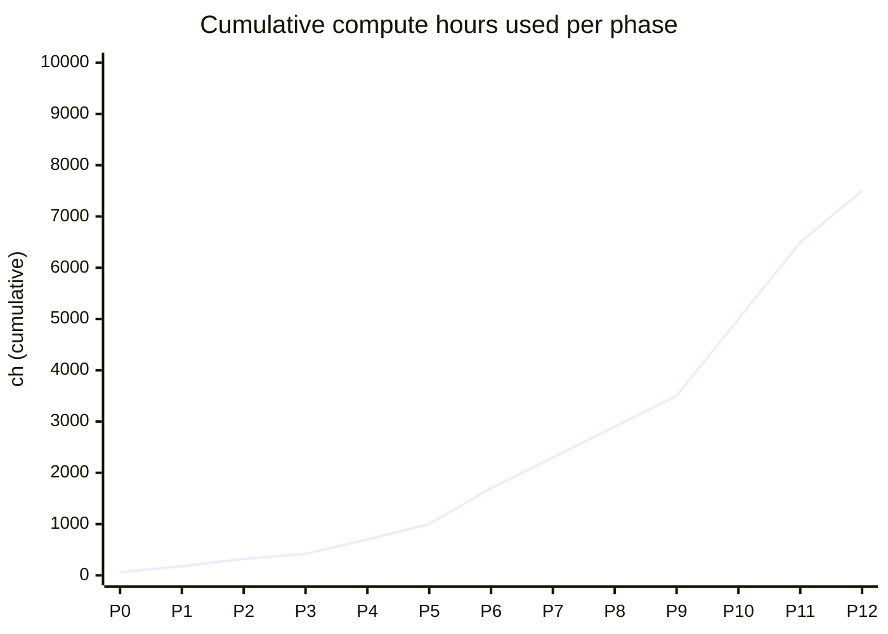
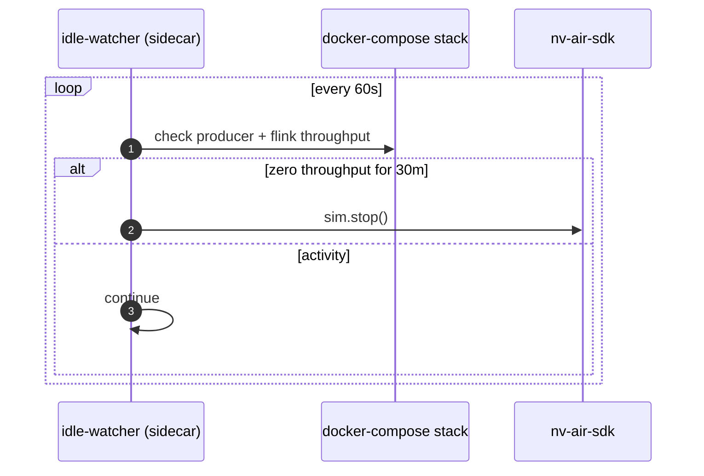

# 19 — Cost & budget guard rails

> 10,000 compute hours is a lot. One forgotten weekend can burn 9% of that. This is how we don't.

## The cost model — verified

Per the [NVIDIA DSX Air Account Setup docs](https://docs.nvidia.com/networking-ethernet-software/nvidia-air-v2/Account-Setup/):

```text
1 compute hour = 1 vCPU running for 1 hour
            OR = 8 GB RAM running for 1 hour
        (billed independently, summed)
```

So if a sim is using N vCPUs and M GB of RAM:

```text
compute_hours_per_hour = N + M/8
```

| Profile | vCPU | RAM (GB) | ch/hour | Hours from 10k credits |
|---|---:|---:|---:|---:|
| Smallest viable | 6 | 16 | 8 | 1250 |
| MVP session A | 20 | 44 | 25.5 | 392 |
| Session B (batch + serve) | 22 | 50 | 28.25 | 354 |
| Session C (AI + governance) | 18 | 42 | 23.25 | 430 |
| Burst test | 40 | 56 | 47 | 213 |
| Theoretical max | 60 | 60 | 67.5 | 148 |

## Burn budget per phase

Cumulative target burn (matches `ROADMAP.md` Gantt):



Leaves **2500 hr buffer** for re-runs, demos, screen-recording, and emergencies.

## Guard rails

### 1. `budget_guard.py` (cron, every 15 min)

Polls compute usage via the DSX Air SDK. If:
- **daily burn > 250 ch** → email + auto-stop
- **total used > 8500 ch** → auto-stop + freeze (require manual re-arm)
- **sim has been running > 6 hours of idle CPU** → soft-stop

See [`dsx-air/scripts/budget_guard.py`](../dsx-air/scripts/budget_guard.py).

### 2. Auto-stop-if-idle

Each session's `docker-compose` includes a sidecar that detects no producer activity for 30 min and stops the simulation.



### 3. Daily budget Slack/email summary

A morning report:
```text
Hello. As of YYYY-MM-DD 09:00 UTC:
  - compute hours used today: 142
  - compute hours used total: 3201
  - remaining: 6799
  - sim status: stopped
  - latest checkpoint: 2026-05-19T22:14Z
```

### 4. Hard policies

| Rule | Why |
|---|---|
| Never start a sim before opening a notebook with a goal | "Why is the sim on?" must always have an answer |
| Stop sim at end of every session | No "leave it running until tomorrow" |
| Burst tests run < 30 min, scheduled, recorded | One-off, not background |
| Save checkpoint after every meaningful change | Free restart from a known good state |
| Decommission test sims same day | No lingering experiments |

### 5. Quota alarms in DSX Air UI

Set the built-in usage alert at:
- 50% (informational)
- 75% (warning)
- 90% (critical — pause new sims)

## Edge cases to plan for

| Scenario | Mitigation |
|---|---|
| Laptop closed, sim running | `auto-stop-if-idle` |
| Long-running benchmark exceeds budget | `budget_guard.py` hard-stops at 8500 |
| Image pull repeatedly costs bandwidth | Use a local registry mirror on `node-lake` |
| Trial expires before P12 | See [`docs/20-exit-portability-plan.md`](./20-exit-portability-plan.md) |

## Reporting

Every phase commit includes a one-liner in the message:
```text
P5: first Flink job complete. Cumulative: 1023 ch. ETA P6: 1700 ch.
```

This way the repo history doubles as a budget audit log.

## References

- [DSX Air Account Setup](https://docs.nvidia.com/networking-ethernet-software/nvidia-air-v2/Account-Setup/)
- [`dsx-air/scripts/budget_guard.py`](../dsx-air/scripts/budget_guard.py)
- [`ROADMAP.md`](../ROADMAP.md) — phase budget table
