# 20 — Exit & portability plan

> 10,000 compute hours will eventually run out. This is how we land softly.

## Trigger conditions

Execute the exit plan when **any** of:
- Total compute used > 9000 ch
- Trial expiration < 30 days
- A "platform abandoned" decision
- A "move to real cloud" decision

## Export checklist

```mermaid
flowchart LR
    A["Stop sim"] --> B["Export topology JSON<br/>+ Ansible inventory"]
    B --> C["Export MinIO buckets<br/>via mc mirror to local"]
    C --> D["pg_dump Postgres OLTP + metastore"]
    D --> E["Export Redpanda topic configs<br/>(rpk topic describe)"]
    E --> F["Export Grafana dashboards JSON"]
    F --> G["Export ClickHouse DDL + sample data"]
    G --> H["Snapshot Flink savepoint to MinIO"]
    H --> I["Capture screencast / GIFs"]
    I --> J["git tag v-trial-end"]
```



## Reproducibility outside DSX Air

After export, the platform can be rebuilt on:

| Target | Effort | Notes |
|---|---|---|
| Laptop (Docker Compose) | Low | Lose network-fabric story; service-only chaos |
| Single cloud VM | Low | Same as laptop with persistence |
| Hetzner / Oracle free tier | Medium | Survives long-term |
| Kubernetes cluster (k3s) | Medium-High | Re-deploy via helm charts (not provided here) |
| Bare-metal lab (real switches) | High | Fabric story returns; would need Cumulus VX or real switches |

## Files retained in repo

- All code, configs, schemas, topologies, ansible, compose files
- All ADRs, docs, runbooks
- All benchmark results
- All screenshots / screencasts
- `.env.sops.yaml` (encrypted)
- Public age key

Files **not** retained (regenerable):
- Container images (re-pull on demand)
- MinIO contents (re-seed via producers)
- Postgres data (re-seed via producers + CDC replay)

## Final commit

```text
git tag v-final
git log --oneline | head -50  # the journey summary
```
