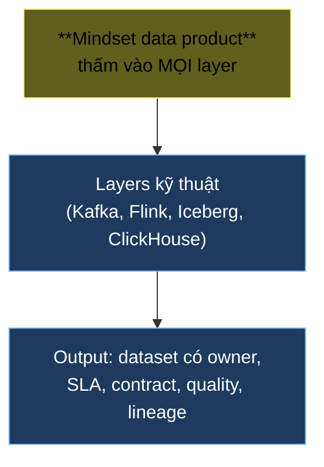
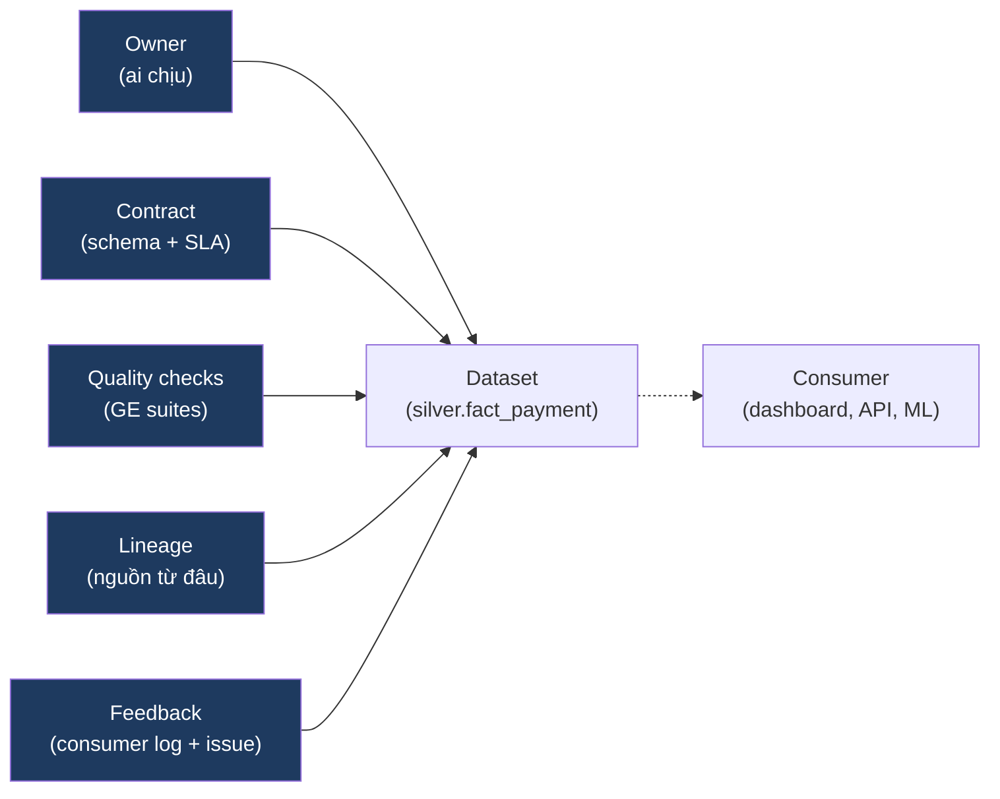

# KU 00/01 — Tư duy data product

> Dữ liệu không phải "đống file rớt vào kho". Dữ liệu là **sản phẩm** — có khách hàng, có SLA, có chủ sở hữu, có lifecycle.

**Module:** [00 — Mental Models](./README.md)
**Đọc trong:** ~8 phút

---

## 🎯 Nó là gì?

Hãy tưởng tượng một **tiệm bún bò Huế ngon nhất phố**.

Cô chủ tiệm có:
- Đầu vào: bún, thịt, gia vị, nước dùng.
- Đầu ra: tô bún bưng ra cho khách.
- Khách hàng: anh chạy Grab, cô làm văn phòng, bác về hưu.
- Cam kết: nước dùng nóng, bún không nhão, thịt không hỏng.
- Phản hồi: khách than mặn → tuần sau bớt muối.
- Lịch sử thương hiệu: 20 năm cùng phố → khách tin.

Tô bún ấy chính là một **data product**: có **producer** (cô chủ), có **consumer** (khách), có **contract** (vị, nhiệt độ), có **feedback loop**, có **lineage** (mua thịt ở chợ nào).

> *Định nghĩa hàn lâm:* Data product là một dataset được coi và quản lý như sản phẩm: có owner, có SLA, có schema contract, có versioning, có observability, có lifecycle.

---

## 💡 Nó làm được gì?

Khi bạn **coi dữ liệu là sản phẩm**, bạn tự nhiên làm 5 điều:

- **Có owner** rõ ràng. Hỏi "bảng `gold.daily_revenue` ai quản?" — phải trả lời được tên team / người. Như "bún bò này cô Lan nấu", không phải "ai đó trong bếp".
- **Có SLA freshness** (mới đến bao giờ). "Realtime funnel cập nhật < 60 giây" giống "bún bưng ra trong 3 phút".
- **Có schema contract** (hợp đồng cấu trúc). "Bảng có cột X kiểu Y, không tự ý đổi" giống "tô bún luôn có 1 lát chân giò".
- **Có quality check** (kiểm tra chất lượng). "Bún không nhão = no null trong customer_id".
- **Có lineage** (nguồn gốc). "Thịt từ chợ Bà Chiểu" = "gold table dựng từ silver dựng từ bronze dựng từ topic CDC".

---

## 🧩 Nó là mảnh ghép nào trong tổng thể?

Tư duy data product không phải 1 tool. Nó là **góc nhìn** xuyên suốt mọi layer:

→ Một team có Kafka + Flink + Iceberg nhưng **không có** data product mindset → vẫn ra "đống file". Có mindset → ra "sản phẩm".

---

## 🚀 Nó giúp ích gì?

**Không có** data product mindset, mỗi dataset như đĩa cơm hộp vô danh — không biết ai nấu, để bao lâu rồi, có an toàn ăn không. Khi pipeline lỗi:

- Không biết ai chịu trách nhiệm sửa.
- Không biết khách nào đang chịu ảnh hưởng.
- Không có baseline để biết "bao giờ là bất thường".

**Có** data product mindset:
- Lỗi → mở `governance/data-ownership.md` → biết ngay ai sửa.
- Dataset trễ → so với SLA freshness → biết có vi phạm cam kết không.
- Schema đổi → so với contract → biết có break consumer không.

---

## ⏰ Khi nào dùng / KHÔNG dùng?

| ✅ Luôn dùng khi | ❌ Có thể bỏ qua khi |
|---|---|
| Dataset có > 1 consumer | Notebook cá nhân, chạy 1 lần rồi xoá |
| Dataset feed dashboard / API | Đang prototype Spike chạy 1 lần |
| Dataset có downstream phụ thuộc | Chỉ mình bạn đọc, ngắn ngày |
| Pipeline production-bound | Học thử trong sandbox |

> Trong project này, **mọi `silver.*` và `gold.*` đều là data product**. `raw/` và `bronze/` thì không bắt buộc — chúng là *intermediate*.

---

## 🤔 Vì sao chọn nó (vs alternatives)?

| Mindset | Khi nào thắng | Khi nào thua |
|---|---|---|
| **Data product** (cái này) | Khi team > 1 người, dataset > 1 consumer | Overkill cho prototype |
| **Pipeline-as-script** | Ad-hoc, chạy 1 lần | Sẽ broken khi consumer thay đổi |
| **Data mesh** (extension) | Org lớn, nhiều domain | Quá nặng cho team < 10 người |
| **"Bảng dữ liệu thôi mà"** | … không khi nào | Mọi project lớn sẽ trả giá |

→ Data product là **sweet spot** cho team 2-20 người, dataset có consumer thật.

---

## 🔧 Nó vận hành ra sao?

5 thuộc tính sống cùng dataset suốt vòng đời:

**Vòng đời** của 1 data product:

1. **Born:** team proposes — viết contract, define owner, sketch quality rules.
2. **Live:** pipeline produces, alerts on SLA breach, GE checks every run.
3. **Evolve:** schema change → bump version → BACKWARD compat → consumer test.
4. **Sunset:** unused → mark deprecated → grace period 30 ngày → drop.

---

## 🧠 Self-test

1. Cô bán bún của bạn vừa nói "hôm nay tôi sẽ thay nước dùng vì lạnh quá" — đó là vi phạm contract hay là evolve contract đúng cách? Sự khác biệt nằm ở đâu?
2. Trong project DSX Air này, dataset nào **là data product** và dataset nào **không là**?
3. Schema một `payment.authorized.v1` thêm cột `discount_amount`. Đây có break contract không? Vì sao? (Gợi ý: BACKWARD compat).
4. Một team không có data product mindset có thể có Kafka + Iceberg + Flink chứ? Họ sẽ vấp ở đâu?
5. Vì sao `bronze` thường KHÔNG được coi là data product trong khi `silver` và `gold` thì có?

---

## 🔗 Trong repo này

- Ownership map: [`governance/data-ownership.md`](../../governance/data-ownership.md)
- Contract mẫu: [`governance/data-contracts/payment.authorized.v1.yaml`](../../governance/data-contracts/payment.authorized.v1.yaml)
- SLA + freshness được monitor trong: [`observability/prometheus/alerts.yml`](../../observability/) (Phase 9)
- ADR-0010 nói về synthetic data, một dạng "input contract" cho data product: [`adr/0010-synthetic-data-strategy.md`](../../adr/0010-synthetic-data-strategy.md)

---

## 📖 Đọc thêm (chính thống, hạn chế)

- Zhamak Dehghani — "Data Mesh principles" (Martin Fowler blog) — bài gốc của khái niệm data product trong context mesh.
- DataHub project — "Data Product entity model" docs — đại diện cho cách industry mã hoá khái niệm này.
