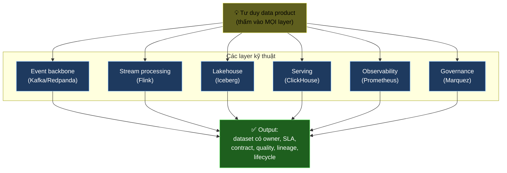
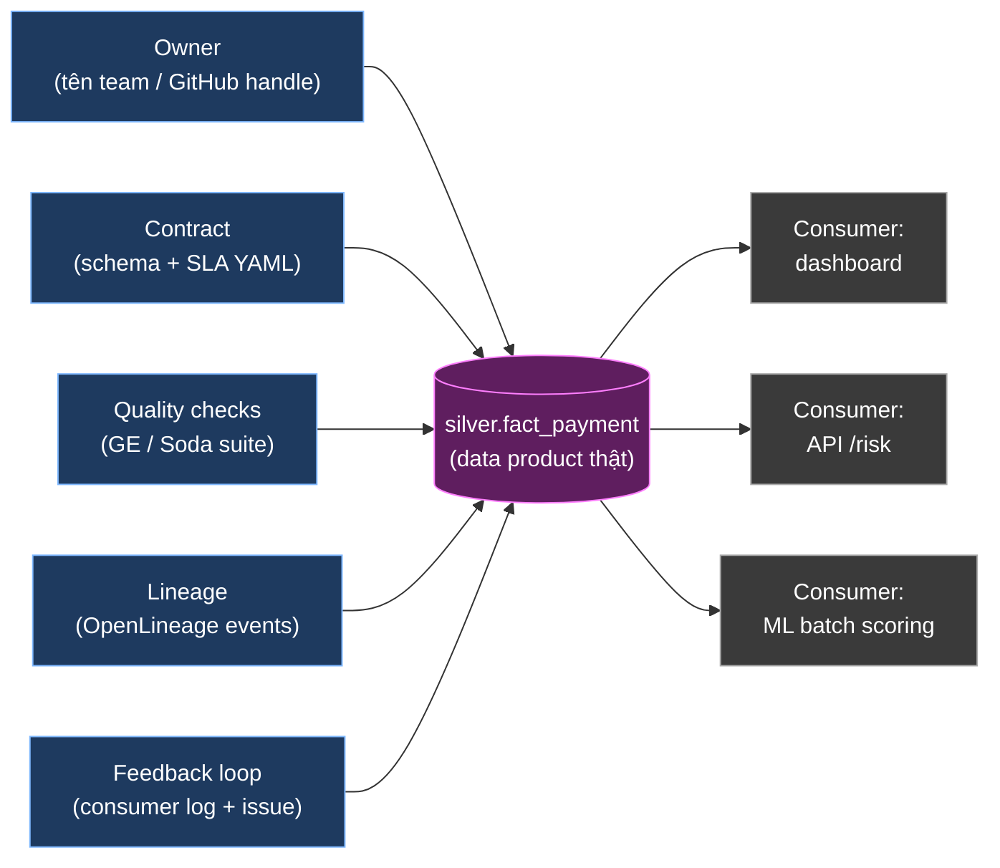
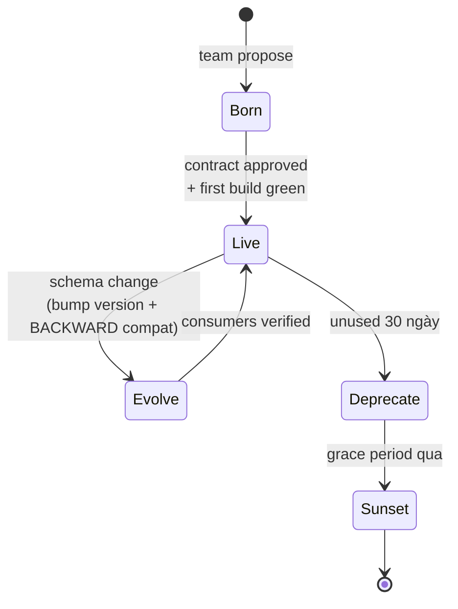
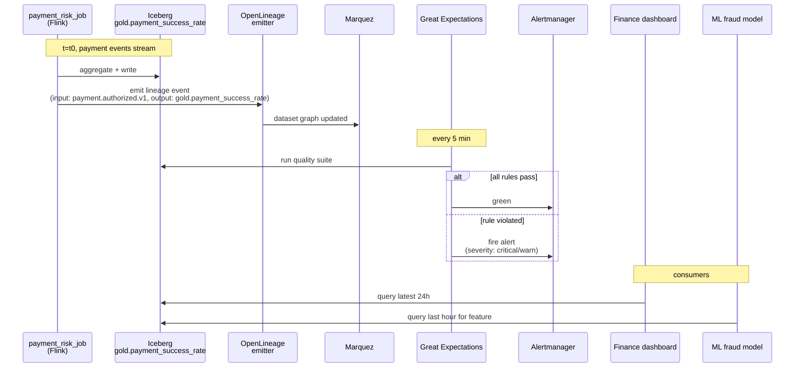

# KU F00 / 01 — Tư duy data product

> Dữ liệu không phải "đống file rớt vào kho". Dữ liệu là **sản phẩm** — có khách, có hợp đồng, có chủ, có vòng đời. Hiểu được điều này thay đổi cách bạn build, đo, vận hành mọi pipeline.

**Module:** [F00 — Mental Models](./README.md)
**Prereqs:** không
**Related KUs:** [F00/04 State+Change+Time](./04-state-change-time.md) · [D15/01 Conceptual model](../D15-data-modeling/) · [D22/07 Schema contracts](../D22-data-quality-contracts/)
**Đọc trong:** ~12 phút
**Mức độ:** Foundational

---

## 🎯 Nó là gì? (Analogy đời sống)

Hãy tưởng tượng **tiệm bún bò Huế ngon nhất phố Nguyễn Trãi**.

Cô chủ tiệm vận hành tiệm như **một sản phẩm**, không phải "nồi nước dùng để đó ai múc thì múc":

| Yếu tố | Cách cô làm |
|---|---|
| **Có khách hàng cụ thể** | Anh chạy Grab buổi sáng, cô văn phòng giờ trưa, gia đình cuối tuần |
| **Có cam kết chất lượng** | Nước dùng nóng > 80°C, thịt không quá 4 tiếng, bún không nhão |
| **Có thực đơn rõ ràng** | "Tô đầy đủ", "tô không hành" — khách biết trước |
| **Có chủ chịu trách nhiệm** | Sai chất lượng → khách tìm cô, không "ai đó trong bếp" |
| **Có feedback loop** | Khách than mặn → tuần sau bớt muối |
| **Có nguồn gốc rõ** | Thịt từ chợ Bà Chiểu, bún từ làng nghề Củ Chi |
| **Có vòng đời** | Sáng nấu, trưa bán, cuối ngày dọn — không bán hôm sau |

Đó là **data product**: một dataset được vận hành **giống tô bún ấy** — có khách, có hợp đồng, có chủ, có lifecycle.

> Khi bạn coi `gold.daily_revenue` không phải "file Parquet trong S3" mà là "**sản phẩm** mà team Finance đặt hàng để chạy báo cáo cuối tháng" — bạn đang dùng tư duy data product.

---

## 📖 Định nghĩa chính thức

**Data product** (sản phẩm dữ liệu) là một dataset hoặc luồng dữ liệu được thiết kế, vận hành, và quản lý **như một sản phẩm độc lập** với:

- **Producer-Consumer relationship** rõ ràng (ai tạo — ai dùng)
- **Service-Level Objective (SLO)** đo lường được (freshness, availability, accuracy)
- **Schema contract** machine-readable + version
- **Quality guarantees** kiểm chứng tự động
- **Lineage** truy ngược được nguồn
- **Ownership** đến tận tên người / team
- **Lifecycle** từ propose → live → evolve → sunset

Khái niệm được Zhamak Dehghani đưa ra trong **Data Mesh** (2019) — coi mỗi domain là chủ sở hữu data product riêng, thay vì 1 team trung tâm "central data team" quản hết.

---

## 🔤 Terminology box

Mọi thuật ngữ kèm tiếng Anh + giải thích ngắn:

| Thuật ngữ | Anh | Giải thích 1 câu |
|---|---|---|
| **Sản phẩm dữ liệu** | Data product | Dataset được vận hành như sản phẩm có khách, hợp đồng, vòng đời |
| **Người sản xuất** | Producer | Pipeline / team tạo ra data product (ví dụ: Flink job, Dagster asset) |
| **Người tiêu thụ** | Consumer | Dashboard, ML model, API gọi data product |
| **Chủ sở hữu** | Owner | Team chịu trách nhiệm khi data product hỏng / cần thay đổi |
| **Hợp đồng dữ liệu** | Data contract | Tài liệu (thường YAML) định nghĩa schema + SLA + ownership |
| **Schema contract** | Schema contract | Phần "cấu trúc cột" trong data contract — kiểu dữ liệu, ràng buộc, evolution rule |
| **SLA / SLO / SLI** | SLA/SLO/SLI | Cam kết (SLA), mục tiêu (SLO), chỉ số đo (SLI) — KU 08/06 đào sâu |
| **Độ tươi** | Freshness | Khoảng cách thời gian giữa "data nhập" và "data có sẵn" |
| **Lineage / Dòng chảy** | Lineage | Bản đồ chỉ data product này dựng từ những data product nào |
| **Vòng đời** | Lifecycle | Born → Live → Evolve → Sunset (4 giai đoạn) |
| **Khả năng quan sát** | Observability | Metrics + logs + alerts về sức khoẻ của data product |
| **Quản trị dữ liệu** | Data governance | Chính sách + công cụ để đảm bảo data product có chất lượng + tuân thủ |
| **Kiến trúc lưới dữ liệu** | Data mesh | Mô hình tổ chức nơi mỗi domain sở hữu data product riêng, không "central data team" |
| **Producer-consumer contract** | Producer-consumer contract | Hợp đồng 2 chiều: producer cam kết gì, consumer được expect gì |
| **Bronze / Silver / Gold** | Bronze/Silver/Gold | 3 tầng lakehouse (KU 02/04 sâu hơn). Gold thường là data product chính thức. |

---

## 💡 Nó làm được gì?

Khi bạn **coi dữ liệu là sản phẩm** (thay vì "đống file"), bạn tự nhiên có 5 thực hành:

### 1. Owner rõ ràng

> Hỏi "bảng `gold.payment_success_rate` ai quản?" → phải trả lời được tên team / GitHub handle, không phải "ai đó trong bếp".

Trong project DSX Air này: xem [`governance/data-ownership.md`](../../governance/data-ownership.md) — mỗi dataset có domain owner: commerce, payment, risk, supply chain, hoặc data platform.

### 2. SLA freshness

> "Realtime funnel cập nhật trong vòng 60 giây" giống "bún bưng ra trong 3 phút".

Khi vi phạm → **alert tự fire** + người on-call biết phải làm gì.

### 3. Schema contract

> "Bảng có cột `order_id` kiểu string, không null, không bao giờ tự ý xoá" giống "tô bún luôn có lát chân giò".

Xem ví dụ thật trong project: [`governance/data-contracts/payment.authorized.v1.yaml`](../../governance/data-contracts/payment.authorized.v1.yaml).

### 4. Quality check tự động

> "Không có row null customer_id" = "bún không nhão" — kiểm tra mỗi build, fail thì block downstream.

### 5. Lineage truy ngược

> Khi `gold.daily_revenue` bị sai 5% → mở Marquez UI → thấy ngay nó dựng từ `silver.fact_payment` (dựng từ topic `payment.authorized.v1`) → biết debug ở đâu.

→ 5 thực hành này là **gói combo** — bỏ 1 cái thì 4 cái còn lại yếu đi.

---

## 🧩 Nó là mảnh ghép nào trong tổng thể?

Tư duy data product **không phải 1 tool** — nó là **góc nhìn** thấm vào mọi layer của data platform:



**Điểm cốt yếu:** một team có thể có **đầy đủ Kafka + Flink + Iceberg** nhưng **không có** data product mindset → vẫn ra "đống file". Có mindset → cùng stack ấy ra "sản phẩm".

Nói cách khác: data product mindset là **phần mềm trong não engineer**, không phải "feature trong tool".

---

## 🚀 Nó giúp ích gì?

So sánh 2 team:

### Team A — không có data product mindset

```
Pipeline fail lúc 2h sáng:
  → On-call wake up: "bảng X trễ"
  → Không biết bảng X ai quản
  → Không biết bảng X feed cho ai → ngắt thì hỏng gì?
  → Không có SLA → "trễ" so với cái gì?
  → Mò log 2 tiếng
  → Cuối cùng fix tạm, không root cause
  → Tuần sau lặp lại
```

### Team B — có data product mindset

```
Pipeline fail lúc 2h sáng:
  → On-call wake up: "gold.payment_success_rate vi phạm SLA freshness < 60s"
  → Mở data-ownership.md → owner = team payment, contact #payments
  → Mở Marquez → thấy lineage upstream: payment_risk_job (Flink)
  → Mở Grafana → backpressure cao trên payment_risk_job
  → Open runbook flink-job-failed.md → restart từ checkpoint
  → 10 phút sau: lag drain, alert clear
  → Post-mortem hôm sau: thêm capacity TaskManager
```

**Khác biệt 12 lần thời gian xử lý.** Đó là giá trị thực của data product mindset.

---

## ⏰ Khi nào dùng / KHÔNG dùng?

| ✅ Luôn dùng khi | ❌ Bỏ qua khi |
|---|---|
| Dataset có ≥ 1 consumer thật | Notebook cá nhân chạy 1 lần rồi xoá |
| Dataset feed dashboard / API / ML | Spike prototype 30 phút |
| Dataset có downstream phụ thuộc | Không ai đọc ngoài bạn |
| Production-bound pipeline | One-off ad-hoc query |
| Cross-team consumption | Test trong sandbox |
| Compliance / audit yêu cầu | Throwaway data exploration |

### Trong project DSX Air này

- ✅ **`silver.*` + `gold.*`** = data products → có contract, owner, SLA
- ❌ **`raw/` + `bronze.*`** = intermediate → không bắt buộc là data product
- ✅ **Mọi topic `*.v1`** trong Redpanda = data product (vì có nhiều consumer)
- ❌ **DLQ topic** = ops topic, không là data product

> **Quy tắc:** nếu xoá nó sẽ làm ai đó "đau" → đó là data product. Nếu xoá không ai biết → không phải.

---

## 🤔 Vì sao chọn nó (vs alternatives)?

Có 4 mindset thay thế phổ biến — mỗi cái có chỗ dùng riêng:

| Mindset | Khi nào thắng | Khi nào thua |
|---|---|---|
| **Data product** (cái này) | Team ≥ 2 người, dataset có consumer, production | Overkill cho prototype 1 ngày |
| **Pipeline-as-script** | Ad-hoc, chạy 1 lần | Sẽ vỡ khi consumer mới xuất hiện |
| **Data mesh** (extension) | Org lớn (50+ data engineers, nhiều domain) | Quá nặng cho team < 10 người |
| **Central data lake** ("đổ hết vào, ai dùng tự lo") | Tổ chức nhỏ + ít domain | Không scale — central team thành bottleneck |
| **"Bảng dữ liệu thôi mà"** | Học thử | Mọi project production sẽ trả giá đắt |

**Sweet spot của data product mindset:** team 3-50 người, có ít nhất 5-10 datasets được consume bởi ≥ 2 actor (dashboard, API, ML, team khác).

---

## 🔧 Nó vận hành ra sao? (Logic walkthrough)

5 thuộc tính (5 attributes) sống cùng data product **suốt vòng đời**:



### Vòng đời 4 giai đoạn



**Born — 4 việc:**
1. Team propose data product trong governance/data-contracts/
2. Owner + SLA + schema được review
3. Quality rules được viết
4. Lineage emitter được hook

**Live — luôn 4 dấu hiệu:**
1. Build green (GE pass)
2. Lineage emit thường xuyên
3. SLA freshness được monitor
4. Consumer feedback channel mở

**Evolve — quy tắc vàng:**
- Schema change đi qua BACKWARD compat (KU 22/08 sâu hơn).
- Bump version: `v1` → `v2`. **Không** sửa `v1` in-place.
- Cả 2 version chạy song song trong grace period (30-90 ngày).

**Sunset:**
- Mark deprecated → notify consumers → 30 ngày grace → drop pipeline + bảng + topic.

---

## 🧪 Worked example

**Tình huống cụ thể:** team Payment muốn tạo data product `gold.payment_success_rate` cho dashboard Finance + ML model fraud detection.

### Bước 1 — Propose contract

Team Payment viết file `governance/data-contracts/gold.payment_success_rate.yaml`:

```yaml
name: gold.payment_success_rate
domain: payment
owner: payments-team
status: ACTIVE
sla:
  freshness_p95_seconds: 60        # cập nhật < 60s sau payment event
  availability_target: 99.5         # 99.5% in lab time

schema:
  - name: minute_bucket
    type: TIMESTAMP
    description: "Bucketed by minute"
  - name: success_count
    type: BIGINT
  - name: failure_count
    type: BIGINT
  - name: success_rate
    type: DECIMAL(5,4)
    description: "= success_count / (success_count + failure_count)"

quality_rules:
  - rule: success_rate between 0 and 1
    severity: critical
  - rule: not_null minute_bucket
    severity: critical
  - rule: row_count > 0 in last 5 minutes
    severity: warn

consumers:
  - team: finance, use_case: "monthly revenue dashboard"
  - team: ml-platform, use_case: "fraud detection feature"
```

### Bước 2 — Vận hành thực

Sau khi merged contract:



### Bước 3 — 3 sự kiện xảy ra

1. **Sự kiện 1 — schema đổi.** Team muốn thêm cột `currency`. → Bump version → `gold.payment_success_rate.v2`. Cũ vẫn chạy 60 ngày. Consumers migrate. Drop v1.

2. **Sự kiện 2 — vi phạm SLA.** Một ngày freshness lên 180s do MinIO chậm. Alert fire. On-call mở runbook `runbooks/minio-unavailable.md`. Fix. Postmortem: thêm capacity MinIO.

3. **Sự kiện 3 — sunset.** ML team chuyển sang dataset khác. Finance dashboard cũng đổi. → 30 ngày không có read → mark deprecated → drop.

### Bài học từ worked example

- Hợp đồng được viết **trước** code → buộc team nghĩ kỹ.
- Quality rule chạy **tự động**, không cần human check.
- Lineage **emit tự nhiên** từ Flink — không phải gõ thủ công.
- Schema evolution **không bao giờ sửa in-place** — luôn bump version.

---

## ⚠️ Common pitfalls (sai lầm thường gặp)

### Pitfall 1 — "Data product = bảng đẹp"

❌ **Sai:** Team nghĩ chỉ cần đặt tên bảng rõ ràng + viết description là xong.

✅ **Đúng:** Data product = **5 thuộc tính + lifecycle**. Thiếu owner, thiếu SLA, thiếu lineage → chưa phải.

### Pitfall 2 — Coi mọi dataset là data product

❌ **Sai:** Apply contract + SLA + quality rule cho cả `raw.tmp_debug_table`.

✅ **Đúng:** Chỉ `silver/gold` + topic public. Bronze + DLQ + ops table không bắt buộc.

> **Hệ quả của làm sai:** team kiệt sức vì governance overhead cho dataset không quan trọng.

### Pitfall 3 — Schema-on-the-fly

❌ **Sai:** "Tao thêm cột mới vào v1, BACKWARD compat mà." Sau đó consumer cũ vẫn vỡ vì cột là REQUIRED.

✅ **Đúng:** Cột mới thêm là **OPTIONAL** (nullable) trong v1. Nếu cần REQUIRED → bump v2.

### Pitfall 4 — Owner là "team data"

❌ **Sai:** Mọi dataset owner = "team data platform". Tất cả 50 datasets về 1 team.

✅ **Đúng:** Owner = **domain team thật sở hữu nghiệp vụ**. Team data platform chỉ host infra. Payment data → payment team. Inventory → supply chain. Đây là tinh thần data mesh.

### Pitfall 5 — Contract viết xong rồi quên

❌ **Sai:** Contract trong file YAML, không ai check, không có CI validate.

✅ **Đúng:** CI workflow (`validate-contracts.yml`) chạy mỗi PR — fail nếu schema thực tế lệch contract.

---

## 🌱 Advanced topics

Cho người curious — chỉ đào nếu đã thấm 5 thuộc tính cơ bản:

### A1. Data mesh — scale data product cho org lớn

Khi org có > 50 data engineers và 5+ business domain, "1 team data platform tập trung" thành bottleneck. **Data mesh** đề xuất:

- Mỗi domain (commerce, payment, risk, supply chain) tự **own data product**.
- Có **platform team** cung cấp self-service infra (Kafka, lakehouse, catalog).
- Có **federated governance** — quy tắc chung nhưng thực thi cục bộ.

> Tham khảo: [Data Mesh Principles — Zhamak Dehghani](https://martinfowler.com/articles/data-mesh-principles.html)

### A2. Data product marketplace

Trong các org tiên tiến (Spotify, Airbnb): có **internal data product marketplace** — UI giống Amazon, list các data products available. Consumer "subscribe" → tự động được cấp access + theo dõi SLA.

Tool đang nổi: **Atlan**, **Unity Catalog** (Databricks), **Polaris** (Snowflake).

### A3. Contract registry vs Schema Registry

| Cái này | Cái kia |
|---|---|
| **Contract Registry** lưu data contract (schema + SLA + ownership + quality rules) | **Schema Registry** chỉ lưu schema (Avro/JSON Schema) |
| Source of truth cho governance | Source of truth cho serialization |
| Ví dụ: DataHub, Unity Catalog | Ví dụ: Confluent SR, Redpanda SR, Karapace |

→ 2 cái này khác nhau! Project này dùng cả 2:
- **Schema Registry** (Redpanda) cho schema serialize.
- **Contract files** trong `governance/data-contracts/` cho data contract đầy đủ.

### A4. Data product SDLC (Software Development Life Cycle)

Khi data product đông (~hàng trăm), cần SDLC formal:
1. **Propose** — RFC + design doc
2. **Design** — schema + SLA + quality rules
3. **Build** — pipeline code + tests
4. **Stage** — chạy song song trong test environment
5. **Release** — promote to production
6. **Operate** — monitor SLA + on-call
7. **Evolve** — version bump, BACKWARD compat
8. **Deprecate + Sunset**

Tương đương SDLC của software service.

---

## 🔗 Liên kết KU khác

Tư duy data product chạm vào nhiều KU khác:

- **[F00/02 Trade-off thinking](./02-trade-off-thinking.md)** — chọn data product vs central lake là 1 trade-off.
- **[F00/04 State + Change + Time](./04-state-change-time.md)** — data product có "state" (snapshot hiện tại) + "change" (history) + "time" (SLA).
- **[F00/06 Idempotency](./06-idempotency.md)** — pipeline tạo data product PHẢI idempotent để retry an toàn.
- **[D15/01 Conceptual modeling](../D15-data-modeling/)** — data product cần model rõ trước khi build.
- **[D22/07 Schema contracts](../D22-data-quality-contracts/)** — contract YAML cụ thể.
- **[D22/09 Data contract standard](../D22-data-quality-contracts/)** — chuẩn YAML ngành.
- **[D27/01 Data governance](../D27-governance-lineage/)** — governance bao trùm data product.
- **[D27/02 OpenLineage spec](../D27-governance-lineage/)** — lineage protocol.
- **[D40/01 Solution architect role](../D40-solution-architecture/)** — solution architect dùng data product làm building block.

---

## 🧠 Self-test (3 mức)

### 🟢 Easy

1. Tô bún của cô chủ có 7 thuộc tính giống data product. Hãy gọi tên 5 thuộc tính tương ứng trong data product.
2. Vì sao `bronze.*` thường KHÔNG được coi là data product trong khi `gold.*` thì có?
3. Owner của 1 data product nên là 1 cá nhân hay 1 team? Vì sao?

### 🟡 Medium

4. Một schema thêm cột `discount_amount` được khai báo OPTIONAL — đây có break BACKWARD compat không? Nếu khai báo REQUIRED thì sao?
5. Pitfall #4 nói "Owner = team data platform" là sai. Vì sao? Phân tích theo tinh thần data mesh.
6. Trong project DSX Air, dataset nào **là** data product và dataset nào **không là**? Liệt kê ít nhất 3 mỗi loại.

### 🔴 Hard

7. Một team có Kafka + Flink + Iceberg + Trino đầy đủ nhưng pipeline vẫn vỡ thường xuyên + không ai biết ai chịu trách nhiệm. Chẩn đoán: thiếu gì? Cần làm 4 việc cụ thể nào?
8. Data mesh đề xuất "federated governance". Giải thích sự khác biệt với "central governance" + cho 1 ví dụ rule thuộc về "federated" vs 1 ví dụ rule thuộc về "central".

> **Trả lời được 6+/8** → hiểu sâu, sẵn sàng đi KU tiếp.
> **Trả lời 4-5** → đọc lại section Worked example + Pitfalls.
> **Trả lời 0-3** → đọc lại toàn KU + làm Glossary trước.

---

## 📌 Trong repo này

Concept "data product" được áp dụng thực tế ở:

- **Ownership map cụ thể:** [`governance/data-ownership.md`](../../governance/data-ownership.md) — 5 domain + ai own gì
- **Contract mẫu thật:** [`governance/data-contracts/payment.authorized.v1.yaml`](../../governance/data-contracts/payment.authorized.v1.yaml) — đọc kỹ để thấy contract trông thế nào
- **CI enforcement:** [`.github/workflows/ci.yml`](../../.github/workflows/ci.yml) → job `validate-contracts` — đảm bảo mọi topic có contract
- **Lineage emission:** [`docs/13-governance-lineage.md`](../../docs/13-governance-lineage.md) — cách Flink + Dagster emit lineage
- **SLO definitions:** [`docs/12-observability-slo.md`](../../docs/12-observability-slo.md) — SLA thực tế cho từng data product
- **ADR liên quan:** [ADR-0010 Synthetic data strategy](../../adr/0010-synthetic-data-strategy.md) — synthetic data là "input contract"

---

## 🌐 Đọc thêm (chính thống, hạn chế)

3 nguồn quan trọng nhất:

- **Zhamak Dehghani — "Data Mesh Principles and Logical Architecture"** ([Martin Fowler blog, 2020](https://martinfowler.com/articles/data-mesh-principles.html)) — bài gốc của khái niệm data product trong context mesh.
- **Andrew Jones — "Driving Data Quality with Data Contracts"** (Packt, 2023) — sách thực tiễn về data contract.
- **DataHub Data Product entity model docs** — đại diện cách industry mã hoá khái niệm thành tool.

---

**Đã đọc xong?**
✅ Tick vào [progress/checklist.md](../progress/checklist.md) → đi tiếp [F00/02 Trade-off thinking](./02-trade-off-thinking.md).
