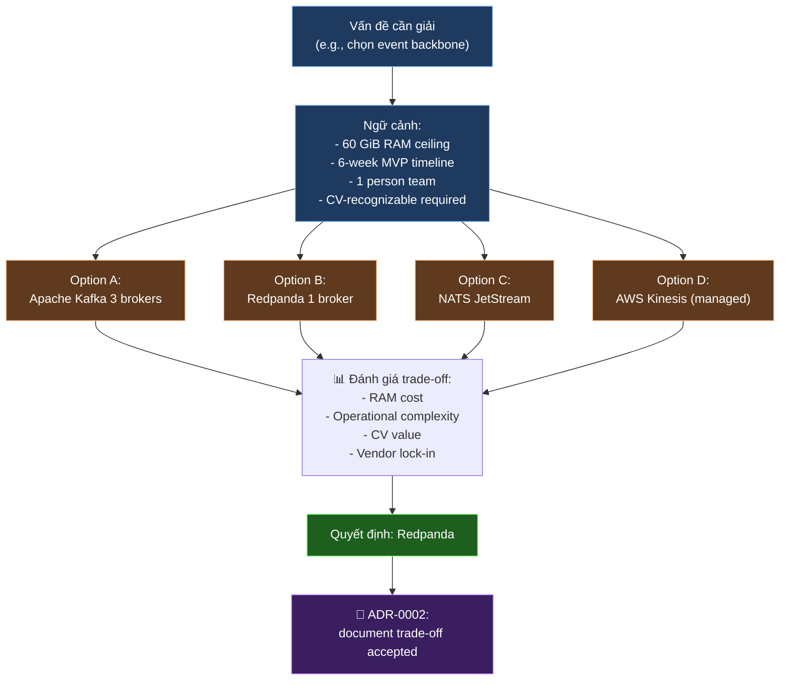
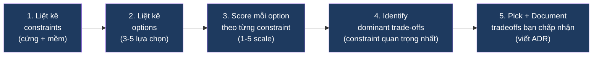
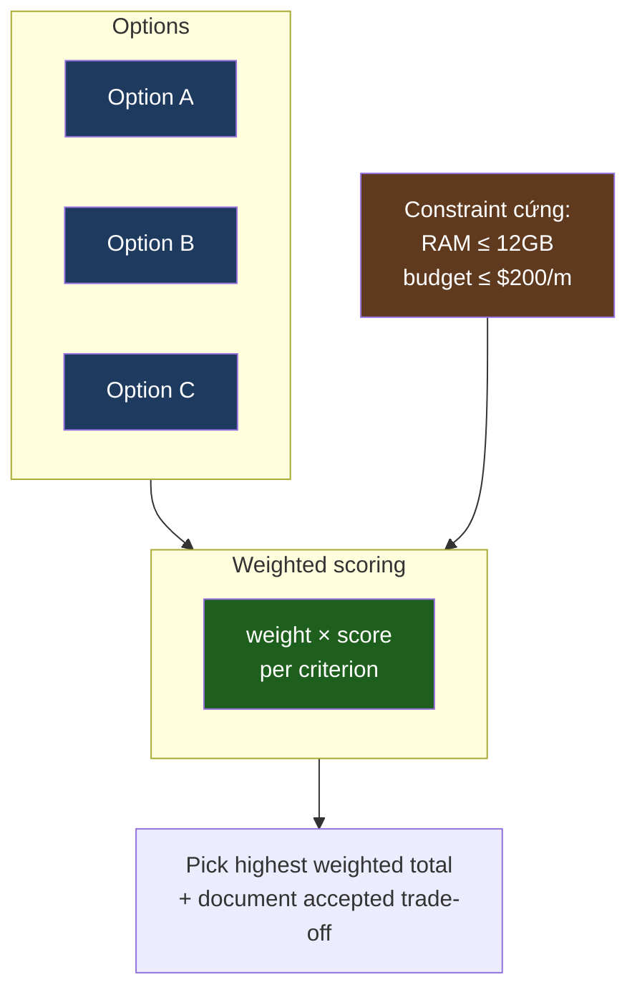

# KU F00 / 02 — Trade-off thinking: không có câu trả lời đúng tuyệt đối

> Trong kỹ thuật, **không có câu trả lời đúng** — chỉ có **đánh đổi**. Hiểu trade-off = dấu hiệu senior #1. Mọi quyết định kiến trúc đều là đánh đổi giữa các constraint cụ thể của ngữ cảnh, không phải so sánh "tool nào tốt nhất tuyệt đối".

**Module:** [F00 — Mental Models](./README.md)
**Prereqs:** [F00/01 Data product thinking](./01-data-product-thinking.md)
**Related KUs:** [F00/10 Premature optimization](./10-premature-optimization.md) · [F00/12 Trade-off triangle](./12-trade-off-triangle.md) · [D40 Solution Architecture](../40-solution-architecture/)
**Đọc trong:** ~12 phút
**Mức độ:** Foundational

---

## 🎯 Nó là gì? (Analogy đời sống)

Bạn đi mua xe máy.

- **Chiếc A:** Honda SH 160i — nhanh, đẹp, tốn xăng, đắt (90 triệu).
- **Chiếc B:** Wave Alpha — chậm, đơn giản, tiết kiệm, rẻ (18 triệu).
- **Chiếc C:** Vespa Sprint — nhanh vừa, đẹp đỉnh, nhưng nhỏ, đắt vừa (75 triệu).

Bạn hỏi: "**Xe nào tốt nhất?**" → người bán cười: "*Tốt nhất cho ai?*"

- Anh giao hàng → Wave Alpha (giờ làm 12h/ngày, cần tiết kiệm xăng)
- Cô giáo Sài Gòn → Vespa (cần đẹp + đủ nhanh đi tỉnh)
- Sinh viên Hà Nội → SH (nếu đủ tiền — vì giao thông + ưu thế tốc độ)
- Người về quê chở hàng → Wave + thêm sọt

Không có xe "**tốt nhất tuyệt đối**". Có xe "**tốt nhất cho ngữ cảnh của bạn**".

Trong kỹ thuật, **mọi quyết định kiến trúc** đều như vậy. Mỗi tool/framework/architecture có 3-5 lựa chọn alternatives, mỗi cái thắng và thua khác nhau **tuỳ ngữ cảnh**.

> *Câu hỏi đúng:* "Trong ngữ cảnh X (constraint cụ thể), tool nào tối ưu?"
> *Câu hỏi sai:* "Tool nào tốt nhất nói chung?"

---

## 📖 Định nghĩa chính thức

**Trade-off thinking** là kỹ năng đánh giá lựa chọn dựa trên ma trận **chi phí — lợi ích — rủi ro — ràng buộc** thay vì tìm "lựa chọn đúng tuyệt đối".

3 nguyên lý cốt lõi:

1. **Mọi quyết định đều có cost.** Không có "free upgrade" — chọn benefit nào thì pay cost nào.
2. **Cost / benefit phụ thuộc ngữ cảnh.** Tool A thắng với startup, thua với enterprise (và ngược lại).
3. **Senior thấy được cost ẩn.** Junior chỉ thấy benefit; senior thấy cả "câu nguyền 2 năm sau".

**Nguồn:**
- Frederick Brooks Jr., *The Mythical Man-Month* (1975) — sách đặt nền móng "no silver bullet" — không có giải pháp ma thuật.
- Bill Wake (2003), *INVEST in Good Stories* — checklist evaluating trade-off.
- Michael Nygard, *Documenting Architecture Decisions* (2011) — ADR template chuẩn để document trade-off.

---

## 🔤 Terminology box

| Thuật ngữ | Tiếng Anh | Giải thích 1 câu |
|---|---|---|
| Đánh đổi | Trade-off | Hy sinh 1 thứ để được thứ khác |
| Tư duy đánh đổi | Trade-off thinking | Skill đánh giá lựa chọn theo cost/benefit ngữ cảnh |
| Lợi ích | Benefit | Cái bạn nhận được khi chọn 1 option |
| Chi phí | Cost | Cái bạn phải trả — thời gian, tiền, complexity, lock-in |
| Chi phí ẩn | Hidden cost | Cost không lộ ngay, xuất hiện 6-24 tháng sau |
| Ngữ cảnh | Context | Constraint cụ thể: team size, budget, deadline, scale |
| Ràng buộc cứng | Hard constraint | Không thể vi phạm (compliance, deadline regulator) |
| Ràng buộc mềm | Soft constraint | Có thể negotiate (budget, scope, quality target) |
| Câu hỏi đúng | Right question | "Trong ngữ cảnh X, option nào tốt hơn?" |
| Câu hỏi sai | Wrong question | "Option nào tốt nhất nói chung?" |
| Cargo cult | Cargo cult | Sao chép giải pháp FAANG cho org không có cùng problem |
| First principles | First principles | Suy từ nguyên lý gốc thay vì copy pattern |
| ADR | Architecture Decision Record | Document chính thức ghi trade-off đã chọn |
| Lock-in | Lock-in | Cost khi muốn đổi sang tool khác sau |
| Silver bullet | Silver bullet | Giải pháp ma thuật giải quyết hết — **không tồn tại** |
| Decision matrix | Decision matrix | Bảng so sánh option × criteria có scoring |

---

## 💡 Nó làm được gì?

Trade-off thinking cho phép bạn:

- **Tránh fanboy.** Không bị "Kafka tốt nhất" / "Spark tốt nhất" / "Databricks tốt nhất" — câu này luôn sai context-free.
- **Trả lời phỏng vấn senior.** "Tại sao anh chọn Redpanda?" — câu trả lời 3 câu trade-off, không phải 1 câu khẳng định.
- **Viết ADR mạnh.** Mỗi ADR là 1 bài trade-off cô đọng.
- **Tranh luận lành mạnh.** Đồng nghiệp đề xuất tool khác → bạn không cãi "không, X tốt hơn" mà hỏi "**trong ngữ cảnh nào X thắng?**"
- **Sống chung với quyết định cũ.** Tiền nhiệm chọn tool dở → bạn nhìn lại constraint thời đó và hiểu, không chê.
- **Phòng tránh cargo cult.** "FAANG dùng X" không phải lý do đủ.
- **Decompose vấn đề.** Tách "phải nhanh" + "phải rẻ" + "phải bảo mật" — không nuốt cùng lúc.

---

## 🧩 Nó là mảnh ghép nào trong tổng thể?

Trade-off thinking là **mental layer chạy bên trên** mọi quyết định kỹ thuật:



→ **Lưu lý do chọn** = lưu trade-off. ADR là **nơi đông cứng** suy nghĩ trade-off vào file. Đây chính là [`adr/0002-redpanda-over-kafka.md`](../../adr/0002-redpanda-over-kafka.md) trong project DSX Air.

---

## 🚀 Nó giúp ích gì?

### Không có trade-off thinking

```
"Build pipeline với Snowflake + Databricks + Spark + Iceberg + Trino + dbt + Airflow + Dagster."

→ Cố adopt cả 8 tool. 6 tháng sau:
- 50% feature chưa work
- Cost = $20k/tháng
- Team kiệt sức vì 8 stack vận hành
- Sếp hỏi: "Vì sao chọn X?" — không trả lời được
```

### Có trade-off thinking

```
Constraint:
- 1 team 3 dev
- $2k/tháng budget
- 6-month launch
- Need lakehouse + dashboard

Pick after trade-off analysis:
- Lakehouse: Iceberg + Trino (open source, $0 license, $200/month server)
- Orchestration: Dagster (asset-based, fit lakehouse)
- Dashboard: Grafana (open source)
- Skip: Snowflake (premium), Databricks (premium), full dbt (overkill)

Document in ADR. Re-evaluate when scale changes.
```

→ Trade-off thinking **giảm 10x cost** + **tăng 10x clarity** so với cargo cult.

### Trong dự án DSX Air

Mỗi ADR trong [`adr/`](../../adr/) là 1 example concrete của trade-off thinking:

| ADR | Pick | Sacrifice |
|---|---|---|
| ADR-0001 | DSX Air positioning network-fabric-aware | Pure-compute alternatives (cheaper) |
| ADR-0002 | Redpanda over Kafka | Recognizable Kafka brand on CV (slight) |
| ADR-0003 | Flink over Spark Streaming | Spark unified batch+stream |
| ADR-0004 | Iceberg over Delta/Hudi | Delta's strong vendor backing (Databricks) |
| ADR-0005 | Dagster over Airflow | Airflow's larger community |
| ADR-0006 | Marquez over DataHub | DataHub's richer feature set |
| ADR-0007 | ClickHouse over Druid/Pinot | Druid's segmented architecture |
| ADR-0008 | Time-multiplex sessions | All-in-one running concurrently |
| ADR-0009 | MVP-first then extend | Big-bang approach |
| ADR-0010 | Synthetic data with built-in dirty | Real-world data realism |

→ 10 trade-offs **explicit**, mỗi cái có "Why this over alternatives" section.

---

## ⏰ Khi nào dùng / KHÔNG dùng?

| ✅ Bắt buộc dùng | ❌ Bỏ qua được |
|---|---|
| Chọn tool / framework / arch | Chọn tên biến `i` vs `j` |
| Viết ADR | Bug fix 3 dòng |
| Phỏng vấn / review code | Quick prototype 30 phút |
| Thuyết phục team | Việc đã có chuẩn org |
| Hire / vendor selection | Pick coffee mug |
| Roadmap planning | Format code |
| Tech debt review | Rename file |

> **Quy tắc thump:** decision có tác động > 1 tuần effort hoặc > $1000 cost → áp dụng trade-off thinking. Quyết định nhỏ hơn → just-do-it.

**Cảnh báo:** Đừng **paralysis-by-trade-off** — không phải mọi quyết định cần ma trận 5 cột × 10 tiêu chí. Cho quyết định trung bình, 3-bullet pros/cons là đủ.

---

## 🤔 Trade-off vs alternatives

3 kiểu tư duy khi đứng trước quyết định:

| Kiểu | Khi đúng | Khi sai |
|---|---|---|
| **Trade-off thinking** (cái này) | Quyết định kiến trúc / tool / hire | Bug fix nhỏ, format code |
| **Best practice cứng** ("dùng theo Google docs") | Code style, lint rule | Quyết định kiến trúc (Google ≠ bạn) |
| **First principles** (từ nguyên lý gốc) | Tổ chức tài liệu khi không có tiền lệ, novel problem | Có thể chậm, không leverage được kiến thức ngành |
| **Cargo cult** ("FAANG dùng X nên ta dùng X") | … chưa khi nào | Luôn luôn |

→ Trade-off + First-principles là combo của senior architect.

→ Cargo cult là sai phổ biến nhất — sẽ học sâu hơn ở [F12 System Design](../12-system-design-fundamentals/).

---

## 🔧 Nó vận hành ra sao? (Logic walkthrough)

### Quy trình trade-off chuẩn 5 bước



### Worked example: ADR-0004 chọn Iceberg cho project DSX Air

**Bước 1 — Constraints:**
- Hard: 60 GiB RAM ceiling, 6-week MVP
- Soft: CV-friendly, streaming-friendly preferred
- Compliance: open source preferred (no vendor lock-in)

**Bước 2 — Options:**
- Iceberg (Apache, REST catalog)
- Delta Lake (Databricks-backed)
- Hudi (Uber-backed)
- Paimon (streaming-first)

**Bước 3 — Score matrix:**

| Constraint | Iceberg | Delta | Hudi | Paimon |
|---|:---:|:---:|:---:|:---:|
| RAM tiết kiệm | 4/5 | 3/5 | 3/5 | 4/5 |
| Streaming-friendly | 4/5 | 3/5 | 4/5 | 5/5 |
| Ecosystem (Trino, Flink, PyIceberg) | 5/5 | 3/5 | 3/5 | 3/5 |
| Familiar trên CV | 5/5 | 5/5 | 3/5 | 2/5 |
| Documentation | 5/5 | 5/5 | 3/5 | 3/5 |
| Open governance | 5/5 | 3/5 | 5/5 | 5/5 |
| **TỔNG** | **28** | **22** | **21** | **22** |

**Bước 4 — Dominant trade-off:** Iceberg thắng trên ecosystem + governance + documentation. Paimon **thắng** trên streaming-friendly **nhưng thua nặng** trên ecosystem.

**Bước 5 — Decide + Document:** chọn Iceberg. ADR-0004 viết:

```markdown
## Decision
Apache Iceberg, REST catalog, on MinIO S3-compatible.

## Trade-offs accepted
- Sacrifice slight streaming-friendliness vs Paimon (3% benefit lost)
- Sacrifice Delta's vendor backing — but we don't want vendor lock-in

## Re-evaluate when
- Streaming workload becomes 80%+ of traffic
- Paimon ecosystem catches up with Trino/PyIceberg
```

→ **Đây là trade-off thinking thành hành động.**

### 3-bullet quick trade-off (khi quyết định nhỏ)

Không phải lúc nào cũng cần matrix 6 cột. Cho quyết định nhỏ, 3 bullet đủ:

```
Decision: dùng pandas hay polars cho ETL local?

Pros polars:
- Nhanh hơn 5-10x cho 1GB+ data
- Lazy evaluation tiết kiệm RAM

Cons polars:
- API khác pandas, team chưa quen
- Documentation kém hơn pandas

Verdict: dùng polars vì dataset > 500MB
Re-evaluate: nếu team complain confusion, switch back
```

→ 30 giây = 1 trade-off đầy đủ.

### Decision matrix template

Khi cần formal hơn:



---

## 🧪 Worked example

**Tình huống thật trong DSX Air:** team được giao yêu cầu — pick orchestrator cho batch pipelines. 3 options trên bàn: Airflow, Dagster, Prefect. Tech lead nói "tự decide + viết ADR".

### Bước 1 — Hỏi đúng câu

❌ Sai: "Cái nào **tốt nhất**?"
✅ Đúng: "Cái nào tối ưu cho **constraint cụ thể của project DSX Air**?"

### Bước 2 — Liệt kê constraints

```
Hard:
- Lakehouse asset-based mental model (project dùng Iceberg)
- < 4GB RAM (vì DSX Air ceiling)
- Open source (no vendor lock-in)

Soft:
- CV-friendly (industry recognition)
- Active community (Q&A available)
- Easy DAG visualization
- Native Iceberg integration
```

### Bước 3 — Score matrix

| Criterion | Weight | Airflow | Dagster | Prefect |
|---|:---:|:---:|:---:|:---:|
| Asset-based model | 30% | 2/5 | 5/5 | 3/5 |
| Memory footprint | 20% | 3/5 | 4/5 | 4/5 |
| Native Iceberg integration | 15% | 3/5 | 5/5 | 3/5 |
| Community size | 15% | 5/5 | 3/5 | 3/5 |
| CV recognition | 10% | 5/5 | 3/5 | 2/5 |
| Learning curve | 10% | 3/5 | 4/5 | 4/5 |
| **WEIGHTED TOTAL** | | **3.10** | **4.30** | **3.20** |

### Bước 4 — Decide + Sacrifice

Dagster wins. **Trade-off accepted:**
- Sacrifice: Airflow's community size (8x more StackOverflow answers, more tutorials)
- Sacrifice: Airflow's CV recognition (more recruiters know Airflow than Dagster)
- Sacrifice: Prefect's flow-as-code Pythonic feel

**Gain:**
- Asset-based model maps 1:1 to lakehouse work
- Native Iceberg + PyIceberg integration
- Lower RAM
- Modern data platform credibility (Dagster is rising)

### Bước 5 — ADR-0005

```markdown
# ADR-0005: Use Dagster for batch orchestration

## Decision
Adopt Dagster (asset-based) for all batch lakehouse jobs.

## Why this over alternatives
- Airflow: task-based, doesn't fit asset/data product model
- Prefect: flow-based but weaker lineage/asset support

## Trade-offs accepted
- Smaller community than Airflow (mitigated by good docs)
- Less CV recognition than Airflow (mitigated by quality of work demonstrated)

## Re-evaluate when
- Team grows > 10 engineers (Airflow's community = onboarding ease)
- Dagster open source pricing model changes adversely
```

### Bài học từ worked example

- **Score matrix forced explicit trade-off.** Không thể "feel" — phải pick weight + score.
- **Sacrifice documented up-front.** 2 năm sau ai đó hỏi "sao không dùng Airflow?" — câu trả lời sẵn trong ADR.
- **Re-evaluate trigger pre-defined.** Tránh sunk-cost fallacy (cố thủ với choice cũ khi context thay đổi).

---

## ⚠️ Common pitfalls

### Pitfall 1 — Hỏi "tool nào tốt nhất?"

❌ **Sai:** "Kafka vs Redpanda — tool nào tốt hơn?"

✅ **Đúng:** "Cho project [60 GiB RAM ceiling, 6-week MVP, 1 dev team], tool nào tối ưu?"

→ Câu hỏi đúng đã có **context** ngay trong câu hỏi.

### Pitfall 2 — Cargo cult từ FAANG

❌ **Sai:** "Netflix dùng Kafka, mình cũng dùng Kafka."

✅ **Đúng:** "Netflix có 200M user, 10,000 engineer, $5B/year tech budget. Mình có 1k user, 3 engineer, $5k budget. Constraint khác → có thể tool khác."

### Pitfall 3 — Paralysis by analysis

❌ **Sai:** Ma trận 15 cột × 10 hàng cho quyết định adopt 1 lib utility.

✅ **Đúng:** Match level of analysis với impact. Adopt 1 lib = 3-bullet pros/cons. Adopt platform = matrix + ADR.

### Pitfall 4 — Không document sacrifice

❌ **Sai:** Pick Dagster, không document sacrifice (Airflow community). 1 năm sau team mới join hỏi "sao không dùng Airflow?", không ai nhớ.

✅ **Đúng:** Mỗi quyết định lớn → ADR section "Why this over alternatives" + "Trade-offs accepted".

### Pitfall 5 — Sunk-cost fallacy

❌ **Sai:** "Mình đã build trên X 2 năm, switch tốn quá, cố thủ tiếp."

✅ **Đúng:** Re-evaluate khi context đổi. Quyết định cũ tốt cho context cũ — không nhất thiết tốt cho context mới. Sunk cost = chi phí đã chi, không quyết định future.

### Pitfall 6 — One-sided recommendation

❌ **Sai:** "Tôi recommend Redpanda" (kèm 5 pro, 0 con).

✅ **Đúng:** "Tôi recommend Redpanda" (kèm 3 pro + 2 con + "trade-off accepted"). Một-sided rec = red flag senior khôg trust.

---

## 🌱 Advanced topics

### A1. No Silver Bullet (Frederick Brooks 1986)

Brooks famous essay: *"There is no single development, in either technology or management technique, which by itself promises even one order-of-magnitude improvement within a decade in productivity, in reliability, in simplicity."*

→ "Silver bullet" = ảo tưởng có tool magic giải hết. Brooks chứng minh: mọi tool đều có trade-off, complexity bản chất của software không thể trừ bỏ.

→ Senior từ chối thanh kiếm bạc. Mọi recommend "X giải quyết hết" = red flag.

### A2. Conway's reverse — trade-off org structure

Liên hệ với [F00/11 Conway's Law](./11-conways-law.md): khi chọn tool, trade-off bao gồm **fit với org structure**. Team 5 người chọn microservice = sai trade-off (Brooks's Law cộng dồn).

→ Trade-off không phải chỉ tech — bao gồm cả **team capacity + org maturity**.

### A3. Reversible vs irreversible decisions

Jeff Bezos chia decision thành 2 loại:
- **Type 1 (irreversible):** acquisitions, multi-year platform commit. Cần slow, careful analysis.
- **Type 2 (reversible):** A/B test, tool experiment, MVP. Cần fast iteration.

→ Áp trade-off thinking khác nhau. Type 1 = matrix + ADR + multiple reviewers. Type 2 = 3-bullet + ship.

→ Junior thường treat Type 2 như Type 1 (over-analysis) + Type 1 như Type 2 (under-analysis). Senior phân biệt được.

### A4. Cost ẩn (hidden cost) — 6 loại thường gặp

| Cost ẩn | Ví dụ |
|---|---|
| **Learning cost** | Team chưa biết tool → 2 tháng ramp |
| **Migration cost** | Sau 1 năm switch → 6 tháng migration |
| **Vendor lock-in** | Snowflake-proprietary SQL khó port |
| **Maintenance cost** | Self-host = on-call rotation, patching |
| **Coordination cost** | Multi-tool stack → integration overhead |
| **Opportunity cost** | Pick X → không build Y trong cùng thời gian |

→ Senior khi evaluate **luôn liệt kê hidden cost**. Junior chỉ thấy sticker price.

### A5. Pareto frontier — sub-set of trade-off thinking

Khi có > 3 biến trade-off, dùng **Pareto frontier**: tập hợp các option **không bị dominate**.

```mermaid
quadrantChart
    title Data tool Pareto frontier
    x-axis "Cost" --> "Higher"
    y-axis "Time-to-value + Quality" --> "Higher"
    quadrant-1 Premium (Pareto-optimal)
    quadrant-2 Dominated (avoid)
    quadrant-3 Cheap (Pareto-optimal)
    quadrant-4 Dominated (avoid)
    "Snowflake": [0.95, 0.95]
    "Databricks": [0.85, 0.92]
    "Postgres+Trino": [0.4, 0.78]
    "DuckDB": [0.1, 0.6]
    "Hive 2010s": [0.7, 0.3]
    "MySQL DW hack": [0.5, 0.4]
```

→ Pick **từ Pareto frontier** (top-right hoặc bottom-left). Avoid "dominated" zone (paying more for less).

### A6. Trade-off cho LLM 2026

Cùng pattern apply cho LLM choice:

| LLM | Cost ($/M tokens) | Latency | Quality |
|---|:---:|:---:|:---:|
| GPT-4 Turbo | $$$$ | Slow | 9/10 |
| Claude Opus 4.7 | $$$$ | Slow-Medium | 9.5/10 |
| Claude Sonnet 4.6 | $$ | Fast | 9/10 |
| Claude Haiku 4.5 | $ | Very fast | 7.5/10 |
| Local 7B model | $0 (GPU cost) | Variable | 6/10 |

→ Senior AI engineer pick từ Pareto frontier theo use case, không default 1 model luôn.

---

## 🔗 Liên kết KU khác

- **[F00/01 Data product thinking](./01-data-product-thinking.md)** — data product là 1 trade-off (formal vs ad-hoc)
- **[F00/10 Premature optimization](./10-premature-optimization.md)** — over-optimize = sai trade-off
- **[F00/11 Conway's Law](./11-conways-law.md)** — trade-off bao gồm org structure
- **[F00/12 Trade-off triangle](./12-trade-off-triangle.md)** — formal 3-variable version
- **[F11 Distributed Systems Theory](../11-distributed-systems-theory/)** — CAP, PACELC là trade-off cho distributed DB
- **[D40 Solution Architecture](../40-solution-architecture/)** — architect daily uses this skill
- **[D42 Soft Skills](../42-soft-skills-communication/)** — ADR writing là core soft skill

---

## 🧠 Self-test (3 mức)

### 🟢 Easy

1. Có câu trả lời cho "Kafka có tốt nhất không?" Đó là câu gì?
2. Cargo cult là gì? Cho 1 ví dụ trong tech.
3. ADR là viết tắt của gì? Vai trò chính?

### 🟡 Medium

4. Sao chép tool stack của Netflix về dùng cho team 3 người có vấn đề gì? Liên hệ "context".
5. Trong worked example chọn orchestrator, vì sao Dagster thắng dù Airflow có community lớn hơn? Trade-off accepted là gì?
6. "Hidden cost" 6 loại — kể 4 cái + cho 1 ví dụ mỗi cái từ project DSX Air.

### 🔴 Hard

7. Brooks' "No Silver Bullet" essay (1986) nói gì? Áp dụng vào AI/LLM 2026: có "silver bullet model" không? Vì sao có/không?
8. Jeff Bezos Type 1 vs Type 2 decisions: trong project DSX Air, hãy phân loại 5 quyết định (chọn tool stack, viết KU, run chaos test, commit code, hire senior engineer) — Type 1 hay 2?
9. Khi nào trade-off thinking thành **paralysis by analysis**? Đưa 3 cách phòng tránh.

> **6+/9** = hiểu sâu, đi tiếp KU 03. **4-5** = đọc lại worked example. **<4** = đọc lại toàn KU + viết ADR mẫu cho 1 quyết định.

---

## 📌 Trong repo này

Trade-off thinking thấm vào mọi file kiến trúc:

- **10 ADRs** trong [`adr/`](../../adr/) — mỗi cái là 1 trade-off thực
- **ADR template** ([`adr/ADR-template.md`](../../adr/ADR-template.md)) — section "Alternatives considered" + "Consequences" buộc thinking trade-off
- **README** ([`README.md`](../../README.md)) — section "Stack — kill-your-darlings choices" map trade-off cho 10 slot
- **ROADMAP** ([`ROADMAP.md`](../../ROADMAP.md)) — phase 1 vs phase 4 trade-off priorities
- **Limitations doc** ([`docs/99-limitations-and-honesty.md`](../../docs/99-limitations-and-honesty.md)) — explicit về trade-off đã chấp nhận
- **F00/12 Trade-off triangle** — formal 3-variable framework xây trên foundation này

---

## 🌐 Đọc thêm (chính thống, hạn chế — 3 nguồn)

- **Frederick Brooks Jr., "No Silver Bullet — Essence and Accidents of Software Engineering"** (Computer, 1987) — essay foundation cho mọi trade-off thinking.
- **Michael Nygard, "Documenting Architecture Decisions"** (2011, thinkrelevance.com) — bài gốc của ADR template.
- **Reis & Housley, "Fundamentals of Data Engineering" — Chapter 4 "Choosing Technologies Across the Data Engineering Lifecycle"** — chương dày về trade-off framework cho data tool selection. [Library: `Reis-Housley_2022_Fundamentals-of-Data-Engineering.pdf`](../../library/books/data-engineering/Reis-Housley_2022_Fundamentals-of-Data-Engineering.pdf)

---

**Đã đọc xong?**
✅ Tick vào [`progress/checklist.md`](../progress/checklist.md) → đi tiếp [F00/03 Biết vs Hiểu](./03-know-vs-understand.md).
