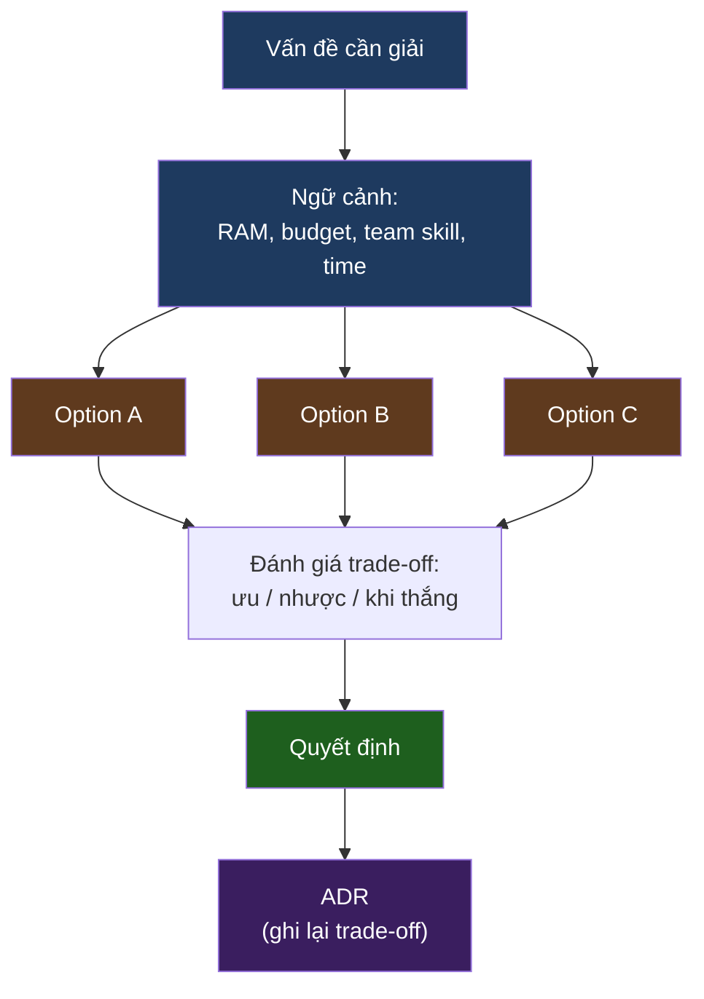
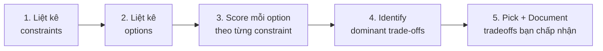

# KU 00/02 — Trade-off thinking

> Trong kỹ thuật, **không có câu trả lời đúng** — chỉ có **đánh đổi**. Hiểu trade-off = dấu hiệu senior #1.

**Module:** [00 — Mental Models](./README.md)
**Đọc trong:** ~10 phút

---

## 🎯 Nó là gì?

Bạn đi mua xe.

- Chiếc A: nhanh, tốn xăng, đắt.
- Chiếc B: chậm, tiết kiệm, rẻ.
- Chiếc C: nhanh, tiết kiệm, nhưng nhỏ.

Người mua hỏi "xe nào **tốt nhất**?" → người bán cười: "Tốt nhất cho ai?"

Đó là **trade-off thinking**: không có chiếc xe tốt nhất tuyệt đối. Có chiếc xe **tốt nhất cho ngữ cảnh của bạn**.

Trong kỹ thuật, **mọi quyết định kiến trúc** đều như thế: có 3-5 lựa chọn, mỗi cái thắng / thua khác nhau.

> *Định nghĩa hàn lâm:* Trade-off thinking là kỹ năng đánh giá lựa chọn dựa trên ma trận **chi phí — lợi ích — rủi ro — ràng buộc** thay vì tìm "lựa chọn đúng tuyệt đối".

---

## 💡 Nó làm được gì?

Trade-off thinking giúp bạn:

- **Tránh fanboy.** Không bị "Kafka tốt nhất" / "Spark tốt nhất" / "Databricks tốt nhất".
- **Trả lời phỏng vấn senior.** "Anh chọn Redpanda vì…" — câu trả lời có 3 dòng đánh đổi, không phải 1 câu khẳng định.
- **Viết ADR.** Mỗi ADR là 1 bài trade-off cô đọng.
- **Tranh luận lành mạnh.** Đồng nghiệp đề xuất tool khác → bạn không cãi "không, X tốt hơn" mà hỏi "trong ngữ cảnh nào X thắng?"
- **Sống chung với quyết định cũ.** Người tiền nhiệm chọn tool dở → bạn nhìn lại constraint thời đó và hiểu, không chê.

---

## 🧩 Nó là mảnh ghép nào trong tổng thể?

Trade-off thinking là **mental layer chạy bên trên mọi quyết định**:

→ Lưu lại **lý do chọn** = lưu lại trade-off. ADR là **nơi đông cứng** suy nghĩ trade-off vào file.

---

## 🚀 Nó giúp ích gì?

**Không** có trade-off thinking, bạn:
- Cãi nhau với đồng nghiệp về tool "tốt hơn"
- Bị đẩy đi xa khỏi vấn đề thực vì sa đà vào "best practice"
- Khi vấn đề mới xuất hiện 6 tháng sau, không nhớ vì sao đã chọn cái cũ
- Viết tutorial → bị review chê "thế tại sao không dùng Y?"

**Có** trade-off thinking:
- Mỗi quyết định có lý do giải thích được
- Khi context thay đổi (team lớn lên, budget tăng) → re-evaluate, không cố thủ
- Đọc README người khác và đoán được **những gì họ đã đánh đổi**

---

## ⏰ Khi nào dùng / KHÔNG dùng?

| ✅ Dùng khi | ❌ Không cần dày công khi |
|---|---|
| Chọn tool / framework / arch | Chọn tên biến `i` vs `j` |
| Viết ADR | Bug fix 3 dòng |
| Phỏng vấn / review code | Quick prototype 30 phút |
| Thuyết phục team | Việc đã có chuẩn org |

Đừng **paralysis-by-trade-off** — không phải mọi quyết định cần ma trận 5 cột.

---

## 🤔 Vì sao chọn nó (vs alternatives)?

| Kiểu tư duy | Hữu ích khi | Tệ khi |
|---|---|---|
| **Trade-off** (cái này) | Quyết định kiến trúc / tool | Bug fix nhỏ |
| **Best practice cứng** | Code style, format | Quyết định kiến trúc |
| **First principles** | Tổ chức tài liệu khi không có tiền lệ | Có thể quá chậm |
| **Cargo cult** ("FAANG dùng X nên ta dùng X") | Không khi nào | Luôn luôn |

→ Trade-off + first-principles là combo của senior architect.

---

## 🔧 Nó vận hành ra sao?

Một quy trình trade-off chuẩn gồm 5 bước:

**Ví dụ thực: chọn lakehouse format trong project này** (= ADR-0004).

| Constraint | Iceberg | Delta | Paimon | Hudi |
|---|---:|---:|---:|---:|
| RAM tiết kiệm | 4/5 | 3/5 | 4/5 | 3/5 |
| Streaming-friendly | 4/5 | 3/5 | 5/5 | 4/5 |
| Ecosystem (Trino, Flink, PyIceberg) | 5/5 | 3/5 | 3/5 | 3/5 |
| Familiar trên CV | 5/5 | 5/5 | 2/5 | 3/5 |
| Documentation | 5/5 | 5/5 | 3/5 | 3/5 |

→ Iceberg thắng trên 4/5 cột. Paimon **thắng** trên streaming-friendly nhưng thua nặng trên ecosystem → reject.

**Đó là trade-off thinking thành hành động.**

---

## 🧠 Self-test

1. Có một câu trả lời cho "Kafka có tốt nhất không?" Đó là câu gì?
2. Sao chép tool stack của Netflix về dùng cho team 3 người có vấn đề gì? (Liên hệ với "cargo cult").
3. Bạn đang chọn giữa ClickHouse và Pinot. Hãy liệt kê 5 constraint sẽ ảnh hưởng quyết định.
4. ADR-0004 (Iceberg) loại Paimon ra. Trade-off cụ thể là gì?
5. Khi nào trade-off thinking thành **paralysis**? Làm sao tránh?

---

## 🔗 Trong repo này

- Mọi ADR đều là trade-off thinking đông cứng: [`adr/`](../../adr/)
- ADR mẫu rõ trade-off: [ADR-0008 Time-multiplex sessions](../../adr/0008-time-multiplex-sessions.md)
- README "kill-your-darlings" stack table: [README.md](../../README.md#stack--kill-your-darlings-choices)

---

## 📖 Đọc thêm (chính thống, hạn chế)

- Michael Nygard — "Documenting Architecture Decisions" (2011) — ADR template gốc, thấm đẫm trade-off thinking.
- "The Architecture of Open Source Applications" — multiple authors — chương về Nginx vs Apache là trade-off mẫu.
