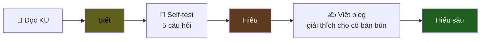
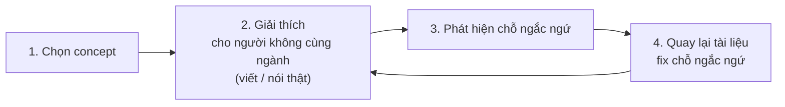

# KU 00/03 — Biết vs Hiểu

> Test hiểu thực sự không phải làm được bài tập. Test hiểu là **dạy lại cho người không cùng ngành** trong 3 phút.

**Module:** [00 — Mental Models](./README.md)
**Đọc trong:** ~6 phút

---

## 🎯 Nó là gì?

Bạn học **lái xe**.

- **Tuần 1:** Đọc luật giao thông. Bạn **biết** "đèn đỏ phải dừng".
- **Tuần 4:** Lái 100km. Bạn **hiểu** vì sao có khoảng cách an toàn — vì lần ấy xe trước phanh gấp.
- **Tháng 6:** Dạy em mình lái. Bạn giải thích được "vì sao **không** đạp phanh giữa cua". Đó là **hiểu sâu**.

Ba mức:
- **Biết:** đọc qua, nhắc lại được.
- **Hiểu:** dùng được trong tình huống mới.
- **Hiểu sâu:** giải thích được cho người khác, kèm ví dụ cụ thể, biết các sai lầm thường gặp.

> *Định nghĩa hàn lâm:* Bloom's taxonomy phân biệt **remember → understand → apply → analyze → evaluate → create**. "Biết" ≈ remember; "Hiểu" ≈ understand+apply; "Hiểu sâu" ≈ analyze+evaluate+create.

---

## 💡 Nó làm được gì?

Phân biệt 3 mức giúp bạn:

- **Tự đánh giá đúng** trình độ trước phỏng vấn (đa phần "biết" 70%, "hiểu" 20%, "hiểu sâu" 10%)
- **Học có chiến lược.** Không trộn nhầm "đọc xong tutorial Kafka" với "đã hiểu Kafka".
- **Phát hiện lỗ hổng.** Khi không giải thích được → đó là chỗ chỉ "biết" chứ chưa "hiểu".
- **Cải thiện nhanh.** Mỗi lần dạy lại / viết blog → bạn ép não mình từ "biết" lên "hiểu".

---

## 🧩 Nó là mảnh ghép nào trong tổng thể?

Trong **hệ thống học** của repo này, mỗi KU được thiết kế để đẩy bạn từ "biết" lên "hiểu":

→ Self-test ép bạn từ Biết → Hiểu. Viết blog ép bạn từ Hiểu → Hiểu sâu.

---

## 🚀 Nó giúp ích gì?

Phổ biến: bạn đọc xong "Designing Data-Intensive Applications" 600 trang.

**Không** phân biệt biết/hiểu → tự thấy mình đã rành DDIA → đi phỏng vấn → bị hỏi "vẽ giúp tôi cách CRDT giải quyết conflict" → đứng hình.

**Có** phân biệt → bạn **tự test** sau mỗi chương → biết chỗ nào còn "biết-không-hiểu" → quay lại.

---

## ⏰ Khi nào dùng / KHÔNG dùng?

| ✅ Dùng khi | ❌ Không cần khi |
|---|---|
| Học concept mới | Học hot-key IDE (chỉ cần biết) |
| Trước phỏng vấn senior | Lookup tài liệu rồi quên |
| Ai đó hỏi "anh đã rành X chưa?" | Khen xã giao "anh giỏi quá" |
| Viết blog / dạy lại | Đánh máy thuần tuý |

---

## 🤔 Vì sao chọn nó (vs alternatives)?

Có 3 framework đánh giá hiểu biết phổ biến:

| Framework | Ưu | Nhược |
|---|---|---|
| **Biết / Hiểu / Hiểu sâu** (cái này) | Đơn giản 3 mức, dễ tự đánh giá | Hơi thô cho academic |
| **Bloom's taxonomy** (6 mức) | Học thuật, đầy đủ | Khó tự áp dụng nhanh |
| **Feynman technique** | Test bằng giải thích lại | Cần "đối tượng" để test |
| **Self-rated 1-5** | Nhanh | Dễ tự đánh lừa (Dunning-Kruger) |

→ "Biết / Hiểu / Hiểu sâu" + Feynman technique là combo thực tiễn nhất.

---

## 🔧 Nó vận hành ra sao?

Feynman technique 4 bước, áp dụng cho bất kỳ KU nào:

Vòng lặp **dừng** khi: bạn giải thích trôi chảy + người nghe gật đầu.

**Trong project này, "người không cùng ngành"** = bạn viết blog đời thường (blogs/published/), và tưởng tượng **mẹ bạn / em họ tuổi teen** đọc.

---

## 🧠 Self-test

1. Bạn đọc xong tutorial Iceberg + xem video 1h. Đó là Biết, Hiểu, hay Hiểu sâu? Vì sao?
2. Test thực tế: hãy giải thích "partition trong Kafka" cho cô bán bún. Bạn vấp chỗ nào?
3. Khi bạn dạy lại đồng nghiệp một concept và họ hỏi câu khó bạn không trả lời được — bạn rút ra điều gì về mức độ hiểu của mình?
4. Vì sao "đọc 600 trang DDIA" KHÔNG đảm bảo "hiểu DDIA"?
5. Self-test ở cuối mỗi KU đẩy bạn từ mức nào lên mức nào?

---

## 🔗 Trong repo này

- Mỗi KU có self-test cuối bài để test Biết → Hiểu
- [`blogs/`](../../blogs/) là nơi ép Hiểu → Hiểu sâu
- METHODOLOGY: [`learning/METHODOLOGY.md`](../METHODOLOGY.md) giải thích chi tiết quy tắc tự đánh giá

---

## 📖 Đọc thêm (chính thống, hạn chế)

- Richard Feynman — "Surely You're Joking, Mr. Feynman!" — chương về dạy ở Caltech mô tả Feynman technique.
- Bloom B.S. — "Taxonomy of Educational Objectives" — bài gốc của 6 mức.
