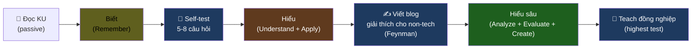
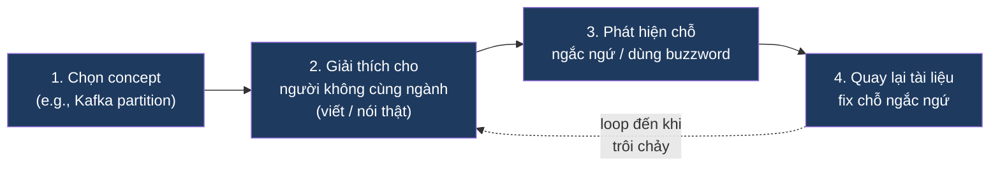
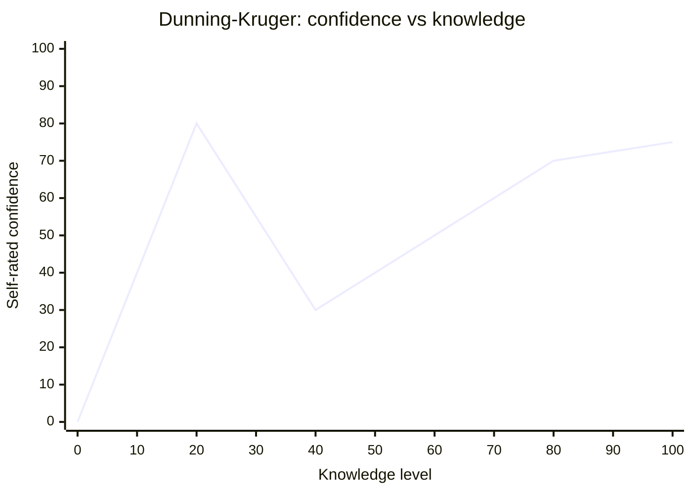
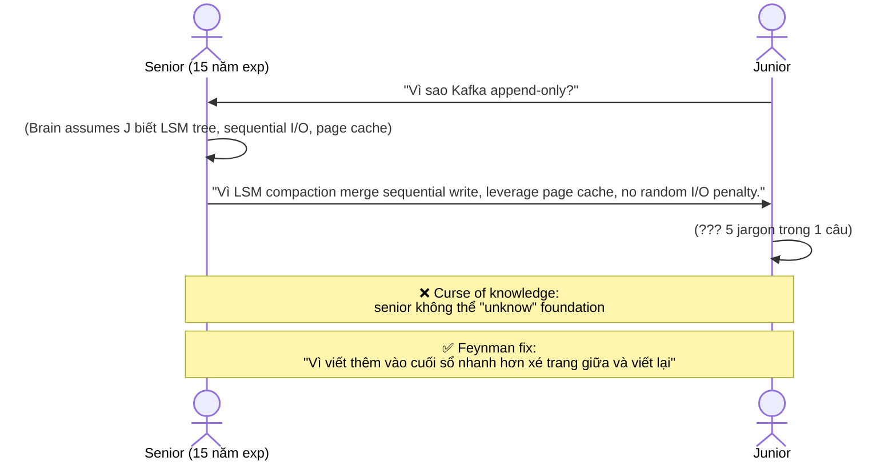

# KU F00 / 03 — Biết vs Hiểu vs Hiểu sâu

> Test "hiểu thực sự" không phải làm được bài tập. Test "hiểu thực sự" là **dạy lại cho người không cùng ngành** trong 3 phút mà họ gật đầu. Đây là khoảng cách giữa *đọc tutorial* và *làm chủ kiến thức*.

**Module:** [F00 — Mental Models](./README.md)
**Prereqs:** không
**Related KUs:** [F00/02 Trade-off thinking](./02-trade-off-thinking.md) · [D42 Soft Skills](../42-soft-skills-communication/)
**Đọc trong:** ~10 phút
**Mức độ:** Foundational

---

## 🎯 Nó là gì? (Analogy đời sống)

Bạn học **lái xe máy**.

- **Tuần 1 — Biết:** Đọc luật giao thông + xem video. Bạn **biết** "đèn đỏ phải dừng" + "đường 1 chiều" + "giữ khoảng cách an toàn". Hỏi câu lý thuyết, bạn trả lời trôi chảy.

- **Tuần 4 — Hiểu:** Đã lái 100km thật. Lần đầu phanh gấp khi xe trước đột nhiên dừng → bạn **hiểu** vì sao có "khoảng cách an toàn 2 giây" — không phải vì luật bắt, mà vì **vật lý + thời gian phản xạ của con người**.

- **Tháng 6 — Hiểu sâu:** Bạn dạy em mình lái. Em hỏi: "Vì sao **không** đạp phanh giữa cua?" Bạn giải thích được — vì lực ly tâm + bám đường giảm + xe có xu hướng đổ. Em gật đầu hiểu. Bạn không quote sách — bạn explain bằng câu chuyện riêng.

3 mức:
- **Biết (Know):** đọc qua, nhắc lại được.
- **Hiểu (Understand):** dùng được trong tình huống mới.
- **Hiểu sâu (Master):** giải thích cho người khác, kèm ví dụ cụ thể, biết các sai lầm thường gặp.

Khoảng cách giữa 3 mức là **đào tạo thực sự** — không phải đọc thêm sách.

---

## 📖 Định nghĩa chính thức

**Bloom's Taxonomy** (Benjamin Bloom 1956, revised 2001) chia learning thành 6 mức (low → high):

1. **Remember** (Nhớ): quote, recall facts.
2. **Understand** (Hiểu): paraphrase, explain, summarize.
3. **Apply** (Áp dụng): dùng vào tình huống mới.
4. **Analyze** (Phân tích): chia nhỏ + relate.
5. **Evaluate** (Đánh giá): phán xét + critique.
6. **Create** (Sáng tạo): tổng hợp + tạo mới.

Trong KU này, tôi simplify thành 3 mức thực dụng:

- **Biết** ≈ Remember (mức 1)
- **Hiểu** ≈ Understand + Apply (mức 2-3)
- **Hiểu sâu** ≈ Analyze + Evaluate + Create (mức 4-6)

**Feynman Technique** (Richard Feynman, Nobel Physics 1965) là 1 method test mức Hiểu sâu: **giải thích concept cho 1 đứa trẻ 12 tuổi**. Nếu không giải thích được → quay lại Biết. Vòng lặp đến khi giải thích trôi chảy.

**Nguồn:**
- Benjamin Bloom et al., *Taxonomy of Educational Objectives* (1956) — bài gốc của 6 mức.
- Anderson & Krathwohl (2001) revised taxonomy — version hiện đại.
- Richard Feynman, *"Surely You're Joking, Mr. Feynman!"* (1985) — chapter về teach at Caltech mô tả Feynman technique.

---

## 🔤 Terminology box

| Thuật ngữ | Tiếng Anh | Giải thích 1 câu |
|---|---|---|
| Biết | Know | Recall facts, nhắc lại được |
| Hiểu | Understand | Paraphrase + apply vào tình huống mới |
| Hiểu sâu | Master | Teach lại + ví dụ riêng + biết edge case |
| Bloom's Taxonomy | Bloom's Taxonomy | Khung phân loại 6 mức learning (1956) |
| Feynman technique | Feynman technique | Method test bằng cách dạy người ngoài ngành |
| Dunning-Kruger effect | Dunning-Kruger effect | Người biết ít tự đánh giá cao; người biết nhiều tự đánh giá thấp |
| Curse of knowledge | Curse of knowledge | Khi biết quá nhiều, khó giải thích cho người mới |
| Tacit knowledge | Tacit knowledge | Kiến thức ngầm, khó verbal — phải trải nghiệm |
| Explicit knowledge | Explicit knowledge | Kiến thức rõ ràng, có thể document được |
| Mental model | Mental model | Cách hình dung 1 concept |
| Spaced repetition | Spaced repetition | Học rải rác qua thời gian, tăng retention |
| Active recall | Active recall | Tự test thay vì re-read |
| Cognitive load | Cognitive load | Lượng kiến thức đang xử lý cùng lúc |
| Transfer learning | Transfer learning | Apply kiến thức cũ vào domain mới |
| Beginner's mind | Beginner's mind | Tư duy người mới — không bias từ kiến thức cũ |

---

## 💡 Nó làm được gì?

Phân biệt 3 mức Biết / Hiểu / Hiểu sâu cho phép bạn:

- **Tự đánh giá đúng trình độ** trước phỏng vấn (đa phần senior "biết" 70%, "hiểu" 25%, "hiểu sâu" 5% — tự lừa mình là "hiểu sâu" 60%).
- **Học có chiến lược.** Không trộn nhầm "đọc xong tutorial Kafka" với "đã hiểu Kafka" — 2 thứ khác xa.
- **Phát hiện lỗ hổng nhanh.** Khi không giải thích được → đó là chỗ chỉ "biết" chứ chưa "hiểu".
- **Cải thiện nhanh.** Mỗi lần dạy lại / viết blog → bạn ép não mình từ "biết" lên "hiểu" trong 1 phiên.
- **Tránh Dunning-Kruger trap.** Người "biết" 1 chút thường self-rate cao nhất → tự lừa.
- **Test người khác.** Khi hire engineer, hỏi "explain X cho non-tech" — câu trả lời reveal mức thật.

---

## 🧩 Nó là mảnh ghép nào trong tổng thể?

Trong **hệ thống học** của repo này (đọc [`learning/METHODOLOGY.md`](../METHODOLOGY.md)), mỗi KU được thiết kế để đẩy bạn từ "Biết" lên "Hiểu":



→ **Self-test** ép bạn từ Biết → Hiểu.
→ **Viết blog** (trong [`blogs/`](../../blogs/)) ép bạn từ Hiểu → Hiểu sâu.
→ **Teach đồng nghiệp** = highest test, validates Hiểu sâu.

Project DSX Air thiết kế learning loop explicit:

```
Read KU → Self-test → Lab journal → Blog draft → Publish → Teach
```

---

## 🚀 Nó giúp ích gì?

### Trường hợp 1: Bạn đọc DDIA 600 trang xong

**Không** phân biệt biết/hiểu:
- Tự đánh giá: "Mình đã rành DDIA."
- Đi phỏng vấn → bị hỏi "Vẽ giúp tôi cách CRDT giải quyết conflict" → đứng hình.
- Embarrassment + wasted opportunity.

**Có** phân biệt:
- Sau mỗi chương → tự test "Mình giải thích được cho 1 PM không?"
- Phát hiện: CRDT, vector clocks, two-phase commit là "biết-không-hiểu" → quay lại.
- 1 tháng sau: phỏng vấn → câu trả lời CRDT + analogy đời thường + edge cases → senior signal.

### Trường hợp 2: Học Kafka

**Junior path:** đọc tutorial Confluent → chạy `docker run kafka` → produce/consume → "Biết Kafka".

**Senior path:** đọc tutorial → tự hỏi "Tại sao Kafka append-only thay vì update?" → research → hiểu LSM tree + sequential I/O → dạy lại đồng nghiệp → đứng được trước câu hỏi "Tại sao không dùng database?".

→ Khoảng cách là **không phải đọc thêm sách** — mà là **active recall + Feynman + teach**.

### Trong dự án DSX Air

Self-test cuối mỗi KU là cơ chế chính:

| Mức | Mức câu hỏi | Test |
|---|---|---|
| 🟢 Easy (3-4 câu) | Recall + paraphrase | Biết → Hiểu |
| 🟡 Medium (3 câu) | Apply vào tình huống mới | Hiểu → Apply |
| 🔴 Hard (2 câu) | Analyze + evaluate + design | Apply → Hiểu sâu |

Pass đủ tất cả = chuẩn "ready to teach". Viết blog post từ KU = official mark "Hiểu sâu".

---

## ⏰ Khi nào dùng / KHÔNG dùng?

| ✅ Dùng khi | ❌ Không cần khi |
|---|---|
| Học concept mới (KU, sách, course) | Học hot-key IDE (chỉ cần biết) |
| Trước phỏng vấn senior | Lookup tài liệu rồi quên |
| Ai đó hỏi "anh rành X chưa?" | Khen xã giao "anh giỏi quá" |
| Viết blog / dạy lại | Đánh máy thuần tuý |
| Hire engineer | Onboarding tool routine |
| Plan learning path | Daily debug |

→ Apply 3-level distinction cho mọi technical concept bạn declare "rành".

---

## 🤔 Trade-off vs alternatives

3 framework đánh giá hiểu biết phổ biến:

| Framework | Ưu | Nhược | Khi dùng |
|---|---|---|---|
| **Biết / Hiểu / Hiểu sâu** (cái này) | Đơn giản 3 mức, dễ tự đánh giá | Hơi thô cho academic | Daily self-check |
| **Bloom's Taxonomy** (6 mức) | Học thuật, đầy đủ, designed cho education | Khó tự áp dụng nhanh | Course design, education |
| **Feynman technique** | Test thực chất bằng giải thích | Cần "đối tượng" để test | Validate hiểu sâu |
| **Self-rated 1-5** | Nhanh | Dễ tự đánh lừa (Dunning-Kruger) | Avoid |
| **DACI / RACI levels** | Practical for team | Org-focused, không cho self | Team capability matrix |

→ "Biết / Hiểu / Hiểu sâu" + Feynman technique là combo thực tiễn nhất cho daily learning.

---

## 🔧 Nó vận hành ra sao? (Logic walkthrough)

### Feynman Technique — 4 bước



Vòng lặp **dừng** khi: bạn giải thích trôi chảy + người nghe gật đầu + không dùng jargon.

### Spaced Repetition + Active Recall

2 kỹ thuật khoa học chứng minh:

| Phương pháp | Mô tả | Hiệu quả |
|---|---|---|
| **Spaced repetition** | Học rải rác qua ngày 1, 3, 7, 14, 30 thay vì học dồn | Retention tăng 3-5x (Ebbinghaus curve) |
| **Active recall** | Tự test thay vì re-read | Retention tăng 2-3x (Karpicke 2008) |
| **Re-reading** (passive) | Đọc lại sách | Baseline — yếu nhất |

→ Self-test cuối mỗi KU = active recall built-in. Sau 1 tuần, làm lại self-test = spaced repetition.

### Dunning-Kruger Curve — cảnh báo



→ Người **mới biết 10%** thường tự rate cao nhất (Mt. Stupid). Người **biết 60%** thấp xuống (Valley of Despair). Người **biết 90%** mới lên lại nhưng vẫn dưới đỉnh giả của junior.

**Bài học:** khi bạn nghĩ "mình đã rành X" + chưa làm Feynman test → có thể bạn đang ở Mt. Stupid.

### Curse of Knowledge — pitfall của senior



→ **Senior thường mất khả năng giải thích đơn giản** vì foundation ngầm. Feynman ép họ explain at 12-year-old level → recover skill.

---

## 🧪 Worked example

**Tình huống:** bạn vừa đọc xong KU F00/09 Leaky abstractions. Sếp hỏi "rành chưa?" — bạn trả lời thế nào?

### Bước 1 — Self-honest assessment

❌ **Sai (Mt. Stupid):** "Dạ rành rồi, em đọc kỹ rồi."

✅ **Đúng:** Áp Feynman test trước khi trả lời.

### Bước 2 — Feynman test mentally

Imagine: bạn explain "leaky abstraction" cho **mẹ bạn** (giả định không tech background).

Attempt 1:
> "Mẹ ơi, leaky abstraction là khi một lớp che kín bên dưới không che được hoàn toàn, đôi khi chi tiết bên dưới lộ ra qua lớp trên."

Mẹ confused. Quá jargon ("abstraction", "lớp che").

Attempt 2:
> "Mẹ ơi, mẹ dùng Google Maps đúng không? Lúc bình thường nó dẫn đường ngon — đó là 'che' phức tạp bên dưới (vệ tinh, GPS, server). Nhưng đột nhiên nó bảo 'rẽ phải vào hẻm X' mà hẻm đó đang sửa chữa, bị rào. Lúc đó **bản đồ không đủ** — mẹ phải tự nhìn đường thực. Đó là **leaky abstraction** — lúc bình thường che kín, lúc rỉ thì lộ thực tế."

Mẹ gật. ✅ Pass Feynman.

### Bước 3 — Tự đánh giá lại

```
Concept: Leaky abstraction
- Biết (recall): ✅ định nghĩa Joel Spolsky
- Hiểu (apply): ✅ đưa ví dụ Google Maps
- Hiểu sâu (teach): ✅ giải thích được cho non-tech
```

→ Tự rate: **Hiểu sâu**.

### Bước 4 — Test edge case

Câu khó hơn: "Có phải mọi abstraction đều rỉ không? Nếu có abstraction không rỉ, đó là gì?"

Bạn thử trả lời:
> "Theo Joel Spolsky, mọi abstraction non-trivial đều rỉ. Có khái niệm 'zero-cost abstraction' trong Rust — abstraction không tạo runtime overhead. Nhưng vẫn rỉ về compile time + error message + learning curve. Không có abstraction nào completely non-leaky cho mọi dimension."

→ ✅ Pass edge case. Confirm Hiểu sâu.

### Bước 5 — Báo cáo sếp

> "Em đọc kỹ rồi. Em explain được cho non-tech bằng Google Maps analogy. Em biết edge case zero-cost abstraction. Em ready apply vào project."

→ Senior signal. Khác biệt với junior "rành rồi" mơ hồ.

---

## ⚠️ Common pitfalls

### Pitfall 1 — Trộn "đọc xong" với "hiểu"

❌ **Sai:** Đọc xong 600 trang DDIA → "mình rành distributed systems".

✅ **Đúng:** Sau mỗi chương → self-test + Feynman cho 1 concept. Nếu pass → mark "hiểu". Nếu fail → chưa hiểu.

### Pitfall 2 — Dunning-Kruger trap

❌ **Sai:** Biết 1 ít → over-confident → đi phỏng vấn declare "expert" → bị bắt bài.

✅ **Đúng:** Phỏng vấn nói "tôi đã build X production, biết edge case Y, chưa rành Z" — concrete + humble. Recruiter trust hơn 10x.

### Pitfall 3 — Curse of knowledge khi mentor

❌ **Sai:** Senior explain cho junior bằng 5 jargon trong 1 câu → junior confused → silent.

✅ **Đúng:** Practice Feynman với senior peers. Khi mentor junior → start at "đứa trẻ 12 tuổi" level explicitly, scale up gradually.

### Pitfall 4 — Passive reading

❌ **Sai:** Re-read sách 3 lần để "thấm". Thực tế: retention từ passive reading chỉ 10-20%.

✅ **Đúng:** Đọc 1 lần + self-test + viết tóm tắt của riêng mình + giải thích cho người khác. Retention 60-70%.

### Pitfall 5 — Tự lừa "I'll learn later"

❌ **Sai:** Skip self-test "để sau" → never come back → assume hiểu.

✅ **Đúng:** Self-test imediately. Spaced repeat sau 1 tuần. Mark in checklist.

### Pitfall 6 — Không viết blog vì "không có gì hay"

❌ **Sai:** "Concept này phổ biến rồi, mình viết không thêm gì."

✅ **Đúng:** Viết blog là **cho bản thân**, không phải cho audience. Process viết = process Hiểu sâu. Publish là bonus.

---

## 🌱 Advanced topics

### A1. Tacit vs Explicit knowledge

**Michael Polanyi** (1966) phân biệt:

- **Explicit knowledge:** có thể viết ra, document. Ex: SQL syntax, Kafka API.
- **Tacit knowledge:** chỉ học qua trải nghiệm. Ex: "khi nào nên scale Kafka brokers", "feeling architecture đúng".

Junior thường master explicit (đọc sách). Senior thường mạnh tacit (trải qua incidents). Trade-off:

- Explicit dễ teach, dễ test → certifications, exams
- Tacit khó teach → mentor + experience + on-call

→ Plan learning: explicit qua sách + tacit qua **labs + production + mentor**.

### A2. Beginner's Mind (Shoshin) — Zen concept

Suzuki Roshi: *"In the beginner's mind there are many possibilities, in the expert's mind there are few."*

Pitfall của expert: bias quá nhiều, không see novel solution. Beginner's mind = giữ open, ask "dumb question" không sợ.

→ Senior tốt nhất combine: tacit knowledge + beginner's mind.

### A3. Active Recall + Spaced Repetition science

Karpicke & Roediger (2008) experiment classic:
- Group A: study + study + study + study (4 lần passive)
- Group B: study + test + test + test (1 lần passive + 3 active recall)

→ Sau 1 tuần: Group B nhớ **80%** vs Group A **30%**.

Hệ quả: design KU self-test ở cuối là **scientifically validated** improve retention.

### A4. Transfer Learning — apply across domain

Khi bạn hiểu sâu 1 concept, có thể **transfer** sang domain khác:

| Concept | Original domain | Transfer |
|---|---|---|
| Backpressure | TCP networking | Apply cho Kafka, Flink, queue systems |
| Idempotency | Math (function property) | Apply cho API design, DB operations |
| State machines | Automata theory | Apply cho TCP, Kafka transactions, workflow engines |
| Pareto principle | Economics (80/20) | Apply cho profiling, prioritization, A/B testing |
| CAP theorem | Distributed DB | Apply cho any consistent-vs-available trade-off |

→ Hiểu sâu = transferable. Hiểu = chỉ apply nơi học. Biết = chỉ recall.

### A5. Cognitive Load Theory (John Sweller 1988)

Não con người có working memory limited (~7 ± 2 items).

3 loại cognitive load:
- **Intrinsic load:** complexity của material gốc — không giảm được
- **Extraneous load:** complexity từ cách present (UI dở, doc dở) — **giảm được bằng design**
- **Germane load:** effort tạo mental model — **đầu tư đúng cho học sâu**

→ KU template với 16 section + analogy đời thường + diagram = minimize extraneous, maximize germane.

### A6. Apply cho AI/LLM 2026

LLM eval cũng tuân 3 mức:

| Mức | LLM test | Human eval |
|---|---|---|
| Biết | "Recite definition" | Easy MCQ |
| Hiểu | "Explain in your own words" | Open-ended |
| Hiểu sâu | "Apply to novel scenario, explain edge cases" | Worked example + critique |

→ Benchmark MMLU test ở mức "Hiểu". HumanEval test ở mức "Hiểu sâu" (require apply + debug).

---

## 🔗 Liên kết KU khác

- **[F00/02 Trade-off thinking](./02-trade-off-thinking.md)** — Hiểu sâu trade-off = mức Master
- **[F00/09 Leaky abstractions](./09-leaky-abstractions.md)** — apply Feynman test trong worked example
- **[D42 Soft Skills](../42-soft-skills-communication/)** — communication skill là application của Feynman
- **[Learning METHODOLOGY](../METHODOLOGY.md)** — entire methodology xây trên 3 mức này
- **[Blogs templates](../../blogs/templates/)** — writing blog = Hiểu sâu test

---

## 🧠 Self-test (3 mức)

### 🟢 Easy

1. 3 mức Biết / Hiểu / Hiểu sâu khác nhau ra sao? Cho 1 câu định nghĩa mỗi mức.
2. Feynman technique là gì? Test cho mức nào?
3. Dunning-Kruger effect cảnh báo gì?

### 🟡 Medium

4. Đọc xong tutorial Iceberg + xem video 1h. Đó là mức nào? Vì sao?
5. "Curse of knowledge" của senior là gì? Cho 1 ví dụ + cách fix.
6. Active recall + spaced repetition khác re-reading như thế nào? Khoa học chứng minh?

### 🔴 Hard

7. Tacit vs Explicit knowledge — phân biệt + cho 2 ví dụ mỗi loại trong DE.
8. Transfer learning của 1 concept là gì? Cho 1 concept và chứng minh nó transferable sang 3 domain khác nhau.
9. Cognitive Load Theory: làm sao thiết kế tutorial / sách để minimize extraneous load + maximize germane load? Cho 3 design principles.

> **6+/9** = Hiểu sâu KU này. **4-5** = Hiểu. **<4** = Biết — đọc lại + làm Feynman test cho 1 concept.

---

## 📌 Trong repo này

3-mức framework thấm vào toàn bộ learning system:

- **Self-test 3-level** (Easy/Medium/Hard) ở cuối mỗi KU → ép từ Biết → Hiểu → Hiểu sâu
- **Mini-quizzes** ([`learning/00-mental-models/MINI-QUIZ.md`](./MINI-QUIZ.md)) → module-level recall
- **Blog templates** ([`blogs/templates/`](../../blogs/templates/)) → ép Hiểu sâu qua viết
- **Lab journal** ([`lab-journal/`](../../lab-journal/)) → spaced repetition của insight
- **Progress checklist** ([`progress/checklist.md`](../progress/checklist.md)) → tracking mức Hiểu
- **METHODOLOGY** ([`learning/METHODOLOGY.md`](../METHODOLOGY.md)) → official rule "no setup, no code, hiểu logic"

---

## 🌐 Đọc thêm (chính thống, hạn chế — 3 nguồn)

- **Richard Feynman, "Surely You're Joking, Mr. Feynman!"** (1985) — chapter về teaching at Caltech mô tả Feynman technique.
- **Karpicke & Roediger, "The Critical Importance of Retrieval for Learning"** (Science, 2008) — paper khoa học về active recall vs passive reading.
- **Benjamin Bloom et al., "Taxonomy of Educational Objectives"** (1956 + 2001 revised) — bài gốc 6 mức.

---

**Đã đọc xong?**
✅ Tick vào [`progress/checklist.md`](../progress/checklist.md) → đi tiếp [F00/04 State + Change + Time](./04-state-change-time.md).
