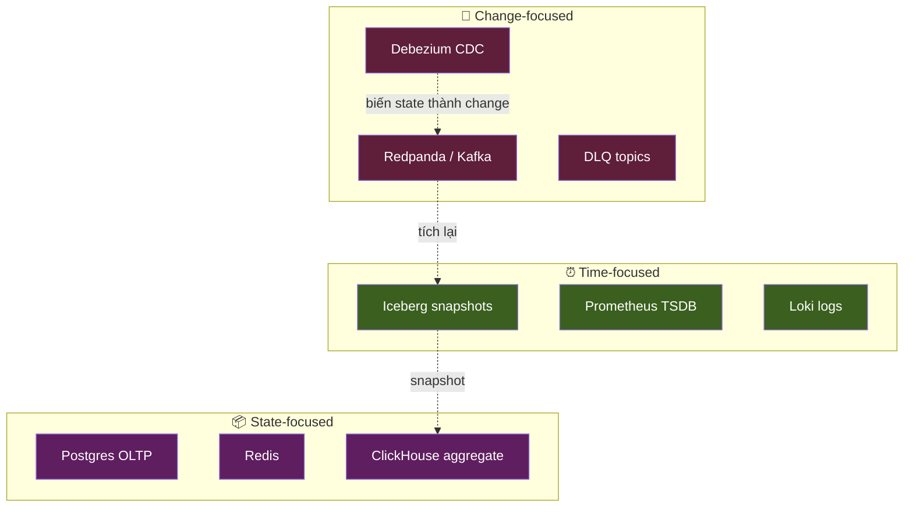
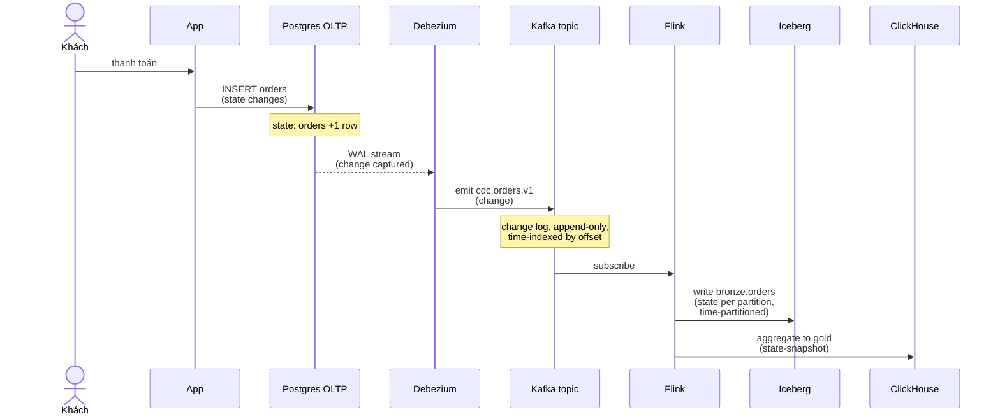

# KU 00/04 — Hệ thống = State + Change + Time

> Mọi hệ thống data đều là sự pha trộn của 3 trục: **trạng thái** (state), **thay đổi** (change), và **thời gian** (time). Hiểu 3 trục này = hiểu mọi tool.

**Module:** [00 — Mental Models](./README.md)
**Đọc trong:** ~10 phút

---

## 🎯 Nó là gì?

Tưởng tượng **một cuốn sổ tay** của tiệm tạp hoá:

- **State:** trang hiện tại — "hôm nay còn 12 chai nước, 3 gói mì."
- **Change:** mỗi dòng được viết thêm — "bán 1 chai, còn 11."
- **Time:** dấu giờ bên mỗi dòng — "14:32 bán chai cho cô Ba."

Bạn có thể:
- Mở **trang hiện tại** → xem state (giống mở Postgres).
- Đọc **mỗi dòng** → xem từng change (giống đọc Kafka log).
- Lùi về **ngày 13/5** → xem trạng thái lúc đó (giống Iceberg time-travel).

> *Định nghĩa hàn lâm:* Mọi data system biểu diễn world thông qua: (i) snapshot state, (ii) sequence of events, (iii) time dimension. Khác biệt giữa các tool là **chọn focus ở đâu** trong 3 trục này.

---

## 💡 Nó làm được gì?

Hiểu khung "state + change + time" giúp bạn:

- **Hiểu vì sao có nhiều loại DB.** OLTP = state-first. Kafka = change-first. Lakehouse = time-first.
- **Biết tool nào trả lời câu hỏi nào.** "Khách hàng X bây giờ ra sao?" → state-DB. "Khách X đã làm gì 1h qua?" → event log. "Doanh thu hôm qua?" → time-partitioned table.
- **Hiểu CDC** (Change Data Capture) tự nhiên: CDC biến state-DB thành change-stream.
- **Hiểu event sourcing.** Lưu changes thay vì state → có thể rebuild state bất cứ lúc nào.

---

## 🧩 Nó là mảnh ghép nào trong tổng thể?

Mỗi tool trong project này focus 1-2 trục:

→ **Pipeline data hiện đại = chuyển đổi qua lại giữa 3 trục.**

---

## 🚀 Nó giúp ích gì?

Khi gặp tool mới, hỏi: "Tool này lưu **state**, **change**, hay **time**?"

- Snowflake / BigQuery → state với time (chấp nhận query lịch sử)
- Kafka → change, ít state
- Flink → change-in, state-trong-RAM-tạm, change-out
- Iceberg → state per snapshot, snapshot theo time
- DuckDB → state, không quan tâm time
- Materialize → change-in, state-out (incremental view)
- Datomic → change ALL-time, không bao giờ delete

→ Học 1 tool mới → biết ngay nó "type" gì → liên hệ với kiến thức có sẵn.

---

## ⏰ Khi nào dùng / KHÔNG dùng?

Mental model này là "kính lúp" để **soi mọi tool**. Không có "khi nào không dùng" — nó là khung tư duy thường trực.

Tuy nhiên, **đừng ép** 1 tool chỉ làm 1 trục. Realistic: hầu hết tool **làm 2 trục**, focus chính ở 1 trục.

---

## 🤔 Vì sao chọn nó (vs alternatives)?

Có nhiều khung phân loại data system:

| Khung | Ưu | Nhược |
|---|---|---|
| **State / Change / Time** (cái này) | 3 trục, dễ áp cho 90% tool | Quá thô cho academic |
| **CAP** (C/A/P trade-off) | Mạnh cho distributed | Không nói gì về OLAP / time |
| **OLTP vs OLAP** | Đơn giản | Bỏ qua streaming + log |
| **Lambda / Kappa architecture** | Có ngữ cảnh pipeline | Đã lỗi thời, gây nhầm |

→ State/Change/Time là khung **tổng quát nhất**, làm nền cho tất cả khung khác.

---

## 🔧 Nó vận hành ra sao?

Lấy 1 transaction thực tế: khách mua bún.

**Đọc lại sequence trên qua lăng kính 3-trục:**

1. Postgres giữ **state** (hàng tồn order).
2. Debezium **rebroadcasts mỗi change**.
3. Kafka là **change stream**, được index bởi **time** (offset).
4. Flink ăn change, lưu state-tạm, sinh change mới.
5. Iceberg lưu mỗi **partition** = 1 snapshot **state** ở 1 **time** cụ thể.
6. ClickHouse giữ **aggregated state** mới nhất.

→ **Pipeline = chuyển đổi qua lại 3 trục, mỗi node "focus" 1 trục khác nhau.**

---

## 🧠 Self-test

1. Phân loại 3 tool sau theo trục chính (state / change / time): Redis, Apache Kafka, Apache Iceberg.
2. CDC (Debezium) chuyển state thành change. Vậy ngược lại, từ change về state bằng cách nào? (Tên kỹ thuật).
3. Vì sao Iceberg snapshot vừa là state, vừa có time — nó **không** phải change?
4. Cho ví dụ 1 câu hỏi mà chỉ event log mới trả lời được, OLTP DB không trả lời được.
5. Tại sao trong project này, ClickHouse là "state-focused" trong khi Kafka feed nó là "change-focused"? Trạng thái nào đang được lưu, change nào đang được tích?

---

## 🔗 Trong repo này

- Sequence end-to-end thấm 3 trục: [`ARCHITECTURE.md` §16](../../ARCHITECTURE.md#16-data-flow-end-to-end)
- Bronze/silver/gold (3 layer state): [`docs/09-lakehouse-design.md`](../../docs/09-lakehouse-design.md)
- CDC = state→change: [`docs/07-cdc-design.md`](../../docs/07-cdc-design.md)

---

## 📖 Đọc thêm (chính thống, hạn chế)

- Martin Kleppmann — DDIA ch. 11 "Stream Processing" — phần "Databases and Streams" trình bày khung state↔change rõ ràng.
- Pat Helland — "Immutability Changes Everything" (CIDR 2015 paper) — tư duy change-first xuất sắc.
