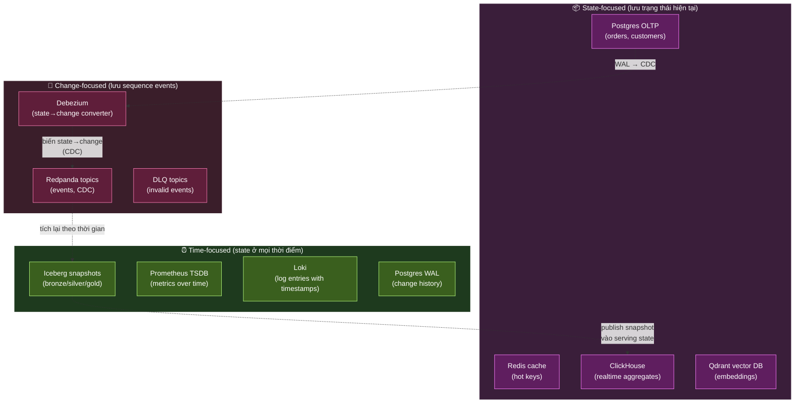
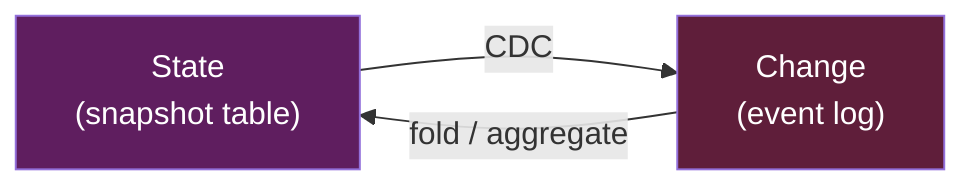
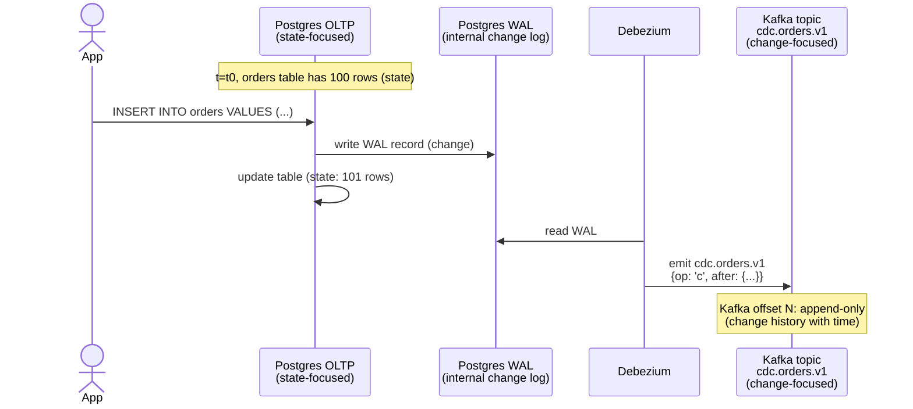
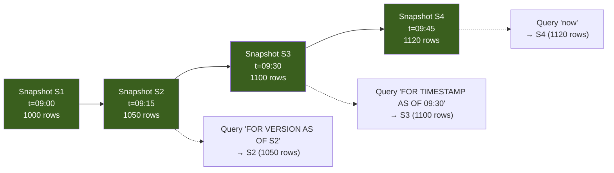
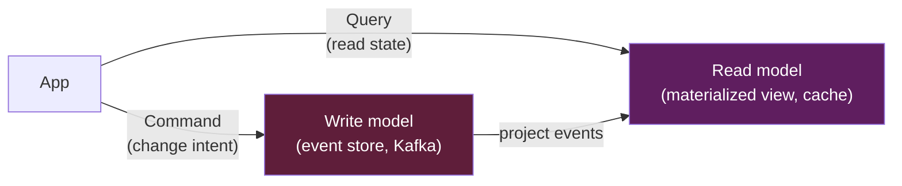
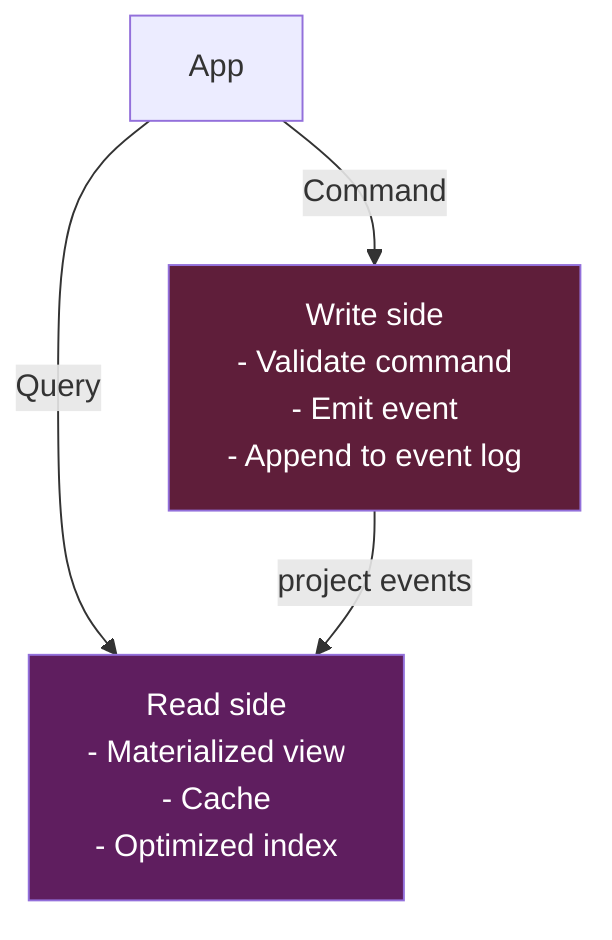

# KU F00 / 04 — Hệ thống = State + Change + Time

> Mọi hệ thống data đều là sự pha trộn của 3 trục: **trạng thái** (state), **thay đổi** (change), và **thời gian** (time). Hiểu 3 trục này = hiểu mọi tool. Postgres focus state. Kafka focus change. Iceberg focus time. Pipeline = chuyển đổi qua lại giữa 3 trục.

**Module:** [F00 — Mental Models](./README.md)
**Prereqs:** [F00/01 Data product thinking](./01-data-product-thinking.md)
**Related KUs:** [F00/06 Idempotency](./06-idempotency.md) · [F00/08 Eventual consistency](./08-eventual-consistency.md) · [F11 Distributed Systems Theory](../11-distributed-systems-theory/) · [D13 Event Streaming](../13-event-streaming-deep/) · [D15 Data Modeling](../15-data-modeling/)
**Đọc trong:** ~12 phút
**Mức độ:** Foundational (★ quan trọng nhất F00)

---

## 🎯 Nó là gì? (Analogy đời sống)

Tưởng tượng **một cuốn sổ tay** của tiệm tạp hoá:

- **Trang hiện tại:** "Hôm nay còn 12 chai nước, 3 gói mì." → đây là **State** (trạng thái).
- **Mỗi dòng được viết thêm:** "14:32 bán 1 chai → còn 11. 15:01 bán 2 gói mì → còn 1." → đây là **Change** (thay đổi).
- **Dấu giờ bên mỗi dòng:** "14:32", "15:01" → đây là **Time** (thời gian).

Bạn có thể **dùng cuốn sổ này 3 cách**:

| Cách | Lấy gì? | Tương đương trong DE |
|---|---|---|
| Mở **trang hiện tại** | State hiện tại | Query Postgres / Redis |
| Đọc **từng dòng** | Sequence of changes | Đọc Kafka topic / Debezium CDC |
| Tua về **ngày 13/5** | State quá khứ | Iceberg time-travel / Postgres point-in-time recovery |

3 cách dùng = 3 góc nhìn về cùng 1 cuốn sổ. **Mọi data system trên đời** đều là 1 trong 3 góc nhìn này (hoặc combo).

---

## 📖 Định nghĩa chính thức

Mọi data system biểu diễn **world** thông qua 3 trục:

1. **State** (trạng thái) — snapshot của thế giới tại 1 thời điểm. Ví dụ: số dư tài khoản hiện tại, danh sách orders đang pending.
2. **Change** (thay đổi) — sequence of events đã xảy ra. Ví dụ: log giao dịch, CDC events, click stream.
3. **Time** (thời gian) — dimension cho phép truy ngược state hoặc replay change. Ví dụ: snapshot Iceberg, Postgres WAL.

Khác biệt giữa các tool là **chọn focus ở đâu**:

- **State-focused systems:** Postgres, Redis, ClickHouse (aggregates) — query "thế giới hiện tại trông sao?"
- **Change-focused systems:** Kafka/Redpanda, Debezium — đọc "đã xảy ra gì?"
- **Time-focused systems:** Iceberg, Prometheus TSDB, Loki — query "lúc đó/khoảng đó trông sao?"

**Khái niệm liên quan trong DE 2026:**

- **Event Sourcing** (Pat Helland, Greg Young) — lưu changes thay vì state. State được rebuild bằng replay changes.
- **CQRS** (Command Query Responsibility Segregation) — tách write model (change) khỏi read model (state).
- **CDC (Change Data Capture)** — biến state-database thành change-stream. Foundation của modern data platform.
- **Snapshot** — capture state tại 1 thời điểm. Iceberg snapshot, DB backup, Flink checkpoint đều là snapshot.

**Nguồn:**
- Pat Helland, *"Immutability Changes Everything"* (CIDR 2015) — paper đặt nền tảng tư duy change-first.
- Martin Kleppmann, *DDIA* Chapter 11 "Stream Processing" — phần "Databases and Streams" trình bày state↔change duality.
- Nathan Marz, *Big Data* (2015) — Lambda architecture explicit dùng 3 trục.

---

## 🔤 Terminology box

| Thuật ngữ | Tiếng Anh | Giải thích 1 câu |
|---|---|---|
| Trạng thái | State | Snapshot of world at 1 point in time |
| Thay đổi | Change | Event mô tả 1 transition (insert/update/delete) |
| Thời gian | Time | Dimension cho phép navigate state/change qua thời gian |
| Snapshot | Snapshot | State được capture tại 1 thời điểm specific |
| CDC | Change Data Capture | Cơ chế chuyển state-DB thành change-stream |
| Event sourcing | Event sourcing | Pattern lưu changes thay vì state (state rebuilt từ replay) |
| CQRS | Command Query Responsibility Segregation | Tách write (change) khỏi read (state) |
| Append-only log | Append-only log | Data structure chỉ thêm vào cuối, không update — base của Kafka |
| WAL | Write-Ahead Log | Postgres-style log ghi trước khi apply state change |
| Tombstone | Tombstone | Marker đánh dấu "đã xoá" trong compacted topic |
| Time travel | Time travel | Khả năng query state ở quá khứ (Iceberg, Delta, Snowflake) |
| Bitemporal | Bitemporal | Theo dõi 2 trục time: valid time + transaction time |
| Materialized view | Materialized view | Pre-computed state từ aggregating changes |
| Compacted topic | Compacted topic | Kafka topic chỉ giữ latest event per key |
| Watermark | Watermark | Marker thời gian trong stream processing (chi tiết KU 04 D14) |
| Event time vs Processing time | Event time vs Processing time | Time khi event xảy ra vs khi processed |

---

## 💡 Nó làm được gì?

Hiểu khung "State + Change + Time" cho phép bạn:

- **Hiểu vì sao có nhiều loại DB.** OLTP = state-first. Kafka = change-first. Lakehouse = time-first. Không phải "DB này tốt hơn" — chúng nhắm 3 góc khác nhau.
- **Biết tool nào trả lời câu hỏi nào.**
  - "Khách hàng X bây giờ ra sao?" → state-DB (Postgres, Redis).
  - "Khách X đã làm gì 1h qua?" → event log (Kafka, Loki).
  - "Doanh thu hôm qua (snapshot 24h)?" → time-partitioned table (Iceberg).
- **Hiểu CDC tự nhiên.** CDC biến state-DB thành change-stream. Là 1 chuyển đổi trục.
- **Hiểu event sourcing.** Lưu changes thay vì state → có thể rebuild state bất cứ lúc nào. Audit log built-in.
- **Đoán architecture từ tool.** Thấy team dùng Iceberg + Kafka + Postgres → đoán họ có state-change-time layered architecture.
- **Tránh anti-pattern.** Update Kafka message in-place (anti — Kafka là change). Append-only Postgres (anti — Postgres là state).

---

## 🧩 Nó là mảnh ghép nào trong tổng thể?

Mỗi tool trong project DSX Air focus 1-2 trục:



→ **Pipeline data hiện đại = chuyển đổi qua lại giữa 3 trục.** Mỗi mũi tên là 1 transformation.

---

## 🚀 Nó giúp ích gì?

### Khi gặp tool mới

Hỏi: "Tool này lưu **state**, **change**, hay **time**?" Câu trả lời tiết lộ purpose + limitation:

| Tool | Trục chính | Trục phụ | Khi dùng |
|---|---|---|---|
| **Snowflake / BigQuery** | State | Time (time travel) | Analytics queries |
| **Kafka / Redpanda** | Change | Time (offset = ordered time) | Event backbone |
| **Flink** | Change-in, State-trong-RAM, Change-out | Time (watermark) | Stream processing |
| **Iceberg** | State per snapshot | Time (snapshot history) | Lakehouse |
| **DuckDB / SQLite** | State | — | Embedded analytics |
| **Materialize / RisingWave** | Change-in, State-out (incremental view) | Time | Streaming SQL |
| **Datomic** | Change (immutable) | Time (built-in) | Bitemporal apps |
| **EventStoreDB** | Change (event sourcing) | Time | Event-sourced apps |
| **Prometheus** | Time-series | State (instant query) | Metrics + monitoring |
| **TimescaleDB** | Time + State | Change (via hypertable) | Time-series + relational |

→ Học 1 tool mới → identify trục → liên hệ với kiến thức có sẵn → giảm learning time 5x.

### Real example: Hiểu Apache Kafka từ khung 3-trục

| Question | Answer qua khung 3-trục |
|---|---|
| "Kafka là gì?" | Change-focused log, append-only, time-indexed by offset |
| "Vì sao Kafka append-only?" | Vì change-focused = immutable events = audit log |
| "Vì sao có compacted topic?" | Để biến change-log thành state-snapshot per key |
| "Tombstone là gì?" | Change kiểu "delete" trong compacted state |
| "Replay là gì?" | Reprocess history of changes = navigate time |
| "Vì sao Kafka không update message?" | Update phá vỡ change-focused = phá audit log |

→ 6 câu hỏi traditional, 1 framework trả lời tất cả.

### Trong project DSX Air

Sequence end-to-end trong [`ARCHITECTURE.md`](../../ARCHITECTURE.md) §16 thấm rõ 3 trục:

```
1. App writes order → Postgres OLTP (state: orders +1 row)
2. Postgres WAL stream (change captured) → Debezium
3. Debezium emit cdc.orders.v1 → Kafka (change)
4. Kafka append-only log, time-indexed by offset
5. Flink subscribe → state-tạm in RocksDB → change-out (dedup + window)
6. Flink → Iceberg bronze (state per partition, time-partitioned)
7. Dagster batch → silver/gold (aggregated state, time-partitioned)
8. ClickHouse materialized view (aggregated state)
9. FastAPI query state for dashboard
```

→ **Đọc lại qua lăng kính 3-trục:**
- Step 1: state change in Postgres.
- Step 2-4: state→change conversion via CDC.
- Step 5-7: change processing + time-stamped state snapshots.
- Step 8-9: aggregated state for serving.

**Toàn bộ data platform = orchestrate 3 trục.**

---

## ⏰ Khi nào dùng / KHÔNG dùng?

Mental model này là "**kính lúp**" để soi mọi tool — không có "khi nào không dùng". Đây là khung **always-on**.

Tuy nhiên, **đừng ép** 1 tool chỉ làm 1 trục. Realistic: hầu hết tool **làm 2 trục**, focus chính ở 1.

| Khi nào áp dụng | Cách |
|---|---|
| Evaluate tool mới | Hỏi "tool này focus state/change/time?" |
| Design pipeline | Map mỗi stage vào trục chính |
| Debug data issue | Hỏi "lost state? lost change? lost time?" |
| Onboard junior | Dạy 3-trục trước khi dạy bất kỳ tool nào |
| Architecture review | Check: trục nào balance, trục nào thiếu? |

---

## 🤔 Trade-off vs alternatives

Có nhiều khung phân loại data system:

| Khung | Ưu | Nhược | Dùng khi |
|---|---|---|---|
| **State / Change / Time** (cái này) | 3 trục, dễ áp cho 90% tool, universal | Quá thô cho academic deep-dive | Daily DE / DA thinking |
| **CAP theorem** (C/A/P trade-off) | Mạnh cho distributed | Không nói gì về OLAP / time | Distributed DB design |
| **OLTP vs OLAP** | Đơn giản, recognizable | Bỏ qua streaming + log | High-level architecture |
| **Lambda / Kappa architecture** | Có ngữ cảnh pipeline cụ thể | Đã lỗi thời (2015 era) | Historical reference only |
| **CALM (Consistency as Logical Monotonicity)** | Foundational theory | Quá academic | Research, not daily |

→ **State/Change/Time là khung tổng quát nhất**, làm nền cho tất cả khung khác. Học trước, các khung khác là refinement.

---

## 🔧 Nó vận hành ra sao? (Logic walkthrough)

### State ↔ Change duality (Kleppmann ch.11)

**Insight kinh điển của Kleppmann:** state và change là 2 góc nhìn của cùng dữ liệu.



- **State → Change:** CDC (Debezium reads Postgres WAL).
- **Change → State:** Aggregate / fold events → current state. Materialized view in ClickHouse, kSqlDB GROUP BY.

→ **Tương đương về thông tin**, khác nhau về **trục access**. Pick trục theo query pattern.

### CDC = chuyển đổi trục



→ **State→Change conversion** = CDC. Foundation của modern data platform.

### Event Sourcing — change-first design

Traditional pattern: lưu **state**, lose history.

```
account_balance = 100 → 80 → 120
       ^^^^                  ^^^^
       lost                  current
```

Event sourcing: lưu **changes**, rebuild state bất cứ lúc nào.

```
events = [
  Deposit(50, t=1),
  Withdraw(20, t=2),
  Deposit(40, t=3),
  Deposit(50, t=4),
]
→ replay → current_balance = 120
→ replay until t=2 → balance_at_t2 = 30 ✓
```

→ Audit log built-in. Time travel built-in. Cost: read state cần replay.

Tools: EventStoreDB, Axon Framework, custom on Kafka.

### Time-focused: Iceberg snapshot

Mỗi commit vào Iceberg table = 1 snapshot. Snapshot = state at point-in-time.



→ Iceberg = state + time. Query state at any point in time. Time travel = first-class.

### CQRS — physical separation of state and change

Pattern:



→ Write side optimize cho throughput + append-only. Read side optimize cho query performance. Mỗi side dùng tool phù hợp trục.

---

## 🧪 Worked example

**Tình huống thật trong DSX Air:** team Payment muốn build feature "Xem lịch sử thanh toán 1 customer trong 24h qua".

### Bước 1 — Phân tích câu hỏi qua 3 trục

Câu hỏi cần:
- **Sequence of events** (changes) → cần change-focused
- **Filter by customer_id** (state lookup) → cần state-focused query
- **Time range 24h** → cần time-focused

→ Câu hỏi này **lai 3 trục**. Tool nào phục vụ?

### Bước 2 — So sánh options

| Tool | Trục | Fit cho câu hỏi? |
|---|---|---|
| Postgres OLTP `orders` | State only | ❌ Mất history, chỉ thấy current order |
| Kafka topic `payment.authorized.v1` | Change + time | ✅ Có history, nhưng phải scan 24h × all customers |
| Iceberg `silver.fact_payment` partition by hour | State + time | ✅ Time-indexed, easy filter, có history |
| ClickHouse `payments` table | State + time (TTL) | ✅ Fast aggregate query |

→ Best fit: **Iceberg `silver.fact_payment` + Trino query**.

### Bước 3 — Query design

```sql
SELECT
    event_time,
    order_id,
    amount,
    status,
    payment_method
FROM iceberg.silver.fact_payment
WHERE customer_id = 'cus_123'
  AND event_time >= current_timestamp - INTERVAL '24' HOUR
ORDER BY event_time DESC;
```

Iceberg partition by `day(event_time)` → query chỉ scan 1-2 partitions. Fast.

### Bước 4 — Architectural insight

Câu hỏi này reveal pattern:

```
User question (multi-axis)
  → identify required axes
  → pick tool with right axis mix
  → write query leveraging axis
```

Nếu chỉ có Postgres (state-only) → impossible to answer. Cần tool time-axis (Iceberg, ClickHouse, or Kafka log).

### Bước 5 — Trade-off check

Iceberg query 24h history = ~1s latency. Acceptable cho dashboard, **not for real-time fraud check**.

For real-time fraud check, cần Redis (state, low-latency) hoặc ClickHouse materialized view (state, sub-second).

→ Architecture: **time-focused storage (Iceberg)** for history, **state-focused cache (Redis)** for real-time access. 2 trục, 2 tool.

### Bài học từ worked example

- **Câu hỏi business reveals required axes.**
- **Pick tool theo axis fit**, không theo "popular tool".
- **Multi-axis question** thường cần multi-tool pipeline.
- **Trade-off** giữa axis (latency vs history depth) phải explicit.

---

## ⚠️ Common pitfalls

### Pitfall 1 — Force 1 tool cho tất cả axes

❌ **Sai:** "Postgres làm hết — state, change, time." → Postgres state-focused, dùng làm event log = slow + bloat. Dùng làm time-travel = limited (chỉ point-in-time recovery, không query lịch sử như Iceberg).

✅ **Đúng:** Pick tool theo axis. Multi-axis pipeline = nhiều tool.

### Pitfall 2 — Update Kafka message in-place

❌ **Sai:** "Send updated event to Kafka with same key, hi vọng replace cũ." → Kafka append-only. Old message vẫn ở đó. Confusion.

✅ **Đúng:** Hoặc dùng compacted topic (latest per key), hoặc accept history of changes.

### Pitfall 3 — Materialized view = duplicate everything

❌ **Sai:** "Để query fast, mình materialize hết các view." → Disk explode, refresh cost cao.

✅ **Đúng:** Materialize select queries với high query rate. Đo trước (xem [F00/10 Premature optimization](./10-premature-optimization.md)).

### Pitfall 4 — Confused event time vs processing time

❌ **Sai:** Query "events in last hour" = processing time → late events bị miss.

✅ **Đúng:** Distinguish event time (khi xảy ra) vs processing time (khi processed). Stream processing dùng event time + watermark (xem [D14 Stream Processing](../14-stream-processing-deep/)).

### Pitfall 5 — Lose change axis

❌ **Sai:** Sau khi materialize state vào ClickHouse, xoá Kafka topic "để tiết kiệm". → Lose history. Cần audit / debug → impossible.

✅ **Đúng:** Keep change log với reasonable retention. Materialize state là **derived**, source of truth là change log.

### Pitfall 6 — Time travel quá long → cost explode

❌ **Sai:** Iceberg snapshot 5 năm history, không expire. Metadata + small files explode.

✅ **Đúng:** Set retention policy. Iceberg `expire_snapshots` + `remove_orphan_files` định kỳ (xem [D19 Lakehouse Deep](../19-lakehouse-deep/)).

---

## 🌱 Advanced topics

### A1. Event Sourcing — Greg Young's pattern

Greg Young (2010) formalize event sourcing:

```
1. State = projection of events
2. Events are immutable
3. Events are source of truth
4. State can be rebuilt anytime
5. Audit log = built-in
```

Trade-off:
- **Pros:** audit, time travel, multiple projections from same events
- **Cons:** slower reads (need projection), eventual consistency, learning curve

Tools: EventStoreDB, Axon, custom on Kafka.

→ Apply tốt cho domain có **audit requirement** (finance, healthcare, compliance).

### A2. CQRS deep — separation of concerns

Bertrand Meyer (1986) introduced Command-Query Separation (CQS). Greg Young extended thành **CQRS** for distributed systems:



Write side: optimize for consistency + throughput. Read side: optimize for query latency + complexity.

→ Modern data architecture (Postgres OLTP write + ClickHouse read) là CQRS implicit.

### A3. Bitemporal data

Track 2 trục time:
- **Valid time:** thời điểm event xảy ra trong real world
- **Transaction time:** thời điểm event được insert vào DB

Use case: compliance, historical correction. Ex: HR record "John joined company on 2020-01-01" inserted on 2025-06-15.

Tools: Datomic (built-in bitemporal), TimescaleDB (extension), XTDB.

### A4. Lambda vs Kappa architecture (historical)

**Lambda** (Marz 2015): 2 paths — batch (correctness) + speed (low-latency) — combine cho serving layer.

**Kappa** (Kreps 2014): 1 path — everything is stream. Batch = bounded stream.

2026 architecture: **Hybrid + lakehouse-streaming**. Iceberg + Flink + ClickHouse = real-time + batch on same source-of-truth.

→ Lambda/Kappa là refinement của state/change/time. Modern frameworks superseded them.

### A5. Datomic — bitemporal Clojure DB

Rich Hickey's Datomic implements:
- Time as 1st-class dimension
- Immutable facts (events)
- State = query at time T
- "Database as a value"

```clojure
(d/q '[:find ?balance
       :where [?e :account/id "acc_123"]
              [?e :account/balance ?balance]]
     (d/as-of db #inst "2025-01-01"))
; → balance of acc_123 as of Jan 1, 2025
```

→ Concept đẹp. Adoption low vì Clojure niche. Inspire nhiều modern lakehouse design.

### A6. Apply cho LLM 2026 — RAG state vs LLM internal

| Trục | LLM analog |
|---|---|
| **State** | RAG retrieval cache, vector DB current snapshot |
| **Change** | New document ingestion events, embedding updates |
| **Time** | Document versions, retrieval-time vs query-time |

Modern RAG architecture đang adopt bitemporal: "What did the document say on date X?" + "When was this version added to system?"

→ Sẽ học sâu hơn ở [D32 RAG Engineering Deep](../32-rag-engineering-deep/).

### A7. Pat Helland — "Immutability Changes Everything"

Paper Helland (CIDR 2015) argument:

> *"Immutable data are foundational to a decentralized world... derive other immutable data from existing immutable data, and aggregate immutable data in different ways."*

Insight: **embrace change-first** in distributed systems. State derived from immutable changes. Avoid update-in-place.

→ Inspire Iceberg, Delta, Hudi (immutable file + manifest), Kafka (immutable log), event sourcing.

---

## 🔗 Liên kết KU khác

- **[F00/06 Idempotency](./06-idempotency.md)** — change-focused tools cần idempotent producer
- **[F00/08 Eventual consistency](./08-eventual-consistency.md)** — replication delay = state lag from change
- **[F00/09 Leaky abstractions](./09-leaky-abstractions.md)** — Iceberg metadata layer leak là time-axis cost
- **[F11/05 Consistency models](../11-distributed-systems-theory/)** — formal definition of state consistency
- **[D13 Event Streaming Deep](../13-event-streaming-deep/)** — change-focused systems
- **[D14 Stream Processing Deep](../14-stream-processing-deep/)** — event time, watermark, late events
- **[D15 Data Modeling](../15-data-modeling/)** — state modeling (dimensional), change modeling (event)
- **[D19 Lakehouse Deep](../19-lakehouse-deep/)** — Iceberg time-travel, snapshot, immutability
- **[D32 RAG Engineering](../32-rag-engineering-deep/)** — bitemporal RAG patterns

---

## 🧠 Self-test (3 mức)

### 🟢 Easy

1. 3 trục state/change/time — định nghĩa mỗi cái 1 câu. Cho 1 ví dụ tool mỗi trục.
2. CDC làm gì theo khung 3-trục? Chuyển đổi từ trục nào sang trục nào?
3. Iceberg snapshot là state-focused hay time-focused? Vì sao?

### 🟡 Medium

4. Câu hỏi nào CHỈ event log mới trả lời được, OLTP DB không trả lời được? Cho 2 ví dụ.
5. Vì sao Kafka **không cho update message in-place**? Liên hệ với change-focused nature.
6. Trong worked example "lịch sử thanh toán 24h", vì sao Postgres OLTP không đủ? Cần kết hợp tool nào?

### 🔴 Hard

7. Event sourcing pattern: lưu changes thay vì state. Trade-off so với CRUD truyền thống là gì? Cho 2 use case fit event sourcing.
8. Bitemporal (valid time + transaction time) khác mono-temporal ra sao? Cho 1 scenario phải dùng bitemporal.
9. CQRS: tại sao tách write + read model? Cho 1 architecture example từ project DSX Air có implicit CQRS pattern.

> **6+/9** = hiểu sâu, foundation đủ cho stream processing. **4-5** = đọc lại Kleppmann ch.11. **<4** = đọc lại + làm exercise vẽ data flow project DSX Air theo 3 trục.

---

## 📌 Trong repo này

3-trục framework thấm vào toàn bộ architecture DSX Air:

- **End-to-end sequence** ([`ARCHITECTURE.md` §16](../../ARCHITECTURE.md#16-data-flow-end-to-end)) — explicit 3-trục data flow
- **Bronze/silver/gold model** ([`docs/09-lakehouse-design.md`](../../docs/09-lakehouse-design.md)) — 3 layers state với time history
- **CDC design** ([`docs/07-cdc-design.md`](../../docs/07-cdc-design.md)) — state→change conversion
- **Stream processing jobs** ([`docs/08-stream-processing.md`](../../docs/08-stream-processing.md)) — change-in, state-temp, change-out
- **Topic catalog** ([`docs/06-event-backbone.md`](../../docs/06-event-backbone.md)) — change-focused log với retention policy
- **Iceberg time-travel** ([`lakehouse/sql/query_examples.sql`](../../lakehouse/sql/query_examples.sql)) — time-axis demonstration
- **Reconciliation jobs** ([`docs/10-batch-orchestration.md`](../../docs/10-batch-orchestration.md)) — state-vs-change cross-check

---

## 🌐 Đọc thêm (chính thống, hạn chế — 3 nguồn)

- **Martin Kleppmann, "Designing Data-Intensive Applications" — Chapter 11 "Stream Processing"** — section "Databases and Streams" + "State, Streams, and Immutability" trình bày state↔change duality. [Library: `Kleppmann_2017_Designing-Data-Intensive-Applications.pdf`](../../library/books/distributed-systems/Kleppmann_2017_Designing-Data-Intensive-Applications.pdf)
- **Pat Helland, "Immutability Changes Everything"** (CIDR 2015) — paper foundational về change-first thinking.
- **Reis & Housley, "Fundamentals of Data Engineering" — Chapter 2 + 6 (Data Engineering Lifecycle + Storage)** — lifecycle Generation → Ingestion → Transformation → Serving + Storage là 3-trục in action. [Library: `Reis-Housley_2022_Fundamentals-of-Data-Engineering.pdf`](../../library/books/data-engineering/Reis-Housley_2022_Fundamentals-of-Data-Engineering.pdf)

---

**Đã đọc xong?**
✅ Tick vào [`progress/checklist.md`](../progress/checklist.md) → đi tiếp [F00/05 Failure as a feature](./05-failure-as-feature.md).
