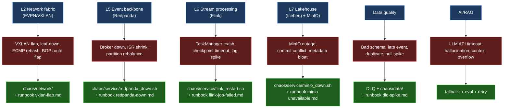
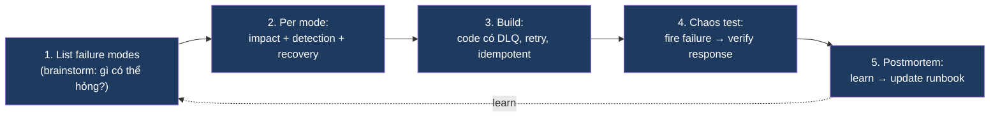
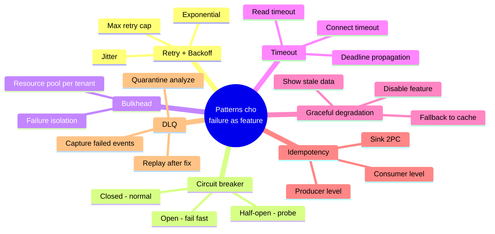
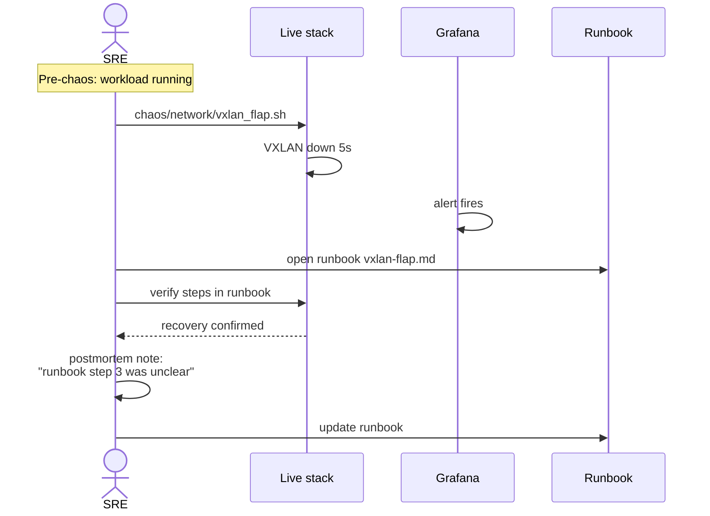
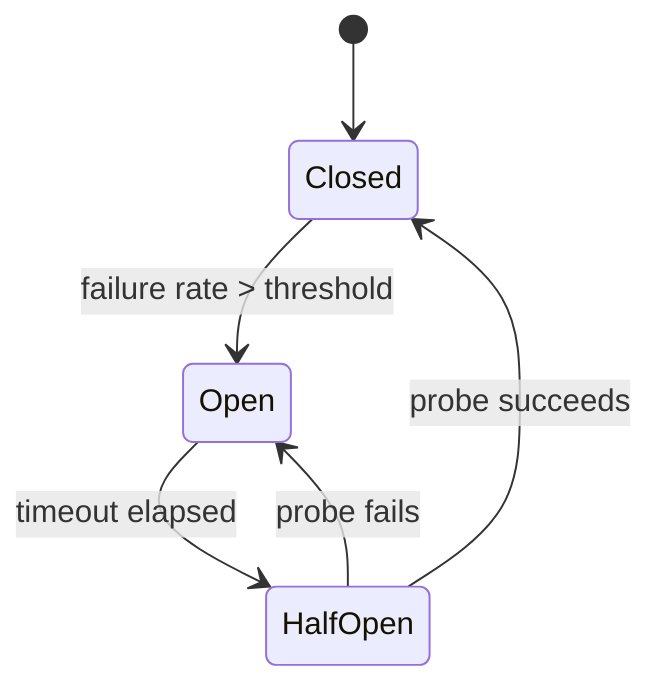

# KU F00 / 05 — Failure as a feature: thiết kế cho lúc hỏng

> Trong distributed systems, **hỏng không phải là lỗi — là đặc tính**. Thiết kế cho lúc hỏng = thiết kế đúng. Thiết kế chỉ cho happy path = chưa thiết kế. Đây là tư duy nền cho SRE, chaos engineering, và mọi platform production.

**Module:** [F00 — Mental Models](./README.md)
**Prereqs:** [F00/02 Trade-off thinking](./02-trade-off-thinking.md) · [F00/04 State+Change+Time](./04-state-change-time.md)
**Related KUs:** [F00/06 Idempotency](./06-idempotency.md) · [F00/07 Backpressure](./07-backpressure.md) · [D26 Observability + SRE](../26-observability-sre/) · [D37 Chaos & Reliability](../37-chaos-reliability/) · [F11/08 Distributed Systems Trouble](../11-distributed-systems-theory/)
**Đọc trong:** ~12 phút
**Mức độ:** Foundational

---

## 🎯 Nó là gì? (Analogy đời sống)

So sánh **2 quán phở** ở Sài Gòn:

### Quán A (junior owner)

- Mưa to mất điện → đóng cửa.
- Nhân viên nghỉ ốm → khách phải đợi 1 tiếng.
- Đông khách bất ngờ → "Hết bún rồi anh ơi".
- Có 1 lần ngộ độc thực phẩm → quán đóng 3 ngày, không có quy trình recovery.
- Sau 1 năm → đóng cửa.

### Quán B (senior owner)

- Có **máy phát điện** dự phòng (1 ngày setup, 5 triệu).
- Có **ô che** ngoài hành lang để khách đợi mưa.
- Có **menu cắt giảm** khi nhân viên thiếu (3 món thay 8).
- Có **quy trình đông khách** quá tải (giới hạn 50 tô/giờ, mời khách chờ).
- Sau ngộ độc → **postmortem**: rà soát supplier + thay quy trình rửa rau. 2 tuần khôi phục uy tín.
- Sau 1 năm → mở chi nhánh 2.

**Sự khác biệt cốt lõi:** quán B **coi mưa, mất điện, đông khách, ngộ độc là chuyện sẽ xảy ra** — không phải "edge case ai mà gặp".

→ Đây là **failure as a feature**: failures **được liệt kê tường minh**, có response plan, có observability để phát hiện, có recovery cơ chế hoá.

Trong tech, đây là tư duy nền của:
- **SRE (Site Reliability Engineering)** — Google formalize 2003
- **Chaos Engineering** — Netflix Chaos Monkey 2010
- **Resilience Engineering** — Hollnagel research
- **Fault-tolerant design** — distributed systems classic

---

## 📖 Định nghĩa chính thức

**"Failure as a feature"** là tư duy thiết kế nơi failure modes được:

1. **Liệt kê tường minh** trước khi build (không phải sau khi prod fail)
2. **Có response plan** cho mỗi mode (alert + runbook + recovery)
3. **Có observability** để phát hiện (metrics + logs + traces)
4. **Có chaos test** chủ động (verify response works)
5. **Có postmortem culture** (learn from failures, blameless)

Đây là **paradigm shift** từ "happy path coding" sang "design for failure":

- Junior: viết code happy path + thêm `try-catch` "khi nào nó vỡ".
- Senior: liệt kê failure modes trước, code cả happy + recovery path.

**Nguồn:**
- Werner Vogels (Amazon CTO), *"Everything fails all the time"* (mantra).
- Google SRE Book (2016), Chapter 3 "Embracing Risk" — Error budget concept.
- Casey Rosenthal et al., *"Chaos Engineering"* O'Reilly 2017 — principles + game day patterns.
- Sidney Dekker, *"The Field Guide to Understanding Human Error"* — postmortem culture.

---

## 🔤 Terminology box

| Thuật ngữ | Tiếng Anh | Giải thích 1 câu |
|---|---|---|
| Hỏng là đặc tính | Failure as a feature | Coi failure như spec, không phải bug |
| Mode hỏng | Failure mode | Cách 1 hệ thống có thể fail (mỗi mode unique) |
| Đường vận hành đúng | Happy path | Flow khi mọi thứ work |
| Đường lỗi | Error path | Flow khi 1 phần fail |
| MTBF | Mean Time Between Failures | Khoảng thời gian trung bình giữa 2 failures |
| MTTR | Mean Time To Recovery | Thời gian trung bình recovery sau failure |
| RTO | Recovery Time Objective | Mục tiêu thời gian recovery (e.g., 1h) |
| RPO | Recovery Point Objective | Mức dữ liệu chấp nhận mất (e.g., 5 min) |
| Chaos engineering | Chaos engineering | Inject failure chủ động để test resilience |
| Game day | Game day | Buổi practice chaos cho team |
| Postmortem | Postmortem | Document phân tích failure sau incident |
| Blameless postmortem | Blameless postmortem | Postmortem tập trung process, không đổ lỗi cá nhân |
| Runbook | Runbook | Tài liệu hướng dẫn xử lý 1 incident |
| Circuit breaker | Circuit breaker | Pattern ngắt mạch khi downstream fail |
| Bulkhead | Bulkhead | Pattern isolate failure trong 1 partition |
| Retry + backoff | Retry + backoff | Thử lại với delay tăng dần |
| Idempotency | Idempotency | Chạy lại không hại (KU 06) |
| Error budget | Error budget | Mức failure cho phép — SRE concept |
| Blast radius | Blast radius | Phạm vi impact của 1 failure |
| Cascade failure | Cascade failure | Failure 1 service lan ra nhiều service |
| Graceful degradation | Graceful degradation | Giảm chức năng thay vì sập hoàn toàn |

---

## 💡 Nó làm được gì?

Tư duy "failure as a feature" biến đổi cách bạn build:

- **Liệt kê failure modes trước khi code.** Không chỉ "happy path" + "vài exception".
- **Mỗi failure mode có alert + runbook.** Không có "lỡ hỏng thì sao?" — đã có sẵn câu trả lời.
- **Test failure chủ động** (chaos engineering). Không chờ production tự hỏng dạy bạn.
- **Document recovery trước**, không phải sau sự cố.
- **Compose-able systems.** Mỗi component có hành vi rõ ràng khi component khác hỏng.
- **Calm on-call.** 3h sáng alert fire → biết chính xác run lệnh gì (runbook).
- **Trust trong team.** Blameless postmortem → engineers dám report mistakes, learn fast.

---

## 🧩 Nó là mảnh ghép nào trong tổng thể?

Trong project DSX Air, "failure as feature" thấm vào **mọi layer**:



→ **Chaos catalog 3-family** ([`docs/16-failure-chaos-catalog.md`](../../docs/16-failure-chaos-catalog.md)) explicit liệt kê 17+ failure modes. **Runbook directory** ([`runbooks/`](../../runbooks/)) có response plan cho mỗi mode.

→ Đây không phải optional — đây là **core deliverable** của project.

---

## 🚀 Nó giúp ích gì?

So sánh 2 team:

### Team không có "failure as feature" mindset

```
Pipeline fail lúc 2h sáng:
  → On-call wake up: "bảng X trễ"
  → Không biết failure mode nào (mò 30 phút)
  → Không có runbook → Google "kafka consumer lag"
  → Sửa tạm, không root cause
  → Email sếp xin lỗi
  → Tuần sau lặp lại
  → Burnout sau 6 tháng
```

### Team có "failure as feature" mindset

```
Pipeline fail lúc 2h sáng:
  → Alert: "FlinkCheckpointFailure (severity: P2)"
  → On-call mở runbook flink-job-failed.md → đúng 5 bước
  → 10 phút fix
  → Postmortem 2 ngày sau: root cause, action items
  → Add new chaos test cover edge case
  → Tuần sau: edge case bị catch trước khi prod
  → Team confidence ↑
```

**Khác biệt 12x thời gian xử lý + ngăn lặp lại.**

### Quote từ Google SRE Book

> *"100% is the wrong reliability target for basically everything... once you've defined an SLO, the rate of permitted failure becomes an error budget. By embracing imperfection, we can engineer better systems."*
>
> — Google SRE Book, Chapter 3 "Embracing Risk"

→ **Embrace failure** thay vì pretend nó không xảy ra. Build error budget. SRE 101.

### Trong project DSX Air

Failure catalog: **17 chaos scenarios** trong 3 family (service / data / network):

| Family | Count | Examples |
|---|:---:|---|
| Service | 5 | Redpanda/Flink/MinIO/Postgres/ClickHouse down |
| Data | 8 | Invalid schema, late events, duplicates, malformed, etc. |
| Network ★ | 6 | VXLAN flap, leaf-down, BGP flap, ECMP, packet loss |

→ Sequence: Liệt kê → Script (`chaos/`) → Runbook (`runbooks/`) → Test → Postmortem.

---

## ⏰ Khi nào dùng / KHÔNG dùng?

| ✅ Bắt buộc | ❌ Có thể nhẹ |
|---|---|
| Pipeline production | Notebook học thử |
| Multi-user system | One-off script chạy 1 lần |
| ≥ 1 service phụ thuộc nhau | Standalone CLI 100 dòng |
| Có SLA / SLO với consumer | Chưa có consumer |
| Has on-call rotation | Solo project |
| Cost > $1k/month | Hobby project < $10/month |

> Trong project DSX Air: **mọi layer bắt buộc** áp dụng — project được design là "production-inspired", chaos catalog là core deliverable.

---

## 🤔 Trade-off vs alternatives

4 thái độ về failure:

| Thái độ | Khi đúng | Khi sai |
|---|---|---|
| **Failure as feature** (cái này) | Production system, SRE org, data platform | Spike 30 phút, hobby code |
| **Defensive coding** (check mọi input) | Boundary code (API), untrusted input | Internal hot path (over-validate slow) |
| **Optimistic + fix on bug** | Quick prototype | Production — sẽ trả giá đắt |
| **"Just retry"** (không nghĩ kỹ) | Khi idempotent + transient | Retry mù có thể amplify (cascade) |
| **"Add more monitoring"** mà không design recovery | Monitor tools manager | Engineer cần actionable runbook |

→ **Failure as feature + idempotency + retry + monitor** = combo của senior SRE.

---

## 🔧 Nó vận hành ra sao? (Logic walkthrough)

### Workflow chuẩn 5 bước (làm TRƯỚC khi build, không phải sau)



### Failure Mode and Effects Analysis (FMEA)

Cho mỗi component, liệt kê:

| Mode | Impact | Detection | Recovery |
|---|---|---|---|
| Redpanda down | Producers chặn | `up == 0`, alert | docker start + replay |
| Flink TM down | Lag tăng, restart | `flink_numRestarts > 0` | Auto từ checkpoint |
| MinIO down | Sink fail | sink error rate alert | dlq → replay |
| **VXLAN flap** ★ | ISR shrink, brief gap | `under_replicated > 0` | Idempotent producer + auto |
| Bad schema | DLQ spike | `dlq_rate > threshold` | Fix schema + replay |
| Late event | Watermark stuck | watermark lag metric | Side output policy |
| Duplicate | Double-count gold | row count anomaly | Idempotent dedup |

→ Đây chính là [`docs/16-failure-chaos-catalog.md`](../../docs/16-failure-chaos-catalog.md) trong project.

### Patterns đặc trị failure



### Sequence: chaos test workflow



### Error budget — SRE math

Google SRE introduces **error budget**:

```
SLO: 99.9% availability per month
→ Error budget: 0.1% × 30 days = 43.2 minutes downtime/month

If error budget remaining > 0:
  Team can ship features faster (accept risk)
If error budget < 0:
  Team must freeze features, focus reliability
```

→ Quantify acceptable failure. Force priority alignment.

---

## 🧪 Worked example

**Tình huống thật trong DSX Air:** Phase 5 — bạn deploy Flink `order_funnel_job` lần đầu. Sếp hỏi: "Failure plan của em là gì?"

Junior: "Em sẽ monitor + Slack alert nếu fail."

Senior approach:

### Bước 1 — Liệt kê failure modes

Brainstorm với Flink + Kafka + Iceberg context:

| Layer | Failure mode | Probability |
|---|---|:---:|
| Network | VXLAN flap | Medium |
| Network | Leaf-down (whole rack) | Low |
| Kafka | Broker crash | Low |
| Kafka | Topic deleted by accident | Very low |
| Flink | TaskManager OOM | Medium |
| Flink | Checkpoint timeout (slow MinIO) | Medium |
| Flink | State backend corruption | Low |
| Data | Late event > 30 min | High |
| Data | Schema evolution break | Medium |
| Data | Duplicate event_id | High |
| MinIO | Disk full | Medium |
| MinIO | Service down | Low |
| Logic | Bug in business rule | Medium |

→ 13 failure modes. Realistic.

### Bước 2 — Per mode: impact + detection + recovery

Tập trung top-5 cao priority:

| Mode | Impact | Detection | Recovery |
|---|---|---|---|
| VXLAN flap | 5s gap, no loss | Grafana ISR + alert N1 | Idempotent producer auto |
| Flink TM OOM | Job restart, 30s lag | `flink_restart_count` alert | Auto checkpoint recovery |
| Late event > 30m | Side output spike | `late_event_rate` metric | Documented policy: discard |
| Duplicate event | Double-count gold | Dagster row-count anomaly | Idempotent dedup in Flink |
| MinIO disk full | Checkpoint fail | disk usage alert | Add disk, expire old snapshots |

### Bước 3 — Build với defensive design

- Producer: `enable.idempotence=true` + `acks=all` + retry
- Flink: checkpoint interval 60s, max 3 retry, fail-fast after 5 min
- Iceberg sink: 2-phase commit (exactly-once)
- Idempotent dedup operator with `event_id` key
- Watermark with 30-min allowed lateness

### Bước 4 — Chaos test

Sau deploy, run mỗi failure mode 1 lần:

```bash
# Day 1
chaos/network/vxlan_flap.sh
chaos/service/flink_restart.sh

# Day 2
chaos/data/inject_late_events.sh
chaos/data/inject_duplicates.sh

# Day 3
chaos/service/minio_down.sh
```

Verify: alert fires + runbook works + no data loss.

### Bước 5 — Document + iterate

3 runbook viết:
- `runbooks/vxlan-flap.md`
- `runbooks/flink-job-failed.md`
- `runbooks/minio-unavailable.md`

1 postmortem mẫu cho 1 chaos run.

### Báo cáo sếp

Senior trả lời:

> "Em đã liệt kê 13 failure modes, focus top-5. Mỗi mode có detection + recovery. Em đã chaos test 5 lần qua 3 ngày. 3 runbook ready. Error budget: 99.5% SLO, 3.6 hours/month downtime allowed. Em monitor `flink_restart_count`, `late_event_rate`, `dlq_rate` qua Grafana."

→ **Senior signal**. Sếp confident giao production responsibility.

---

## ⚠️ Common pitfalls

### Pitfall 1 — "Add more monitoring" without recovery design

❌ **Sai:** Set up 50 Grafana dashboards, không có runbook. Khi alert fires → engineer mò.

✅ **Đúng:** Mỗi alert → có runbook URL. Runbook là first-class deliverable.

### Pitfall 2 — Retry mù

❌ **Sai:** `retry: forever` cho mọi failure. Khi backend down hoàn toàn → retry storm amplify load → cascade.

✅ **Đúng:** Retry với exponential backoff + jitter + max retry + circuit breaker.

### Pitfall 3 — Postmortem đổ lỗi cá nhân

❌ **Sai:** "John đã push code sai → fire John."

✅ **Đúng:** Blameless. "Hệ thống cho phép code sai pass review → fix process (require test coverage, peer review)."

### Pitfall 4 — Chaos test trong production lần đầu

❌ **Sai:** Lần đầu inject VXLAN flap thẳng production tester. Bug khám phá → wakeup all team.

✅ **Đúng:** Game day trong staging trước. Production chaos chỉ sau khi staging verified.

### Pitfall 5 — Failure mode "unknown unknowns"

❌ **Sai:** Tin "đã liệt kê hết failure modes". Production fail vì mode chưa từng nghĩ tới.

✅ **Đúng:** Hằng năm review failure modes. Sau mỗi postmortem add new mode discovered. List grows over time.

### Pitfall 6 — Hero culture

❌ **Sai:** "John là hero — fix production fire single-handed lúc 3h sáng."

✅ **Đúng:** Heroes = systemic failure. Có hero = không có team process. Goal: ai cũng có thể fix bằng runbook.

---

## 🌱 Advanced topics

### A1. Error budget — quantify acceptable failure

Google SRE introduces:

```
SLO target = 99.9%
Error budget = 0.1% × time_period

If error budget > 0:
  - Ship features (accept risk)
  - Run chaos experiments
  - Push experimental changes

If error budget < 0:
  - Freeze features
  - All effort on reliability
  - Postmortem all incidents
```

→ **Force aligned priority** between product (ship fast) + SRE (reliability). Math thay vì emotion.

### A2. Chaos engineering principles (Rosenthal 2017)

5 principles:
1. **Build hypothesis** about steady-state behavior
2. **Vary real-world events** (server kill, network down, etc.)
3. **Run experiments in production** (after staging validated)
4. **Automate experiments to run continuously**
5. **Minimize blast radius** — gradually increase scope

→ Netflix Chaos Monkey, Gremlin, AWS Fault Injection Simulator implement this.

### A3. Circuit breaker pattern (Nygard)

Michael Nygard, *Release It!* (2007):



States:
- **Closed (normal):** requests flow through
- **Open (broken):** requests fail fast, don't hit downstream
- **Half-open (probing):** allow few requests, decide

→ Prevent cascade failure. Implement in HTTP clients (Polly, Hystrix, Resilience4j).

### A4. Bulkhead pattern

Ship hold compartments tách biệt — 1 hole không sink toàn ship. Same in software:

```
Thread pool A (for service X) — isolated
Thread pool B (for service Y) — isolated

If service Y slow → only pool B exhausted, A unaffected
```

→ Prevent one slow dependency from consuming all resources.

### A5. Postmortem culture (blameless)

Sidney Dekker, *Field Guide to Understanding Human Error*:

> *"Human error is not the cause of failure, it's the consequence of how systems are designed."*

Postmortem template:
1. **What happened** (timeline, facts)
2. **Impact** (users affected, downtime, $ loss)
3. **Root cause analysis** (5 whys)
4. **Action items** (concrete + assigned + deadline)
5. **Lessons learned**
6. **NOT blame**

→ Engineer feel safe to share mistakes → learn faster → better system.

### A6. Recovery patterns

| Pattern | Description | Example |
|---|---|---|
| **Retry + backoff** | Wait + retry, exponential | HTTP client |
| **Circuit breaker** | Fail fast when known broken | Above |
| **Bulkhead** | Resource isolation | Thread pool per service |
| **Timeout** | Don't wait forever | DB query, HTTP call |
| **Fallback** | Use stale data / disable feature | Cache miss → return last value |
| **Graceful degradation** | Reduce functionality, not crash | Show partial results |
| **Idempotent retry** | Safe to retry | Producer key + dedup |
| **DLQ** | Quarantine failed events | Kafka dead letter |
| **2PC** | Atomic commit across systems | Flink Iceberg sink |
| **Saga** | Compensating transactions | Multi-step booking |

→ Senior engineer combine 3-5 patterns per service.

### A7. Apply cho LLM/AI 2026

LLM specific failure modes:

| Mode | Detection | Recovery |
|---|---|---|
| API timeout | latency metric | Retry với jitter, fallback model |
| Hallucination | RAGAS faithfulness eval | Re-prompt, ground in retrieved docs |
| Context overflow | token count check | Chunking + summarize |
| Rate limit hit | 429 response | Exponential backoff |
| Model deprecated | API error | Auto-fallback to backup model |
| Cost spike | $ metric | Circuit breaker per user/team |
| Drift over time | eval scores trending down | Periodic re-eval + retrain |

→ Production AI = AI + failure-as-feature mindset (sẽ học sâu hơn ở [D34 MLOps](../34-mlops-model-serving/)).

---

## 🔗 Liên kết KU khác

- **[F00/06 Idempotency](./06-idempotency.md)** — foundation of safe retry
- **[F00/07 Backpressure](./07-backpressure.md)** — prevent overload failure
- **[F00/08 Eventual consistency](./08-eventual-consistency.md)** — accept replication failure
- **[F11/08 Trouble with Distributed Systems](../11-distributed-systems-theory/)** — DDIA ch.8, failure in distributed
- **[D26 Observability + SRE](../26-observability-sre/)** — SLO, error budget, monitoring
- **[D37 Chaos & Reliability](../37-chaos-reliability/)** — chaos engineering deep dive
- **[D34 MLOps Model Serving](../34-mlops-model-serving/)** — model failure handling

---

## 🧠 Self-test (3 mức)

### 🟢 Easy

1. Quán phở "junior" gặp mưa thì làm gì? Quán "senior" làm gì? Liên hệ với Kafka khi broker down.
2. RTO vs RPO khác nhau ra sao?
3. Blameless postmortem là gì? Vì sao quan trọng?

### 🟡 Medium

4. Vì sao "retry mù" có thể tệ hơn không retry? (Gợi ý: retry storm).
5. Trong project DSX Air, "chaos catalog" là gì và vì sao nó nằm cùng level với "platform code"?
6. Error budget = 99.9% SLO. Tính error budget allowed per month (minutes).

### 🔴 Hard

7. Liệt kê 5 patterns recovery (xem A6) + cho 1 ví dụ apply mỗi pattern trong project DSX Air.
8. Chaos engineering 5 principles của Rosenthal — explain principle "minimize blast radius" + cho 1 strategy implementation.
9. LLM production: kể 5 failure modes + detection + recovery cho mỗi mode (xem A7).

> **6+/9** = senior signal. **4-5** = đọc lại Google SRE Ch.3. **<4** = đọc lại + xem chaos catalog repo.

---

## 📌 Trong repo này

"Failure as feature" thấm vào project DSX Air ở mọi level:

- **Chaos catalog 3-family** ([`docs/16-failure-chaos-catalog.md`](../../docs/16-failure-chaos-catalog.md)) — 17 scenarios
- **Network failure storyline** ★ ([`docs/17-network-failure-storyline.md`](../../docs/17-network-failure-storyline.md)) — differentiator
- **Runbook directory** ([`runbooks/`](../../runbooks/)) — response plans
- **ADR-0010 Synthetic data with dirty/late/duplicate built-in** ([`adr/0010-synthetic-data-strategy.md`](../../adr/0010-synthetic-data-strategy.md)) — failure as design input
- **Failure cascade diagram** ([`ARCHITECTURE.md` §17](../../ARCHITECTURE.md#17-failure-cascade-reference)) — explicit cascade map
- **Budget guard rails** ([`docs/19-cost-budget-guardrails.md`](../../docs/19-cost-budget-guardrails.md)) — cost-failure mode
- **Postmortem template** (sẽ có ở [`runbooks/POSTMORTEM-TEMPLATE.md`](../../runbooks/)) — blameless culture

---

## 🌐 Đọc thêm (chính thống, hạn chế — 3 nguồn)

- **Google SRE Book, Chapter 3 "Embracing Risk" + Chapter 15 "Postmortem Culture"** — foundation cho SRE thinking. [Library: `Google_2016_Site-Reliability-Engineering.pdf`](../../library/books/sre-observability/Google_2016_Site-Reliability-Engineering.pdf)
- **Casey Rosenthal et al., "Chaos Engineering"** (O'Reilly 2017) — principles + game day patterns.
- **Michael T. Nygard, "Release It! Design and Deploy Production-Ready Software"** (2007, 2018 2nd ed) — Circuit breaker + bulkhead patterns gốc.

---

**Đã đọc xong?**
✅ Tick vào [`progress/checklist.md`](../progress/checklist.md) → đi tiếp [F00/06 Idempotency](./06-idempotency.md).
