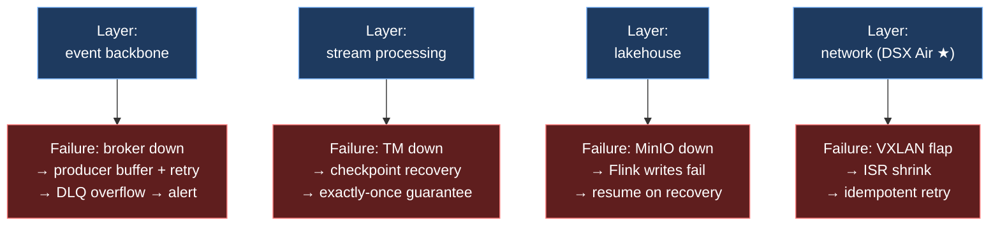
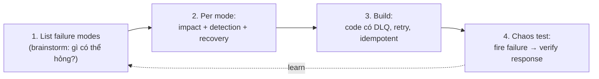

# KU 00/05 — Failure as a feature

> Trong hệ thống thật, **hỏng không phải lỗi — là **đặc tính**. Thiết kế cho lúc hỏng = thiết kế đúng. Thiết kế chỉ cho happy path = chưa thiết kế.

**Module:** [00 — Mental Models](./README.md)
**Đọc trong:** ~10 phút

---

## 🎯 Nó là gì?

Hãy tưởng tượng **một quán phở**.

- Quán **junior**: ngày bình thường ngon, mưa to mất điện thì đóng cửa, không có phương án.
- Quán **senior**: có máy phát điện, có ô che bàn, có menu cắt giảm khi nhân viên nghỉ, có quy trình đông khách quá tải.

Sự khác biệt: quán senior **coi mưa, mất điện, đông khách là chuyện sẽ xảy ra** — không phải "edge case ai mà gặp".

> *Định nghĩa hàn lâm:* "Failure as a feature" là tư duy thiết kế nơi **failure modes được liệt kê tường minh**, có response plan, có observability để phát hiện, có recovery cơ chế hoá. Tương đương với phần lớn nguyên tắc của SRE / chaos engineering.

---

## 💡 Nó làm được gì?

Tư duy này biến đổi cách bạn build:

- **Liệt kê failure modes trước khi code.** Không chỉ "happy path" + "vài exception".
- **Mỗi failure mode có alert + runbook.** Không có "lỡ hỏng thì sao?" — đã có sẵn câu trả lời.
- **Test failure chủ động** (chaos engineering). Không chờ production tự hỏng dạy bạn.
- **Document recovery** trước, không phải sau sự cố.
- **Compose-able systems.** Mỗi component có hành vi rõ ràng khi component khác hỏng.

---

## 🧩 Nó là mảnh ghép nào trong tổng thể?

Trong project này, "failure as feature" thấm vào **mọi layer**:

→ **Mỗi layer có chaos test riêng** ([`chaos/`](../../chaos/)) và **runbook riêng** ([`runbooks/`](../../runbooks/)). Đây không phải optional — đây là *core deliverable*.

---

## 🚀 Nó giúp ích gì?

**Không** có tư duy này, hệ thống bạn build:
- Demo đẹp, production lỗi ngầm.
- Lỗi → đổ lỗi cho team hạ tầng.
- Bị wakeup 3h sáng vì 1 thứ "chưa nghĩ tới".
- Postmortem viết "we should have considered…".

**Có** tư duy này:
- Demo + chaos test cùng nhau.
- Lỗi → đã có runbook trong 2 phút.
- 3h sáng → alert tự fire, biết chính xác run lệnh gì.
- Postmortem ngắn, đa phần "đã handle theo runbook X".

---

## ⏰ Khi nào dùng / KHÔNG dùng?

| ✅ Bắt buộc | ❌ Có thể nhẹ |
|---|---|
| Pipeline production | Notebook học thử |
| Multi-user system | One-off script chạy 1 lần |
| > 1 service phụ thuộc nhau | Standalone CLI 100 dòng |
| Có SLA với consumer | Chưa có consumer |

> Trong project này: **mọi layer đều bắt buộc**, vì project này được thiết kế là production-inspired.

---

## 🤔 Vì sao chọn nó (vs alternatives)?

| Tư duy | Khi nào thắng | Khi nào thua |
|---|---|---|
| **Failure as feature** (cái này) | Production / SRE / data platform | Spike 30 phút |
| **"Defensive coding"** (check mọi input) | Boundary code (API) | Internal hot path (over-validate) |
| **"Optimistic + fix on bug"** | Quick prototype | Production (sẽ trả giá) |
| **"Just retry"** (không nghĩ kỹ) | … chưa khi nào | Luôn — retry mù có thể amplify |

---

## 🔧 Nó vận hành ra sao?

Quy trình "failure as feature" có 4 bước, làm **trước khi build**:

**Áp dụng cho project này:**

| Mode liệt kê | Impact | Detection | Recovery |
|---|---|---|---|
| Redpanda down | producers chặn | `up == 0` | docker start + replay |
| Flink TM down | lag tăng | `flink_numRestarts > 0` | auto-recover từ checkpoint |
| MinIO down | sink fail | sink error rate | dlq → replay |
| **VXLAN flap** ★ | ISR shrink | `under_replicated > 0` | idempotent producer + auto |
| Bad schema | DLQ spike | `dlq_rate > threshold` | fix schema + replay |

→ Đây chính là [`docs/16-failure-chaos-catalog.md`](../../docs/16-failure-chaos-catalog.md) trong repo.

---

## 🧠 Self-test

1. Quán phở "junior" gặp mưa thì làm gì? Quán "senior" làm gì? Liên hệ với hệ thống Kafka khi broker down.
2. Vì sao "retry mù" có thể tệ hơn không retry? (Gợi ý: retry storm).
3. Trong project này, "chaos catalog" là gì và vì sao nó nằm cùng level với "platform code"?
4. Một runbook đầy đủ phải có những phần gì? (xem template trong repo).
5. Vì sao failure as feature là yêu cầu **mọi producer phải idempotent** (KU 06 sẽ vào sâu)?

---

## 🔗 Trong repo này

- Chaos catalog 3 family: [`docs/16-failure-chaos-catalog.md`](../../docs/16-failure-chaos-catalog.md)
- Network failure storyline: [`docs/17-network-failure-storyline.md`](../../docs/17-network-failure-storyline.md)
- Runbook template + 4 runbook cụ thể: [`runbooks/`](../../runbooks/)
- Failure cascade diagram: [`ARCHITECTURE.md` §17](../../ARCHITECTURE.md#17-failure-cascade-reference)

---

## 📖 Đọc thêm (chính thống, hạn chế)

- Google SRE Book — chapter "Embracing Risk" — defining "error budget" và acceptance of failure.
- Casey Rosenthal — "Chaos Engineering" (O'Reilly) — principles + game day patterns.
