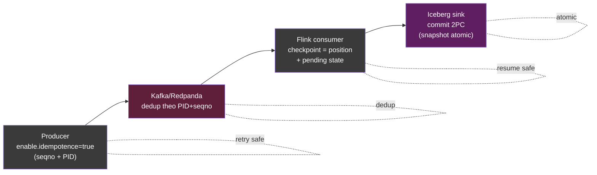
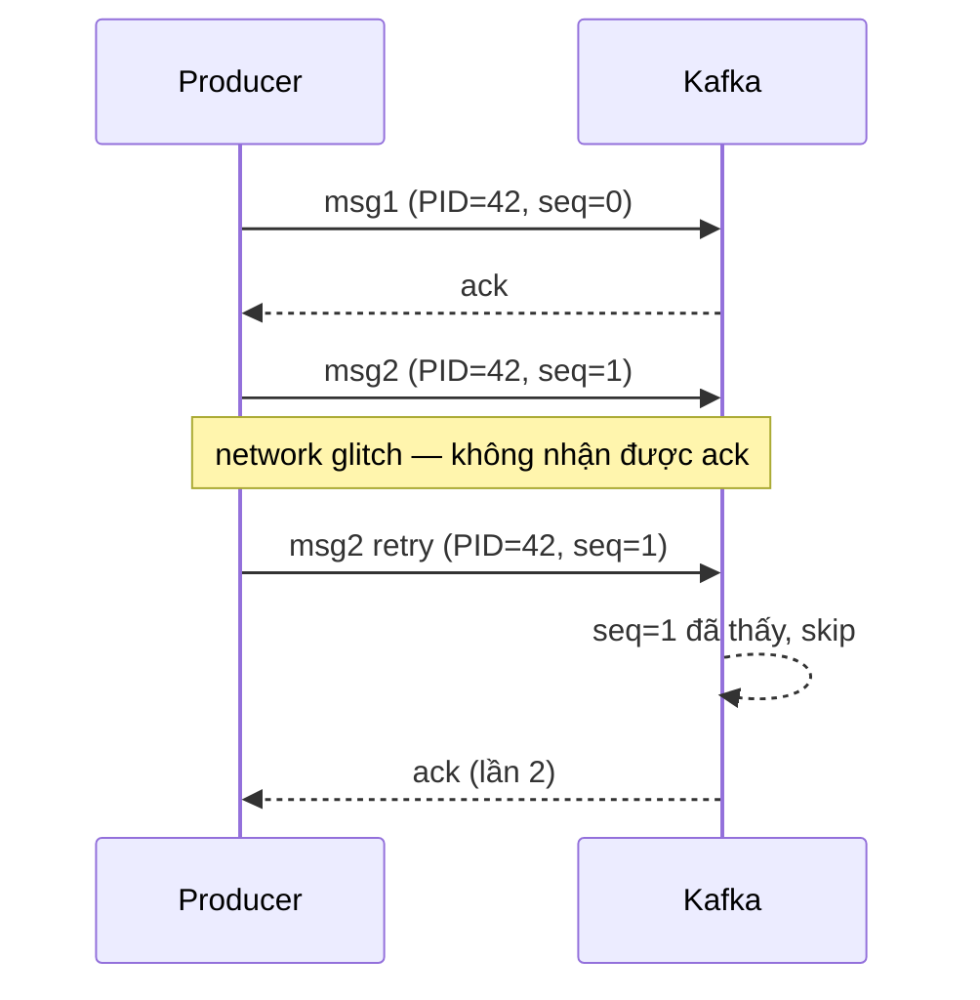

# KU 00/06 — Idempotency: chạy lại không hại

> **Idempotent** = chạy 1 lần và chạy 100 lần ra cùng kết quả. Tư duy này phải có trước khi viết bất kỳ producer / consumer / API nào.

**Module:** [00 — Mental Models](./README.md)
**Đọc trong:** ~8 phút

---

## 🎯 Nó là gì?

Bạn đi thang máy.

- **Idempotent:** bấm nút tầng 5 một lần. Bấm 10 lần nữa — thang vẫn đi tầng 5, không đi tầng 50.
- **KHÔNG idempotent:** rút tiền ATM "rút 500k". Bấm 10 lần → mất 5 triệu (nếu hệ thống ngân hàng kém).

Trong code:
- `SELECT * FROM users` → idempotent (đọc 100 lần cũng giống nhau)
- `INSERT INTO orders ...` → KHÔNG idempotent (lặp lại tạo bản ghi trùng)
- `UPDATE balance SET balance = 100 WHERE user_id = X` → **idempotent** (đặt = 100, chạy lại vẫn = 100)
- `UPDATE balance SET balance = balance - 50 WHERE user_id = X` → KHÔNG idempotent (chạy 2 lần trừ 100)

> *Định nghĩa hàn lâm:* Operation `f` idempotent ↔ `f(f(x)) = f(x)` — apply nhiều lần cùng kết quả như apply 1 lần.

---

## 💡 Nó làm được gì?

Idempotent operations cho phép bạn:

- **Retry an toàn** khi network blip / timeout.
- **Replay từ Kafka** không sợ double-count.
- **Resume từ checkpoint** Flink không sợ ghi 2 lần vào Iceberg.
- **Reconcile** bằng "reset state" thay vì "fix delta".
- **Test dễ.** Chạy test 100 lần — kết quả không "drift".

---

## 🧩 Nó là mảnh ghép nào trong tổng thể?

Idempotency là **hợp đồng** giữa producer ↔ broker ↔ consumer ↔ sink:



→ **Mọi node đều phải idempotent** thì pipeline mới exactly-once thực sự.

---

## 🚀 Nó giúp ích gì?

**Không** idempotent:
- Network blip → producer retry → broker nhận 2 lần → consumer xử lý 2 lần → revenue gold table **đếm trùng**.
- Flink restart → 1 batch records bị process 2 lần → bronze có duplicate event_id.
- ETL job retry sau lỗi → 1 record được insert 2 lần.

**Có** idempotent:
- Retry tuỳ ý, không tạo duplicate.
- Replay 7 ngày từ Kafka → bronze giống y hệt — không có ghi trùng.
- Resume Flink từ checkpoint → output exactly-once.

---

## ⏰ Khi nào dùng / KHÔNG dùng?

| ✅ Bắt buộc idempotent | ❌ Idempotent không áp dụng (hoặc khó) |
|---|---|
| Producer events | Random number generator |
| INSERT vào sink | Counter increment (cần version) |
| HTTP PUT / DELETE | HTTP POST tạo resource có ID server-gen |
| Stream sink | Email "đã gửi" (đã gửi rồi không gửi lại) |
| Pipeline reconciliation | …nhưng có thể wrap trong "idempotent token" |

**Quy tắc vàng:** mọi operation **có thể retry** phải idempotent.

---

## 🤔 Vì sao chọn nó (vs alternatives)?

3 cách đảm bảo đúng-một-lần:

| Cách | Cách hoạt động | Ưu | Nhược |
|---|---|---|---|
| **Idempotent operation** | Operation tự nó không tạo trùng | Đơn giản, không cần state ngoài | Phải design op từ đầu |
| **Dedupe ở consumer** | Consumer giữ set event_id đã xử lý | Producer có thể "dumb" | Bộ nhớ phình, hết hạn ra sao? |
| **Transactional 2PC** | Coordinator điều phối commit | Đúng tuyệt đối | Phức tạp, chậm, lock |

→ Lý tưởng: **idempotent op + dedupe consumer + 2PC ở sink quan trọng**. Layered defense.

---

## 🔧 Nó vận hành ra sao?

3 pattern thực tế:

### Pattern 1 — Idempotent INSERT bằng UPSERT

```sql
INSERT INTO orders (order_id, amount, ts)
VALUES ('ord_123', 100, now())
ON CONFLICT (order_id) DO NOTHING;
```

Chạy 100 lần → 1 hàng. Pattern phổ biến nhất.

### Pattern 2 — Idempotent producer Kafka

Cấu hình `enable.idempotence=true`. Producer gán PID + sequence number. Broker dedupe theo (PID, seq).



### Pattern 3 — Idempotent Flink sink to Iceberg

Flink dùng **2-phase commit** với Iceberg. Checkpoint N hoàn tất → snapshot N được commit atomically. Restart → resume từ checkpoint N, **không commit lại snapshot cũ**.

---

## 🧠 Self-test

1. ATM rút tiền: liệu thiết kế "rút thêm 500k" có thể được làm idempotent bằng cách nào?
2. Operation `UPDATE balance = 100` idempotent. Operation `UPDATE balance = balance - 50` thì sao? Vì sao?
3. Producer Kafka bật `enable.idempotence=true` nhưng consumer phía downstream không idempotent — pipeline còn exactly-once không?
4. Khi nào "dedupe ở consumer" tốt hơn "idempotent ở producer"?
5. Trong project này, Flink lakehouse_sink_job đảm bảo exactly-once bằng cơ chế nào? (Phần `## 🔧` đã có gợi ý).

---

## 🔗 Trong repo này

- ADR-0010 nhắc producer idempotent: [`adr/0010-synthetic-data-strategy.md`](../../adr/0010-synthetic-data-strategy.md)
- Flink lakehouse_sink_job đảm bảo exactly-once: [`docs/08-stream-processing.md`](../../docs/08-stream-processing.md#job-4--lakehouse_sink_job)
- Topic catalog có idempotent flag: [`docs/06-event-backbone.md`](../../docs/06-event-backbone.md)
- Runbook ví dụ tận dụng idempotent: [`runbooks/redpanda-down.md`](../../runbooks/redpanda-down.md)

---

## 📖 Đọc thêm (chính thống, hạn chế)

- Confluent — "Exactly-Once Semantics in Apache Kafka" — paper trắng giải thích PID + epoch + transactional producer.
- "Idempotent Receivers" — Enterprise Integration Patterns (Hohpe & Woolf) — pattern gốc cho idempotent consumer.
