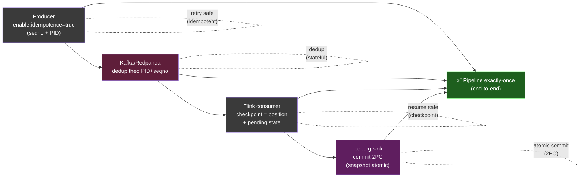
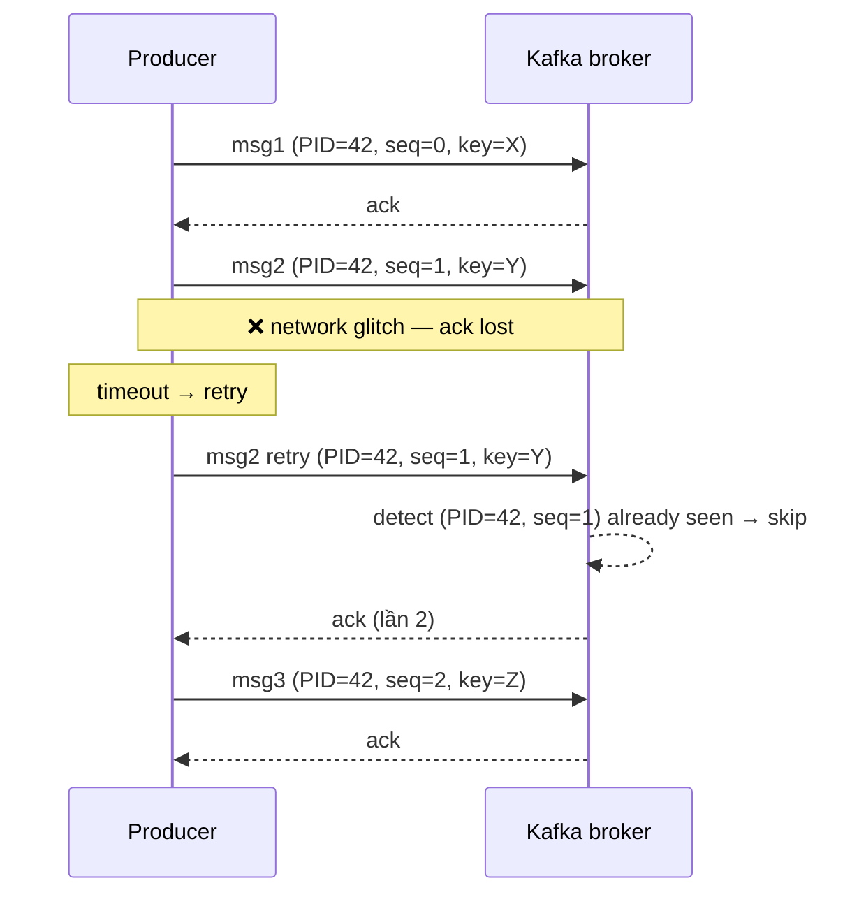
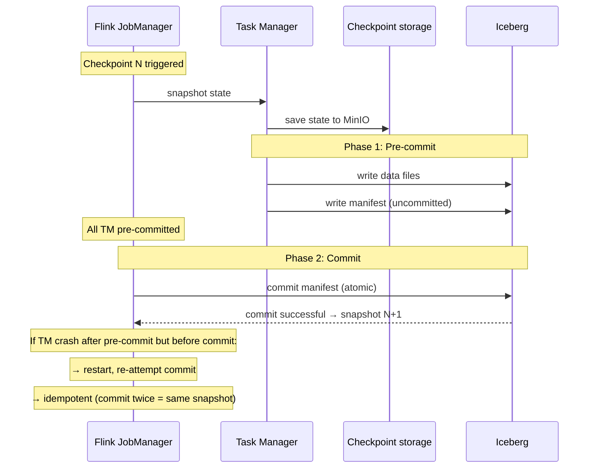
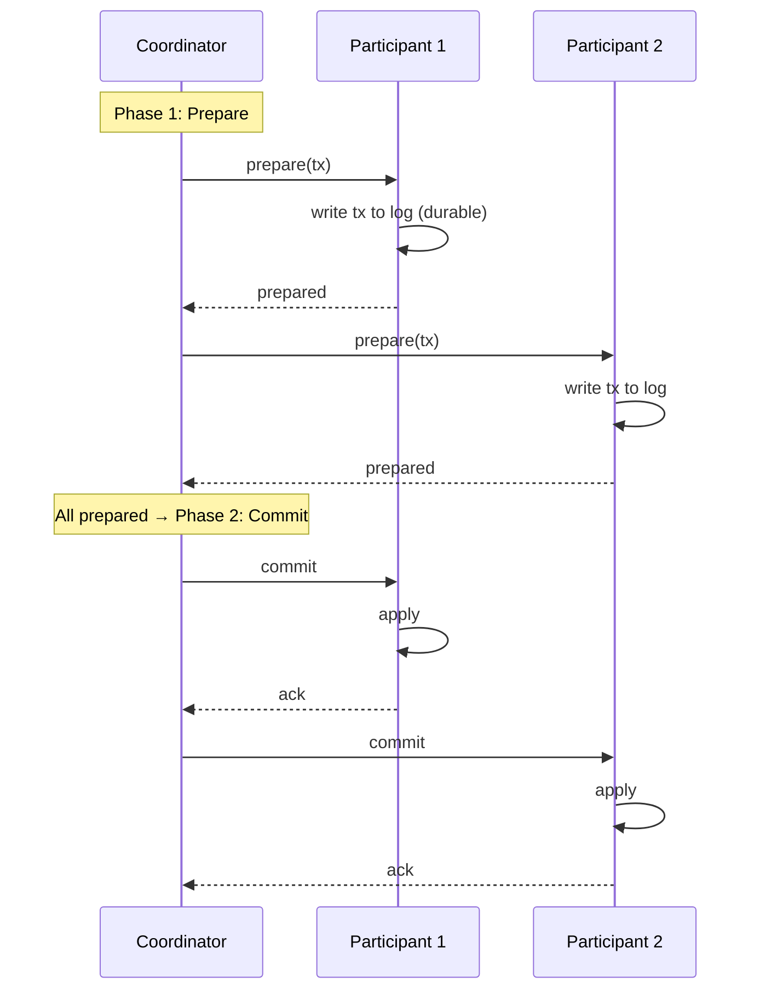

# KU F00 / 06 — Idempotency: chạy lại không hại

> **Idempotent** = chạy 1 lần và chạy 100 lần ra cùng kết quả. Tư duy này phải có **trước khi viết bất kỳ producer, consumer, hoặc API nào**. Là foundation của safe retry, exactly-once semantics, và mọi distributed system fault tolerance.

**Module:** [F00 — Mental Models](./README.md)
**Prereqs:** [F00/05 Failure as feature](./05-failure-as-feature.md)
**Related KUs:** [F00/07 Backpressure](./07-backpressure.md) · [F00/08 Eventual consistency](./08-eventual-consistency.md) · [D13 Event Streaming](../13-event-streaming-deep/) · [D14 Stream Processing](../14-stream-processing-deep/) · [F12/14 Idempotency keys](../12-system-design-fundamentals/)
**Đọc trong:** ~12 phút
**Mức độ:** Foundational

---

## 🎯 Nó là gì? (Analogy đời sống)

Bạn đi **thang máy**.

- **Idempotent:** bấm nút tầng 5 **một lần**. Bấm 10 lần nữa — thang vẫn đi tầng 5, không đi tầng 50. Nút "đèn sáng = đã chọn" — bấm thêm = no-op.

- **KHÔNG idempotent:** rút tiền ATM "rút 500k". Bấm "OK" 10 lần (giả định hệ thống ngân hàng kém) → mất 5 triệu.

Trong code:

- `SELECT * FROM users` → **idempotent** (đọc 100 lần cùng kết quả)
- `INSERT INTO orders (...)` → **KHÔNG idempotent** (lặp lại tạo bản ghi trùng)
- `UPDATE balance SET balance = 100 WHERE user_id = X` → **idempotent** (đặt = 100, chạy lại vẫn = 100)
- `UPDATE balance SET balance = balance - 50 WHERE user_id = X` → **KHÔNG idempotent** (chạy 2 lần trừ 100)
- `DELETE FROM users WHERE id = X` → **idempotent** (lần 2 không xoá thêm)
- `PUT /resource/123 {data}` → **idempotent** (REST PUT semantic)
- `POST /resource {data}` → **không idempotent** (tạo resource mới mỗi lần)

→ **Idempotency = property của operation**, không phải tool/framework. Bạn design vào.

---

## 📖 Định nghĩa chính thức

**Idempotent operation:** operation `f` thoả mãn `f(f(x)) = f(x)` — apply nhiều lần ra cùng kết quả như apply 1 lần.

3 đặc tính:
1. **Repeatable:** chạy nhiều lần không tạo side effect mới.
2. **Convergent:** kết quả hội tụ về cùng state cuối.
3. **Safe to retry:** có thể retry sau timeout/failure mà không lo data corruption.

**Trong distributed systems**, idempotency là **foundation** của:
- Safe retry mechanism (KU 05)
- Exactly-once semantics (KU 04 + 06 combined)
- Crash recovery (Flink checkpoint resume)
- Network unreliability mitigation
- "At-least-once" delivery → effectively-once

**Tại sao quan trọng?** Network unreliable. Timeout không đồng nghĩa "failed" — có thể "succeeded but ack lost". Phải retry. Retry **chỉ an toàn** khi operation idempotent.

**Nguồn:**
- Pat Helland, *"Idempotence Is Not a Medical Condition"* (CACM 2012) — paper foundational.
- RFC 7231 HTTP/1.1 §4.2.2 — định nghĩa idempotent methods.
- Confluent, *"Exactly-Once Semantics in Apache Kafka"* (KIP-98) — producer idempotence + transactional.

---

## 🔤 Terminology box

| Thuật ngữ | Tiếng Anh | Giải thích 1 câu |
|---|---|---|
| Idempotent | Idempotent | Chạy nhiều lần = chạy 1 lần |
| Idempotent operation | Idempotent operation | `f(f(x)) = f(x)` |
| Non-idempotent | Non-idempotent | Mỗi lần chạy tạo side effect mới |
| Idempotency key | Idempotency key | Unique ID dùng để dedup retry |
| At-most-once | At-most-once | Tối đa 1 lần — có thể mất |
| At-least-once | At-least-once | Tối thiểu 1 lần — có thể trùng |
| Exactly-once | Exactly-once | Đúng 1 lần (chỉ với idempotent + transactional) |
| Effectively-once | Effectively-once | At-least-once + dedup downstream → net effect là 1 |
| Producer ID (PID) | Producer ID | Kafka producer unique ID cho idempotence |
| Sequence number | Sequence number | Counter per producer-partition để dedup |
| Two-phase commit (2PC) | Two-phase commit | Distributed transaction protocol |
| Saga | Saga pattern | Long-running transaction với compensating actions |
| Tombstone | Tombstone | Marker đánh dấu delete trong compacted topic |
| Upsert | Upsert | INSERT or UPDATE — idempotent variant of INSERT |
| Compare-and-swap (CAS) | Compare-and-swap | Atomic conditional update |
| Token bucket | Token bucket | Rate limit với idempotency support |
| Replay | Replay | Re-process events from log — safe only if idempotent |
| Checkpoint | Checkpoint | Saved state for safe restart |

---

## 💡 Nó làm được gì?

Idempotent operations cho phép bạn:

- **Retry an toàn** khi network blip / timeout.
- **Replay từ Kafka** không sợ double-count.
- **Resume từ checkpoint** Flink không sợ ghi 2 lần vào Iceberg.
- **Reconcile** bằng "reset state" thay vì "fix delta".
- **Test dễ.** Chạy test 100 lần — kết quả không "drift".
- **Crash recovery** đơn giản — restart, replay, ko cần manual cleanup.
- **Idempotent infrastructure as code.** Terraform `apply` chạy lại không phá.
- **Schedule cron jobs** không sợ overlap.

---

## 🧩 Nó là mảnh ghép nào trong tổng thể?

Idempotency là **hợp đồng** giữa các component trong pipeline:



→ **Mọi node đều phải idempotent** thì pipeline mới exactly-once thực sự. Yếu 1 node = vỡ guarantee.

---

## 🚀 Nó giúp ích gì?

### Không idempotent

- Network blip → producer retry → broker nhận 2 lần → consumer xử lý 2 lần → revenue gold table **đếm trùng**.
- Flink restart → 1 batch records bị process 2 lần → bronze có duplicate event_id.
- ETL job retry sau lỗi → 1 record được insert 2 lần.
- Webhook delivery retry → user nhận 5 email cho 1 order.

**Real impact:** Stripe processes $billions per year. 1 lần mất idempotency = duplicate charge → customer fury, regulator fine, refund processing chaos.

### Có idempotent

- Retry tuỳ ý, không tạo duplicate.
- Replay 7 ngày từ Kafka → bronze giống y hệt — không có ghi trùng.
- Resume Flink từ checkpoint → output exactly-once.
- Cron job overlap không vấn đề.

### Trong project DSX Air

Mỗi layer phải design idempotent:

| Layer | Idempotency mechanism |
|---|---|
| Producer (Kafka) | `enable.idempotence=true` (PID + seqno) |
| Consumer (Flink) | Checkpointed offset + state |
| Iceberg sink | 2PC: pre-commit + commit atomic |
| Dagster batch | Asset materialization với deterministic key |
| Postgres UPSERT | `INSERT ... ON CONFLICT DO UPDATE` |
| API endpoint | Idempotency-Key header (Stripe pattern) |
| Producer with `_event_id` | Dedup by event_id trong Flink state |

→ ADR-0010 ([`adr/0010-synthetic-data-strategy.md`](../../adr/0010-synthetic-data-strategy.md)) explicit: "All producers are idempotent (`enable.idempotence=true`)".

---

## ⏰ Khi nào dùng / KHÔNG dùng?

| ✅ Bắt buộc idempotent | ❌ Idempotent không áp dụng (hoặc khó) |
|---|---|
| Producer events | Random number generator |
| INSERT vào sink | Counter increment (cần version) |
| HTTP PUT / DELETE | HTTP POST tạo resource có ID server-gen |
| Stream sink | Email "đã gửi" (đã gửi rồi không gửi lại — outside system) |
| Pipeline reconciliation | …nhưng có thể wrap trong "idempotent token" |
| API public-facing | One-time crypto operation |
| Webhook delivery | … |
| Cron job với schedule overlap | … |

**Quy tắc vàng:** mọi operation **có thể retry** phải idempotent. Nếu không, retry là dangerous.

---

## 🤔 Trade-off vs alternatives

3 cách đảm bảo đúng-một-lần:

| Cách | Cách hoạt động | Ưu | Nhược |
|---|---|---|---|
| **Idempotent operation** | Operation tự nó không tạo trùng | Đơn giản, không cần state ngoài | Phải design op từ đầu |
| **Dedupe ở consumer** | Consumer giữ set event_id đã xử lý | Producer có thể "dumb" | Bộ nhớ phình, hết hạn ra sao? |
| **Transactional 2PC** | Coordinator điều phối commit | Đúng tuyệt đối | Phức tạp, chậm, lock |
| **Saga pattern** | Compensating actions cho rollback | Long-running OK | Khó debug, eventual |

→ **Lý tưởng: combine** — idempotent op + dedupe consumer + 2PC ở sink quan trọng. Layered defense.

---

## 🔧 Nó vận hành ra sao? (Logic walkthrough)

### Pattern 1 — Idempotent INSERT bằng UPSERT

```sql
-- Postgres / MySQL syntax
INSERT INTO orders (order_id, amount, ts)
VALUES ('ord_123', 100, now())
ON CONFLICT (order_id) DO NOTHING;
-- hoặc DO UPDATE SET amount = excluded.amount

-- Chạy 100 lần → 1 hàng order_id = ord_123. ✅
```

Pattern phổ biến nhất trong DE. Postgres + Iceberg + Trino + ClickHouse đều support.

### Pattern 2 — Idempotent Kafka producer

Cấu hình `enable.idempotence=true`. Producer gán PID + sequence number. Broker dedupe theo (PID, seq).



→ Result: K nhận msg1, msg2, msg3 mỗi cái **đúng 1 lần** mặc dù producer retry.

**Detail:**
- PID = producer-broker negotiated unique ID
- Sequence number per (PID, partition)
- Broker maintains `(PID, partition) → last_seq` map
- Duplicate detected by `seq <= last_seq` → skip

### Pattern 3 — Idempotent Flink sink to Iceberg (2PC)

Flink dùng **2-phase commit** với Iceberg. Sequence:



→ Flink restart = resume từ checkpoint N → re-attempt commit của data đã pre-committed. Iceberg commit là atomic + idempotent (commit cùng manifest cùng kết quả).

### Pattern 4 — Idempotency Key (Stripe pattern)

Cho API public-facing:

```http
POST /v1/charges
Idempotency-Key: customer_abc_charge_2026-01-15_001
Content-Type: application/json

{
  "amount": 1000,
  "currency": "USD"
}
```

Server side:
1. Check `Idempotency-Key` in cache (Redis với TTL 24h).
2. If hit → return cached response (same charge_id, same status).
3. If miss → process → cache response → return.

→ Client retry với same key = same result. Client retry với new key = new charge.

→ Sẽ học sâu hơn ở [F12/14 Idempotency Keys](../12-system-design-fundamentals/).

### Pattern 5 — Dedup operator trong Flink

```python
# PyFlink pseudo-code
class DedupOperator(KeyedProcessFunction):
    def __init__(self):
        self.seen = state.descriptor("seen_event_ids", Boolean)

    def process_element(self, event, ctx):
        if self.seen.value():
            return  # skip duplicate
        self.seen.update(True)
        ctx.timer_service().register(now() + 24*60*60*1000)  # TTL 24h
        yield event

    def on_timer(self, timestamp, ctx):
        self.seen.clear()  # expire
```

State `seen_event_ids` keyed by `event_id`. TTL 24h. Dedup window 24h.

→ Trade-off: state size grows với throughput. Cần TTL hợp lý.

---

## 🧪 Worked example

**Tình huống thật trong DSX Air:** producer Kafka send 100 events. Network blip occurs sau event 50 — producer retry. Khi check Iceberg bronze, count cần đúng 100, không phải 50 hoặc 150.

### Bước 1 — Identify retry points

```
Producer → Kafka → Flink → Iceberg
   ↑          ↑       ↑        ↑
   retry?    dedup?  resume?  commit-twice?
```

Mỗi mũi tên là potential duplicate.

### Bước 2 — Apply idempotency at each layer

| Layer | Mechanism |
|---|---|
| Producer | `enable.idempotence=true` → PID + seqno |
| Kafka broker | Built-in dedup by (PID, seq) |
| Flink consumer | Checkpointed offset (resume from exact position) |
| Flink dedup operator | KeyedState với event_id (TTL 24h) |
| Iceberg sink | 2PC atomic commit |

### Bước 3 — Simulate failure

```bash
# Start producer + Flink + Iceberg pipeline
make produce-normal &

# Simulate network blip via chaos
sleep 30 && chaos/network/vxlan_flap.sh

# After recovery, count
trino> SELECT COUNT(*) FROM iceberg.bronze.events_payment;
100  ✓

trino> SELECT event_id, COUNT(*) FROM iceberg.bronze.events_payment
       GROUP BY event_id HAVING COUNT(*) > 1;
(empty)  ✓ no duplicates
```

### Bước 4 — What if 1 layer non-idempotent?

| If broken | Result |
|---|---|
| Producer `enable.idempotence=false` | Duplicate at Kafka layer → propagate down |
| No Flink dedup | Duplicate at bronze layer |
| Sink not 2PC | Duplicate on Flink restart |
| Idempotency-Key disabled | Duplicate at API layer |

→ Layered defense. Each layer adds protection. Skip any → break end-to-end exactly-once.

### Bước 5 — Test idempotency explicitly

```bash
# Inject 2% duplicate events from producer
chaos/data/inject_duplicates.sh

# Verify bronze count matches unique event_ids
trino> SELECT COUNT(*), COUNT(DISTINCT event_id)
       FROM iceberg.bronze.events_payment;
1000   1000  ✓ (no duplicates in bronze despite 2% duplicate input)
```

→ Worked example proves pipeline is end-to-end idempotent. Test in chaos catalog.

---

## ⚠️ Common pitfalls

### Pitfall 1 — Idempotent producer chưa đủ cho exactly-once

❌ **Sai:** "Em set `enable.idempotence=true` rồi, pipeline exactly-once chứ ạ?"

✅ **Đúng:** Producer idempotent chỉ giải quyết retry-duplicate ở producer-broker layer. **Consumer + sink** cũng phải idempotent / transactional. End-to-end cần **mọi layer**.

### Pitfall 2 — Non-idempotent UPDATE

❌ **Sai:** `UPDATE balance SET balance = balance - 50` → retry 2 lần = mất 100.

✅ **Đúng:** Dùng version + CAS: `UPDATE balance SET balance = 50, version = 2 WHERE id = X AND version = 1`. Hoặc lưu transaction_id để dedup.

### Pitfall 3 — Idempotent insert mà không có dedup key

❌ **Sai:** `INSERT INTO orders VALUES (...)` với auto-generated UUID at insert time → retry = duplicate.

✅ **Đúng:** Generate UUID at **client side** (idempotency key). Server INSERT với ON CONFLICT.

### Pitfall 4 — State TTL không match retry window

❌ **Sai:** Dedup operator TTL 1h, nhưng retry policy upstream 7 ngày → sau 1h TTL expire → duplicate slip through.

✅ **Đúng:** TTL ≥ max retry window. Hoặc dùng persistent state (Postgres, RocksDB).

### Pitfall 5 — Side effects external

❌ **Sai:** API "send_email" gọi 3rd party SES. SES không idempotent → retry = duplicate email user.

✅ **Đúng:** Wrap external call with idempotency key + dedup at boundary. Hoặc accept "at-least-once" và document.

### Pitfall 6 — Trust framework "magic"

❌ **Sai:** "Em dùng Kafka exactly-once mode, không cần care idempotency."

✅ **Đúng:** Kafka exactly-once mode dùng idempotent producer + transactional API. Đó là **layered abstraction over idempotency** — hiểu underlying mechanism quan trọng để debug.

---

## 🌱 Advanced topics

### A1. Pat Helland "Idempotence Is Not a Medical Condition"

Paper CACM 2012 luận điểm:

> *"Building a distributed system without considering idempotence is like driving without a seatbelt. You may be fine 99% of the time, but the 1% will hurt."*

3 patterns Helland proposes:
- **Activity ID:** unique ID per business transaction
- **Idempotent receiver:** dedup at receiver
- **Reliable messaging:** at-least-once + dedup = effectively-once

→ Foundational read cho mọi data engineer.

### A2. Kafka exactly-once semantics (KIP-98)

Confluent introduced 2018:
- **Idempotent producer:** PID + sequence number (KU above)
- **Transactional producer:** atomic write to multiple partitions/topics
- **Read-committed consumer:** only see committed messages

Combined → end-to-end exactly-once across Kafka cluster.

Caveat: chỉ trong Kafka. External sink (DB, S3) cần own 2PC integration.

### A3. Two-phase commit (2PC) — distributed transaction

Tanenbaum & Steen (1977 origin):



Trade-off:
- Pros: strong consistency
- Cons: blocking (participant stuck if coordinator crashes), slow (2 round trips), single point of failure

→ Modern alternatives: Saga (compensating actions), TCC (Try-Confirm-Cancel).

### A4. Saga pattern — long-running transaction

For multi-step business transactions (e.g., book flight + hotel + car):


Mỗi step có compensating action. Saga = forward path + reverse path.

→ Better than 2PC cho long-running, eventual consistency OK.

### A5. CRDT (Conflict-free Replicated Data Types)

Marc Shapiro et al. (2011):

Data structures with mathematically-guaranteed idempotent + commutative + associative operations. Examples:
- **G-Counter** (grow-only counter)
- **PN-Counter** (positive-negative counter)
- **OR-Set** (observed-remove set)
- **LWW-Register** (last-write-wins)

Use cases: collaborative editing (Google Docs, Figma), distributed cache.

→ CRDT là "idempotency built into data structure". No need application-level idempotency.

### A6. Apply cho LLM/AI 2026

LLM API specific:
- **Idempotency key** for hosted LLM API calls (OpenAI, Anthropic support)
- **Deterministic mode** (`seed`, `temperature=0`) → idempotent output
- **Prompt caching** (Anthropic) — cache prompt prefix → idempotent retrieval
- **Tool calls** — design tool to be idempotent (use external transaction IDs)

→ AI agent retries an toàn chỉ khi tool calls idempotent.

### A7. PUT vs POST semantics (REST)

RFC 7231 §4.2.2:

| Method | Idempotent? | Safe? |
|---|---|---|
| GET | ✅ | ✅ |
| HEAD | ✅ | ✅ |
| PUT | ✅ | ❌ |
| DELETE | ✅ | ❌ |
| POST | ❌ | ❌ |
| PATCH | ❌ (depends) | ❌ |

→ Pick HTTP method theo idempotency desired. PUT cho update, POST cho create.

---

## 🔗 Liên kết KU khác

- **[F00/05 Failure as feature](./05-failure-as-feature.md)** — retry safe = idempotent prerequisite
- **[F00/07 Backpressure](./07-backpressure.md)** — backpressure + retry need idempotent
- **[F00/08 Eventual consistency](./08-eventual-consistency.md)** — eventual + idempotent → convergent
- **[F11/12 Vector clocks](../11-distributed-systems-theory/)** — alternative dedup mechanism
- **[D13 Event Streaming](../13-event-streaming-deep/)** — producer/consumer idempotency
- **[D14 Stream Processing](../14-stream-processing-deep/)** — exactly-once Flink + Iceberg
- **[D17 Serving & APIs](../17-serving-apis-deep/)** — Idempotency-Key header pattern
- **[D33 AI Agents](../33-ai-agents-tool-use/)** — idempotent tool calls

---

## 🧠 Self-test (3 mức)

### 🟢 Easy

1. Operation nào sau đây idempotent? Giải thích mỗi cái:
   - `SELECT * FROM users`
   - `INSERT INTO orders VALUES (...)`
   - `UPDATE status = 'SHIPPED' WHERE order_id = 'ord_123'`
   - `UPDATE balance = balance - 50 WHERE id = X`
2. Operation `UPDATE balance = 100` idempotent. Operation `UPDATE balance = balance - 50` thì sao? Vì sao khác?
3. Vì sao network unreliable yêu cầu mọi operation phải idempotent?

### 🟡 Medium

4. Producer Kafka bật `enable.idempotence=true` nhưng consumer downstream không idempotent — pipeline còn exactly-once không? Giải thích.
5. Khi nào "dedupe ở consumer" tốt hơn "idempotent ở producer"?
6. Trong project DSX Air, Flink `lakehouse_sink_job` đảm bảo exactly-once bằng cơ chế nào? Liệt kê 3 component cần idempotent.

### 🔴 Hard

7. ATM rút tiền: thiết kế "rút thêm 500k" thành idempotent operation bằng cách nào? (Hint: client-generated UUID).
8. Saga pattern vs 2PC: khi nào dùng cái nào? Cho 1 use case mỗi pattern.
9. CRDT là "idempotency built into data structure". Cho 1 use case CRDT outperforms application-level idempotency.

> **6+/9** = hiểu sâu. **4-5** = đọc lại Confluent KIP-98. **<4** = đọc Helland 2012 + apply lên 1 ADR mẫu.

---

## 📌 Trong repo này

Idempotency thấm vào mọi component:

- **ADR-0010 Synthetic data strategy** ([`adr/0010-synthetic-data-strategy.md`](../../adr/0010-synthetic-data-strategy.md)) — explicit "All producers idempotent"
- **Producer base class** ([`producers/common/base.py`](../../producers/common/base.py)) — `enable.idempotence=true`
- **Topic catalog** ([`docs/06-event-backbone.md`](../../docs/06-event-backbone.md)) — idempotent flag per topic
- **Stream processing design** ([`docs/08-stream-processing.md`](../../docs/08-stream-processing.md)) — `lakehouse_sink_job` exactly-once via 2PC
- **CDC design** ([`docs/07-cdc-design.md`](../../docs/07-cdc-design.md)) — Debezium offset checkpointing
- **Duplicate chaos** ([`chaos/data/inject_duplicates.sh`](../../chaos/data/inject_duplicates.sh)) — test idempotency
- **Runbook redpanda-down** ([`runbooks/redpanda-down.md`](../../runbooks/redpanda-down.md)) — relies on idempotent retry

---

## 🌐 Đọc thêm (chính thống, hạn chế — 3 nguồn)

- **Pat Helland, "Idempotence Is Not a Medical Condition"** (CACM 2012) — foundational paper.
- **Confluent KIP-98: "Exactly-Once Semantics in Apache Kafka"** — Kafka idempotent producer + transactional design.
- **Martin Kleppmann, "Designing Data-Intensive Applications" — Chapter 8 (Trouble with Distributed Systems) + Chapter 11 (Stream Processing)** — distributed retry semantics. [Library: `Kleppmann_2017_Designing-Data-Intensive-Applications.pdf`](../../library/books/distributed-systems/Kleppmann_2017_Designing-Data-Intensive-Applications.pdf)

---

**Đã đọc xong?**
✅ Tick vào [`progress/checklist.md`](../progress/checklist.md) → đi tiếp [F00/07 Backpressure](./07-backpressure.md).
