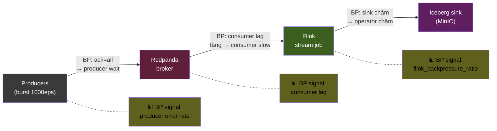
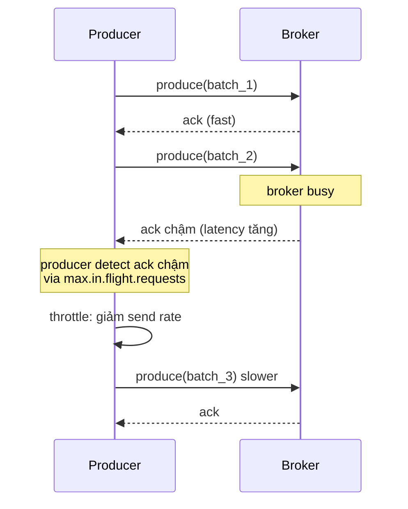
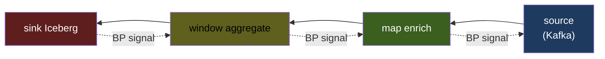
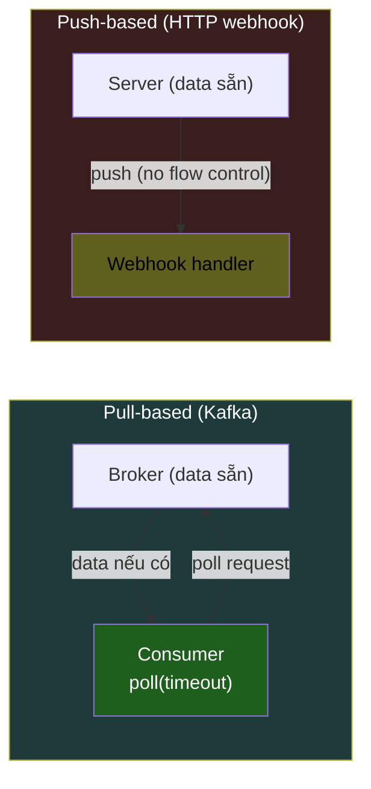
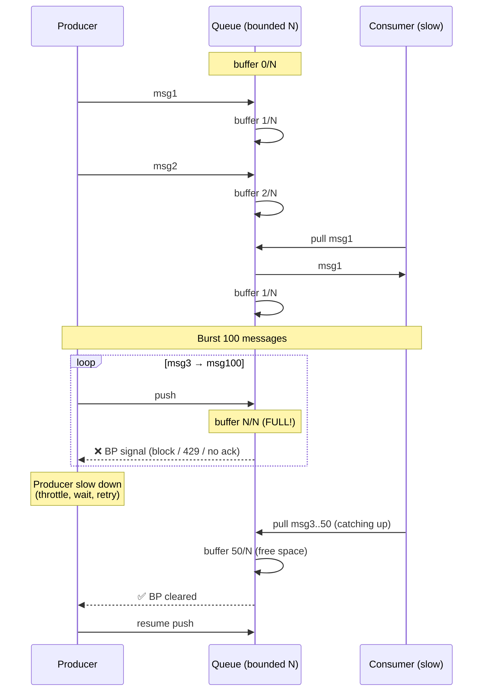
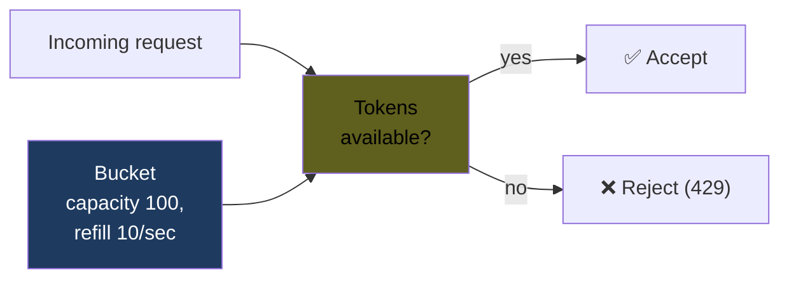

# KU F00 / 07 — Backpressure: tắc đường ngược

> Khi downstream tắc, upstream phải biết **chậm lại** — không phải đẩy mạnh hơn. Tư duy này quyết định pipeline **sống hay chết** khi burst traffic. Backpressure = cơ chế phản hồi ngược chống quá tải.

**Module:** [F00 — Mental Models](./README.md)
**Prereqs:** [F00/05 Failure as feature](./05-failure-as-feature.md) · [F00/06 Idempotency](./06-idempotency.md)
**Related KUs:** [F00/08 Eventual consistency](./08-eventual-consistency.md) · [D14 Stream Processing](../14-stream-processing-deep/) · [F12/08 Rate limiting](../12-system-design-fundamentals/) · [F12/09 Circuit breaker](../12-system-design-fundamentals/)
**Đọc trong:** ~12 phút
**Mức độ:** Foundational

---

## 🎯 Nó là gì? (Analogy đời sống)

Hãy tưởng tượng **đại lộ Võ Văn Kiệt 4 làn → ngõ Bùi Viện 1 làn**.

### Trường hợp 1: Không có tín hiệu lùi

- Đại lộ 4 làn xe chạy tự do (upstream nhanh).
- Ngõ Bùi Viện 1 làn (downstream chậm).
- **Không có biển báo + tín hiệu lùi** ở ngã ba.
- Xe trên đại lộ vẫn lao tới → kẹt cứng ở ngã ba → kẹt lan ngược lên đại lộ → 3km kẹt cứng.
- Cấp cứu, công an đến không vào được → cascade failure.

### Trường hợp 2: Có tín hiệu lùi

- Cùng đại lộ, cùng ngõ.
- **Có biển báo + đèn vàng nhấp nháy** + nhân viên hướng dẫn.
- Xe trên đại lộ thấy đèn vàng → **giảm tốc**.
- Ngõ tiếp nhận đều đều → không kẹt.
- Khi ngõ thông trở lại → đèn xanh → đại lộ tăng tốc lại.

**Tín hiệu lùi này = backpressure.** Cơ chế cho phép downstream nói "tôi đang chậm, anh chậm lại đi", thay vì để upstream lao tới → kẹt → cascade.

Trong tech, backpressure = **default behavior của well-designed system**. Không có nó = OOM, drop event, cascade failure.

---

## 📖 Định nghĩa chính thức

**Backpressure** là cơ chế cho phép một component **chậm hơn** trong pipeline ép component **nhanh hơn** giảm rate, thay vì:
- Để buffer phình vô hạn → OOM
- Drop dữ liệu im lặng → data loss
- Cascade failure → lan ra nhiều service

3 cơ chế cài đặt:
1. **Pull-based (consumer-driven):** consumer chủ động request data. Kafka consumer poll.
2. **Push-based với credit:** producer push, downstream gửi "credit" về cho phép push thêm. Reactive Streams.
3. **Push-based với feedback signal:** queue length, lag metric → upstream observe → adjust rate.

**Nguồn:**
- Reactive Streams Specification (2015, JVM, JavaScript) — chuẩn cross-platform về backpressure.
- Tyler Akidau, *"Streaming 101 / 102"* (O'Reilly) — backpressure trong streaming systems.
- Marc Brooker, *"Tail at scale: Backpressure in distributed systems"* — Amazon engineering blog.

---

## 🔤 Terminology box

| Thuật ngữ | Tiếng Anh | Giải thích 1 câu |
|---|---|---|
| Áp lực ngược | Backpressure | Cơ chế signal downstream chậm → upstream chậm theo |
| Quá tải | Overload | Khi tải vượt capacity của system |
| Load shedding | Load shedding | Drop request thay vì OOM khi quá tải |
| Drop policy | Drop policy | Quy tắc drop khi queue full |
| Buffer | Buffer | Vùng nhớ tạm giữ items pending |
| Bounded buffer | Bounded buffer | Buffer có limit — tránh OOM |
| Unbounded buffer | Unbounded buffer | Buffer không limit — risk OOM |
| Bottleneck | Bottleneck | Stage chậm nhất trong pipeline |
| Backpressure ratio | Backpressure ratio | Flink metric: % time bị block do BP |
| Rate limiting | Rate limiting | Giới hạn rate request — bảo vệ chủ động |
| Throttling | Throttling | Giảm rate khi gần quá tải |
| Pull-based | Pull-based | Consumer chủ động fetch data |
| Push-based | Push-based | Producer push data đến consumer |
| Credit-based | Credit-based | Consumer gửi credit cho producer |
| Watermark | Watermark | (Streaming) marker thời gian event-time |
| Consumer lag | Consumer lag | Khoảng cách giữa latest offset vs consumer offset |
| Spill to disk | Spill to disk | Buffer overflow → ghi xuống disk |
| Reactive Streams | Reactive Streams | JVM/JS spec cho async + backpressure |

---

## 💡 Nó làm được gì?

Backpressure cho phép:

- **Pipeline tự điều chỉnh** khi 1 stage chậm.
- **Không OOM** vì buffer phình vô hạn.
- **Không drop event** (= không mất data) trong default behavior.
- **Phát hiện bottleneck** — stage có backpressure cao = stage chậm nhất.
- **Burst absorption** — sống sót qua spike traffic.
- **Fair scheduling** — không 1 producer monopolize resource.
- **Cost control** — không scale-up bất tận khi traffic spike.

---

## 🧩 Nó là mảnh ghép nào trong tổng thể?

Backpressure tồn tại ở **mọi tầng** trong project DSX Air:



→ Mỗi mũi tên ẩn 1 cơ chế backpressure. Pipeline **sống sót khi burst** chỉ khi MỌI mũi tên đều có BP đúng.

---

## 🚀 Nó giúp ích gì?

### Không có backpressure (push-only, unbounded)

```
Burst 1000 eps:
- Broker đầy → producer ack timeout
- Producer dồn buffer cục bộ → OOM tại producer
- Hoặc drop events → data loss
- Flink: 1 sink chậm → operator trước tắc → state phình → checkpoint timeout
- Cascade: Flink crash → Kafka grows → cascade fail
```

**Real impact:** Knight Capital (2012) lost $440M in 45 minutes vì cascade overload — no backpressure.

### Có backpressure

```
Burst 1000 eps:
- Broker chậm ack → producer tự điều chỉnh rate
- Lag tăng temporarily, hết burst tự drain
- Flink: sink chậm → subtask buffer record nhỏ → operator phía trước giảm pull → tự nhiên giảm rate
- No OOM, no data loss
- Lag clears trong vài phút sau burst
```

**Real impact:** Netflix, LinkedIn, Confluent depend on Kafka's pull-based backpressure for 100M+ events/sec.

### Trong DSX Air

Burst benchmark scenario:
- Normal: 100 eps
- Burst: 1000 eps in 2 minutes
- Expected: lag tăng temporary, return < 5min after burst ends

Test trong [`benchmarks/scenarios/run_mvp.sh`](../../benchmarks/scenarios/) — verify backpressure works under burst.

---

## ⏰ Khi nào dùng / KHÔNG dùng?

Backpressure là **default — không phải lựa chọn**. Câu hỏi đúng: cấu hình bounded vs unbounded buffer?

| Tình huống | Strategy |
|---|---|
| Pipeline data, ETL, streaming | Backpressure default, bounded buffer |
| Logging non-critical | Có thể accept drop (lossy) — load shedding OK |
| Metrics with priorities | Drop low-priority, keep critical |
| End-to-end latency critical (trading) | Hard limit + ack timeout, drop late |
| Long-running burst absorbing | Spill to disk OK (slow but safe) |
| Webhook delivery | Bounded retry queue + DLQ |

### Trade-off: Backpressure vs Drop vs Buffer

| Strategy | Cách | Khi dùng |
|---|---|---|
| **Backpressure** (cái này) | Upstream chậm theo downstream | Default cho data pipeline |
| **Drop (load shedding)** | Bỏ event khi quá tải | Logs, metrics non-critical |
| **Buffer infinite** | Lưu hết, queue dài tuỳ thích | ❌ Risk OOM, never OK |
| **Spill to disk** | Buffer overflow → ghi đĩa | Absorb burst dài, accept đắt I/O |

---

## 🤔 Trade-off vs alternatives

3 chiến lược xử lý quá tải:

| Chiến lược | Cách hoạt động | Khi dùng | Trade-off |
|---|---|---|---|
| **Backpressure** | Upstream chậm theo downstream | Pipeline data, streaming | Throughput đầu vào bị giảm tạm |
| **Drop** | Bỏ event khi full | Logs, metrics | Data loss (accept) |
| **Spill to disk** | Buffer to disk | Burst dài, ok I/O cost | Slower, disk wear |
| **Auto-scale** | Add capacity downstream | Cloud, container | Latency tăng (cold start), cost |
| **Reject (429)** | Return rate limit error | API public | Caller phải retry — push problem upstream |

→ **Combo lý tưởng**: backpressure default + drop selective (low-priority) + spill long burst.

---

## 🔧 Nó vận hành ra sao? (Logic walkthrough)

### Trong Kafka producer (push với ack feedback)



Producer config:
- `max.in.flight.requests.per.connection` (default 5) — số request chưa ack tối đa
- `linger.ms` — wait time trước khi send batch
- `batch.size` — kích thước batch
- `acks=all` + `enable.idempotence=true` — bắt producer wait

→ When broker chậm, các request unacked piling up → producer naturally slows.

### Trong Flink (operator-level backpressure)

Mỗi operator có **input buffer** bounded:



- **Đỏ (sink):** chậm thực sự — bottleneck
- **Vàng (aggregate):** BP cao do sink chậm
- **Xanh nhạt (map):** BP nhẹ
- **Xanh (source):** bị throttled → poll Kafka chậm hơn

**Metric:** `flink_taskmanager_job_task_operator_backpressure_ratio` ∈ [0, 1]:
- 0.0 = không BP
- 0.5 = nửa thời gian bị block
- 1.0 = hoàn toàn block

→ **Bottleneck identification:** operator có BP **THẤP nhất** = bottleneck thực (vì nó là cái chậm nhất, không bị ai block). Operator có BP **CAO** = bị bottleneck downstream block.

### Pull-based vs Push-based



- **Pull-based** (Kafka, Pulsar): consumer control rate. Backpressure tự nhiên — consumer poll chậm = không nhận data thêm.
- **Push-based** (HTTP webhook, RPC stream): producer push. Cần explicit BP signal (HTTP 429, credit-based).

→ Pull-based **simpler** cho backpressure. Đó là 1 lý do Kafka dominate cho streaming.

### Reactive Streams — chuẩn JVM/JS

Reactive Streams (2015) chuẩn hoá BP với 4 interfaces:

```
Publisher<T>     // produces items
Subscriber<T>    // consumes items
Subscription     // contract between them
Processor<T,R>   // transforms

// Backpressure via Subscription.request(n)
// Subscriber requests N items → Publisher emits ≤ N
```

Implementations: RxJava, Reactor, Akka Streams (JVM). RxJS (JS).

→ **Credit-based push** mechanism. Subscriber explicitly request N → publisher cannot overrun.

### Sequence: BP qua time



→ **Buffer bounded** + **consumer pull** + **producer respect BP** = stable system under burst.

---

## 🧪 Worked example

**Tình huống thật trong DSX Air:** chạy chaos burst scenario B2 (1000 eps trong 2 phút). Verify backpressure works.

### Bước 1 — Setup baseline

```
Normal load: 100 eps producer → Flink consume → ClickHouse sink
Steady state:
- Producer p95 latency: 5ms
- Consumer lag: < 10
- Flink BP ratio: 0.0
- ClickHouse insert p95: 8ms
```

### Bước 2 — Inject burst

```bash
make produce-burst   # 1000 eps × 2 min
```

### Bước 3 — Observe trong Grafana

Timeline:

| Time | Producer ack p95 | Consumer lag | Flink BP ratio | CH insert p95 |
|---|---:|---:|---:|---:|
| t=0s (baseline) | 5ms | 5 | 0.0 | 8ms |
| t=10s (burst start) | 15ms | 200 | 0.1 | 12ms |
| t=30s (mid-burst) | 45ms | 2,000 | 0.4 | 30ms |
| t=60s (peak) | 80ms | 5,000 | 0.6 | 50ms |
| t=120s (burst end) | 60ms | 3,500 | 0.5 | 40ms |
| t=180s (recovery) | 20ms | 800 | 0.2 | 15ms |
| t=300s (back normal) | 5ms | 10 | 0.0 | 8ms |

### Bước 4 — Analyze

- **Producer ack chậm 16x peak** — natural BP signal.
- **Consumer lag tăng tạm thời** lên 5,000 records — chấp nhận được.
- **Flink BP ratio 0.6 peak** — sink chậm hơn aggregate, signal back-pressure đang work.
- **No OOM, no data loss** — burst absorbed.
- **Recovery time:** 3 phút sau burst ends — within SLA (5 phút).

### Bước 5 — Identify bottleneck

Trong burst, **ClickHouse insert p95 = 50ms** (slowest). Flink BP ratio cao nhất ở operator gần sink. → **Bottleneck = ClickHouse**.

Action: trong production, scale ClickHouse cluster horizontally. Trong DSX Air lab, accept và document.

### Bước 6 — Verify data integrity

```bash
trino> SELECT COUNT(*) FROM iceberg.bronze.events_payment WHERE event_time BETWEEN burst_start AND burst_end;
120000  ✓ (matches producer count exactly — no loss)

trino> SELECT COUNT(*), COUNT(DISTINCT event_id) FROM ...;
120000  120000  ✓ (no duplicates)
```

→ **End-to-end exactly-once + backpressure + no data loss**. Pipeline pass burst test.

### Bài học từ worked example

- **BP ratio metric** là first-class signal cho health check.
- **Bottleneck = lowest BP** node (counter-intuitive cho junior).
- **Recovery time** quan trọng hơn peak performance — đo qua scenario test.
- **Combine backpressure + idempotency + 2PC** = pipeline production-grade.

---

## ⚠️ Common pitfalls

### Pitfall 1 — Unbounded buffer "to be safe"

❌ **Sai:** "Mình set queue size = Int.MAX_VALUE để chắc chắn không drop."

✅ **Đúng:** Bounded buffer + spill-to-disk nếu cần absorb burst dài. Unbounded → OOM dưới load thực.

### Pitfall 2 — Identify bottleneck SAI

❌ **Sai:** Operator có BP ratio CAO nhất → "đây là bottleneck, optimize nó."

✅ **Đúng:** Operator có BP ratio **THẤP nhất** = bottleneck. Optimize **đó**. (Vì BP cao = bị downstream block, không phải nó chậm).

### Pitfall 3 — Backpressure mà không có alert

❌ **Sai:** BP ratio 0.8 trong 1 tiếng → không ai biết. Sau đó OOM → wakeup.

✅ **Đúng:** Alert: `backpressure_ratio > 0.5 for 5min`. Investigate root cause trước khi cascade.

### Pitfall 4 — Tất cả pipeline cần backpressure

❌ **Sai:** "Logs cũng cần backpressure để không mất."

✅ **Đúng:** Logs non-critical = accept drop (load shedding). Backpressure cho data pipeline; drop cho logs/metrics tier 2.

### Pitfall 5 — Push-based without flow control

❌ **Sai:** API webhook push to consumer 100 req/sec. Consumer chậm → drop hoặc OOM.

✅ **Đúng:** Webhook delivery với bounded retry queue + DLQ. Hoặc switch to pull-based (consumer poll).

### Pitfall 6 — Retry mà không tôn trọng BP

❌ **Sai:** Retry immediate khi 429 → amplify load → cascade.

✅ **Đúng:** Retry với exponential backoff + jitter. Tôn trọng `Retry-After` header.

---

## 🌱 Advanced topics

### A1. Tail at scale (Jeffrey Dean, Google 2013)

Famous paper. Insight:
- 1 request = nhỏ
- 1 request gọi 1000 backends = p99 dominate (1 slow = cả request slow)

→ **Tail latency = system reliability**. Backpressure giúp keep tail manageable.

Techniques:
- **Hedged requests:** send 2nd request after p95 timeout (accept double cost cho safety)
- **Tied requests:** cancel pending duplicate khi 1 succeed
- **Micro-partitioning:** smaller work units → less impact của 1 slow worker

### A2. Token bucket (rate limiting)



- Bucket capacity = max burst size
- Refill rate = sustained rate
- Request takes 1 token

→ Combines burst tolerance + steady rate limit. AWS API Gateway, Kong use this.

### A3. Leaky bucket vs Token bucket

| | Leaky bucket | Token bucket |
|---|---|---|
| Output rate | Constant | Burst allowed |
| Use case | Traffic shaping (smooth) | API rate limiting (burst tolerant) |
| Implementation | Queue + timer | Token counter + refill |

→ Most modern systems use token bucket (more flexible).

### A4. Backpressure trong gRPC

gRPC streaming có built-in flow control:
- HTTP/2 frames có flow-control window
- Server cannot send if client window = 0
- Client signal "ready" by incrementing window

→ gRPC inherently backpressured. REST không.

### A5. Reactive Streams trong JVM

Specs từ Lightbend (creators of Akka):

```java
// Java 9+ has Flow API
Flow.Publisher<Integer> publisher = ...;
Flow.Subscriber<Integer> subscriber = new Flow.Subscriber<>() {
    Flow.Subscription subscription;

    public void onSubscribe(Flow.Subscription sub) {
        subscription = sub;
        sub.request(1);  // request 1 item
    }

    public void onNext(Integer item) {
        process(item);
        subscription.request(1);  // request next
    }
    // ...
};
publisher.subscribe(subscriber);
```

→ Subscriber controls rate via `request(n)`. Publisher cannot overrun.

### A6. CompactionDelay vs Backpressure

Iceberg / Delta lakehouse có "**compaction lag**" — analogue to backpressure:
- Insert nhanh → many small files
- Compaction chậm → small file pileup → query slow
- Need balance insert rate vs compaction rate

→ Apply backpressure pattern: monitor compaction lag, throttle insert if lag too high.

### A7. Apply cho LLM/AI 2026

LLM inference backpressure:
- **Token rate limits** (OpenAI: 200K tokens/min for tier 1)
- **Request rate limits** (3000 req/min)
- **Queue depth limit** (vLLM, TGI)
- **Speculative decoding** = "hedged tokens" — generate ahead, accept best

Solution patterns:
- Client-side: respect `Retry-After`, exponential backoff
- Server-side: prioritize critical requests, drop low-priority
- Architecture: caching (Anthropic prompt cache) + fallback to smaller model

→ LLM production = inherently backpressured. AI Engineer must design for it.

---

## 🔗 Liên kết KU khác

- **[F00/05 Failure as feature](./05-failure-as-feature.md)** — backpressure ngăn cascade failure
- **[F00/06 Idempotency](./06-idempotency.md)** — backpressure + retry need idempotent
- **[F00/08 Eventual consistency](./08-eventual-consistency.md)** — lag = eventual gap
- **[F12/08 Rate limiting](../12-system-design-fundamentals/)** — token bucket, leaky bucket
- **[F12/09 Circuit breaker](../12-system-design-fundamentals/)** — fail-fast when overloaded
- **[D14 Stream Processing](../14-stream-processing-deep/)** — Flink backpressure deep
- **[D17 Serving & APIs](../17-serving-apis-deep/)** — API rate limit + 429
- **[D33 AI Agents](../33-ai-agents-tool-use/)** — LLM rate limit handling

---

## 🧠 Self-test (3 mức)

### 🟢 Easy

1. Đại lộ chuyển vào ngõ nhỏ, **không** có "tín hiệu lùi" — chuyện gì xảy ra? Liên hệ với Kafka producer không có ack.
2. Backpressure ratio = 0.8 ở 1 operator nghĩa là gì?
3. Khi nào "drop event" tốt hơn backpressure? Cho 1 ví dụ.

### 🟡 Medium

4. Operator nào trong Flink pipeline là bottleneck thật sự — operator có BP **cao** hay BP **thấp**? Giải thích nghịch lý.
5. Producer Kafka tự backpressure bằng cách nào dù không có flag rõ ràng? (Gợi ý: `acks=all`).
6. Token bucket vs Leaky bucket: khác nhau ra sao? Khi nào dùng cái nào?

### 🔴 Hard

7. "Tail at scale" của Jeff Dean: 1 request đến 1000 backend, p99 latency thực = ? (math). Áp dụng "hedged request" giảm như thế nào?
8. Trong worked example burst test, vì sao **ClickHouse là bottleneck** chứ không phải Flink? Đo qua metric nào?
9. LLM production có "backpressure" gì? Kể 3 mechanism + cho strategy implementation.

> **6+/9** = senior signal. **4-5** = đọc Reactive Streams spec. **<4** = đọc lại worked example + Tail at scale paper.

---

## 📌 Trong repo này

Backpressure design thấm vào:

- **Burst benchmark scenario** ([`benchmarks/scenarios/`](../../benchmarks/)) — verify BP works under burst
- **Flink BP ratio metric** trong [`docs/12-observability-slo.md`](../../docs/12-observability-slo.md) (Grafana dashboard)
- **ADR-0003 Flink chọn 1 phần vì backpressure visibility** ([`adr/0003-flink-over-spark-streaming.md`](../../adr/0003-flink-over-spark-streaming.md))
- **Producer base** ([`producers/common/base.py`](../../producers/common/base.py)) — `acks=all` + `enable.idempotence=true`
- **Burst chaos** ([`producers/burst_producer.py`](../../producers/burst_producer.py) — Phase 4)
- **Alert rules** trong [`observability/prometheus/alerts.yml`](../../observability/) — BP alert

---

## 🌐 Đọc thêm (chính thống, hạn chế — 3 nguồn)

- **Reactive Streams Specification** ([reactive-streams.org](https://www.reactive-streams.org/)) — chuẩn JVM/JS official.
- **Jeffrey Dean & Luiz Barroso, "The Tail at Scale"** (CACM 2013) — paper foundational về tail latency + BP.
- **Tyler Akidau et al., "Streaming Systems"** (O'Reilly 2018) — chapter về watermark + backpressure trong stream processing.

---

**Đã đọc xong?**
✅ Tick vào [`progress/checklist.md`](../progress/checklist.md) → đi tiếp [F00/08 Eventual consistency](./08-eventual-consistency.md).
