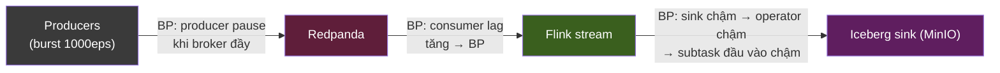
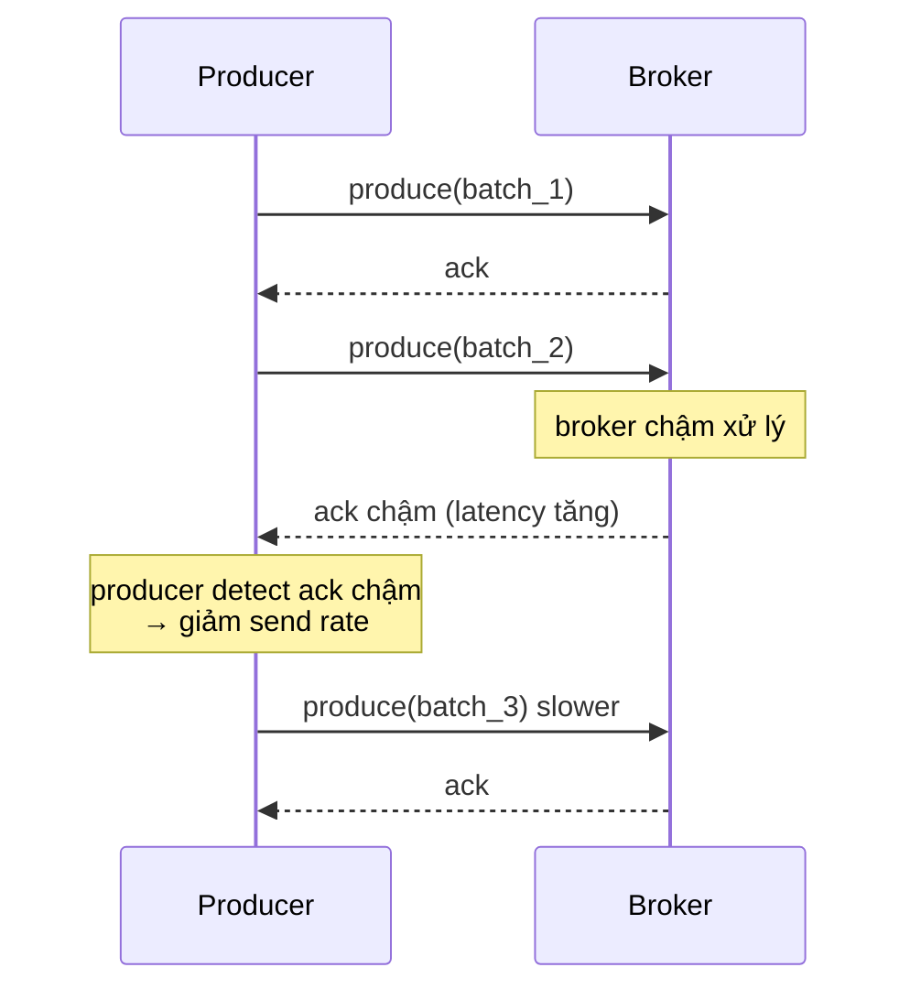

# KU 00/07 — Backpressure: tắc đường ngược

> Khi downstream tắc, upstream phải biết chậm lại — không phải đẩy mạnh hơn. Tư duy này quyết định pipeline sống hay chết khi burst traffic.

**Module:** [00 — Mental Models](./README.md)
**Đọc trong:** ~10 phút

---

## 🎯 Nó là gì?

Hãy tưởng tượng **đại lộ → ngõ nhỏ**.

- Đại lộ 4 làn (upstream nhanh).
- Ngõ nhỏ 1 làn (downstream chậm).
- Không có **biển báo + tín hiệu lùi**: xe trên đại lộ vẫn lao tới → kẹt cứng ở ngã ba → tắc lan ngược lên đại lộ → 3km kẹt cứng.
- Có **biển báo + tín hiệu lùi**: xe trên đại lộ giảm tốc khi thấy đèn vàng → ngõ tiếp nhận đều → không kẹt.

Cái "tín hiệu lùi" = **backpressure**: downstream nói "tôi đang chậm, anh chậm lại đi".

> *Định nghĩa hàn lâm:* Backpressure là cơ chế cho phép một component **chậm hơn** trong pipeline ép component **nhanh hơn** giảm rate, thay vì để buffer phình hoặc drop dữ liệu.

---

## 💡 Nó làm được gì?

Backpressure cho phép:

- **Pipeline tự điều chỉnh** khi 1 stage chậm.
- **Không OOM** (out-of-memory) vì buffer phình vô hạn.
- **Không drop event** (= không mất data).
- **Phát hiện bottleneck** — stage có backpressure cao = stage chậm nhất.
- **Burst absorption** — sống sót qua spike traffic.

---

## 🧩 Nó là mảnh ghép nào trong tổng thể?

Backpressure tồn tại ở **mọi tầng** trong project này:

→ Mỗi mũi tên ẩn 1 cơ chế backpressure. Pipeline **sống được khi burst** chỉ khi MỌI mũi tên đều backpressure đúng.

---

## 🚀 Nó giúp ích gì?

**Không** backpressure (= push-only):
- Burst 1000 eps → broker đầy → producer ack timeout → **producer dồn buffer cục bộ** → OOM hoặc drop.
- Flink: 1 sink chậm → các operator trước tắc → state phình → checkpoint chậm → cascade.
- Kết quả: **mất event hoặc crash**.

**Có** backpressure:
- Burst → broker chậm ack → producer tự điều chỉnh rate (built-in `acks=all` đã ép backpressure).
- Flink: sink chậm → subtask vẫn buffer record nhỏ → operator phía trước giảm pull → tự nhiên giảm rate.
- Kết quả: lag tạm tăng, hết burst tự drain — **không mất event**.

---

## ⏰ Khi nào dùng / KHÔNG dùng?

Không có "không dùng" — backpressure là **default behavior nên có**.

| Quyết định | Khi nào |
|---|---|
| Backpressure mặc định | Hầu hết stream pipeline |
| Có drop khi quá tải (lossy) | Logging / metrics — chấp nhận mất 1% |
| Hard limit + ack timeout | Khi end-to-end latency là cứng (trading, voice) |

---

## 🤔 Vì sao chọn nó (vs alternatives)?

3 chiến lược xử lý quá tải:

| Chiến lược | Cách hoạt động | Khi dùng |
|---|---|---|
| **Backpressure** (cái này) | Upstream chậm theo downstream | Pipeline data, ETL, streaming |
| **Drop** (load shedding) | Bỏ event khi quá tải | Logs, metrics non-critical |
| **Buffer infinite** | Lưu hết, queue dài tuỳ thích | … chưa khi nào ổn (OOM rủi ro) |
| **Spill to disk** | Buffer xuống đĩa khi RAM đầy | Khi cần absorb burst dài, chấp nhận đắt I/O |

→ Backpressure + spill-to-disk thường là combo realistic.

---

## 🔧 Nó vận hành ra sao?

### Trong Kafka producer

Producer dùng `max.in.flight.requests.per.connection` + `linger.ms` + `batch.size` để tự throttle. Khi `acks=all` và `enable.idempotence=true`, behavior này là **default**.

### Trong Flink
Mỗi operator có **input buffer**. Khi buffer đầy → backpressure signal lan ngược.

Đỏ → vàng → xanh: sink đỏ (slow), aggregate vàng (BP cao), map xanh (BP nhẹ), source bị throttle.

Metric: `flink_taskmanager_job_task_operator_backpressure_ratio` ∈ [0, 1].
- 0.0 = không BP
- 0.5 = nửa thời gian bị block do BP
- 1.0 = hoàn toàn block

→ **Dashboard Grafana** show backpressure ratio per operator giúp bạn tìm stage chậm nhất.

---

## 🧠 Self-test

1. Khi đại lộ chuyển vào ngõ nhỏ và **không** có "tín hiệu lùi" — chuyện gì xảy ra? Liên hệ với Kafka producer không có ack.
2. Backpressure ratio = 0.8 ở 1 operator nghĩa là gì? Operator nào là bottleneck thật sự — operator có BP cao hay BP thấp?
3. Khi nào "drop event" tốt hơn backpressure? Cho 1 ví dụ.
4. Producer Kafka tự backpressure bằng cách nào dù không có flag rõ ràng? (Gợi ý: `acks=all`).
5. Trong project này, alert nào liên quan đến backpressure? (Tip: xem alerts.yml).

---

## 🔗 Trong repo này

- Metric backpressure ratio trong Flink dashboard: [`observability/grafana/dashboards/flink.json`](../../observability/) (Phase 9)
- Burst benchmark test backpressure: [`docs/18-benchmark-strategy.md`](../../docs/18-benchmark-strategy.md) — scenario B2
- Chaos burst → producer phải sống sót: [`producers/`](../../producers/)
- ADR-0003 Flink chọn 1 phần vì backpressure visibility: [`adr/0003-flink-over-spark-streaming.md`](../../adr/0003-flink-over-spark-streaming.md)

---

## 📖 Đọc thêm (chính thống, hạn chế)

- Reactive Streams Specification — bài gốc của khái niệm "non-blocking backpressure".
- Tyler Akidau — "Streaming 101" / "Streaming 102" (O'Reilly) — phần backpressure trong streaming systems.
