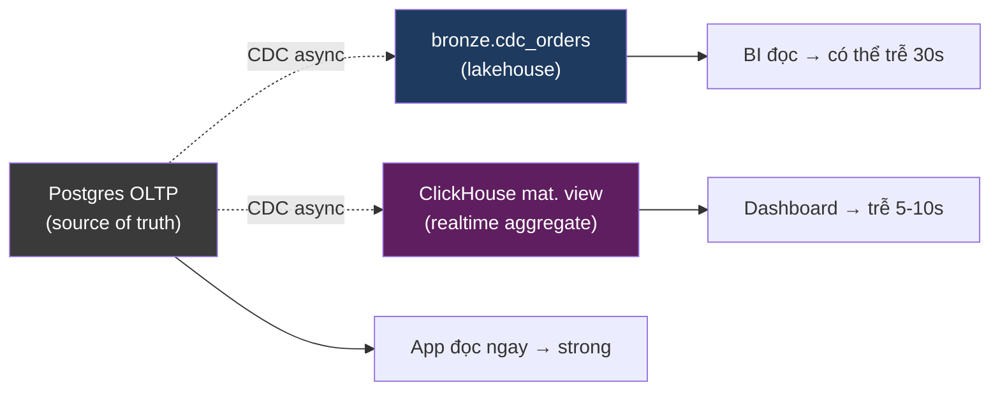
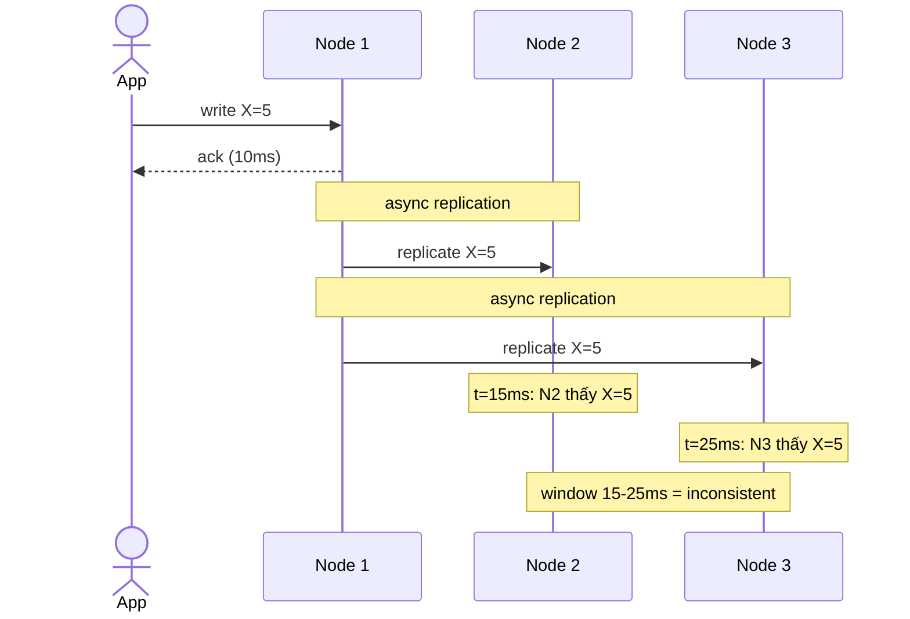

# KU 00/08 — Eventual consistency: thư rủ về quê

> Trong hệ distributed, "ngay lập tức" là ảo. Mọi thứ **nhất quán dần dần**. Hiểu eventual consistency = hiểu được vì sao Kafka, lakehouse, replica không bao giờ "real-time tuyệt đối".

**Module:** [00 — Mental Models](./README.md)
**Đọc trong:** ~10 phút

---

## 🎯 Nó là gì?

Bạn gửi thư về quê cho **3 người họ hàng** ở 3 tỉnh khác nhau, qua đường bưu điện.

- Mỗi thư mất 1-3 ngày tuỳ tỉnh.
- Sau 1 ngày: anh trai ở Hà Nội đã nhận, chú ở Cà Mau chưa.
- Sau 3 ngày: **tất cả nhận**.

Giai đoạn ngày 1-2: thông tin **không nhất quán** giữa 3 người. Ngày 3: nhất quán hoàn toàn.

Đó là **eventual consistency**: hệ thống đảm bảo **cuối cùng** mọi replica sẽ giống nhau, không đảm bảo **ngay lập tức**.

> *Định nghĩa hàn lâm:* Eventual consistency là mô hình nhất quán nơi: nếu không có write mới, sau một khoảng thời gian hữu hạn, mọi replica sẽ hội tụ về cùng một state.

---

## 💡 Nó làm được gì?

Chấp nhận eventual consistency cho phép:

- **Hệ thống vẫn chạy khi 1 replica chết.** Strong consistency cần đồng thuận → chết replica = đứng máy.
- **Latency thấp**, nhất là cross-region.
- **Scale ngang dễ dàng** — nhiều replica đọc song song.
- **Đối tác chậm không kéo đối tác nhanh**. Anh Hà Nội đọc thư xong rồi, anh Cà Mau từ từ.

---

## 🧩 Nó là mảnh ghép nào trong tổng thể?

Eventual consistency hiện diện ở **mọi nơi** có replica / asynchronous flow:

→ **OLTP** là source of truth (strong consistency cục bộ). **Lakehouse + ClickHouse** là replica downstream → **eventual** so với OLTP.

---

## 🚀 Nó giúp ích gì?

**Nếu** ép strong consistency end-to-end:
- Mỗi write OLTP phải đợi xác nhận từ MinIO + ClickHouse trước khi ack → latency 100ms thành 5s.
- 1 component chết → cả pipeline đứng.
- Không scale ra > 1 region được.

**Chấp nhận eventual:**
- Write OLTP ack 10ms.
- Lakehouse lag trung bình 30s.
- ClickHouse lag trung bình 5s.
- Dashboard lag 5-10s (cộng dồn).
- Tất cả vẫn chạy khi 1 replica chậm.

→ Trade-off rõ: **strong** = đắt + dễ sụp. **Eventual** = rẻ + bền + nhưng "lag".

---

## ⏰ Khi nào dùng / KHÔNG dùng?

| ✅ Eventual phù hợp khi | ❌ Cần strong consistency khi |
|---|---|
| Dashboard, analytics, BI | Số dư ngân hàng (trừ tiền) |
| Recommendations, search | Booking ghế máy bay |
| Lakehouse, data warehouse | Inventory bán hàng (oversell) |
| CDN, replicated cache | Authentication / authorization |
| Notifications, emails | Distributed lock |

Trong project này:
- OLTP `orders` write → cần strong consistency tại OLTP.
- Sau CDC → mọi downstream eventual OK.
- `inventory_availability` ở ClickHouse → eventual (chấp nhận 5s drift) — KHÔNG dùng để chặn bán (oversell risk).

---

## 🤔 Vì sao chọn nó (vs alternatives)?

Có 5 mức consistency phổ biến (từ mạnh → yếu):

| Mức | Đảm bảo | Chi phí |
|---|---|---|
| **Linearizable** (strong nhất) | Mọi đọc thấy write mới nhất, global order | Đắt + cần đồng thuận |
| **Sequential** | Có order toàn cục nhưng có thể delay | Đắt vừa |
| **Causal** | Cause-effect được giữ | Vừa phải |
| **Eventual** (cái này) | Cuối cùng hội tụ | Rẻ |
| **Read-your-writes** (subset) | Bạn đọc thấy write của bạn ngay | Vừa, làm trick session |

→ Eventual + "read-your-writes" cho session của bạn = compromise phổ biến.

---

## 🔧 Nó vận hành ra sao?

### Cơ chế "gossip" / replication

Mỗi node nhận write → propagate sang node khác async.

Trong **window 15-25ms**, nếu app đọc từ N3 sẽ thấy X cũ. Sau 25ms → đồng nhất.

### Trong project này

- Postgres OLTP write → ack ngay.
- WAL → Debezium → Kafka (~50-500ms lag).
- Flink → bronze (~1-5s).
- Dagster → silver/gold (~1h batch).
- ClickHouse mat. view → realtime (~5-30s lag).

→ "Dashboard funnel realtime" thực ra là **eventual với lag ~5-30s** — không phải "real-time tuyệt đối".

### Conflict resolution

Khi 2 replica nhận write khác nhau cho cùng key, cần resolve:

- **Last-Write-Wins (LWW):** dựa timestamp.
- **Vector clock:** giữ thứ tự nhân quả.
- **CRDT (Conflict-free Replicated Data Type):** merge tự động (Redis Cluster, Riak).

Trong project này phần lớn append-only → **không có conflict** cần resolve. Compacted topics dùng key-based "latest wins".

---

## 🧠 Self-test

1. Thư về quê: ngày 1-2 thông tin "không nhất quán", ngày 3 nhất quán. Đây là eventual consistency. Bạn có thể chỉ ra một use case kỹ thuật tương ứng?
2. Vì sao ngân hàng KHÔNG được dùng eventual cho số dư mà PHẢI dùng strong / linearizable?
3. Trong project này, `inventory_availability` ở ClickHouse có lag 5-30s. Tại sao **không** được dùng nó để chặn người bán hàng "đặt khi chưa biết hết hàng"?
4. CDC từ Postgres → Kafka có lag ~500ms. Đó là eventual hay strong?
5. Nếu sếp hỏi "dashboard realtime không?" — câu trả lời chính xác hơn là gì? (Gợi ý: không có "real-time" tuyệt đối ngoài cùng máy).

---

## 🔗 Trong repo này

- Lag end-to-end ~5-60s là eventual: [`docs/12-observability-slo.md`](../../docs/12-observability-slo.md) (freshness SLO)
- ClickHouse mat. view = eventual replica: [`docs/11-serving-layer.md`](../../docs/11-serving-layer.md)
- Reconciliation job đối chiếu stream vs batch: [`docs/10-batch-orchestration.md`](../../docs/10-batch-orchestration.md) — đây là cách "đo eventual gap"

---

## 📖 Đọc thêm (chính thống, hạn chế)

- Werner Vogels — "Eventually Consistent" (CACM, 2009) — bài gốc của khái niệm trong Amazon.
- Martin Kleppmann — DDIA ch. 5 "Replication" — chi tiết về strong vs eventual.
