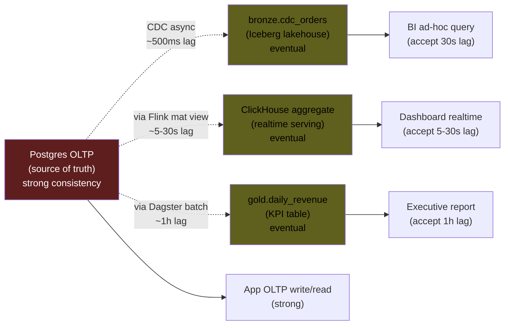
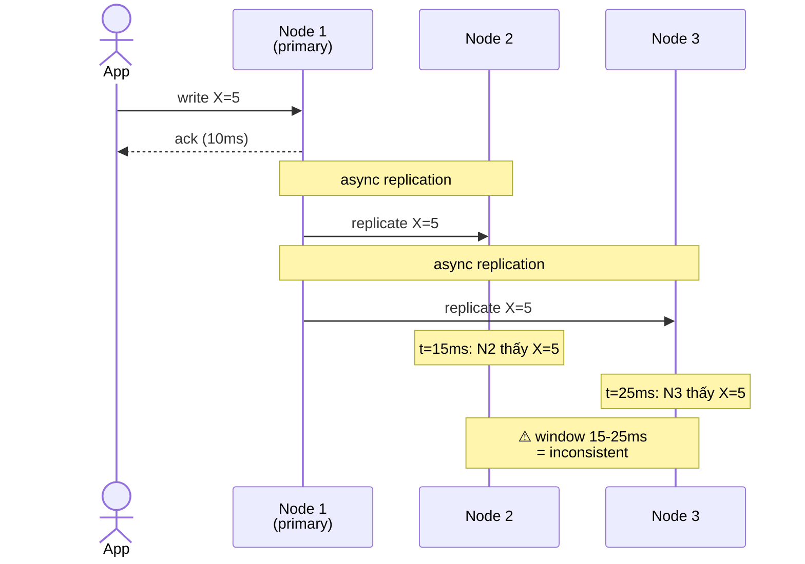
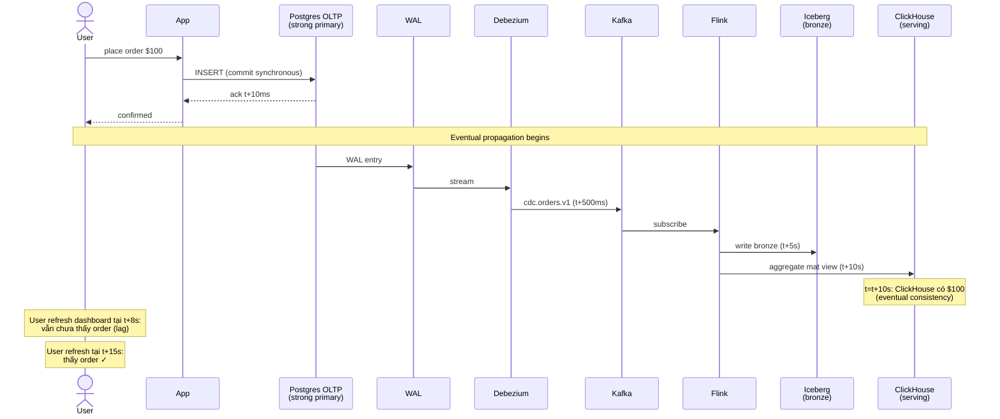
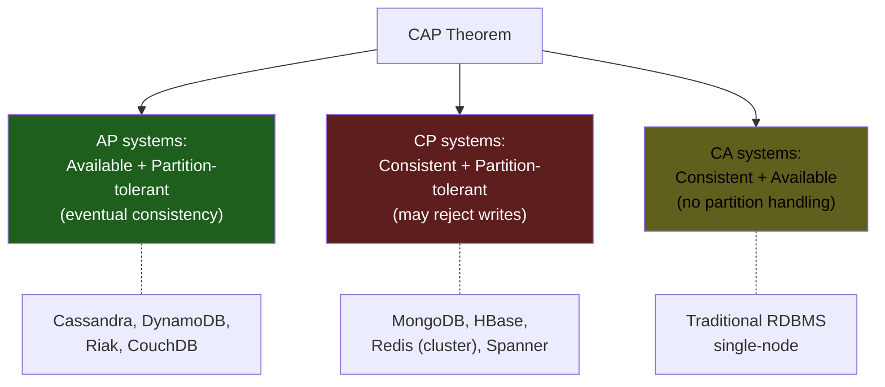

# KU F00 / 08 — Eventual consistency: nhất quán dần dần

> Trong distributed systems, "ngay lập tức" là **ảo**. Mọi thứ **nhất quán dần dần**. Hiểu eventual consistency = hiểu được vì sao Kafka, lakehouse, replica không bao giờ "real-time tuyệt đối", và **đó là tính năng, không phải bug**.

**Module:** [F00 — Mental Models](./README.md)
**Prereqs:** [F00/04 State+Change+Time](./04-state-change-time.md) · [F00/06 Idempotency](./06-idempotency.md)
**Related KUs:** [F00/05 Failure as feature](./05-failure-as-feature.md) · [F00/07 Backpressure](./07-backpressure.md) · [F11/03 CAP theorem](../11-distributed-systems-theory/) · [F11/05 Consistency models](../11-distributed-systems-theory/) · [F11/06 CRDT](../11-distributed-systems-theory/)
**Đọc trong:** ~12 phút
**Mức độ:** Foundational

---

## 🎯 Nó là gì? (Analogy đời sống)

Bạn gửi **thư về quê** cho 3 người họ hàng ở 3 tỉnh khác nhau, qua đường bưu điện thông thường.

- Bạn ở Sài Gòn gửi cùng nội dung cho:
  - **Anh trai ở Hà Nội** — thư đến sau 1 ngày
  - **Cô ở Đà Nẵng** — thư đến sau 2 ngày
  - **Chú ở Cà Mau** — thư đến sau 3 ngày

Giai đoạn ngày 1-2:
- Anh đã biết tin.
- Cô đang nhận thư.
- Chú chưa biết gì.
- → **3 người có 3 góc nhìn khác nhau** về "thông tin hiện tại của gia đình".

Ngày 3:
- Tất cả nhận → **nhất quán hoàn toàn** ✓

Đó là **eventual consistency**: hệ thống đảm bảo **cuối cùng** mọi replica sẽ giống nhau, không đảm bảo **ngay lập tức**.

Trong tech, bưu điện = network. Người họ hàng = database replicas. Lag thư = replication delay. Đây là **bản chất của distributed systems**.

---

## 📖 Định nghĩa chính thức

**Eventual consistency** là mô hình nhất quán (consistency model) trong distributed systems nơi:

> *"If no new updates are made to a given data item, eventually all accesses to that item will return the last updated value."*

Tức là: **nếu không có write mới**, sau một khoảng thời gian hữu hạn, **mọi replica sẽ hội tụ** về cùng một state.

**Khác biệt với strong consistency:**

| Strong consistency | Eventual consistency |
|---|---|
| Mọi read thấy write mới nhất ngay | Read có thể thấy state cũ tạm thời |
| Đắt (cần consensus, lock) | Rẻ (replicate async) |
| Latency cao | Latency thấp |
| Khó scale | Dễ scale ngang |
| Phù hợp: balance ngân hàng | Phù hợp: feed mạng xã hội, cache |

**Đây là 1 mức trong spectrum 5 consistency models** (sẽ học sâu hơn ở [F11/05](../11-distributed-systems-theory/)):

1. **Linearizable** (strongest) — như chỉ có 1 copy duy nhất
2. **Sequential** — global order tồn tại nhưng có lag
3. **Causal** — cause-effect được giữ
4. **Eventual** (cái này) — cuối cùng hội tụ
5. **Weak** — không đảm bảo gì

**Nguồn:**
- Werner Vogels (Amazon CTO), *"Eventually Consistent"* (CACM 2009) — bài gốc khái niệm trong context Amazon.
- Martin Kleppmann, *DDIA* Chapter 5 "Replication" + Chapter 9 "Consistency and Consensus" — chi tiết về spectrum.
- Brewer's CAP Theorem (2000) — context của eventual consistency.

---

## 🔤 Terminology box

| Thuật ngữ | Tiếng Anh | Giải thích 1 câu |
|---|---|---|
| Nhất quán dần dần | Eventual consistency | Cuối cùng mọi replica sẽ hội tụ |
| Nhất quán mạnh | Strong consistency | Mọi read thấy write mới ngay |
| Nhất quán tuyến tính | Linearizable | Hành xử như chỉ có 1 copy |
| Nhất quán nhân quả | Causal consistency | Cause-effect được giữ |
| CAP theorem | CAP theorem | Consistency, Availability, Partition tolerance — chọn 2 |
| PACELC theorem | PACELC theorem | Extension của CAP với normal case |
| Replication | Replication | Sao chép data sang nhiều node |
| Replication lag | Replication lag | Khoảng cách giữa primary và replica |
| Sync replication | Sync replication | Đợi replica ack trước khi commit |
| Async replication | Async replication | Không đợi replica ack |
| Read-your-writes | Read-your-writes | Session-level: thấy write của bạn ngay |
| Monotonic read | Monotonic read | Không bao giờ thấy state cũ hơn lần trước |
| Quorum | Quorum | Đa số replicas cần đồng ý |
| W/R/N | W/R/N | Write quorum / Read quorum / Total replicas |
| Conflict | Conflict | 2 writes cùng key, không có order rõ |
| Last-Write-Wins (LWW) | Last-Write-Wins | Resolve conflict theo timestamp |
| Vector clock | Vector clock | Track causality cho conflict detection |
| CRDT | Conflict-free Replicated Data Type | Data structure tự merge không conflict |
| Convergence | Convergence | Replicas hội tụ về same state |
| Anti-entropy | Anti-entropy | Background sync giữa replicas |

---

## 💡 Nó làm được gì?

Chấp nhận eventual consistency cho phép:

- **Hệ thống vẫn chạy khi 1 replica chết.** Strong cần consensus → chết replica = đứng máy.
- **Latency thấp**, nhất là cross-region.
- **Scale ngang dễ dàng** — nhiều replica đọc song song.
- **Đối tác chậm không kéo đối tác nhanh**. Anh Hà Nội đọc thư xong rồi, anh Cà Mau từ từ.
- **Cost rẻ.** Strong consistency = đắt + complex.
- **Geographic distribution.** Đặt node ở Singapore + US → giảm latency local user.

---

## 🧩 Nó là mảnh ghép nào trong tổng thể?

Eventual consistency hiện diện ở **mọi nơi** có replica / asynchronous flow trong project DSX Air:



→ **Source of truth** = OLTP Postgres (strong). **Replicas downstream** đều eventual với lag khác nhau.

→ Architecture pattern: **strong at source + eventual at derived data**. Modern lakehouse standard.

---

## 🚀 Nó giúp ích gì?

### Nếu ép strong consistency end-to-end

- Mỗi write OLTP phải đợi xác nhận từ MinIO + ClickHouse + Iceberg + Redis trước khi ack → latency 10ms thành 5s.
- 1 component chết → cả pipeline đứng.
- Không scale ra > 1 region được (cross-region 100ms latency).
- Cost ↑↑ vì consensus protocol.

### Chấp nhận eventual

- Write OLTP ack 10ms (only strong at OLTP).
- Lakehouse lag trung bình 30s.
- ClickHouse lag trung bình 5s.
- Dashboard lag 5-10s (cộng dồn).
- Tất cả vẫn chạy khi 1 replica chậm.
- Easy scale, cheap.

→ Trade-off rõ: **strong** = đắt + dễ sụp. **Eventual** = rẻ + bền + nhưng "lag".

### Quote từ Werner Vogels (Amazon)

> *"Eventually consistent systems will return the new value to read operations, but only after some time. We call this period the 'inconsistency window'."*
>
> — Vogels, CACM 2009

→ **Quan trọng:** quantify inconsistency window. Không phải "lag" mơ hồ. Đo cụ thể: p50, p95, p99 lag.

### Trong DSX Air

[`docs/12-observability-slo.md`](../../docs/12-observability-slo.md) explicit về freshness SLO:

| Layer | Freshness SLO |
|---|---|
| Realtime funnel (ClickHouse) | < 60s p95 |
| Lakehouse bronze (Iceberg) | < 5 min p95 |
| Lakehouse gold (daily) | < 25h p95 |

→ Eventual consistency có **bounded lag**. Không phải "có thể trễ vô hạn".

---

## ⏰ Khi nào dùng / KHÔNG dùng?

| ✅ Eventual phù hợp khi | ❌ Cần strong consistency khi |
|---|---|
| Dashboard, analytics, BI | Số dư ngân hàng (trừ tiền) |
| Recommendations, search | Booking ghế máy bay (oversell) |
| Lakehouse, data warehouse | Inventory bán hàng (oversell) |
| CDN, replicated cache | Authentication / authorization |
| Notifications, emails | Distributed lock |
| Social feed | Financial transactions |
| ML feature store offline | Online order/payment validation |
| Logs aggregation | Audit log critical compliance |

### Trong project DSX Air

| Dataset | Consistency | Reason |
|---|---|---|
| `orders` Postgres OLTP | Strong | Source of truth, no oversell |
| `payment_authorization` Postgres | Strong | Financial transaction |
| `bronze.cdc_orders` Iceberg | Eventual (~500ms) | Replica, accept lag |
| `gold.daily_revenue` Iceberg | Eventual (~1h) | Aggregated, daily refresh OK |
| `realtime_funnel` ClickHouse | Eventual (~30s) | Dashboard tolerance |
| `risk:{customer_id}` Redis cache | Eventual (TTL 60s) | Hot path, cache miss → query primary |
| `inventory_availability` ClickHouse | Eventual (~5-30s) | ⚠️ **KHÔNG** dùng để chặn bán (oversell risk) |

→ **Last row important:** dashboard "inventory available" có lag → **không phải truth**. Order placement phải hit OLTP Postgres (strong).

---

## 🤔 Trade-off vs alternatives

5 mức consistency phổ biến (từ mạnh → yếu):

| Mức | Đảm bảo | Chi phí | Use case |
|---|---|---|---|
| **Linearizable** (mạnh nhất) | Mọi đọc thấy write mới nhất, global order | Đắt + cần consensus | Distributed lock, leader election |
| **Sequential** | Có order toàn cục nhưng có delay | Đắt vừa | Multi-DC banking |
| **Causal** | Cause-effect được giữ | Vừa phải | Collaborative editing |
| **Eventual** (cái này) | Cuối cùng hội tụ | Rẻ | Lakehouse, dashboard, cache |
| **Read-your-writes** (subset) | Bạn đọc thấy write của bạn ngay | Vừa, làm trick session | Profile edit UX |

→ **Eventual + "read-your-writes" cho session** = compromise phổ biến. User feels "instant" cho write của họ, hệ thống vẫn eventual underneath.

---

## 🔧 Nó vận hành ra sao? (Logic walkthrough)

### Cơ chế replication

Mỗi node nhận write → propagate sang node khác async:



Trong **window 15-25ms**:
- Read từ N1 → X=5 (new)
- Read từ N2 → X=5 (new sau 15ms)
- Read từ N3 → X=4 (old until 25ms)

Sau 25ms → đồng nhất X=5 ở tất cả.

### Trong project DSX Air



→ **Window inconsistency 5-30 giây** giữa lúc order commit OLTP và xuất hiện dashboard. **Documented + acceptable.**

### Conflict resolution

Khi 2 replicas nhận write khác nhau cho cùng key (multi-master setup), cần resolve:

**Last-Write-Wins (LWW):** dựa timestamp.

```
Replica A: write key=K, value=5, t=100
Replica B: write key=K, value=7, t=103

Resolve: B wins (later timestamp)
```

Risk: clock skew → wrong winner.

**Vector clock:** track causality.

```
Replica A: (A:1, B:0)
Replica B: (A:0, B:1)
→ concurrent writes (neither dominates) → manual resolution
```

**CRDT (Conflict-free Replicated Data Type):** merge tự động.

```
G-Counter: each replica increments own counter.
Merge = sum of all counters.
Always converges, never conflict.
```

→ Trong project DSX Air phần lớn append-only → **không có conflict cần resolve**. Compacted topics dùng key-based "latest wins". Sẽ học sâu hơn ở [F11/06 CRDT](../11-distributed-systems-theory/).

### Quorum-based eventual

W/R/N pattern (DynamoDB, Cassandra):

```
N = total replicas (e.g., 3)
W = write quorum (e.g., 2 — wait for 2 acks before commit)
R = read quorum (e.g., 2 — read from 2 → pick latest)

Strong if: W + R > N (e.g., 2+2 > 3) ✓
Eventual if: W + R ≤ N
```

→ Tunable consistency. Default N=3, W=R=2 → strong. Can relax to W=1, R=1 → eventual + fast.

---

## 🧪 Worked example

**Tình huống thực:** team Frontend thấy dashboard "fraud alerts" có lag 30s so với OLTP. PM hỏi "fix về 0s được không?".

### Bước 1 — Phân tích current eventual chain

```
OLTP Postgres (fraud_signals table)
  ↓ Debezium CDC (~500ms)
Kafka topic fraud.risk_signal.v1
  ↓ Flink risk_job (~5-10s)
ClickHouse aggregate
  ↓ FastAPI cache 30s TTL
Dashboard
```

Total lag = ~15-40s.

### Bước 2 — Explain trade-off cho PM

> "PM, để 'fix về 0s' = strong consistency end-to-end. Cost:
>
> 1. Mỗi OLTP write phải đợi ClickHouse + Redis ack → write latency tăng 10x.
> 2. Khi ClickHouse chết → OLTP cũng dừng accept write → fraud detection sập.
> 3. Cost compute ↑ vì sync replication overhead.
>
> Alternative: giảm lag từ 30s → 5s bằng cách:
> - Disable FastAPI cache 30s → query trực tiếp ClickHouse (lag ~5s)
> - Tune Flink checkpoint interval 60s → 5s (more CPU)
> - Total: lag ~5-10s
>
> Acceptable cho fraud detection?"

### Bước 3 — Quantify "good enough"

PM:
> "Fraud team OK với 10s. Strong consistency overkill."

### Bước 4 — Document SLO

Update [`docs/12-observability-slo.md`](../../docs/12-observability-slo.md):

```yaml
slo:
  fraud_alert_freshness:
    target: 10s  # p95
    measurement: time from OLTP commit → ClickHouse query result
    monitor: pipeline_event_lag_seconds{topic="fraud.risk_signal.v1"}
```

### Bước 5 — Implement

- Remove FastAPI 30s cache for fraud endpoint
- Tune Flink checkpoint 5s
- Add Grafana panel monitoring lag p95
- Alert if lag > 15s for 2 min

### Bước 6 — Verify

After 1 week monitoring:
- p50 lag: 4s
- p95 lag: 8s ✓
- p99 lag: 12s (acceptable)

→ Eventual consistency với **bounded lag SLO** = production-grade. Không cần strong.

### Bài học từ worked example

- **PM thường ask "0s lag"** vì không biết trade-off — explain rõ.
- **Quantify acceptable lag** (SLO) thay vì "as low as possible".
- **Monitor lag** explicit như metric chính.
- **Strong consistency = nuclear option** — chỉ khi business yêu cầu (financial).

---

## ⚠️ Common pitfalls

### Pitfall 1 — Dùng eventual cho financial

❌ **Sai:** "Số dư trong Redis cache. Read từ đó. Faster."

✅ **Đúng:** Số dư = strong. Read từ Postgres primary. Cache cho **non-critical** metric.

### Pitfall 2 — "Real-time" misnomer

❌ **Sai:** Sếp gọi dashboard là "real-time". Ngầm assume strong.

✅ **Đúng:** Educate: "real-time" thực ra là eventual với lag ~10-60s. Document SLO.

### Pitfall 3 — Inventory dashboard cho oversell prevention

❌ **Sai:** App dùng `inventory_availability` ClickHouse (eventual) để decide "có đủ hàng bán không?"

✅ **Đúng:** Decision logic phải hit OLTP Postgres `inventory` table với atomic decrement. Dashboard chỉ visibility, không truth.

### Pitfall 4 — Không monitor lag

❌ **Sai:** Set up replication, không monitor lag. 6 tháng sau lag explode → users complain.

✅ **Đúng:** Lag = first-class metric. Alert khi vượt SLO.

### Pitfall 5 — Confusion eventual vs availability

❌ **Sai:** Tin "eventual = always available". Thực tế: eventual is *consistency* model, availability là property khác (CAP).

✅ **Đúng:** Distinguish consistency model vs availability. Có thể eventual + low availability (slow replication when network slow).

### Pitfall 6 — Last-Write-Wins (LWW) với clock skew

❌ **Sai:** Multi-master LWW. Server clock skew 5s. Write từ "slow clock" lost despite being newer logically.

✅ **Đúng:** Hoặc dùng vector clocks, hoặc designate single primary, hoặc dùng CRDT.

---

## 🌱 Advanced topics

### A1. CAP Theorem (Brewer 2000)

**Consistency + Availability + Partition tolerance — pick 2.**



→ Network partition = not "if" but "when". Real choice = AP vs CP.

→ Sẽ học sâu hơn ở [F11/03 CAP theorem](../11-distributed-systems-theory/).

### A2. PACELC Theorem (Abadi 2010)

CAP chỉ nói về case partition. **PACELC** extends:

```
If Partition (P):
  trade Availability (A) vs Consistency (C)
Else (E, normal case):
  trade Latency (L) vs Consistency (C)
```

→ Real systems trade-off **both** partition case + normal case. PACELC formal hơn.

Examples:
- Cassandra: PA + EL (eventual default, prioritize availability + latency)
- DynamoDB: PA + EL
- MongoDB: PC + EC (consistent default)
- BigTable: PC + EC

### A3. Read-your-writes consistency

Session-level guarantee: nếu **bạn vừa write**, bạn **đọc thấy** write của mình ngay (dù replica khác chưa thấy).

Implementation:
- Stick session to 1 primary node
- Hoặc: track write timestamp per session, read with `read_after_timestamp`

→ User feels "instant" cho own writes. System vẫn eventual underneath.

Trong app: user edit profile → reload thấy ngay. Friends thấy sau vài giây.

### A4. Monotonic read consistency

Guarantee: 1 user không bao giờ thấy state **cũ hơn** lần đọc trước.

Without: user reload → thấy state cũ → confused.

Implementation: stick read sang 1 replica per session.

### A5. CRDTs (Conflict-free Replicated Data Types)

Marc Shapiro et al. 2011. Data structures with math-guaranteed convergence:

| CRDT | Operations | Use case |
|---|---|---|
| **G-Counter** | Increment only | Page view counter |
| **PN-Counter** | Inc/Dec | Like/Dislike counter |
| **OR-Set** | Add/Remove with element ID | Shopping cart |
| **LWW-Register** | Set value with timestamp | Profile field |
| **Sequence/RGA** | Insert at position | Collaborative editing (Google Docs) |

→ **No conflict resolution needed.** Merge function deterministic + commutative + idempotent.

Used in: Redis CRDT, Riak, AntidoteDB, Yjs (CRDT for collaborative apps).

### A6. Vector clocks vs HLC

**Vector clocks:** track causality via vector of counters per node.

```
Node A: (A:3, B:1, C:0)
Node B: (A:2, B:2, C:1)
→ concurrent (neither dominates)
```

**Hybrid Logical Clocks (HLC):** combine wall clock + logical counter. Used in CockroachDB, YugaByte.

→ Better than pure logical (vector clocks grow) + pure physical (clock skew).

### A7. Strong eventual consistency (SEC)

Marc Shapiro: **stronger than eventual, weaker than strong.**

Định nghĩa: nếu 2 nodes nhận cùng set of updates (in any order), they converge to same state.

CRDTs achieve SEC. Useful cho collaborative editing, distributed caches.

### A8. Apply cho LLM/AI 2026

Vector DB replication = eventual. Embedding index updates async.

```
Document indexed in Qdrant primary → replicate to secondary nodes
Lag ~100ms typically, can grow under load
```

→ RAG retrieval might miss recently indexed docs in early window. Quantify + monitor.

LLM caching (Anthropic prompt cache):
- Cache invalidation = eventual
- New prompt version may use cached old prefix briefly
- Designed to accept transient inconsistency for cost benefit

---

## 🔗 Liên kết KU khác

- **[F00/04 State+Change+Time](./04-state-change-time.md)** — eventual = state lag from change
- **[F00/05 Failure as feature](./05-failure-as-feature.md)** — eventual handles partition failure
- **[F00/06 Idempotency](./06-idempotency.md)** — idempotent operation converges
- **[F00/07 Backpressure](./07-backpressure.md)** — replication lag = backpressure signal
- **[F11/03 CAP theorem](../11-distributed-systems-theory/)** — eventual = AP side of CAP
- **[F11/04 PACELC](../11-distributed-systems-theory/)** — formal PACELC
- **[F11/05 Consistency models](../11-distributed-systems-theory/)** — full spectrum 5 mức
- **[F11/06 CRDT](../11-distributed-systems-theory/)** — strong eventual consistency

---

## 🧠 Self-test (3 mức)

### 🟢 Easy

1. Thư về quê: ngày 1-2 thông tin "không nhất quán", ngày 3 nhất quán. Đây là eventual consistency. Cho 1 use case kỹ thuật tương ứng.
2. Vì sao ngân hàng KHÔNG được dùng eventual cho số dư mà PHẢI dùng strong/linearizable?
3. CDC từ Postgres → Kafka có lag ~500ms. Đó là eventual hay strong?

### 🟡 Medium

4. Trong project DSX Air, `inventory_availability` ClickHouse có lag 5-30s. Tại sao **không** được dùng nó để chặn người bán hàng "đặt khi chưa biết hết hàng"?
5. CAP theorem: AP vs CP systems. Cho 2 ví dụ DB mỗi loại + giải thích trade-off.
6. Nếu sếp hỏi "dashboard real-time không?" — câu trả lời chính xác hơn là gì? Cho framework explain.

### 🔴 Hard

7. PACELC theorem extends CAP như thế nào? Tại sao quan trọng hơn CAP cho daily DB choice?
8. CRDT achieves "strong eventual consistency". Giải thích + cho 1 use case (collaborative editing pattern).
9. Trong worked example fraud dashboard 30s lag, tại sao không strong consistency? Tính cost của strong end-to-end (ước lượng).

> **6+/9** = senior signal. **4-5** = đọc Kleppmann ch.5 + 9. **<4** = đọc Vogels 2009 + làm exercise vẽ replication chain DSX Air.

---

## 📌 Trong repo này

Eventual consistency design patterns:

- **End-to-end lag chain** ([`ARCHITECTURE.md` §16](../../ARCHITECTURE.md#16-data-flow-end-to-end)) — explicit lag từng layer
- **SLO freshness target** ([`docs/12-observability-slo.md`](../../docs/12-observability-slo.md)) — bounded lag per dataset
- **CDC design** ([`docs/07-cdc-design.md`](../../docs/07-cdc-design.md)) — async replication
- **ClickHouse mat view** ([`docs/11-serving-layer.md`](../../docs/11-serving-layer.md)) — eventual replica
- **Reconciliation jobs** ([`docs/10-batch-orchestration.md`](../../docs/10-batch-orchestration.md)) — đo eventual gap stream vs batch
- **Limitations doc** ([`docs/99-limitations-and-honesty.md`](../../docs/99-limitations-and-honesty.md)) — explicit về eventual nature

---

## 🌐 Đọc thêm (chính thống, hạn chế — 3 nguồn)

- **Werner Vogels, "Eventually Consistent"** (CACM, 2009) — bài gốc của khái niệm trong context Amazon DynamoDB.
- **Martin Kleppmann, "Designing Data-Intensive Applications" — Chapter 5 (Replication) + Chapter 9 (Consistency and Consensus)** — chi tiết về spectrum 5 mức + CAP/PACELC. [Library: `Kleppmann_2017_Designing-Data-Intensive-Applications.pdf`](../../library/books/distributed-systems/Kleppmann_2017_Designing-Data-Intensive-Applications.pdf)
- **Daniel Abadi, "Consistency Tradeoffs in Modern Distributed Database System Design"** (IEEE Computer, 2012) — PACELC paper gốc.

---

**🎉 Đã đọc xong KU F00/08 — bạn hoàn thành toàn bộ Module F00 ở chuẩn v2 university-grade (12/12 KUs)!**

**Tổng kết Module F00:**
- 12 KU mental models foundational
- ~38,000 từ tổng cộng
- Mỗi KU 16-section + analogy đời sống + worked example DSX Air + 3-level self-test
- Cross-references đến toàn bộ project (ADRs, docs, chaos, runbooks)

**Tiếp theo:**
- ✅ Tick checklist [`progress/checklist.md`](../progress/checklist.md)
- 🧠 Làm [Mini-quiz Module 00](./MINI-QUIZ.md) để verify
- ➡️ Đi sang [Module 01 — Foundations](../01-foundations/) (OS / Network / Distributed Systems)
