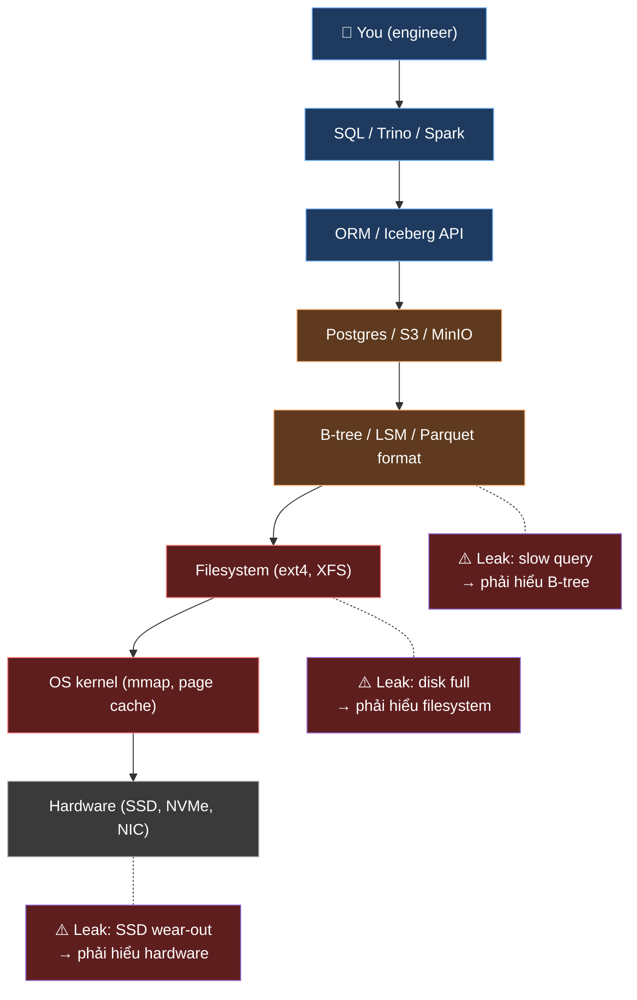
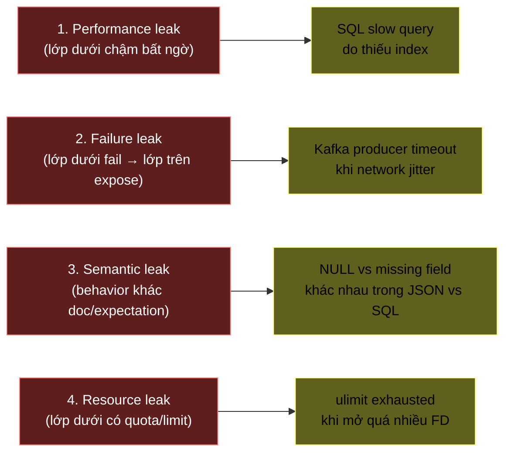
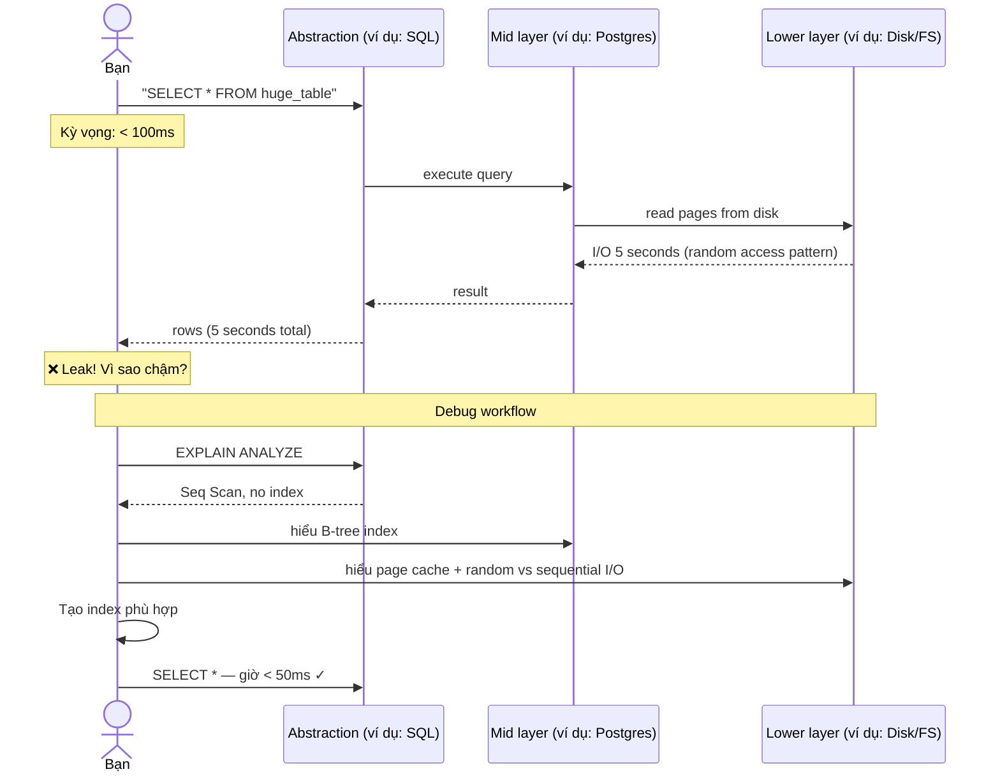
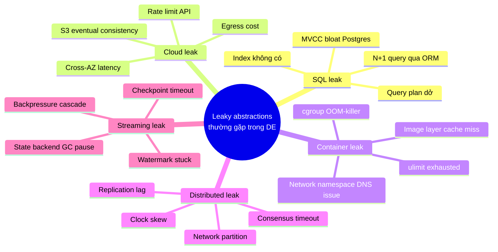

# KU F00 / 09 — Leaky abstractions: trừu tượng không bao giờ kín

> Joel Spolsky's Law: *"All non-trivial abstractions, to some degree, are leaky."* Mỗi lớp che kín giữa bạn và "máy bên dưới" sẽ rỉ — và bạn phải hiểu lớp bên dưới khi nó rỉ. Hiểu được điều này là rào giữa **senior** và **junior**.

**Module:** [F00 — Mental Models](./README.md)
**Prereqs:** [F00/02 Trade-off thinking](./02-trade-off-thinking.md)
**Related KUs:** [F00/04 State+Change+Time](./04-state-change-time.md) · [F00/05 Failure as feature](./05-failure-as-feature.md) · [F11/01 What is distributed?](../11-distributed-systems-theory/)
**Đọc trong:** ~12 phút
**Mức độ:** Foundational

---

## 🎯 Nó là gì? (Analogy đời sống)

Bạn có bản đồ Google Maps trong điện thoại — một **abstraction** (sự trừu tượng) đẹp đẽ về thành phố. Nó che giấu tất cả phức tạp bên dưới: vệ tinh, GPS, server, thuật toán routing, cập nhật real-time…

Bạn lái xe theo bản đồ → 99% bạn không cần biết bên dưới ra sao. **Abstraction kín — và đó là điểm hay.**

Nhưng đột nhiên:

- Bản đồ chỉ "rẽ phải vào hẻm X" — đến nơi thấy **hẻm đang sửa chữa**, bị rào.
- Bản đồ cho ETA 15 phút — thực tế 35 phút vì **kẹt xe đột xuất**.
- Bản đồ chỉ đường **cấm xe máy** vào (luật mới chưa update).
- GPS chỉ định vị bạn ở **giữa Hồ Tây** vì tín hiệu vệ tinh yếu khi mưa.

Lúc này, abstraction "bản đồ" đã **rỉ** — bạn phải nhìn ra **thế giới thực** bên dưới (hẻm thật, kẹt xe thật, luật thật, tín hiệu vệ tinh thật) để xử lý.

Joel Spolsky đặt tên hiện tượng này:

> **"All non-trivial abstractions, to some degree, are leaky."**
> Tất cả abstraction phi-tầm-thường, ít nhiều, đều **rỉ**.

Trong kỹ thuật: mọi lớp công cụ/framework/database/cloud-service che kín cái bên dưới → 99% bạn không cần biết → 1% nó "rỉ" và bạn **buộc phải hiểu lớp bên dưới** mới fix được.

---

## 📖 Định nghĩa chính thức

**Leaky abstraction** = một abstraction (mô hình đơn giản hoá) **không che hoàn toàn** chi tiết bên dưới. Khi behavior, performance, hoặc failure mode của lớp dưới **lộ ra** qua lớp trên, abstraction được gọi là "leaky".

Hậu quả: người dùng abstraction phải **học cả lớp dưới** khi gặp tình huống bất thường — mặc dù lý do tồn tại của abstraction là để **không cần học** lớp dưới.

→ Đó là nghịch lý cốt lõi của abstraction.

**Nguồn:** Joel Spolsky, "The Law of Leaky Abstractions" (2002), blog Joel on Software.

---

## 🔤 Terminology box

| Thuật ngữ | Tiếng Anh | Giải thích 1 câu |
|---|---|---|
| Trừu tượng / Lớp che | Abstraction | Mô hình đơn giản hoá ẩn đi chi tiết bên dưới |
| Lớp dưới | Underlying layer | Tầng kỹ thuật thật bị abstraction ẩn đi |
| Rỉ | Leak | Lớp dưới "lộ" qua lớp trên trong tình huống bất thường |
| Trừu tượng rò rỉ | Leaky abstraction | Abstraction không che hoàn toàn → đôi lúc lộ chi tiết dưới |
| Cú đánh đổi học tập | Learning tax | Khi abstraction rỉ, bạn phải học thêm lớp dưới — chi phí bất ngờ |
| Trừu tượng zero-cost | Zero-cost abstraction | Abstraction không tạo overhead runtime (Rust ưu tiên) |
| Cao tầng / Thấp tầng | High-level / Low-level | Cao tầng = nhiều abstraction (Python/SQL); thấp tầng = ít (C/assembly) |
| ORM | Object-Relational Mapping | Abstraction map class ↔ table — nổi tiếng "rỉ" |
| Đường tắt phá lớp | Escape hatch | Cơ chế cho phép user dùng lớp dưới khi cần (raw SQL trong ORM) |
| Trừu tượng rò rỉ tổng quát | General leakiness | Định luật Joel Spolsky |

---

## 💡 Nó làm được gì?

Hiểu "leaky abstractions" giúp bạn:

- **Không tin abstraction tuyệt đối.** Mọi `SELECT *` trong SQL **có thể chậm** vì index — bạn cần hiểu B-tree/LSM-tree bên dưới (DDIA ch. 3).
- **Đoán được nơi sẽ rỉ.** Network luôn rỉ (timeout, packet loss), filesystem luôn rỉ (latency varies), distributed luôn rỉ (clock skew, partition).
- **Đầu tư đúng kiến thức.** Học SQL không đủ — phải học query plan + index strategy + storage engine. Học Kubernetes không đủ — phải hiểu container + cgroups + network namespace.
- **Tránh "magic" tooling.** Khi review tool mới ai đó pitch — hỏi: "Nó che cái gì? Khi nó rỉ thì lộ ra cái gì?"
- **Debug hiệu quả.** Bug thường nằm ở **chỗ abstraction rỉ**, không phải code business logic.

---

## 🧩 Nó là mảnh ghép nào trong tổng thể?

Mọi tool data-engineering bạn dùng là **một chồng abstraction**:



Mỗi mũi tên `→` là 1 abstraction. Mỗi `⚠️` là 1 chỗ rỉ thường gặp. **Senior** = biết chồng abstraction này + biết rỉ ở đâu. **Junior** = chỉ biết lớp trên cùng, lúng túng khi rỉ.

---

## 🚀 Nó giúp ích gì?

### Trong dự án DSX Air của chúng ta

**Tình huống 1 — Iceberg time-travel chậm bất thường:**

- Abstraction `iceberg.gold.daily_revenue FOR VERSION AS OF 12345` trông đẹp.
- Khi chạy, query mất 30 giây thay vì 0.1 giây.
- **Junior**: hoang mang, Google "iceberg slow".
- **Senior**: biết Iceberg = metadata layer + Parquet files trên S3 → rỉ vì:
  - Manifest list grow lớn (nhiều snapshot)
  - S3 latency cao cho first-byte
  - Predicate pushdown không hoạt động vì partition column sai
- Fix: chạy `expire_snapshots` + tune `read.split.target-size`.

**Tình huống 2 — Flink job restart mất 2 phút:**

- Abstraction `flink run --fromSavepoint s3://...` đơn giản.
- Restart thực tế chậm.
- **Rỉ** = bên dưới Flink phải:
  1. Tải state từ S3 (network bound)
  2. Restore RocksDB từ checkpoint
  3. Re-establish Kafka consumer connection
  4. Re-acquire JobManager leadership
- Phải hiểu để tune đúng (parallel restore, RocksDB block cache, etc.)

**Tình huống 3 — Producer Kafka ack chậm hơn dự kiến:**

- Abstraction `producer.send(record)` 1 dòng code.
- p99 latency 200ms, sếp hỏi sao chậm.
- **Rỉ**: TCP underlying layer — handshake, MTU, congestion control, network jitter từ DSX Air simulated fabric.

→ Senior data engineer **biết trước** những leak này tồn tại, không bị shock.

---

## ⏰ Khi nào dùng / KHÔNG dùng?

Leaky abstractions luôn tồn tại — đây không phải lựa chọn "dùng hay không". Câu hỏi đúng: **chọn abstraction nào** và **đầu tư bao nhiêu** vào hiểu lớp dưới?

| Tình huống | Chiến lược |
|---|---|
| Prototype 1 ngày | Dùng abstraction cao tầng (Pandas, ORM, managed service) — không cần hiểu sâu |
| Production pipeline | Hiểu **ít nhất 1 lớp** dưới abstraction chính bạn dùng |
| Performance-critical | Hiểu **toàn bộ stack** từ tầng cao đến lớp HW |
| On-call data engineer | Hiểu **mọi lớp rỉ thường gặp** + ưu tiên debug từ leak xuống dưới |
| Sếp hỏi vì sao chậm | Hiểu **chính xác** lớp nào đang chậm + giải thích |

---

## 🤔 Trade-off vs alternatives

3 thái độ với abstraction:

| Thái độ | Khi đúng | Khi sai |
|---|---|---|
| **"Trust the abstraction"** (junior thuần) | Prototype, hobby project | Production — bạn sẽ bất lực khi rỉ |
| **"Understand 1 layer below"** (sweet spot senior) | Production work | Có thể chậm hơn 10% so với optimum nếu thiếu hiểu sâu HW |
| **"Understand everything"** (over-investing) | Performance-critical (HFT, GPU compute) | Hầu hết DE work — wasted effort |

Quy tắc Joel-Spolsky-friendly:

> *"You become qualified to work as a high-level abstraction layer programmer only after you have spent some time as a low-level abstraction layer programmer."*
>
> — Joel Spolsky

Senior data engineer = đã từng **chạm tận lớp dưới ít nhất 1 lần**, không phải lúc nào cũng cần lặn xuống, nhưng biết đường khi cần.

---

## 🔧 Nó vận hành ra sao? (Logic walkthrough)

### Anatomy of a leak — 4 nguồn rỉ phổ biến



### Sequence khi bạn gặp leak (workflow debug)



→ Debug = **lội xuống lớp dưới abstraction** đến khi tìm thấy root cause.

### 5 leak nổi tiếng trong data engineering



---

## 🧪 Worked example

**Tình huống thật:** team báo `gold.payment_success_rate` Iceberg table mất 8 giây để query thay vì <1s như dashboards cần. Junior tưởng "Iceberg chậm".

### Bước 1 — Liệt kê abstractions trong chuỗi

```
User dashboard
  → ClickHouse query
  → S3 engine read
  → Iceberg metadata layer
  → Parquet file
  → S3 object storage
  → MinIO (local lab)
  → ext4 filesystem
  → SSD hardware
```

### Bước 2 — Đo từng tầng

| Tầng | Latency đo được |
|---|---:|
| ClickHouse plan + execute | 0.3s |
| Iceberg metadata fetch | **6.2s** ⚠️ |
| Parquet read | 0.8s |
| MinIO + ext4 + SSD | 0.7s |

→ Leak ở **Iceberg metadata layer**.

### Bước 3 — Mở capôt Iceberg

Iceberg metadata = chuỗi snapshot manifest:

```
metadata.json
  ├── snapshot-1 → manifest-list-1.avro → manifest-1.avro → data file paths
  ├── snapshot-2 → manifest-list-2.avro → ...
  ├── snapshot-3
  ├── ...
  └── snapshot-1024
```

Mỗi `expire_snapshots` chưa chạy → 1024 snapshot accumulated.

Mỗi query phải:
1. Đọc `metadata.json` (tìm current snapshot)
2. Đọc manifest list của snapshot đó
3. Đọc tất cả manifest files
4. Lọc data files cần read

Với 1024 snapshot historical, manifest list nặng + nhiều round-trip S3.

### Bước 4 — Fix

Chạy maintenance:

```sql
CALL system.expire_snapshots('gold.payment_success_rate', TIMESTAMP '2026-05-15 00:00:00');
CALL system.rewrite_manifests('gold.payment_success_rate');
```

Sau đó: metadata fetch **0.4s** → tổng query **2.2s** → trong SLA.

### Bước 5 — Bài học

- Iceberg abstraction `SELECT * FROM table FOR VERSION AS OF X` rỉ qua **metadata storage**.
- Senior tự hỏi từ ngày đầu: "Iceberg đẹp, nhưng metadata layer kích thước bao nhiêu sau 1 năm chạy?"
- Đáp án: chạy `expire_snapshots` định kỳ là **maintenance bắt buộc**, không tuỳ chọn.

---

## ⚠️ Common pitfalls

### Pitfall 1 — "Magic" tooling syndrome

❌ **Sai:** Adopt 1 tool vì demo đẹp ("Snowflake handle everything!"), không hiểu nó che cái gì.

✅ **Đúng:** Khi đánh giá tool, hỏi:
- Nó che lớp gì bên dưới?
- Khi nó rỉ, behavior thế nào?
- Có escape hatch không (custom UDF, raw connection, low-level API)?

### Pitfall 2 — "I don't need to know SQL internals"

❌ **Sai:** Lifecycle data engineer dùng SQL/ORM 100% — không cần hiểu B-tree, MVCC, query plan.

✅ **Đúng:** Senior dùng `EXPLAIN ANALYZE` mỗi tuần. Đọc query plan như đọc bản tin thời tiết.

### Pitfall 3 — Tin tưởng SLA của cloud service

❌ **Sai:** "AWS S3 cam kết 99.99% availability, mình không cần retry logic."

✅ **Đúng:** Cloud SLA là **trung bình** — bạn vẫn gặp 1-trong-10000 request fail. Idempotent retry là bắt buộc (xem [KU F00/06 Idempotency](./06-idempotency.md)).

### Pitfall 4 — Over-investing vào lớp dưới

❌ **Sai:** Đầu tư 3 tháng học CPU cache lines, SIMD, mmap internals cho 1 batch ETL hàng giờ.

✅ **Đúng:** Đầu tư hiểu **1-2 lớp dưới abstraction chính**, không phải tất cả lớp đến HW. Sweet spot = "đủ debug, không hơn".

### Pitfall 5 — "ORM giải quyết hết"

❌ **Sai:** Dùng ORM (Django ORM, SQLAlchemy) không biết N+1 query problem, không bao giờ check generated SQL.

✅ **Đúng:** Mỗi ORM phải có lúc bypass — dùng raw SQL cho phần phức tạp. ORM = abstraction tiện, **rỉ ở mọi nơi**.

---

## 🌱 Advanced topics

### A1. Zero-cost abstractions (Rust philosophy)

Rust có khái niệm **zero-cost abstraction** — tức là dùng abstraction **không tạo runtime overhead** so với viết code thấp tầng tương đương. Compile-time monomorphization (generics resolved at compile time) → không có v-table lookup, không có boxing.

→ Đây không phải "không leaky" — vẫn leaky về compile time, error message phức tạp, learning curve cao. Nhưng leak performance đã được loại bỏ.

Áp dụng tinh thần: chọn abstraction càng "trong suốt" càng tốt — nhưng zero-cost completely là rare.

### A2. Layered architecture vs unified abstraction

Có 2 trường phái:

| Trường phái | Ví dụ | Đặc tính |
|---|---|---|
| **Layered** | Linux kernel, TCP/IP stack | Mỗi lớp có abstraction rõ ràng, dễ debug từng tầng, nhưng leak nhiều giữa các lớp |
| **Unified** | Erlang/OTP, Smalltalk image | 1 abstraction lớn, ít leak nhỏ, nhưng debug khó khi rỉ vì không có "lớp dưới" để lặn |

Modern cloud thường layered (AWS, K8s). Modern programming runtime (JVM, .NET) gần unified hơn.

### A3. The "Stratum 0" mindset

Joel Spolsky đề cập "Stratum 0 programmer" — người hiểu **lớp thấp nhất khả thi**. Trong DE 2026:

- **Stratum 0** = SSD characteristics, kernel page cache, network protocol stack
- **Stratum 1** = filesystem, OS scheduler, container runtime
- **Stratum 2** = database storage engine (B-tree, LSM), object storage protocol
- **Stratum 3** = SQL engine, ORM, framework
- **Stratum 4** = business logic, dashboards

Senior thường vững Stratum 2-3, hiểu được Stratum 1 khi cần, biết Stratum 0 tồn tại.

### A4. "Leakiness" như dimensión đánh giá tool

Khi compare tool A vs B, ngoài feature + performance, hỏi:

| Tiêu chí | Tool A | Tool B |
|---|---|---|
| Leak rate (số lần ta phải lặn xuống/tháng) | ? | ? |
| Severity khi leak (recover được tự động hay phải human?) | ? | ? |
| Documentation về lớp dưới khi leak | ? | ? |
| Escape hatch khi leak | ? | ? |

Tool có ít leak + escape hatch tốt = tool senior-friendly.

### A5. AI/LLM abstraction — leak mới của 2025-2026

LLM API (`anthropic.messages.create(...)`) là abstraction cực cao. Nó rỉ qua:

- Context window limit (token counting)
- Latency variance (some prompts 2s, some 60s)
- Hallucination
- Rate limit + retry behavior
- Cache hit/miss (Anthropic prompt caching)
- Tool calling semantics khác provider

→ AI Engineer 2026 = phải hiểu rõ những leak này. Đây là content cho Module D30 LLM Engineering.

---

## 🔗 Liên kết KU khác

- **[F00/02 Trade-off thinking](./02-trade-off-thinking.md)** — chọn abstraction là 1 trade-off (giàu feature vs ít leak)
- **[F00/04 State + Change + Time](./04-state-change-time.md)** — mỗi abstraction là 1 góc nhìn về state/change/time
- **[F00/05 Failure as feature](./05-failure-as-feature.md)** — leak chính là failure mode của abstraction
- **[F00/10 Premature optimization](./10-premature-optimization.md)** — học leak quá sớm cũng là premature
- **[F11/01 What is distributed?](../11-distributed-systems-theory/)** — distributed = source rỉ nhiều nhất
- **[D19/03 Iceberg deep](../D19-lakehouse-deep/)** — Iceberg là abstraction rỉ qua metadata
- **[D26/14 Postmortem culture](../D26-observability-sre/)** — postmortem thường documents 1 leak

---

## 🧠 Self-test (3 mức)

### 🟢 Easy

1. Joel Spolsky's Law nói gì? Trình bày bằng 1 câu của bạn.
2. Cho 1 ví dụ đời sống về leaky abstraction (ngoài Google Maps).
3. Tại sao SQL `SELECT *` được coi là leaky abstraction điển hình?

### 🟡 Medium

4. So sánh 3 thái độ (Trust / Understand 1 layer / Understand everything). Khi nào dùng cái nào trong dự án DSX Air?
5. Trong worked example về Iceberg query chậm, root cause là gì? Senior approach khác junior ra sao?
6. Đưa 2 ví dụ về **failure leak** + 2 ví dụ về **performance leak** từ project DSX Air.

### 🔴 Hard

7. Zero-cost abstraction (Rust) loại bỏ leak loại nào? Còn loại leak nào nó **không** loại bỏ?
8. LLM API là abstraction "rỉ" qua những kênh nào (kể 5 kênh)? Senior AI engineer cần hiểu kênh nào nhất nếu build production RAG?
9. Cho 1 tool/framework bạn dùng hàng ngày. Vẽ chồng abstraction của nó (5 lớp). Đánh dấu lớp nào bạn đã từng debug khi rỉ.

> **6+/9** = hiểu sâu. **4-5** = đọc lại worked example + advanced. **<4** = đọc lại toàn KU + làm GLOSSARY.

---

## 📌 Trong repo này

Leaky abstraction thấm vào dự án DSX Air:

- **Network fabric chaos catalog** ([`chaos/network/`](../../chaos/network/)) — toàn bộ là khai thác **leak của network abstraction** trong DSX Air (VXLAN flap, leaf switch down, ECMP rehash)
- **Budget guard rails** ([`docs/19-cost-budget-guardrails.md`](../../docs/19-cost-budget-guardrails.md)) — DSX Air compute hour billing rỉ qua API, cần proactive monitoring
- **Iceberg time-travel demo** ([`lakehouse/sql/query_examples.sql`](../../lakehouse/sql/query_examples.sql)) — chính là worked example trong KU này
- **Flink checkpoint runbook** ([`runbooks/flink-job-failed.md`](../../runbooks/flink-job-failed.md)) — restart leak qua S3 + RocksDB
- **ADR-0008 Time-multiplex sessions** ([`adr/0008-time-multiplex-sessions.md`](../../adr/0008-time-multiplex-sessions.md)) — DSX Air resource ceiling = leak qua hardware quota

---

## 🌐 Đọc thêm (chính thống, hạn chế — 3 nguồn)

- **Joel Spolsky, "The Law of Leaky Abstractions"** (2002) — [joelonsoftware.com](https://www.joelonsoftware.com/2002/11/11/the-law-of-leaky-abstractions/) — bài gốc khái niệm. Đọc 1 lần để có vocabulary.
- **Martin Kleppmann, "Designing Data-Intensive Applications" — Chapter 1 + Chapter 8** — Reliability section (ch.1) và "The Trouble with Distributed Systems" (ch.8) là 2 chương về leak network/clock/process pauses. [Library: `Kleppmann_2017_Designing-Data-Intensive-Applications.pdf`](../../library/books/distributed-systems/Kleppmann_2017_Designing-Data-Intensive-Applications.pdf)
- **Google SRE Book — Chapter 22 "Addressing Cascading Failures"** — cascading failures là leak xuyên nhiều tầng abstraction. [Library: `Google_2016_Site-Reliability-Engineering.pdf`](../../library/books/sre-observability/Google_2016_Site-Reliability-Engineering.pdf)

---

**Đã đọc xong?**
✅ Tick vào [`progress/checklist.md`](../progress/checklist.md) → đi tiếp [F00/10 Premature optimization](./10-premature-optimization.md).
