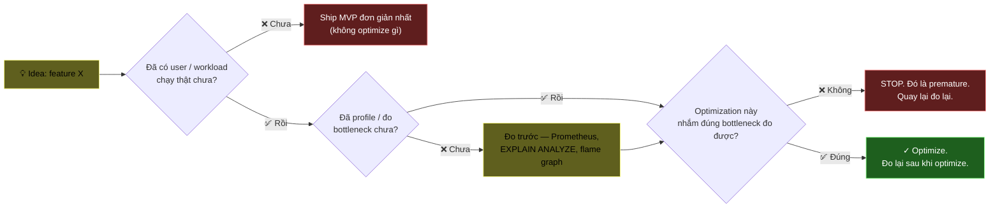
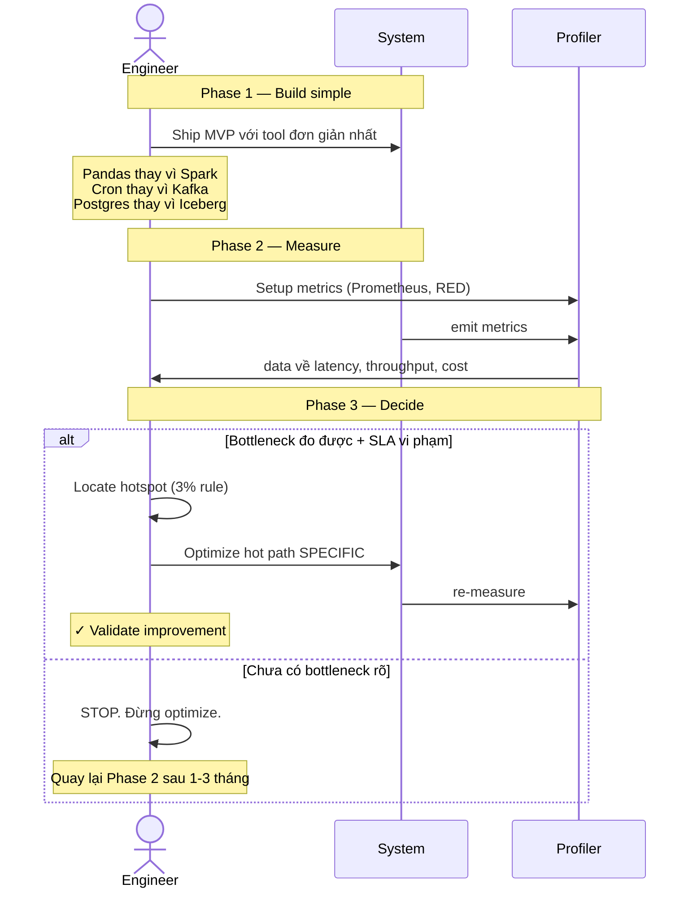

# KU F00 / 10 — Premature optimization: tối ưu sớm = nguồn gốc của cái ác

> Donald Knuth (1974): *"Premature optimization is the root of all evil."* Đầu tư công sức tối ưu thứ chưa biết có phải bottleneck = lãng phí, lock-in, code phức tạp vô lý. Hiểu khi nào "đủ tốt" và khi nào "phải tối ưu" — đây là kỹ năng senior #2 sau trade-off thinking.

**Module:** [F00 — Mental Models](./README.md)
**Prereqs:** [F00/02 Trade-off thinking](./02-trade-off-thinking.md) · [F00/08 Eventual consistency](./08-eventual-consistency.md)
**Related KUs:** [F00/09 Leaky abstractions](./09-leaky-abstractions.md) · [F12 System design fundamentals](../12-system-design-fundamentals/)
**Đọc trong:** ~10 phút
**Mức độ:** Foundational

---

## 🎯 Nó là gì? (Analogy đời sống)

Bạn mở 1 **quán bún bò** ở phố Nguyễn Trãi. Mới khai trương, chưa có khách ổn định, ngày được 20 tô.

**Junior chủ quán:**
- Đầu tư máy thái thịt tự động 50 triệu để "sau này khi 1000 khách/ngày sẽ tiết kiệm thời gian"
- Build app order online 30 triệu vì "Netflix-style scale"
- Thuê 5 nhân viên để "không bị overload khi đông khách"
- 1 tháng sau: vẫn 20 khách/ngày, lỗ 100 triệu vì over-investing.

**Senior chủ quán:**
- Chỉ thuê 1 phụ bếp đủ phục vụ 20-30 khách/ngày
- Thái thịt bằng tay, học pattern khách thật trước
- Khi đông khách thật (đạt 50 tô/ngày 3 tuần liên tiếp) → mới đầu tư máy thái
- 3 tháng sau: đông khách dần, đầu tư đúng lúc, đúng chỗ.

Sự khác biệt = **premature optimization** vs **just-in-time optimization**.

Donald Knuth, năm 1974, trong paper "Structured Programming with goto Statements", viết:

> *"We should forget about small efficiencies, say about 97% of the time: **premature optimization is the root of all evil**. Yet we should not pass up our opportunities in that critical 3%."*

Câu này đã trở thành 1 trong những câu được trích nhiều nhất trong computer science. Quan trọng: **không phải "đừng optimize"** — mà là **"đừng optimize sai chỗ, sai lúc"**.

---

## 📖 Định nghĩa chính thức

**Premature optimization** = đầu tư công sức (code complexity, time, money) để tối ưu một phần hệ thống **trước khi biết chắc** phần đó là bottleneck thật trong workload thật.

Hai điều kiện kết hợp tạo "premature":

1. **Optimization** = sự tăng phức tạp/effort để cải thiện performance/cost/throughput.
2. **Premature** = chưa có **measured evidence** rằng cải thiện này quan trọng.

Knuth không nói "đừng bao giờ optimize". Ông nói: **optimize sau khi profile** + tập trung vào **critical 3%** (= ~3% code chiếm phần lớn execution time, theo Amdahl's Law).

**Nguồn:** Donald E. Knuth, "Structured Programming with goto Statements" (Computing Surveys, 1974). Câu này thực ra Knuth attribute lại cho Tony Hoare nhưng phổ biến qua bài Knuth.

---

## 🔤 Terminology box

| Thuật ngữ | Tiếng Anh | Giải thích 1 câu |
|---|---|---|
| Tối ưu sớm | Premature optimization | Tối ưu trước khi biết cái gì là bottleneck thật |
| Tối ưu đúng lúc | Just-in-time optimization | Tối ưu khi (và chỉ khi) đo được vấn đề thật |
| Quy luật Amdahl | Amdahl's Law | Tăng tốc tối đa của hệ thống bị giới hạn bởi % code tuần tự không thể song song |
| Critical 3% | Hotspot | ~3% code chiếm phần lớn thời gian — chỗ optimize đáng giá |
| Hồ sơ vận hành | Profile | Đo thực tế cho biết code chạy ở đâu, tốn bao lâu |
| Đo trước, đoán sau | Measure first | Tư duy đối ngược "đoán trước, không đo" |
| Quy luật 80/20 | Pareto principle | 80% kết quả từ 20% nguyên nhân — áp cho hotspot |
| Lock-in | Lock-in | Bị "kẹt" vào quyết định sớm khó đảo ngược |
| YAGNI | "You Ain't Gonna Need It" | Đừng build feature trước khi cần nó (XP principle) |
| Over-engineering | Over-engineering | Thiết kế quá phức tạp so với requirement thật |
| Build-Measure-Learn | Build-Measure-Learn | Lean Startup loop — apply cho engineering quyết định |

---

## 💡 Nó làm được gì?

Hiểu "premature optimization" cho phép bạn:

- **Ship MVP nhanh.** Không mất 3 tháng "build right" cho 1 sản phẩm chưa biết có user.
- **Code đơn giản hơn.** Mỗi optimization = thêm complexity. Khi chưa cần, simple wins.
- **Đầu tư đúng chỗ.** Khi profile chỉ ra bottleneck thật, mỗi giờ optimize = ROI cao.
- **Tránh "vendor lock-in sớm".** Adopt Kafka cho 100 events/ngày = trap.
- **Phản biện sếp / đồng nghiệp.** Khi ai đó muốn "scale tới 1 triệu user", hỏi: "Hiện có bao nhiêu? Đo bottleneck đâu chưa?"

---

## 🧩 Nó là mảnh ghép nào trong tổng thể?



→ Decision tree này là **mental check** mỗi khi bạn (hoặc đồng nghiệp) định viết "optimization".

---

## 🚀 Nó giúp ích gì?

Quote từ DDIA (Kleppmann, ch. 1 preface):

> *"Sometimes, when discussing scalable data systems, people make comments along the lines of, 'You're not Google or Amazon. Stop worrying about scale and just use a relational database.' There is truth in that statement: building for scale that you don't need is wasted effort and may lock you into an inflexible design."*

Trong DE, premature optimization tốn cực kỳ nhiều vì:

| Loại đầu tư sớm | Chi phí thật |
|---|---|
| Adopt Spark cho 1M rows | RAM + ops + learning, thay vì pandas đơn giản |
| Adopt Kafka cho 100 events/ngày | Multi-broker complexity, thay vì 1 cron job |
| Adopt K8s cho 3 service | Cluster ops, helm chart, thay vì docker-compose |
| Adopt Iceberg + Trino cho 10GB data | Catalog + REST overhead, thay vì Postgres + view |
| Pre-shard database "for the future" | Cross-shard join phức tạp, thay vì 1 DB normal |
| Tự build streaming pipeline cho daily report | 24/7 ops cost, thay vì 1 cron job mỗi đêm |

→ Quy tắc trong dự án DSX Air: **bắt đầu với tool đơn giản nhất**, chỉ nâng cấp khi có **measured evidence**.

---

## ⏰ Khi nào tránh / khi nào tối ưu?

| ✅ Optimize khi | ❌ Tránh optimize khi |
|---|---|
| Profile chỉ ra bottleneck rõ ràng | "Tôi nghĩ sau này sẽ cần" |
| User complaint cụ thể về performance | "FAANG dùng vậy nên ta cũng vậy" |
| SLA đang vi phạm | Code chạy 1 lần/ngày |
| Cost spike đo được | Latency p99 < SLA + headroom |
| Capacity model dự báo cần | Demo chưa có user thật |
| Critical path (hot loop) đã localized | Code cô lập, ít gọi |

**Quy tắc 80/20:** 80% perf comes from optimizing 20% code = hot path. Optimize cold path = lãng phí.

---

## 🤔 Trade-off vs alternatives

3 thái độ về performance:

| Thái độ | Khi đúng | Khi sai |
|---|---|---|
| **"Optimize as you go"** (junior, perfectionist) | Performance-critical code (HFT, GPU kernel) | Hầu hết business logic — sẽ quá phức tạp |
| **"Measure-first, optimize-after"** (sweet spot senior) | Production system | Critical loop nội ngoại lệ (cần optimize từ design) |
| **"Never optimize"** (lazy) | Prototype 1 ngày | Production khi đã có user complaint |

Lưu ý quan trọng: tối ưu thuật toán (O(n²) → O(n log n)) **không** phải premature optimization — đó là thiết kế đúng. **Premature** = micro-optimization (cache line, inline, SIMD) trước khi profile.

---

## 🔧 Nó vận hành ra sao? (Logic walkthrough)

### Workflow đúng: Build-Measure-Learn cho engineering



### Tại sao "đo trước" quan trọng đến vậy

Without measurement, intuition sai lệch:

```mermaid
quadrantChart
    title Performance intuition vs reality
    x-axis "Bạn nghĩ chậm" --> "Bạn nghĩ nhanh"
    y-axis "Thực tế chậm" --> "Thực tế nhanh"
    quadrant-1 Đoán đúng (waste của junior nghĩ chậm)
    quadrant-2 Bottleneck bất ngờ (chỗ junior bỏ qua)
    quadrant-3 Đoán đúng (perfect target)
    quadrant-4 Premature optimization trap
    "Database query": [0.2, 0.3]
    "Network call": [0.3, 0.6]
    "Inner loop math": [0.7, 0.85]
    "GC pause": [0.6, 0.4]
    "Disk write": [0.4, 0.55]
```

Vị trí "góc trên-trái" (= bottleneck thật nhưng ta không nghĩ tới) là nơi profile thật cứu bạn. Phần lớn micro-optimization thực ra ở **góc dưới-phải** (= ta nghĩ chậm, thực ra nhanh) — đầu tư uổng.

### Amdahl's Law — sao 80/20 đúng

Nếu code có:
- 95% phần đã nhanh (1ms)
- 5% phần chậm (100ms = bottleneck)

Tổng latency = 1 + 100 = 101ms.

Bạn optimize phần 95% nhanh thêm 2x → 0.5 + 100 = 100.5ms (cải thiện 0.5%).
Bạn optimize phần 5% chậm thêm 2x → 1 + 50 = 51ms (cải thiện 49%).

→ **Optimize hotspot có ROI gấp 100 lần optimize cold path.**

Đây chính là quy luật Amdahl's Law trong action.

---

## 🧪 Worked example

**Tình huống thật trong DSX Air:** Phase 5 — bạn vừa deploy Flink job đầu tiên `order_funnel_job`. Trên paper, có thể tối ưu:

- A. Pre-allocate state để giảm GC pause
- B. Tune `linger.ms` của Kafka producer
- C. Use RocksDB native checkpoint format
- D. Optimize JSON parser dùng SIMD
- E. Pre-shuffle data để tránh network shuffle
- F. Increase `numberOfTaskSlots` từ 1 lên 4

Junior approach: **làm hết** trước khi ship.
Senior approach:

### Bước 1 — Ship MVP simple

Deploy với default config:
```
parallelism = 1
linger.ms = 5  (default)
checkpoint interval = 60s
state backend = HashMap (in-memory)
```

Sản phẩm: chạy được, 100 events/sec.

### Bước 2 — Measure

Setup Grafana dashboard:

| Metric | Giá trị đo |
|---|---|
| Throughput | 100 eps |
| End-to-end latency p99 | **3.2 sec** ⚠️ |
| CPU usage Flink TM | 12% |
| Memory Flink TM | 35% |
| Backpressure ratio | 0.0 |
| Checkpoint duration p99 | 0.8s |
| Kafka producer ack p99 | 80ms |

### Bước 3 — Identify hotspot

p99 latency 3.2s vi phạm SLA (60s OK nhưng spike đến 3s là vấn đề). Profile chi tiết:

```
Phân tích latency 3.2s:
  - Kafka consume: 0.05s
  - Watermark wait: 2.8s   ← 🎯 87% latency ở đây
  - Process logic: 0.1s
  - Sink write: 0.25s
```

→ **Hotspot = watermark wait**. Vì watermark mặc định bounded-out-of-orderness = 5 phút, queue 3 phút trước khi emit.

### Bước 4 — Optimize đúng hotspot

Solution: giảm `boundedOutOfOrdernessOf(Duration.ofMinutes(5))` → `Duration.ofSeconds(30)`.

Effect:
- p99 latency: 3.2s → **0.4s** ✓
- Late events ratio: 0.05% → 0.5% (acceptable, gone to side output)
- Throughput, CPU, memory: unchanged

### Bước 5 — Verify + re-measure

Sau 24h, dashboard:
- p99 latency: 0.4s (giữ vững)
- Side output rate: 0.5% (within plan)
- No regression

**Việc tôi KHÔNG làm:**
- A (state pre-allocate): vì GC không phải bottleneck
- C (RocksDB native): vì state vẫn nhỏ
- D (SIMD JSON): vì parsing không trong hot path
- F (parallelism 4): vì CPU mới 12%, no need scale

→ **Nếu làm tất cả 6 việc**, code phức tạp 6x, ROI cải thiện cùng ~85% (chỉ B chính là watermark) → 5/6 effort là **premature**.

---

## ⚠️ Common pitfalls

### Pitfall 1 — "Future-proof" mindset

❌ **Sai:** "Build đẹp ngay từ đầu để sau không phải refactor."

✅ **Đúng:** Refactor là **rẻ** so với over-engineering. Code đơn giản dễ refactor 10 lần khi cần. Code phức tạp khó sửa **vĩnh viễn**.

### Pitfall 2 — "FAANG dùng vậy"

❌ **Sai:** "Netflix dùng Kafka + Flink + Iceberg, mình cũng vậy cho dự án 10 user."

✅ **Đúng:** Netflix có 200M user. Bạn có 10. **Cargo cult** từ FAANG là 1 dạng premature ở quy mô tổ chức.

### Pitfall 3 — Optimize theo feeling

❌ **Sai:** "Loop này nhìn chậm, để mình rewrite C++."

✅ **Đúng:** Loop thật có thể 0.01s, không quan trọng. Profile trước rồi quyết.

### Pitfall 4 — Bỏ qua design optimization

❌ **Sai:** "Knuth said don't optimize prematurely — vậy O(n²) cũng được, mai sẽ profile."

✅ **Đúng:** **Algorithmic complexity** (O notation) là **design-time optimization** — phải có ngay từ đầu. "Premature" của Knuth chỉ ý nói **micro-optimization** (cache, inline, SIMD).

### Pitfall 5 — Tool fancy syndrome

❌ **Sai:** Adopt 10 tool mới (Snowflake, Iceberg, Databricks, dbt, Dagster, Trino, ClickHouse, Redis, Grafana, Marquez) cùng lúc cho project 5 user.

✅ **Đúng:** Bắt đầu Postgres + 1 cron + 1 dashboard. Adopt tool mới khi đo được pain point cụ thể.

---

## 🌱 Advanced topics

### A1. "Critical 3%" của Knuth

Empirical observation từ Knuth + Pareto principle:

- ~3-20% code chiếm 80-97% execution time.
- Phần còn lại = cold path.

Modern profilers (perf, flame graph, py-spy) giúp tìm 3% này nhanh chóng. Không có profiler = không optimize.

### A2. "Big-O complexity" KHÔNG phải premature

Algorithmic complexity là **design-time**, không phải runtime tuning:

| Loại | Premature hay không? |
|---|---|
| Choose O(n log n) algorithm thay vì O(n²) | **KHÔNG** — design-time, đúng từ đầu |
| Inline function để giảm 0.1% time | **CÓ** — micro, profile-first |
| Choose data structure (hash map vs tree map) | **KHÔNG** — design-time |
| Replace `for` với SIMD intrinsic | **CÓ** — micro |
| Index cho query SELECT WHERE | **KHÔNG** — fundamental, không có là ngu xuẩn |
| Pre-shard DB cho future scale | **CÓ** — speculation |

### A3. Donald Knuth nói gì với thời nay

Câu đầy đủ của Knuth (1974) thật ra dài hơn:

> *"There is no doubt that the grail of efficiency leads to abuse. Programmers waste enormous amounts of time thinking about, or worrying about, the speed of noncritical parts of their programs, and these attempts at efficiency actually have a strong negative impact when debugging and maintenance are considered. **We should forget about small efficiencies, say about 97% of the time: premature optimization is the root of all evil.** Yet we should not pass up our opportunities in that critical 3%."*

Lưu ý: Knuth KHÔNG nói "không optimize". Ông nói "optimize 3% critical, ignore 97%". Câu này thường bị **trích cụt** → hiểu nhầm.

### A4. "Premature pessimization" — phía ngược lại

Herb Sutter (C++ guru) đề xuất khái niệm đối lập **premature pessimization**: dùng code chậm hơn cần thiết **mà không có lý do** (= không phải readability, không phải maintainability).

Ví dụ: viết `for (int i=0; i<v.size(); i++)` thay vì `for (auto x : v)` trong C++ — không nhanh hơn, lại verbose. Đây không phải optimization, chỉ là tránh **lazy pessimization**.

→ Bài học: dùng **idioms tốt mặc định** (= không premature). Nhưng không tweak để nhanh thêm 0.1% (= premature).

### A5. Apply cho LLM/AI Engineering 2026

Tương tự applies cho prompt engineering + AI cost optimization:

| Premature trong AI | Khi đáng làm |
|---|---|
| Multi-shot prompt cho mọi câu hỏi | Khi 0-shot fail trong eval |
| Fine-tune model cho 100 examples | Khi few-shot không đủ + có data > 1000 |
| RAG với hybrid + rerank cho 50 docs | Khi simple vector search đủ |
| Multi-agent system cho task đơn giản | Khi single LLM call thực sự fail |
| Self-host LLM khi monthly cost API < $200 | Khi cost > $5000/tháng |

---

## 🔗 Liên kết KU khác

- **[F00/02 Trade-off thinking](./02-trade-off-thinking.md)** — premature optimize là sai trade-off (complexity vs benefit)
- **[F00/05 Failure as feature](./05-failure-as-feature.md)** — đôi khi over-engineering for failure cũng premature
- **[F00/09 Leaky abstractions](./09-leaky-abstractions.md)** — biết leak ở đâu giúp pick chỗ optimize đúng
- **[F12 System Design](../12-system-design-fundamentals/)** — capacity planning đúng cách = không premature
- **[D26 Observability + SRE](../26-observability-sre/)** — đo trước, optimize sau
- **[D39 FinOps](../39-finops-cost-engineering/)** — premature optimization có version về cost

---

## 🧠 Self-test (3 mức)

### 🟢 Easy

1. Knuth viết "premature optimization is the root of all evil" — câu này có nghĩa **không** optimize gì hết không? Vì sao?
2. Cho 1 ví dụ premature optimization từ kinh nghiệm bạn (hoặc tưởng tượng).
3. "Choose O(n log n) thay vì O(n²)" có phải premature không?

### 🟡 Medium

4. Trong worked example về Flink job, vì sao optimization B (giảm watermark) là đúng còn 5 cái còn lại là premature?
5. Cho 3 ví dụ premature trong adopt tool/framework cho dự án nhỏ.
6. Amdahl's Law: optimize 95% code nhanh thêm 2x vs optimize 5% code nhanh thêm 2x — cái nào ROI cao hơn? Vì sao?

### 🔴 Hard

7. "Premature pessimization" của Herb Sutter là gì? Phân biệt với "premature optimization" + cho 1 ví dụ.
8. Trong context AI engineering 2026, đưa 2 ví dụ premature optimization + 2 ví dụ optimization đáng làm (dựa worked example pattern).
9. Nếu sếp ép "build for 1M user from day 1" cho dự án có 0 user thật, bạn pushback ra sao trong 3 câu (theo trade-off thinking)?

> **6+/9** = sẵn sàng đi tiếp. **4-5** = đọc lại Amdahl + worked example. **<4** = đọc lại + ví dụ trong project DSX Air.

---

## 📌 Trong repo này

Premature optimization tránh được trong dự án DSX Air:

- **MVP-first roadmap** ([`ROADMAP.md`](../../ROADMAP.md)) — 6-week MVP thay vì 12-week full stack
- **ADR-0009 MVP-first then extend** ([`adr/0009-mvp-first-then-extend.md`](../../adr/0009-mvp-first-then-extend.md)) — chốt nguyên tắc này
- **ADR-0002 Redpanda thay vì Kafka** ([`adr/0002-redpanda-over-kafka.md`](../../adr/0002-redpanda-over-kafka.md)) — chọn đơn giản hơn cho lab scale
- **ADR-0008 Time-multiplex sessions** ([`adr/0008-time-multiplex-sessions.md`](../../adr/0008-time-multiplex-sessions.md)) — không adopt K8s khi compose đủ
- **Budget guard rails** ([`docs/19-cost-budget-guardrails.md`](../../docs/19-cost-budget-guardrails.md)) — measure trước, scale sau
- **Benchmark strategy** ([`docs/18-benchmark-strategy.md`](../../docs/18-benchmark-strategy.md)) — measurement-first culture

---

## 🌐 Đọc thêm (chính thống, hạn chế — 3 nguồn)

- **Donald E. Knuth, "Structured Programming with Go To Statements"** (1974) — bài gốc câu trích. PDF có online qua ACM Digital Library.
- **Martin Kleppmann, "Designing Data-Intensive Applications" — Preface + Chapter 1** — explicitly cảnh báo about "scale you don't need". [Library: `Kleppmann_2017_Designing-Data-Intensive-Applications.pdf`](../../library/books/distributed-systems/Kleppmann_2017_Designing-Data-Intensive-Applications.pdf)
- **Google SRE Book — Chapter 5 "Eliminating Toil" + Chapter 9 "Simplicity"** — Google SRE philosophy về simplicity-first. [Library: `Google_2016_Site-Reliability-Engineering.pdf`](../../library/books/sre-observability/Google_2016_Site-Reliability-Engineering.pdf)

---

**Đã đọc xong?**
✅ Tick vào [`progress/checklist.md`](../progress/checklist.md) → đi tiếp [F00/11 Conway's Law](./11-conways-law.md).
