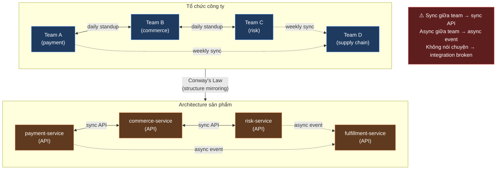
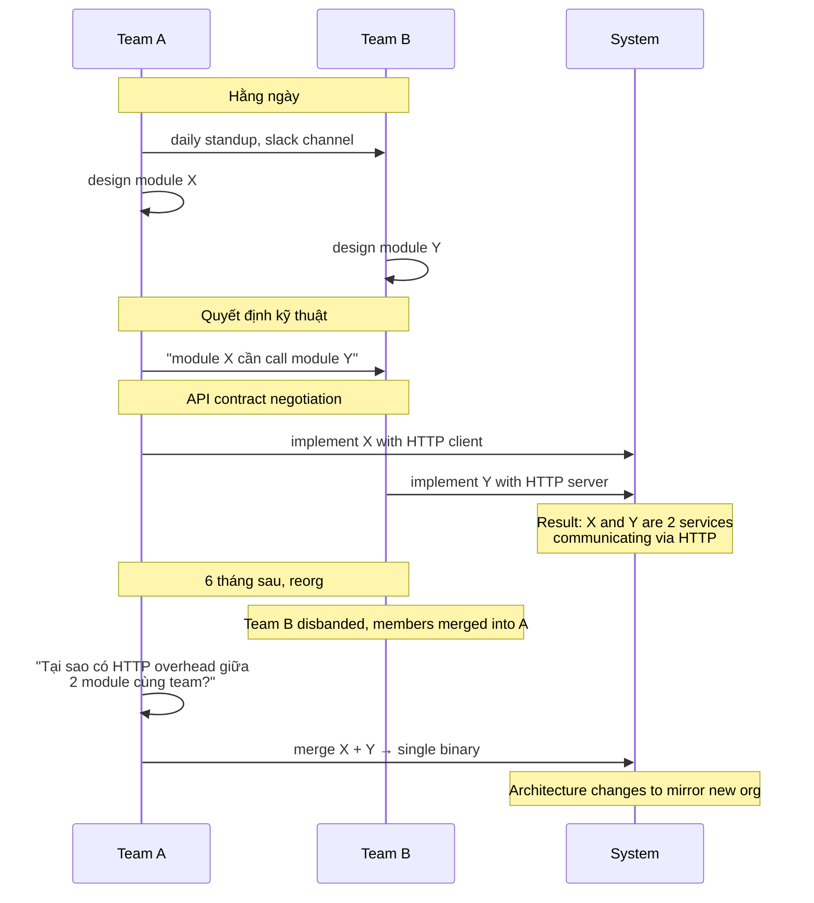
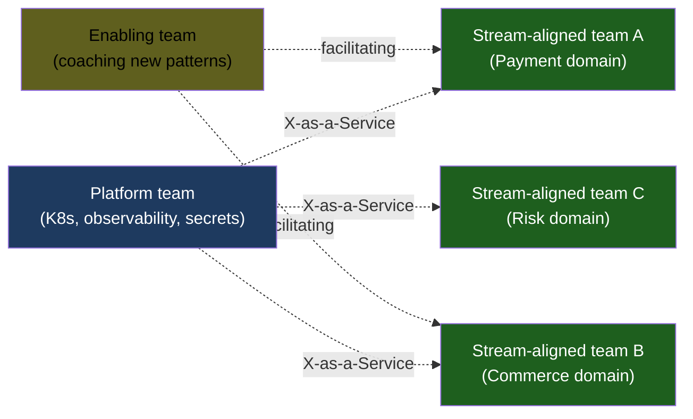
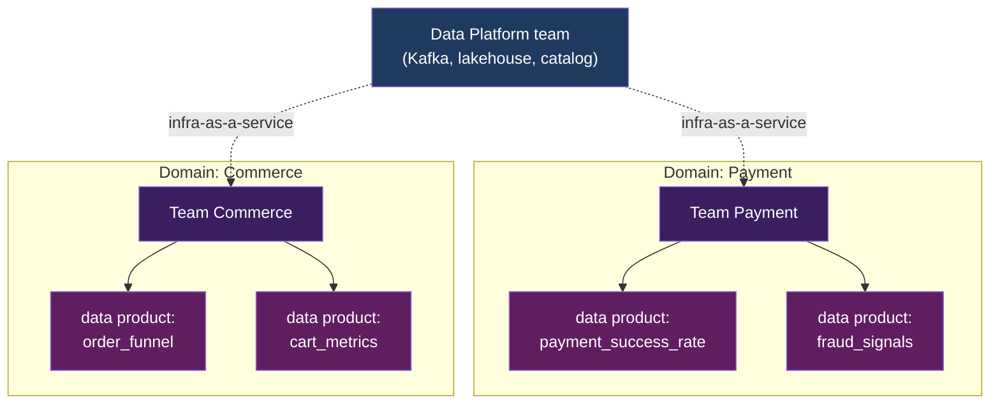
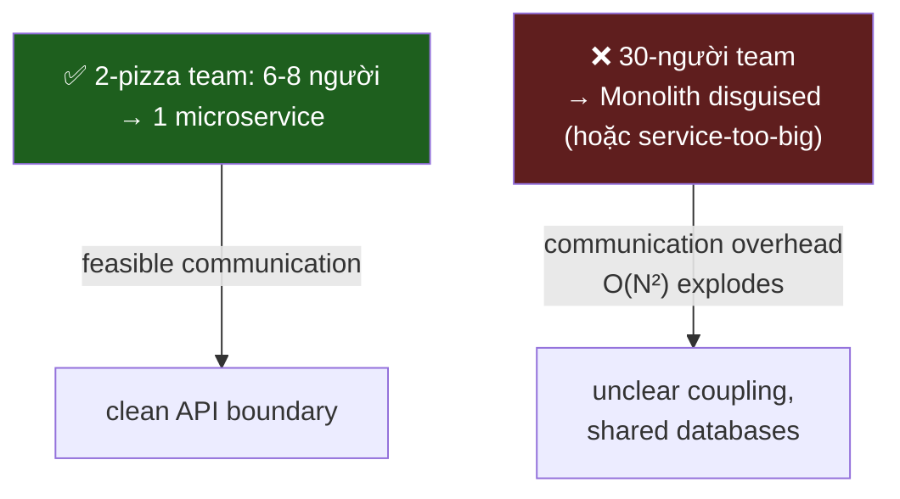

# KU F00 / 11 — Conway's Law: cấu trúc tổ chức = cấu trúc hệ thống

> Melvin Conway (1968): *"Organizations which design systems are constrained to produce designs which are copies of the communication structures of these organizations."* Tổ chức 4 team → architecture 4 service. Hiểu Conway's Law = hiểu vì sao có architecture không phải vì kỹ thuật mà vì tổ chức.

**Module:** [F00 — Mental Models](./README.md)
**Prereqs:** [F00/01 Data product thinking](./01-data-product-thinking.md)
**Related KUs:** [F00/02 Trade-off thinking](./02-trade-off-thinking.md) · [D40 Solution Architecture](../40-solution-architecture/) · [D42 Soft Skills](../42-soft-skills-communication/)
**Đọc trong:** ~10 phút
**Mức độ:** Foundational

---

## 🎯 Nó là gì? (Analogy đời sống)

Hãy quan sát **phở Việt Nam** ở 3 nơi:

- **Phở quán gia đình ở Hà Nội:** 1 chủ + 1-2 nhân viên. Phở "nguyên bản" — 1 công thức nước dùng đậm, 1 kiểu thái thịt, không nhiều biến tấu. Vì 1-2 người làm → 1 phong cách thống nhất.

- **Phở chuỗi 24 chi nhánh ở TP HCM:** Có team Marketing, team Operations, team R&D mới món. Menu phình ra: phở gà, phở bò, phở chay, phở pizza-Italia (R&D điên tạo). Mỗi chi nhánh hơi khác do training nhân viên khác nhau. **Tổ chức nhiều phòng ban → menu phình + inconsistency.**

- **Phở Wall Street:** Holding công ty + 5 phòng ban đa quốc gia + supply chain global. Phở Wall Street trông "thiết kế" — 1 brand book chặt chẽ, nhưng giao hàng chậm vì duyệt 4 cấp. **Tổ chức bureaucratic → product bureaucratic.**

3 nhà phở giống món ăn nhưng **structure tổ chức đẻ ra structure product khác nhau**.

Đó là **Conway's Law**:

> *"Any organization that designs a system... will produce a design whose structure is a copy of the organization's communication structure."*
>
> — Melvin E. Conway, "How Do Committees Invent?" (1968)

Trong kỹ thuật: cách team **giao tiếp với nhau** quyết định cách các **service nói chuyện với nhau**. Có 4 team → có 4 service với 4 API. Có 1 monolith team → có 1 monolith app.

→ **Architecture không sinh ra từ kỹ thuật thuần. Architecture sinh ra từ tổ chức.**

---

## 📖 Định nghĩa chính thức

**Conway's Law** (1968) phát biểu: cấu trúc của hệ thống (software architecture) **phản ánh cấu trúc giao tiếp của tổ chức xây nó**.

Hệ quả thực tế:

1. **Module boundary = team boundary.** Hai team có module liên lạc mật thiết → 2 module đó tight-coupling.
2. **Quy mô team ảnh hưởng quy mô component.** Team 50 người → component khổng lồ; 2-pizza team (~8 người) → microservice.
3. **Hierarchy của tổ chức = hierarchy của system.** CEO + 5 VP → hệ thống 5 module lớn.
4. **Communication overhead = integration overhead.** Hai team không nói chuyện → 2 service không tích hợp tốt.

**Inverse Conway Maneuver** (2015, biến thể hiện đại): nếu muốn architecture A, **đầu tiên hãy tổ chức team theo cấu trúc A**, sau đó architecture sẽ tự follow.

**Nguồn:**
- Melvin E. Conway, "How Do Committees Invent?" (Datamation Magazine, April 1968).
- Mel Conway's website: [melconway.com/Home/Conways_Law.html](http://www.melconway.com/Home/Conways_Law.html).

---

## 🔤 Terminology box

| Thuật ngữ | Tiếng Anh | Giải thích 1 câu |
|---|---|---|
| Luật Conway | Conway's Law | Cấu trúc system = cấu trúc giao tiếp của tổ chức |
| Inverse Conway | Inverse Conway Maneuver | Reorg team trước để force architecture mong muốn |
| Ranh giới team | Team boundary | Phân chia thành viên, ownership, accountability |
| Ranh giới module | Module/Service boundary | Phân chia code/runtime |
| Đội 2-pizza | Two-pizza team | Team đủ nhỏ để 2 cái pizza nuôi đủ (~6-8 người) — Bezos |
| Domain ownership | Domain ownership | Mỗi domain (payment, commerce) có team chịu trách nhiệm |
| Data mesh | Data mesh | Architecture pattern apply Conway's Law cho data (Zhamak Dehghani) |
| Cross-functional team | Cross-functional team | Team có đủ skill độc lập (PM + dev + data + ops) |
| Stream-aligned team | Stream-aligned team | Team align theo dòng value stream — Team Topologies pattern |
| Platform team | Platform team | Team build platform cho stream-aligned team — Team Topologies |
| Communication overhead | Communication overhead | Chi phí giao tiếp tăng theo N² với N người |
| Brooks' Law | Brooks' Law | Thêm người vào project trễ làm project càng trễ — Mythical Man-Month |
| Cognitive load | Cognitive load | Lượng kiến thức team phải nắm — Team Topologies metric |

---

## 💡 Nó làm được gì?

Hiểu Conway's Law cho phép bạn:

- **Đoán architecture từ org chart.** Nhìn org chart công ty → đoán được architecture system của họ ra sao.
- **Giải thích vì sao 1 system "không hợp lý".** Service được split kì lạ thường vì tổ chức từng split kì lạ, không phải kỹ thuật.
- **Tránh "rewrite to fix"-trap.** Nếu org không đổi, rewrite sẽ ra architecture giống cũ.
- **Influence architecture thông qua org change.** Muốn có 8 microservice ↔ tổ chức 8 team trước (Inverse Conway).
- **Hiểu data mesh.** Data mesh = Conway's Law cho data — mỗi domain own data product.

---

## 🧩 Nó là mảnh ghép nào trong tổng thể?

→ Communication intensity → coupling intensity.

---

## 🚀 Nó giúp ích gì?

### Case study: Spotify Squad model

Spotify nổi tiếng với "Squad / Tribe / Chapter / Guild" — đây là **Inverse Conway** explicit. Họ tổ chức team theo *feature stream* (squad align với feature thực), kết quả:

- Mỗi squad own end-to-end 1 phần product
- Microservice architecture follows naturally
- Squad có thể deploy độc lập

→ Architecture microservice của Spotify **không phải sinh ra ngẫu nhiên** — họ design tổ chức trước.

### Case study: Amazon "2-pizza team" rule

Jeff Bezos quy tắc 2-pizza team (~6-8 người max). Hệ quả:

- Service phải đủ nhỏ để 8 người own
- API contracts giữa team phải chặt chẽ vì không thể "rủ qua bàn" nói
- Bus factor (số người chết là team chết) thấp

→ AWS có hàng nghìn service vì có hàng nghìn 2-pizza team.

### Case study: Data Mesh (Zhamak Dehghani 2019)

Data Mesh explicitly là **Conway's Law applied to data**:

| Old: monolithic data lake | New: data mesh |
|---|---|
| 1 central data team own everything | Mỗi domain own data product riêng |
| Bottleneck ở central team | Federated governance |
| Architecture: 1 lake | Architecture: nhiều data products |

→ Trong project DSX Air, [`governance/data-ownership.md`](../../governance/data-ownership.md) áp dụng nguyên tắc này — mỗi domain (payment, commerce, risk, supply chain) own data product.

### Quote từ Reis-Housley FundDE

> *"Data mesh acknowledges Conway's law explicitly. If a company has separate teams for marketing, sales, and finance, they will naturally produce separate data products. Forcing them into a single team or data warehouse fights organizational gravity."*
>
> — Reis & Housley, Fundamentals of Data Engineering (2022)

---

## ⏰ Khi nào dùng / tránh?

Conway's Law là **observation** (nó luôn xảy ra), không phải lựa chọn "dùng hay không". Câu hỏi đúng: bạn dùng nó **for** hay **against** bạn?

| ✅ Dùng FOR bạn (proactive) | ❌ Bị Conway's Law against bạn |
|---|---|
| Reorg team trước khi build architecture mới | Cố build architecture mới mà giữ nguyên org |
| Cross-functional team (PM + eng + data + ops) cho fast cycle | Silo team (eng, ops, data riêng biệt) làm hand-off dày |
| 2-pizza team cho microservice | Team 50 người cho microservice → sẽ thành monolith disguised |
| Stream-aligned team cho product agility | Functional team (frontend, backend, ops riêng) cho project chậm |
| Platform team support stream team | Stream team tự build infra → mỗi team 1 stack riêng |

---

## 🤔 Trade-off vs alternatives

3 cách nhìn về quan hệ tổ chức ↔ architecture:

| Mindset | Khi đúng | Khi sai |
|---|---|---|
| **"Tech-first"** (ignore Conway) | Greenfield startup, 1 founder | Org > 20 người, Conway sẽ thắng tech |
| **"Conway-aware"** (sweet spot senior) | Mọi org > 5 người | Có lúc cần override (rare) |
| **"Inverse Conway"** (active design) | Reorg lớn, transformation | Org văn hoá conservative, không reorg được |

Thực tế: senior architect phải **đọc org chart trước khi đề xuất architecture**. Pitching microservice cho tổ chức 1 team 30 người = thất bại.

---

## 🔧 Nó vận hành ra sao? (Logic walkthrough)

### Cơ chế Conway's Law lan toả

→ Architecture **co giãn theo org**, không phải ngược lại.

### 3 patterns triển khai Conway's Law có chủ đích

#### Pattern 1: Stream-aligned teams (Team Topologies)

Stream team own end-to-end domain. Platform team build "as-a-service" (data platform, infra). → Microservice architecture natural.

#### Pattern 2: Data domains (Data Mesh)

→ Project DSX Air follow pattern này — 4 domain (payment, commerce, risk, supply chain), platform team độc lập.

#### Pattern 3: 2-pizza team rule (Amazon)

Brooks' Law (Mythical Man-Month) + Conway's combined: thêm người = thêm communication overhead = architecture deteriorate.

---

## 🧪 Worked example

**Tình huống thật trong dự án DSX Air:** bạn build [`governance/data-ownership.md`](../../governance/data-ownership.md) — file này không random, mà **explicitly áp dụng** Inverse Conway:

### Bước 1 — Định nghĩa domain

5 domain trong project:
- Commerce (orders, products, cart)
- Payment (transactions, settlements)
- Risk (fraud detection, alerts)
- Supply chain (inventory, shipments)
- Analytics platform (gold tables, BI)

### Bước 2 — Assign team (giả định) cho domain

| Domain | Team owner (giả định) | Skills |
|---|---|---|
| Commerce | commerce-platform team | Web + backend + DE |
| Payment | payments team | DE + risk analyst |
| Risk | risk team | DE + data scientist |
| Supply chain | supply-chain team | DE + ops |
| Analytics | data-platform team | DE + DA + ML |

### Bước 3 — Conway's Law predicts architecture

| Team → | Architecture →|
|---|---|
| Commerce team | `cdc.orders.v1` topic, `gold.order_funnel_hourly` table |
| Payment team | `payment.authorized.v1` + `payment.failed.v1` topics, `gold.daily_revenue` |
| Risk team | `fraud.risk_signal.v1` topic, `gold.fraud_alert_summary` |
| Supply chain team | `cdc.inventory.v1`, `shipment.*` topics, `gold.inventory_availability` |
| Data platform team | Trino + Iceberg catalog + lineage + governance tooling |

→ **Architecture tự nhiên = mỗi team own bộ events + data products của domain mình**. Đây là **data mesh in action**.

### Bước 4 — Hệ quả vận hành

- Commerce team thay đổi schema `cdc.orders.v1` → tự ho biết, BACKWARD compat → consumer (Payment, Risk) không vỡ.
- Risk team đẩy alert mới → tự build, không cần coordinate với Payment team.
- Data platform team không own dataset của ai → chỉ host infra.

### Bước 5 — Nếu Conway's Law bị violate

Tưởng tượng nếu Analytics platform team **own tất cả gold table** (anti-Conway):
- Commerce team muốn thêm gold metric → phải request analytics team → queue → bottleneck.
- Payment team change → impact gold table → analytics team phải catch-up.
- → **Architecture rơi vào "central data team" pattern** mà data mesh đề xuất tránh.

→ Worked example cho thấy [`governance/data-ownership.md`](../../governance/data-ownership.md) không phải file documentation thuần — nó là **organizational design** chạm vào architecture.

---

## ⚠️ Common pitfalls

### Pitfall 1 — Cố reorg architecture mà giữ org

❌ **Sai:** "Mình muốn 8 microservice nhưng team chỉ có 5 dev silo theo function."

✅ **Đúng:** Reorg team trước (5 dev → 3 cross-functional team) → architecture follow.

### Pitfall 2 — Microservice cho team 5 người

❌ **Sai:** Build 12 microservice cho công ty 5 dev → mỗi người own 2.4 service → bus factor < 1 → khi 1 người nghỉ, 2 service chết.

✅ **Đúng:** 1-2 service cho 5 dev. Khi team grow đến 20+ → split.

### Pitfall 3 — Ignore communication overhead

❌ **Sai:** Add 5 dev nữa cho "speed up project" → integration overhead tăng, project càng chậm (Brooks' Law).

✅ **Đúng:** Project trễ → fix root cause (requirement, design, blocker), không phải add people.

### Pitfall 4 — Tổ chức team theo skill set thay vì domain

❌ **Sai:** Team "all frontend", team "all backend", team "all DE" → mọi feature cần 3-way handoff → slow.

✅ **Đúng:** Cross-functional team (1 PM + 1 FE + 1 BE + 1 DE) own feature end-to-end → fast cycle.

### Pitfall 5 — Bỏ qua Conway khi pitch architecture

❌ **Sai:** Pitch microservice + event-driven + data mesh cho startup 3 người. Họ không có capacity org.

✅ **Đúng:** Match architecture với org maturity. Startup 3 người = monolith. Scale-up 30 = bắt đầu modular monolith. Enterprise 300 = microservice ra mặt.

---

## 🌱 Advanced topics

### A1. Team Topologies (Skelton & Pais 2019)

Book "Team Topologies" formal hoá Conway's Law thành 4 patterns team:

| Type | Mục đích | Ví dụ |
|---|---|---|
| **Stream-aligned** | Own end-to-end value stream | Domain team (commerce, payment) |
| **Platform** | Provide X-as-a-service | Data platform team, infra team |
| **Enabling** | Coach pattern mới rồi rút | DevOps coaches, security team |
| **Complicated-Subsystem** | Own complex tech ít team khác hiểu | ML model serving, custom database |

→ Modern data org thường là **stream-aligned domain teams + data platform team + enabling DataOps team**.

### A2. Brooks' Law (Mythical Man-Month, 1975)

Fred Brooks: "Adding manpower to a late software project makes it later."

Lý do:
1. New person cần ramp-up time → không productive immediately.
2. Communication overhead grows N² (1 person = 0 lines, N people = N(N-1)/2 communication paths).
3. Tasks không phải lúc nào cũng partitionable.

→ Bài học: org structure quan trọng hơn org size. 5-person team well-organized > 20-person team chaotic.

### A3. "Cognitive load" — Team Topologies metric

Mỗi team có hữu hạn **cognitive load** (= lượng kiến thức + complexity team có thể nắm). Vượt → team perform tệ.

Cognitive load tăng khi:
- Team own quá nhiều service (> 3-5)
- Tech stack quá đa dạng
- Domain quá rộng

Giảm cognitive load bằng:
- Platform team che infra complexity
- Boundary rõ ràng giữa domain
- Documentation tốt

### A4. Conway's Law trong AI/ML 2026

ML team organization thường có pattern:

| Team boundary | Architecture mirror |
|---|---|
| Data scientist + ML engineer riêng | Hand-off model.pkl → "Throw over the wall" + drift later |
| Cross-functional ML team (DS + MLE + DE) | End-to-end MLOps pipeline integrated |
| Central feature store team | Feature store as platform service |
| Per-domain feature engineering | Decentralized features, duplication |

→ Modern MLOps = stream-aligned team own model end-to-end (train + serve + monitor + retrain).

### A5. Data Mesh = Conway's Law cho data

4 nguyên lý của Data Mesh (Dehghani):

1. **Domain-oriented ownership** → mỗi domain own data
2. **Data as a product** → treat data như product
3. **Self-serve data platform** → platform team
4. **Federated governance** → governance committee từ các domain

Conway's Law underlies all four. Without org reorg → data mesh chỉ là cosmetic.

### A6. The "Inverse Conway Maneuver" — gif gì sai

Inverse Conway pop ở Microsoft, Google, Spotify từ 2010s. Nguyên lý:

1. Define target architecture (e.g., 10 microservice).
2. Reorg team thành 10 stream-aligned team.
3. Architecture sẽ **tự nhiên emerge** match design.

Risk: reorg là expensive (people thay đổi vai trò), không guarantee. Apply có chiến lược.

---

## 🔗 Liên kết KU khác

- **[F00/01 Data product thinking](./01-data-product-thinking.md)** — data product mindset là Conway applied to data
- **[F00/02 Trade-off thinking](./02-trade-off-thinking.md)** — chọn architecture pattern phụ thuộc trade-off org
- **[D40 Solution Architecture](../40-solution-architecture/)** — architect senior phải đọc org chart trước
- **[D42 Soft Skills](../42-soft-skills-communication/)** — communication + influence skill để áp Inverse Conway
- **[F12 System Design Fundamentals](../12-system-design-fundamentals/)** — design pattern often follows Conway
- **[D27 Governance + Lineage](../27-governance-lineage/)** — domain ownership = Conway in governance

---

## 🧠 Self-test (3 mức)

### 🟢 Easy

1. Phát biểu Conway's Law bằng 1 câu của bạn (không quote nguyên văn).
2. Cho 1 ví dụ đời sống về Conway's Law (ngoài quán phở).
3. Tại sao Spotify Squad model là 1 dạng "Inverse Conway"?

### 🟡 Medium

4. Trong dự án DSX Air, file `governance/data-ownership.md` áp dụng Conway như thế nào? Nếu Analytics team own tất cả gold tables (anti-Conway), hệ quả gì?
5. Cho 1 case study "anti-Conway" + hệ quả của nó.
6. Brooks' Law nói gì? Liên hệ với Conway's Law ra sao?

### 🔴 Hard

7. Bạn được assign làm architect 1 dự án 30 dev, hiện đang là monolith chia 3 functional team (FE, BE, DE). Sếp muốn convert sang microservice. Bạn sẽ làm theo Inverse Conway 4 bước cụ thể như thế nào?
8. "Cognitive load" của Team Topologies là gì? Đưa 3 cách giảm cognitive load cho 1 team đang quá tải.
9. Data Mesh là Conway's Law applied to data. Tại sao Data Mesh **không phải** lúc nào cũng đúng (cho org > 50 dev maturity)? Phản biện nếu pitching cho org 5 người.

> **6+/9** = thạo. **4-5** = đọc lại Team Topologies + worked example. **<4** = đọc lại + ví dụ DSX Air.

---

## 📌 Trong repo này

Conway's Law được áp dụng explicitly:

- **Data ownership map** ([`governance/data-ownership.md`](../../governance/data-ownership.md)) — Inverse Conway in action, mỗi domain own data
- **ADR-0001 DSX Air positioning** ([`adr/0001-dsx-air-as-network-fabric-twin.md`](../../adr/0001-dsx-air-as-network-fabric-twin.md)) — 1 person team → 1 unified network-fabric story (Conway micro)
- **Module structure** in [`learning/CURRICULUM.md`](../CURRICULUM.md) — curriculum chia thành 43 module, mỗi module 1 chủ đề (Conway applied to curriculum design)
- **Repo structure** in [`README.md`](../../README.md) — chia code theo layer (event/streaming/lakehouse/serving) — Conway via responsibility
- **Architecture diagrams** in [`ARCHITECTURE.md`](../../ARCHITECTURE.md) — C4 + flow + sequence diagrams show team boundary implications

---

## 🌐 Đọc thêm (chính thống, hạn chế — 3 nguồn)

- **Melvin Conway, "How Do Committees Invent?"** (Datamation, 1968) — [melconway.com/Home/Conways_Law.html](http://www.melconway.com/Home/Conways_Law.html). Bài 6 trang, đọc 1 lần.
- **Matthew Skelton & Manuel Pais, "Team Topologies"** (2019, IT Revolution Press) — formal hoá Conway's Law thành 4 team types. Bắt buộc đọc cho senior architect.
- **Joe Reis & Matt Housley, "Fundamentals of Data Engineering" — Chapter 2 (Data Engineering Lifecycle) + Chapter 3 (Good Architecture)** — explicit reference Conway's Law + data mesh. [Library: `Reis-Housley_2022_Fundamentals-of-Data-Engineering.pdf`](../../library/books/data-engineering/Reis-Housley_2022_Fundamentals-of-Data-Engineering.pdf)

---

**Đã đọc xong?**
✅ Tick vào [`progress/checklist.md`](../progress/checklist.md) → đi tiếp [F00/12 Trade-off triangle](./12-trade-off-triangle.md).
