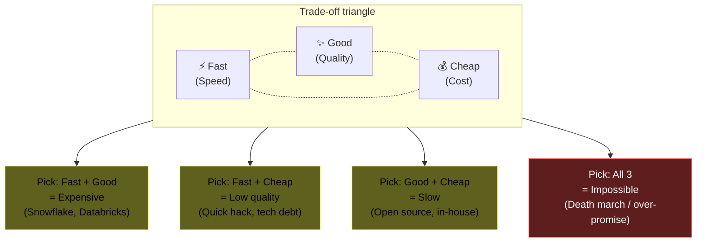
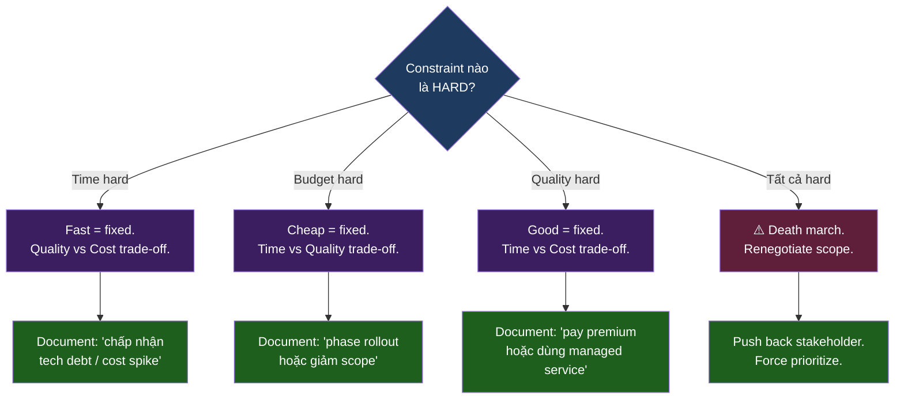
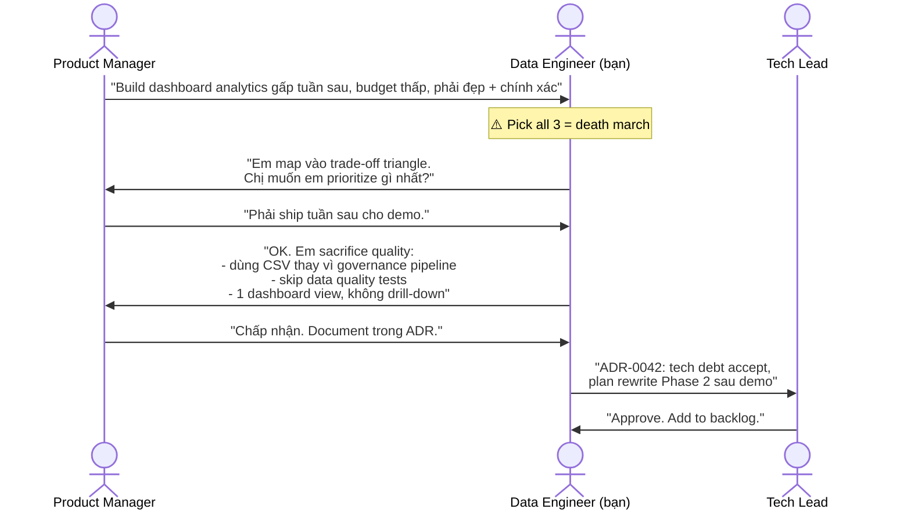
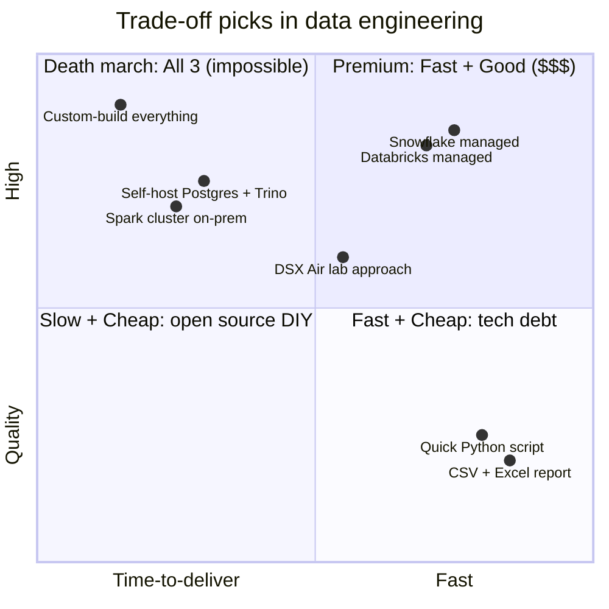
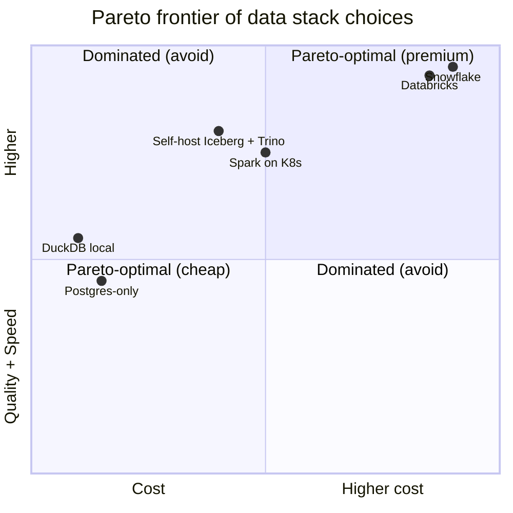

# KU F00 / 12 — Trade-off triangle: nhanh / rẻ / tốt — chọn 2

> *"Fast, cheap, good — pick any two."* — Project management folklore. Bạn không thể đồng thời có cả ba. Hiểu tam giác này = giải phóng bạn khỏi ảo tưởng "có cách nào tối ưu hết". Mỗi quyết định kỹ thuật trong dự án DSX Air đều là một điểm trên tam giác này.

**Module:** [F00 — Mental Models](./README.md)
**Prereqs:** [F00/02 Trade-off thinking](./02-trade-off-thinking.md) · [F00/10 Premature optimization](./10-premature-optimization.md)
**Related KUs:** [F00/05 Failure as feature](./05-failure-as-feature.md) · [F00/11 Conway's Law](./11-conways-law.md) · [D40 Solution Architecture](../40-solution-architecture/)
**Đọc trong:** ~12 phút
**Mức độ:** Foundational

---

## 🎯 Nó là gì? (Analogy đời sống)

Bạn đặt **may áo dài** cho lễ tốt nghiệp tuần sau. Cô thợ may hỏi 3 câu:

- **Có gấp không?** (Tốc độ / Speed)
- **Ngân sách bao nhiêu?** (Chi phí / Cost)
- **Yêu cầu chất liệu cao cấp, đo cá nhân?** (Chất lượng / Quality)

Cô đưa bảng giá:

| Cô muốn | Thực tế |
|---|---|
| **Nhanh + Tốt** | Đắt — cô thợ giỏi phải bỏ khách khác, làm overtime → giá gấp 3 lần |
| **Nhanh + Rẻ** | Chất lượng tệ — may bằng máy đại trà, không đo cá nhân, vải chợ |
| **Tốt + Rẻ** | Chậm — cô thợ chỉ may khi rảnh, 3 tháng mới xong |
| **Cả 3 (Nhanh + Tốt + Rẻ)** | Không tồn tại |

Đó là **trade-off triangle** — tam giác kinh điển của project management:

> *"Fast, Cheap, Good — pick any two. You cannot have all three."*

Trong kỹ thuật, mọi quyết định cuối cùng đều rơi vào 1 trong 4 góc của tam giác (3 góc + ở giữa = compromise). Senior engineer hiểu mình **đang ở đâu trong tam giác**, không ảo tưởng "tối ưu hết".

---

## 📖 Định nghĩa chính thức

**Trade-off triangle** (còn gọi: **Project Management Triangle**, **Iron Triangle**, **Triple Constraint**) là mô hình tư duy nói rằng mọi project bị ràng buộc bởi 3 biến cố:

- **Scope/Quality** (phạm vi / chất lượng): độ "tốt" của output
- **Time/Speed** (thời gian / tốc độ): khi nào xong
- **Cost** (chi phí): tiền, người, resource đầu tư

3 biến cố này **liên đới chặt chẽ**. Cố định 2 → cái thứ 3 bị determine. Cố đạt cả 3 ở mức tối ưu → không khả thi.

Variant hiện đại trong engineering thường gọi: **Reliability + Performance + Cost** (hoặc: **Time-to-market + Quality + Resources**).

**Nguồn:**
- Martin Barnes, *Time and Money in Contract Control* (1969) — phát biểu sớm nhất của "iron triangle".
- Project Management Institute (PMI) PMBOK — chuẩn hoá trong project management.
- Atkinson, R. (1999), *"Project management: cost, time and quality, two best guesses and a phenomenon"* — phản biện + extend lên 6 biến.

---

## 🔤 Terminology box

| Thuật ngữ | Tiếng Anh | Giải thích 1 câu |
|---|---|---|
| Tam giác đánh đổi | Trade-off triangle | Mô hình 3 biến không thể đạt tối ưu cùng lúc |
| Tam giác sắt | Iron triangle | Tên cũ — nhấn mạnh tính bất biến của ràng buộc |
| Ba ràng buộc | Triple constraint | Cách gọi của PMI cho cùng concept |
| Phạm vi | Scope | Phạm vi feature / yêu cầu |
| Chất lượng | Quality | Mức độ "tốt" — reliability, correctness, performance |
| Tốc độ | Speed / Time-to-market | Khi nào ship |
| Chi phí | Cost | Tiền, người, resource |
| Đánh đổi | Trade-off | Hy sinh 1 biến để được biến khác |
| Constraint cứng | Hard constraint | Ràng buộc không thể vi phạm (compliance, deadline) |
| Constraint mềm | Soft constraint | Ràng buộc có thể negotiate |
| Pareto frontier | Pareto frontier | Đường biểu diễn các trade-off tối ưu (không thể cải thiện 1 biến mà không hy sinh biến khác) |
| Sweet spot | Sweet spot | Điểm cân bằng "đủ tốt" trên 3 trục |
| Death march | Death march | Project cố đạt cả 3 → team kiệt sức, fail |
| Quality debt | Quality debt | Nợ chất lượng khi chọn Fast+Cheap |
| MVP | Minimum Viable Product | Pick Fast+Cheap, scope cắt để vẫn "viable" |
| Gold-plating | Gold-plating | Quá-tốt-không-cần — anti-pattern của Quality |

---

## 💡 Nó làm được gì?

Hiểu trade-off triangle giúp bạn:

- **Trả lời sếp / khách hàng** rõ ràng: "Nếu anh muốn gấp tuần sau → chất lượng chỉ ở mức X" — không hứa hoà cả 3.
- **Phản biện yêu cầu vô lý** kiểu "nhanh, rẻ, tốt" — đây là red flag.
- **Đặt prioritize cho team** khi resource hạn chế.
- **Viết ADR mạnh** với "trade-off accepted" rõ ràng.
- **Tránh death march** — project cố đạt cả 3 = team burnout.
- **Hiểu vì sao** managed cloud (Snowflake, Databricks) đắt — bạn mua **Fast + Good**, sacrifice Cost.

---

## 🧩 Nó là mảnh ghép nào trong tổng thể?



---

## 🚀 Nó giúp ích gì?

### Ứng dụng vào quyết định kỹ thuật DE/AI

| Quyết định | Fast | Cheap | Good | Trade-off chọn |
|---|:---:|:---:|:---:|---|
| Use Snowflake managed | ✓ | ✗ | ✓ | Fast + Good (pay $$$) |
| Self-host Postgres + Trino + DIY | ✗ | ✓ | ✓ | Good + Cheap (slow setup) |
| Quick CSV → Excel report | ✓ | ✓ | ✗ | Fast + Cheap (no governance) |
| Build with Spark + Iceberg + GE | ✗ | ✓ | ✓ | Good + Cheap (3 month build) |
| Buy enterprise data platform | ✓ | ✗ | ✓ | Fast + Good ($1M license) |
| Hire 10 engineers urgently | ✓ | ✗ | ?? | Fast (but quality uncertain) |
| 1 engineer build slowly | ✗ | ✓ | ✓ | Good + Cheap |

→ **Senior data engineer/architect** không sợ trade-off — họ **chọn trade-off rõ ràng** và document.

### Quote từ DDIA (Kleppmann)

> *"With a few thousand requests per second on a hundred-megabyte database, a small relational database may suffice... For larger and more complex applications, we need to take a more structured approach to architecture."*

→ Kleppmann ngầm nói: **simple + cheap** đủ tốt cho small scale; chỉ trade up khi scale yêu cầu.

### Trong DSX Air project

ADRs trong [`adr/`](../../adr/) là **lịch sử trade-off đã chọn**:

- **ADR-0002 Redpanda over Kafka**: chọn Cheap + Good (Redpanda 10x nhẹ RAM), sacrifice Fast (Kafka stack quen thuộc hơn).
- **ADR-0008 Time-multiplex sessions**: chọn Good + Cheap (RAM budget), sacrifice Fast (phải switch session).
- **ADR-0009 MVP-first then extend**: chọn Fast + Cheap (6 tuần MVP), sacrifice Good (Phase 1 chưa có AI/RAG/lineage).

---

## ⏰ Khi nào dùng / KHÔNG dùng?

| ✅ Áp dụng khi | ❌ Không dùng khi |
|---|---|
| Decide tool / architecture | Quyết định nhỏ kiểu format code |
| Plan project timeline | Bug fix < 1h |
| Negotiate scope với stakeholder | Việc của bạn 1 mình, không có constraint |
| Viết ADR | Quyết định auto-revertible |
| Hire / staffing | Cá nhân kỹ năng cá nhân |
| Pitching solution cho khách | Casual chat |

> **Quy tắc:** mọi decision có tác động > 1 tuần effort hoặc > $1000 cost → nên explicitly map vào trade-off triangle.

---

## 🤔 Trade-off vs alternatives

3 framework tương tự:

| Framework | Số biến | Khi dùng |
|---|:---:|---|
| **Trade-off triangle** (cái này) | 3 | Quyết định project / engineering daily |
| **Atkinson 6 biến** (1999) | 6 (+ stakeholder satisfaction, info system quality, organizational impact) | Project lớn, multi-stakeholder |
| **Pareto frontier** | N (tổng quát) | Optimization khoa học, multi-objective |
| **PACELC** (distributed DB) | 5 (Partition, Availability, Consistency, Else, Latency, Consistency) | Distributed DB design |
| **CAP theorem** | 3 (Consistency, Availability, Partition tolerance) | Distributed system theory |

→ Trade-off triangle = **simple + powerful + universal**. Học 1 lần, dùng 100 lần.

---

## 🔧 Nó vận hành ra sao? (Logic walkthrough)

### Bước 1 — Liệt kê constraints

Cho mỗi quyết định, hỏi:
1. **Hard time constraint?** (Deadline, compliance, market window)
2. **Hard budget constraint?** (Cost ceiling)
3. **Hard quality constraint?** (SLA, compliance, safety-critical)

### Bước 2 — Pick prioritize



### Bước 3 — Document trade-off

Mỗi quyết định lớn, viết ADR (xem [`adr/ADR-template.md`](../../adr/ADR-template.md)) với section:

```markdown
## Trade-off chấp nhận
- Pick: Fast + Good
- Sacrifice: Cost ($500/month tăng cho managed service)
- Re-evaluate when: cost > $5000/month
```

### Sequence — workflow chốt trade-off



→ **Lưu ý**: trao đổi minh bạch về trade-off **trước** khi build = phòng tránh blame sau.

### Quadrant chart của 4 patterns



---

## 🧪 Worked example

**Tình huống thật trong DSX Air:** team được giao 1 yêu cầu mới — build **realtime fraud detection** trong 4 tuần. CFO nói: "không thuê thêm người, không tăng budget cloud, phải achieve p99 < 500ms latency."

3 hard constraints:
- **Time**: 4 tuần
- **Cost**: zero increase
- **Quality**: p99 < 500ms

→ Đây là **classic death march** if team chấp nhận hết.

### Bước 1 — Push back có cấu trúc

Bạn map ra trade-off triangle:

| Constraint | Hard hay soft? | Tại sao |
|---|---|---|
| Time (4 tuần) | Hard (regulator audit) | Compliance |
| Cost (zero) | Soft (CFO arbitrary) | Có thể negotiate |
| Quality (p99 < 500ms) | Hard (user experience SLA) | Business requirement |

→ Trade-off triangle nói: chọn 2 → biến thứ 3 phải free. **Bạn pick Time + Quality → Cost phải free**.

### Bước 2 — Pitch lại với CFO

> "Để đạt p99 < 500ms + 4 tuần, em cần:
> - Adopt Redpanda Cloud (managed) — $800/month
> - Hoặc tự host nhưng cần 1 senior thuê tạm 6 tuần — $15,000
> 
> Phương án 3: scope cut — chỉ alert offline (p99 < 5 phút thay vì 500ms). Free."

### Bước 3 — CFO chọn

CFO chọn: $800/month Redpanda Cloud → cheapest of the "achievable" options.

### Bước 4 — Document trade-off

ADR-0042 viết:

```markdown
# ADR-0042: Adopt Redpanda Cloud for fraud detection MVP

## Context
- Fraud detection requires p99 < 500ms
- 4-week deadline (compliance audit)
- Team capacity full

## Decision
Adopt Redpanda Cloud managed ($800/month)

## Trade-off accepted
- Pick: Fast (4 weeks) + Good (p99 < 500ms)
- Sacrifice: Cost ($800/month opex new line item)
- CFO approved 2026-XX-XX

## Re-evaluate when
- Monthly cost > $3000 (5x growth)
- Team has capacity to self-host
```

### Bước 5 — Result

Ship đúng 4 tuần. p99 = 380ms. Cost $800/month accepted as audit-driven necessity.

**Bài học:**
- **Không** im lặng chấp nhận "fast + cheap + good" — đó là death march.
- **Negotiate explicit:** map ra trade-off triangle → stakeholder hiểu trade-off → chọn cho bạn.
- **Document accepted trade-off** trong ADR → tránh blame retrospective.

---

## ⚠️ Common pitfalls

### Pitfall 1 — Im lặng chấp nhận death march

❌ **Sai:** Sếp nói "fast + cheap + good", bạn gật đầu, team OT 3 tháng, burnout, ship trễ.

✅ **Đúng:** Push back ngay khi nhận yêu cầu. Map ra trade-off triangle, force stakeholder prioritize.

### Pitfall 2 — Pick "Fast + Cheap" mà không khai báo tech debt

❌ **Sai:** Ship nhanh + rẻ → 6 tháng sau code không maintainable → toàn team kiệt sức sửa.

✅ **Đúng:** Khi pick Fast+Cheap, **explicitly log tech debt** trong backlog. Set re-evaluation date.

### Pitfall 3 — Gold-plating

❌ **Sai:** Pick "Good", build hyper-engineered solution với 10 patterns + 5 abstractions cho 1 ETL chạy 1 lần/ngày.

✅ **Đúng:** "Good enough" beats "perfect". YAGNI principle.

### Pitfall 4 — Tin "managed = không có trade-off"

❌ **Sai:** "Snowflake/Databricks managed, không cần trade-off — họ lo hết."

✅ **Đúng:** Managed = pick Fast + Good, sacrifice Cost (++ vendor lock-in, ++ migration cost). Vẫn là trade-off, chỉ là dịch chuyển.

### Pitfall 5 — Trade-off 1 lần, không re-evaluate

❌ **Sai:** Pick "Fast + Cheap" 2 năm trước, giờ data 100x growth, vẫn dùng kiến trúc cũ.

✅ **Đúng:** Mỗi trade-off có **expiry date**. Re-evaluate định kỳ (annually, hoặc khi metric trigger).

---

## 🌱 Advanced topics

### A1. Atkinson 6 biến (1999) — beyond iron triangle

Roger Atkinson phản biện iron triangle 3 biến quá hẹp. Đề xuất 6 biến:

1. **Cost** (chi phí)
2. **Time** (thời gian)
3. **Quality** (chất lượng technical)
4. **Information system** (chất lượng output system)
5. **Stakeholder benefit** (lợi ích cho user, sponsor, team)
6. **Organizational impact** (impact lâu dài lên tổ chức)

→ Đi sâu hơn iron triangle, nhưng phức tạp hơn. Dùng cho project enterprise lớn.

### A2. PACELC theorem (Daniel Abadi 2010) — DB trade-off

Extension của CAP theorem. Trong distributed DB:

- **P** (Partition): khi network partition xảy ra, chọn **A** (Availability) hay **C** (Consistency)?
- **E** (Else): khi network OK, chọn **L** (Latency) hay **C** (Consistency)?

→ DB nào pick PA + EL = AP + low latency (DynamoDB).
→ DB nào pick PC + EC = strong consistency luôn (Spanner, CockroachDB).

→ Đây là **trade-off triangle áp cho distributed DB**, sẽ học sâu hơn ở [F11/04 PACELC](../11-distributed-systems-theory/).

### A3. Pareto frontier — generalize trade-off triangle

Khi có > 3 biến, không thể visualize tam giác. Dùng **Pareto frontier**: tập hợp các giải pháp **không bị dominate** (không có giải pháp khác tốt hơn ở ALL biến).



→ Senior architect chọn từ Pareto frontier; junior thường chọn options bị dominate (paying more for less quality).

### A4. Goodhart's Law — trade-off ngược cho metric

Charles Goodhart (1975): *"When a measure becomes a target, it ceases to be a good measure."*

Hệ quả cho trade-off: nếu bạn "tối ưu cho Fast" → team gaming metric (skip test, hide bugs) → quality fail dù metric "fast" đẹp.

→ Cảnh báo khi quá obsess 1 góc của tam giác. Health metrics + qualitative review cần đi kèm.

### A5. Time-to-market vs lifecycle cost

Trong B2B SaaS / data platform:

- **Time-to-market** quan trọng nhất ở giai đoạn early (first mover advantage)
- **Lifecycle cost** quan trọng nhất ở scale (10 năm sau, total cost vượt initial)

→ Trade-off shift theo phase. Giai đoạn 1 chọn Fast > Cost. Giai đoạn 3 chọn Cost-optimal.

DSX Air project phase 1-2 = Fast > Cost (MVP). Phase 3+ = Cost > Fast (FinOps + optimize).

### A6. Heuristic "Good enough" trong AI 2026

LLM evaluation introduce trade-off mới:

| Trục | Ví dụ |
|---|---|
| **Quality** | Accuracy, hallucination rate, faithfulness |
| **Speed** | Tokens/sec, p95 latency |
| **Cost** | $/1M tokens, GPU hours |

GPT-4 = Fast + Good ($$$). Local 7B model = Slow + Cheap. Claude Haiku = Fast + Cheap (sacrifice some Quality vs Opus).

→ Mỗi LLM API là 1 điểm trên tam giác. Senior AI engineer = chọn đúng theo use case.

---

## 🔗 Liên kết KU khác

- **[F00/02 Trade-off thinking](./02-trade-off-thinking.md)** — foundation của trade-off thinking
- **[F00/10 Premature optimization](./10-premature-optimization.md)** — quá tối ưu = vi phạm trade-off đúng
- **[F00/11 Conway's Law](./11-conways-law.md)** — org structure ảnh hưởng trade-off choice
- **[F11/03 CAP theorem](../11-distributed-systems-theory/)** — trade-off triangle cho distributed DB
- **[F11/04 PACELC theorem](../11-distributed-systems-theory/)** — extension của CAP
- **[D40 Solution Architecture](../40-solution-architecture/)** — architect daily uses this
- **[D39 FinOps Cost Engineering](../39-finops-cost-engineering/)** — manage Cost axis explicitly

---

## 🧠 Self-test (3 mức)

### 🟢 Easy

1. "Fast + Cheap + Good — pick any two" — câu này nghĩa là gì?
2. Snowflake managed adopt trade-off nào (Fast/Cheap/Good)?
3. Cho 1 ví dụ "death march" project bạn thấy / nghe.

### 🟡 Medium

4. Trong worked example fraud detection 4 tuần, vì sao "self-host Redpanda" không phải lựa chọn? Trade-off triangle nói gì?
5. Pareto frontier khác trade-off triangle ra sao? Khi nào dùng cái nào?
6. ADR-0008 (time-multiplex sessions) chấp nhận trade-off nào? Sacrifice gì?

### 🔴 Hard

7. Goodhart's Law cảnh báo gì về trade-off? Cho ví dụ team data engineering rơi vào trap này.
8. So sánh PACELC vs trade-off triangle: chúng cùng pattern hay khác? Giải thích.
9. Bạn pitching solution cho khách. Khách muốn cả 3 (fast + cheap + good). Bạn push back ra sao trong 4 bước cụ thể (theo worked example pattern)?

> **6+/9** = hiểu sâu. **4-5** = đọc lại worked example. **<4** = đọc lại toàn KU + làm 2 ADR mẫu.

---

## 📌 Trong repo này

Trade-off triangle thấm vào mọi quyết định DSX Air:

- **All 10 ADRs** trong [`adr/`](../../adr/) đều có "Trade-off" / "Consequences" section — đó là tam giác in action
- **ADR-0002 Redpanda over Kafka** ([`adr/0002-redpanda-over-kafka.md`](../../adr/0002-redpanda-over-kafka.md)) — pick Cheap + Good
- **ADR-0008 Time-multiplex sessions** ([`adr/0008-time-multiplex-sessions.md`](../../adr/0008-time-multiplex-sessions.md)) — pick Good + Cheap (sacrifice Fast)
- **ADR-0009 MVP-first then extend** ([`adr/0009-mvp-first-then-extend.md`](../../adr/0009-mvp-first-then-extend.md)) — pick Fast + Cheap MVP, defer Good
- **Roadmap** ([`ROADMAP.md`](../../ROADMAP.md)) — phase 1 prioritize Fast, phase 4 prioritize Good
- **Budget guardrails** ([`docs/19-cost-budget-guardrails.md`](../../docs/19-cost-budget-guardrails.md)) — Cost axis tracking
- **Limitations statement** ([`docs/99-limitations-and-honesty.md`](../../docs/99-limitations-and-honesty.md)) — explicit về Quality giới hạn

---

## 🌐 Đọc thêm (chính thống, hạn chế — 3 nguồn)

- **Martin Barnes, "Time and Money in Contract Control"** (1969) — origin của iron triangle (rare paper, find via academic database).
- **Roger Atkinson, "Project management: cost, time and quality, two best guesses and a phenomenon"** (International Journal of Project Management, 1999) — phản biện + extend 6 biến.
- **Joe Reis & Matt Housley, "Fundamentals of Data Engineering" — Chapter 3 "Good Architecture"** — chương đầy đủ về trade-off framework cho data architecture. [Library: `Reis-Housley_2022_Fundamentals-of-Data-Engineering.pdf`](../../library/books/data-engineering/Reis-Housley_2022_Fundamentals-of-Data-Engineering.pdf)

---

**🎉 Đã đọc xong KU F00/12 — bạn hoàn thành Module F00 Mental Models (12/12 KUs)!**

Tiếp theo:
- ✅ Tick checklist [`progress/checklist.md`](../progress/checklist.md)
- 🧠 Làm [Mini-quiz Module 00](./MINI-QUIZ.md) để verify hiểu
- ➡️ Đi sang [Module 01 — Foundations](../01-foundations/)
