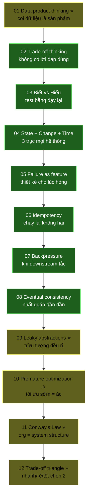

# Module F00 — Mental Models

> Tư duy nền cho mọi engineer. Đọc trước mọi thứ khác. Không có 12 cái này thì 650 KUs còn lại đọc xong vẫn rỗng.

---

## 🧠 Mental model là gì?

**Mental model** = mô hình tư duy = cách bạn *hình dung* 1 vấn đề trước khi viết bất kỳ dòng code nào.

Senior khác junior không phải ở "biết nhiều tool hơn". Senior khác ở:
- Hình dung được trade-off trước khi code
- Biết failure sẽ xảy ra ở đâu
- Biết khi nào "đủ tốt" để dừng
- Đọc org chart đoán architecture
- Phân biệt premature từ just-in-time

12 KU dưới đây là 12 mô hình tư duy cốt lõi của project này — và của hầu hết hệ thống data + AI hiện đại 2026.

---

## 🗺 Đường đi

**Chú thích:** ⭐ = v2 chuẩn university-grade (16-section, ~3000 từ). Các KU không ⭐ là v1 cũ (~1000 từ, đang plan rewrite).

---

## 📚 KU list

| # | KU | Đọc trong | Chuẩn | Status |
|---:|---|---:|:---:|---|
| 01 | [Tư duy data product](./01-data-product-thinking.md) | 12' | v2 ⭐ | ✅ |
| 02 | [Trade-off thinking](./02-trade-off-thinking.md) | 10' | v1 | ✅ |
| 03 | [Biết vs Hiểu](./03-know-vs-understand.md) | 6' | v1 | ✅ |
| 04 | [State + Change + Time](./04-state-change-time.md) | 10' | v1 | ✅ |
| 05 | [Failure as a feature](./05-failure-as-feature.md) | 10' | v1 | ✅ |
| 06 | [Idempotency](./06-idempotency.md) | 8' | v1 | ✅ |
| 07 | [Backpressure](./07-backpressure.md) | 10' | v1 | ✅ |
| 08 | [Eventual consistency](./08-eventual-consistency.md) | 10' | v1 | ✅ |
| 09 | [Leaky abstractions](./09-leaky-abstractions.md) | 12' | v2 ⭐ | ✅ |
| 10 | [Premature optimization](./10-premature-optimization.md) | 10' | v2 ⭐ | ✅ |
| 11 | [Conway's Law](./11-conways-law.md) | 10' | v2 ⭐ | ✅ |
| 12 | [Trade-off triangle](./12-trade-off-triangle.md) | 12' | v2 ⭐ | ✅ |
| Q | [Mini-quiz Module 00](./MINI-QUIZ.md) | 15' | v1 | ✅ |

**Tổng đọc:** ~130 phút (~2.2 giờ).

---

## ✅ Sau khi học xong F00, bạn có thể

1. Giải thích "vì sao project này có chaos catalog" cho non-tech (= Failure as feature)
2. Hiểu vì sao mọi producer phải idempotent (= Idempotency + Eventual consistency)
3. Hiểu vì sao lakehouse + streaming có thể cùng tồn tại (= State+Change+Time)
4. Tự tin trả lời câu hỏi: "anh em đánh đổi gì khi chọn Iceberg?" (= Trade-off thinking + Trade-off triangle)
5. **Đọc bất kỳ ADR** trong [`adr/`](../../adr/) và hiểu trade-off đã chosen (= cả Module này)
6. **Pushback** yêu cầu vô lý "fast + cheap + good" với cấu trúc rõ ràng (= Trade-off triangle)
7. **Đoán architecture** của 1 công ty từ org chart (= Conway's Law)
8. **Tránh death march** + premature optimization trap (= KU 10 + 12)
9. Debug "leak" của abstraction stack mà không hoang mang (= Leaky abstractions)
10. Test mức hiểu của chính mình + người khác (= Biết vs Hiểu)

---

## 🔗 Cross-references

12 KU này là **prerequisites** cho mọi module sau:

- **F11 Distributed Systems Theory** dùng KU 04, 06, 07, 08
- **F12 System Design Fundamentals** dùng KU 02, 05, 10, 11, 12
- **D26 Observability & SRE** dùng KU 05, 12
- **D27 Governance & Lineage** dùng KU 01, 11
- **D33 AI Agents** dùng KU 09 (LLM as leaky abstraction)
- **D37 Chaos & Reliability** dùng KU 05 (failure as feature)
- **D40 Solution Architecture** dùng KU 02, 10, 11, 12 (mọi quyết định)
- **D42 Soft Skills** dùng KU 03 (giải thích cho non-tech)

---

## 📖 Đọc thêm sau khi xong F00

3 sách thấm nhất cho mental models:

- **Reis & Housley, Fundamentals of Data Engineering** — Chapter 1-3 (Data engineering described, Lifecycle, Good Architecture). [Library link](../../library/books/data-engineering/Reis-Housley_2022_Fundamentals-of-Data-Engineering.pdf)
- **Martin Kleppmann, Designing Data-Intensive Applications** — Chapter 1 (Reliable, Scalable, Maintainable Apps) + Chapter 8 (Trouble with Distributed Systems). [Library link](../../library/books/distributed-systems/Kleppmann_2017_Designing-Data-Intensive-Applications.pdf)
- **Google SRE Book** — Chapter 1-5 (SRE basics, Embracing Risk, SLO, Eliminating Toil, Monitoring). [Library link](../../library/books/sre-observability/Google_2016_Site-Reliability-Engineering.pdf)
