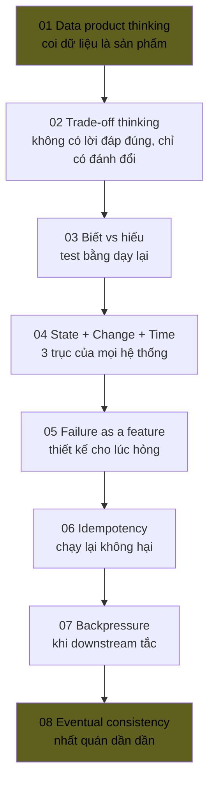

# Module 00 — Mental Models

> Tư duy nền. Đọc trước mọi thứ khác. Không có 8 cái này thì 160 KUs còn lại đọc xong vẫn rỗng.

---

## Mental model là gì?

**Mental model = mô hình tư duy** = cách bạn *hình dung* 1 vấn đề trước khi viết bất kỳ dòng code nào.

Senior khác junior không phải ở "biết nhiều tool hơn". Senior khác ở:
- Hình dung được tradeoff trước khi code
- Biết failure sẽ xảy ra ở đâu
- Biết khi nào "đủ tốt" để dừng

8 KUs dưới đây là 8 mô hình tư duy cốt lõi của project này — và của hầu hết hệ thống data + AI hiện đại.

---

## Đường đi

---

## KU list

| # | KU | Đọc trong | Status |
|---:|---|---:|---|
| 01 | [Tư duy data product](./01-data-product-thinking.md) | 8' | 🟡 |
| 02 | [Trade-off thinking](./02-trade-off-thinking.md) | 10' | 🟡 |
| 03 | [Biết vs hiểu](./03-know-vs-understand.md) | 6' | 🟡 |
| 04 | [Hệ thống = state + change + time](./04-state-change-time.md) | 10' | 🟡 |
| 05 | [Failure as a feature](./05-failure-as-feature.md) | 10' | 🟡 |
| 06 | [Idempotency trong đời sống](./06-idempotency.md) | 8' | 🟡 |
| 07 | [Backpressure giống tắc đường](./07-backpressure.md) | 10' | 🟡 |
| 08 | [Eventual consistency = thư rủ về quê](./08-eventual-consistency.md) | 10' | 🟡 |
| Q | [Mini-quiz Module 00](./MINI-QUIZ.md) | 15' | 🟡 |

Tổng đọc: ~90 phút (1.5h).

---

## Sau khi học xong M00, bạn có thể

- Giải thích được "vì sao project này có chaos catalog" cho non-tech
- Hiểu vì sao mọi producer phải idempotent (= KU 06)
- Hiểu vì sao lakehouse + streaming có thể cùng tồn tại (= KU 04 + 08)
- Tự tin trả lời câu hỏi: "anh em đánh đổi gì khi chọn Iceberg?" (= KU 02)
