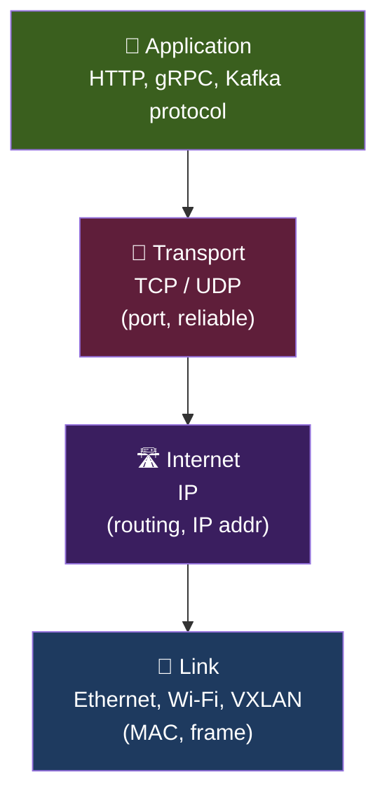
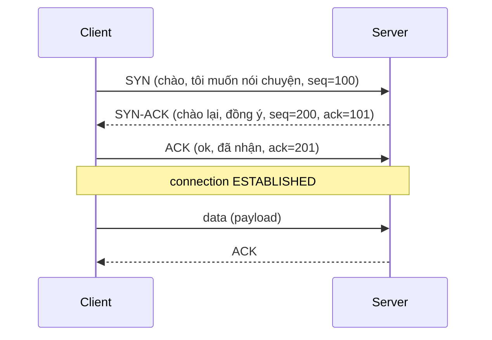
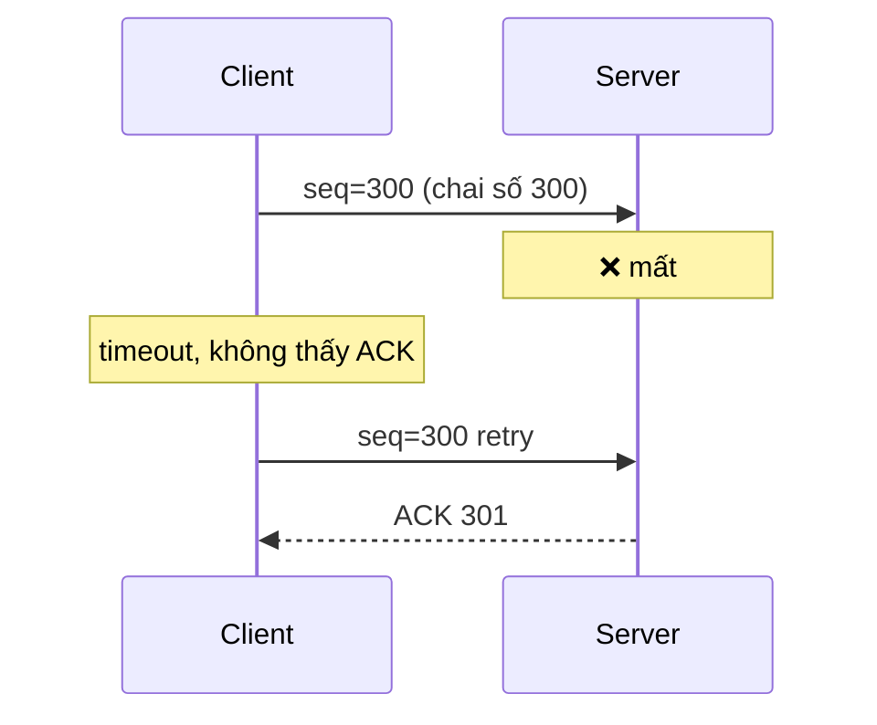

# KU 01/01 — TCP/IP nhìn từ ly cà phê

> Bạn rót cà phê từ bình ra ly. TCP/IP cũng như vậy: chia thành ngụm, đảm bảo từng ngụm tới đúng nơi, đúng thứ tự.

**Module:** [01 — Foundations](./README.md)
**Đọc trong:** ~10 phút

---

## 🎯 Nó là gì?

Bạn pha 1 ly cà phê **300ml** cho bạn ở quán. Ly không thể đi từ bàn pha đến bàn khách nguyên ly — nó vỡ. Quy trình thực:

1. Đổ vào **chai nhựa nhỏ** (gói tin / packet).
2. Đánh số **chai số 1, 2, 3** (sequence number).
3. Đưa chai qua hành lang **không cần đợi từng chai** (mỗi chai đi riêng).
4. Bàn khách nhận đủ → **xếp lại** theo số → đổ ngược ra ly.
5. Nếu chai số 2 lạc đường → **gọi điện báo pha lại chai 2**.

Đó là TCP/IP:
- **IP** = đưa chai từ A đến B qua hành lang (routing).
- **TCP** = đánh số chai, đảm bảo đủ, đúng thứ tự, gửi lại nếu mất (reliable transport).

> *Định nghĩa hàn lâm:* TCP/IP là bộ giao thức 4 lớp (Link / Internet / Transport / Application) chia dữ liệu thành packet, định tuyến qua mạng, và đảm bảo (TCP) hoặc không đảm bảo (UDP) độ tin cậy.

---

## 💡 Nó làm được gì?

TCP/IP cho phép 2 máy nói chuyện qua mạng dù:
- Mạng có lỗi tạm thời (mất gói, trễ).
- Tuyến đường thay đổi giữa chừng.
- Máy đích nhận gói **không đúng thứ tự** (vẫn ráp lại đúng).
- Không quan tâm hệ điều hành / phần cứng 2 đầu là gì.

Cụ thể trong project này:
- Producer Kafka gửi event → đi qua TCP đến Redpanda broker.
- Flink kết nối Iceberg REST catalog → HTTP/TCP.
- Browser mở Grafana → HTTPS/TCP.
- Postgres replication → TCP với MD5 auth.

---

## 🧩 Nó là mảnh ghép nào trong tổng thể?

4 lớp TCP/IP, đếm từ thấp đến cao:

Mỗi lớp **chỉ nói chuyện với** lớp trên + lớp dưới của nó. Đây là **encapsulation**: lớp trên không cần biết lớp dưới hoạt động ra sao.

→ Trong project này, **VXLAN** (KU 13/03) chèn vào layer Link — gọi là **overlay**.

---

## 🚀 Nó giúp ích gì?

**Trước khi TCP/IP chuẩn hoá** (1970s), mỗi mạng nói chuyện 1 kiểu riêng. Muốn nối 2 mạng → viết phần mềm dịch.

**Sau TCP/IP:**
- Mọi máy, mọi OS, mọi mạng nói chuyện được — chỉ cần "biết IP + port".
- Internet trở nên khả thi.
- Mọi app distributed (Kafka, Flink, MinIO) chỉ cần socket layer là chạy.

---

## ⏰ Khi nào dùng / KHÔNG dùng?

TCP/IP là **default** cho hầu hết app. 2 lựa chọn:

| Loại | Ưu | Nhược | Khi dùng |
|---|---|---|---|
| **TCP** | Reliable, ordered, retry tự động | Chậm hơn UDP, overhead handshake | Kafka, HTTP, DB, file transfer |
| **UDP** | Nhanh, không handshake | Mất gói im lặng, không order | DNS query, video streaming, gaming, syslog |

Trong project này: **99% TCP**. Prometheus scrape (HTTP), Kafka, gRPC, Postgres, MinIO — đều TCP. UDP chỉ dùng: DNS (KU 01/02) và đôi khi VXLAN encapsulation (sẽ thấy ở Module 13).

---

## 🤔 Vì sao chọn nó (vs alternatives)?

| Protocol | Ưu | Nhược |
|---|---|---|
| **TCP/IP** (cái này) | Reliable, mọi nơi support | Có overhead |
| **QUIC** (mới) | Nhanh hơn TCP cho web, UDP-based | Còn mới, tooling chưa đầy đủ cho data plane |
| **RDMA** | Cực nhanh, bypass kernel | Cần hardware đặc biệt (Infiniband, RoCE) |
| **TCP/IP** với tuning (kernel bypass DPDK) | Nhanh hơn nhiều | Phức tạp, không phải mọi app dùng |

→ TCP/IP standard là 99% trường hợp. RDMA là chuyện của HPC / AI factory (DSX Air mô phỏng được Spectrum-X RDMA — đáng học khi cần).

---

## 🔧 Nó vận hành ra sao?

### Handshake 3 bước (TCP three-way handshake)

**Why 3 bước?** Đảm bảo cả 2 phía: (1) muốn nói, (2) sẵn sàng, (3) đồng bộ sequence number.

### Khi mất gói

Đây là **lý do TCP "reliable"** — tự retry khi mất ACK.

### Đóng connection

`FIN` từ 1 phía → ACK → `FIN` từ phía kia → ACK. Connection state machine có 11 trạng thái (CLOSED, LISTEN, SYN_SENT, ESTABLISHED, FIN_WAIT_1, ...). Senior phải biết `TIME_WAIT` là gì (giữ 2*MSL ~120s sau close, lý do nhiều port bị "stuck").

---

## 🧠 Self-test

1. Ly cà phê 300ml chia 3 chai. Chai số 2 lạc giữa đường. Pha cà phê có "biết" không? Liên hệ TCP → biết nhờ gì?
2. UDP nhanh hơn TCP. Vì sao Kafka, Postgres, MinIO vẫn dùng TCP?
3. 3-way handshake có 3 bước. Bỏ bước 3 thì sao? Bỏ bước 2 thì sao?
4. Bạn `curl http://node-event:9092` — bao nhiêu lớp TCP/IP được dùng? Đặt tên mỗi lớp.
5. VXLAN ở layer nào trong 4 lớp TCP/IP? (Sẽ confirm ở Module 13).

---

## 🔗 Trong repo này

- Network plan dùng layer Internet (IP): [`docs/03-network-fabric-design.md`](../../docs/03-network-fabric-design.md)
- Mọi service trong `platform/docker-compose.*.yml` dùng TCP port để expose
- VXLAN overlay (Module 13) chèn vào Link layer

---

## 📖 Đọc thêm (chính thống, hạn chế)

- Stevens W.R. — "TCP/IP Illustrated Vol 1" — kinh điển, kèm hình packet trace.
- RFC 793 — TCP specification gốc.
