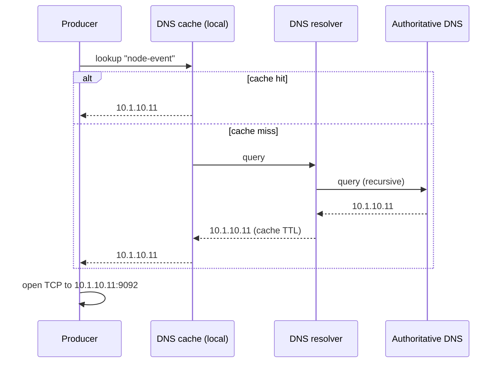

# KU 01/02 — DNS: danh bạ điện thoại của internet

> Bạn không nhớ số điện thoại — bạn nhớ "anh Nam". DNS làm cùng việc cho máy tính: dịch tên dễ nhớ thành địa chỉ máy hiểu (IP).

**Module:** [01 — Foundations](./README.md)
**Đọc trong:** ~6 phút

---

## 🎯 Nó là gì?

Trong sổ danh bạ:
- Bạn nhớ "**Anh Nam Bình Thạnh**" — không nhớ `+84903123456`.
- Lưu trong sổ: `Anh Nam Bình Thạnh → +84903123456`.
- Đổi số → cập nhật trong sổ, tên bạn lưu vẫn vậy.

DNS (Domain Name System):
- Bạn gõ `node-event` → DNS dịch thành `10.1.10.11`.
- Lưu trong server DNS: `node-event → 10.1.10.11`.
- Đổi IP → cập nhật DNS, tên không đổi.

> *Định nghĩa hàn lâm:* DNS là hệ thống phân cấp phân tán dịch tên miền sang IP, dùng UDP/TCP cổng 53. Phân cấp: root (`.`) → TLD (`.com`) → second-level (`example.com`) → host (`www.example.com`).

---

## 💡 Nó làm được gì?

- **Dễ nhớ:** `kafka.internal` vs `10.1.10.11:9092`.
- **Tách phối ghép:** đổi IP mà không phá code (chỉ cập nhật DNS).
- **Load balancing đơn giản:** 1 tên → 3 IP, client lần lượt thử.
- **Service discovery:** Kubernetes, Consul dùng DNS để client tìm service.

---

## 🧩 Nó là mảnh ghép nào trong tổng thể?

Trong project này:
- `/etc/hosts` trên bastion ánh xạ `node-event → IP OOB` (hostfile-based DNS).
- Container internal: docker-compose tạo network → service name = DNS name (Redpanda thấy `postgres-oltp` như tên).

---

## 🚀 Nó giúp ích gì?

**Không** DNS:
- Mỗi đổi IP → sửa code → redeploy → đau.
- Service discovery thủ công.
- Code đầy IP literals → cấu hình rối.

**Có** DNS:
- Cấu hình bằng tên — đổi IP chỉ sửa 1 nơi.
- Failover dễ (đổi A record).
- Multi-region: client tìm tới region gần nhất qua GeoDNS.

---

## ⏰ Khi nào dùng / KHÔNG dùng?

| ✅ Dùng | ❌ Không cần |
|---|---|
| Service-to-service intra-cluster | Connection 1-to-1 hardcoded tạm thời |
| Internet-facing service | Test trên localhost |
| Production environment | Notebook prototype |

→ Mọi project production-bound đều dùng DNS.

---

## 🤔 Vì sao chọn nó (vs alternatives)?

| Cách | Khi nào dùng |
|---|---|
| **DNS** | Mọi nơi (default) |
| **Hostfile (`/etc/hosts`)** | Lab nhỏ, override DNS tạm |
| **Service mesh (Consul / Envoy)** | Multi-region, complex routing |
| **Static IP** | Chỉ cho test cực ngắn |

DNS là **bottom layer** — service mesh chạy trên DNS, không thay thế.

---

## 🔧 Nó vận hành ra sao?

**Record types** chính:
- **A record:** name → IPv4 (`node-event` → `10.1.10.11`)
- **AAAA:** name → IPv6
- **CNAME:** alias (`api` → `api-v2.internal`)
- **MX:** mail server
- **TXT:** metadata (SPF, DKIM)
- **SRV:** service location (port + host)
- **PTR:** reverse lookup (IP → name)

**TTL (Time To Live):** mỗi record có TTL, ví dụ `3600` giây — sau đó client phải resolve lại. TTL ngắn = đổi nhanh nhưng tốn DNS query.

**Caching ở nhiều tầng:**
1. Browser cache (vài phút)
2. OS cache (`/etc/nsswitch.conf`)
3. Resolver cache (ISP, hoặc cluster DNS như CoreDNS)
4. Authoritative server

→ Đổi DNS record xong vẫn thấy IP cũ vài phút? Vì cache. Đó là lý do "DNS propagation" hay được nhắc.

---

## 🧠 Self-test

1. DNS TTL = 86400 nghĩa là gì? Nó ảnh hưởng "DNS propagation" thế nào?
2. CNAME khác A record ở điểm nào? Khi nào CNAME hữu ích?
3. Trong docker-compose, container A "thấy" container B qua tên B — tại sao? (Gợi ý: Docker tự tạo gì?)
4. SRV record giúp ích gì so với A record?
5. Vì sao đổi IP server xong vẫn có user phàn nàn "không truy cập được" sau 30 phút?

---

## 🔗 Trong repo này

- `infra/ansible/inventory.ini.example` dùng hostname (DNS / hostfile)
- docker-compose sẽ tạo DNS nội bộ — service tham chiếu nhau bằng tên (sẽ thấy ở `platform/docker-compose.session-a.yml` khi Phase 4 generate)

---

## 📖 Đọc thêm (chính thống, hạn chế)

- RFC 1034, 1035 — DNS standards.
- "DNS and BIND" (Cricket Liu) — kinh điển nếu muốn rất sâu.
