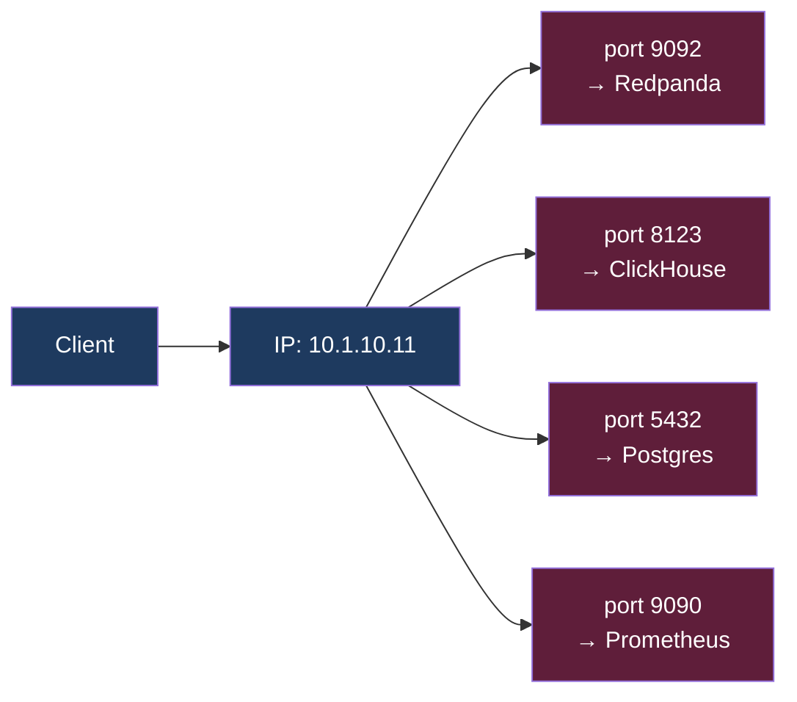

# KU 01/03 — Port: số phòng trong toà nhà

> Một toà nhà có 1 địa chỉ nhưng nhiều phòng. Máy tính có 1 IP nhưng nhiều port. Port = số phòng. Mỗi service "ở" 1 port riêng.

**Module:** [01 — Foundations](./README.md)
**Đọc trong:** ~6 phút

---

## 🎯 Nó là gì?

Toà chung cư **15 tầng, mỗi tầng 6 phòng**. Đứa bạn nhắn:
> "Đến nhà mình chơi: chung cư Bình Thạnh, **phòng 805**."

Bạn cần cả **địa chỉ chung cư** + **số phòng** mới tới đúng. Phòng 805 có gia đình anh Nam, phòng 806 là cô Hà — 2 phòng khác nhau cùng địa chỉ.

Trong máy tính:
- IP = địa chỉ chung cư (`10.1.10.11`).
- Port = số phòng (`9092` cho Redpanda, `8123` cho ClickHouse, `5432` cho Postgres).
- Mỗi service "ở" 1 port → cùng máy có nhiều service không đụng nhau.

> *Định nghĩa hàn lâm:* Port là số 16-bit (0–65535) ở layer Transport (TCP/UDP) xác định endpoint trên 1 host. Cùng IP nhưng khác port → khác service.

---

## 💡 Nó làm được gì?

- Cho phép **nhiều service** cùng chạy trên **1 máy**.
- Cho phép **routing app-level** (HTTP server → port 80/443, SSH → 22).
- Cho phép **firewall** chặn / mở từng service.
- Cho phép **port forwarding** (đẩy port từ container ra host).

---

## 🧩 Nó là mảnh ghép nào trong tổng thể?

Port nằm ở **Transport layer** (KU 01/01).



→ 1 IP + 4 port = 4 service riêng biệt.

---

## 🚀 Nó giúp ích gì?

Trong project này, mỗi node DSX Air chạy nhiều container:

| Node | Service | Port |
|---|---|---:|
| node-event | Redpanda Kafka API | 9092 |
| node-event | Schema Registry | 8081 |
| node-event | Redpanda Console | 8080 |
| node-stream | Flink JobManager | 8081 |
| node-stream | Flink TaskManager | 6121 |
| node-lake | MinIO API | 9000 |
| node-lake | MinIO Console | 9001 |
| node-lake | Iceberg REST catalog | 8181 |
| node-serve | ClickHouse HTTP | 8123 |
| node-serve | ClickHouse Native | 9000 |
| node-serve | Redis | 6379 |
| node-serve | FastAPI | 8000 |
| node-serve | Trino | 8080 |
| node-obs | Prometheus | 9090 |
| node-obs | Grafana | 3000 |
| node-obs | Loki | 3100 |
| node-obs | Marquez | 3001 |

→ **port là không gian phân vùng** dịch vụ.

---

## ⏰ Khi nào dùng / KHÔNG dùng?

Port luôn dùng. Vấn đề chỉ là **chọn port nào**:

- **0–1023:** well-known (HTTP 80, HTTPS 443, SSH 22, DNS 53). Cần root để bind.
- **1024–49151:** registered (Postgres 5432, Redis 6379, …). Tự do nhưng nên theo chuẩn.
- **49152–65535:** ephemeral (client tự pick khi mở connection).

Tip: **đừng tự ý chọn port lạ** cho service phổ biến. Mọi monitoring / alerting tool đoán port chuẩn — đổi port = vỡ default.

---

## 🤔 Vì sao chọn nó (vs alternatives)?

Không có alternative cho port. Có **các cách bind / forward**:

| Cách | Khi dùng |
|---|---|
| **Direct bind** | Service listen trực tiếp |
| **Port forwarding** | Docker `-p 9092:9092` đẩy port container ra host |
| **Reverse proxy** | Nginx/Envoy chia 1 port (443) cho nhiều service theo host header |
| **TCP-level proxy** | HAProxy chia traffic theo client IP / SNI |

Trong project này: Docker port forwarding + reverse proxy (Nginx) cho dịch vụ public.

---

## 🔧 Nó vận hành ra sao?

### Khi 2 service cùng cố bind port

```bash
$ docker run -p 8080:8080 service-a
# Service A đã bind 8080 trên host

$ docker run -p 8080:8080 service-b
# Error: bind: address already in use
```

→ Chỉ 1 service được listen 1 port tại 1 thời điểm. Nhiều client connect cùng lúc — OK (TCP tách bằng `(src IP, src port, dst IP, dst port)`).

### Port forwarding trong Docker


`-p 9092:9092` đọc là `host_port:container_port`.

### Port conflict trong project này

Lý do tôi gán **node** riêng cho mỗi service nặng: tránh port conflict + isolation lỗi. Nếu pack 5 service vào 1 node → mỗi service phải dùng port khác nhau + risk crash kéo theo.

---

## 🧠 Self-test

1. 1 máy IP = `10.1.10.11`. Có thể vừa chạy Redpanda port 9092 vừa MinIO port 9000 không?
2. Vì sao **2** service không thể cùng bind port `9092` trên 1 host?
3. Khi 1000 client connect đến `10.1.10.11:9092` cùng lúc — connection nào dùng port 9092 ở Redpanda? (Câu này test hiểu "tuple identifies connection").
4. `docker run -p 9092:9092` — số 9092 nào là host, số nào là container?
5. Vì sao SSH chạy port 22 mà không phải 2222?

---

## 🔗 Trong repo này

- Bảng port mapping: [`docs/04-compute-platform.md`](../../docs/04-compute-platform.md) + sẽ chi tiết trong `platform/docker-compose.*.yml` (Phase 4)
- Security: chỉ Grafana, FastAPI, Marquez expose ra ngoài; còn lại internal-only: [`docs/14-security-zero-trust.md`](../../docs/14-security-zero-trust.md)

---

## 📖 Đọc thêm (chính thống, hạn chế)

- IANA Port Numbers Registry — danh sách port chính thức.
- "Computer Networking: A Top-Down Approach" — chương Transport layer.
