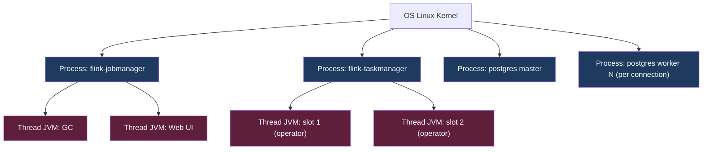
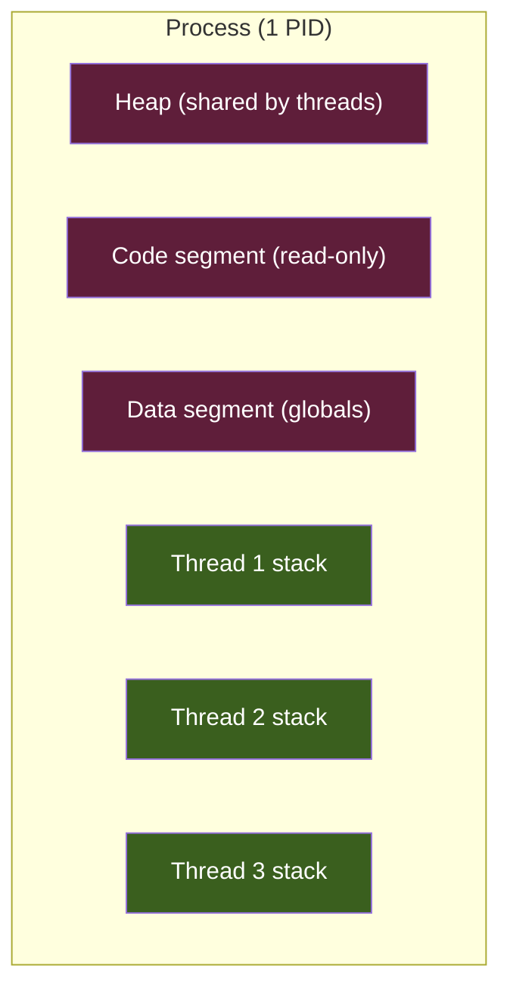

# KU 01/04 — Process vs Thread: thợ vs ca làm

> Process = 1 thợ riêng có bộ đồ nghề riêng. Thread = 1 ca làm trong cùng người thợ — dùng chung bộ đồ nghề. Hiểu khác biệt = hiểu vì sao JVM OOM trong khi RAM máy còn nhiều.

**Module:** [01 — Foundations](./README.md)
**Đọc trong:** ~8 phút

---

## 🎯 Nó là gì?

**Trong tiệm sửa xe:**

- **1 thợ riêng** (process): có kệ đồ nghề riêng, không cho ai dùng kệ của mình. Sửa được nhiều xe nhưng phải dọn kệ giữa các lần.
- **1 thợ + nhiều ca làm cùng người thợ** (multi-thread): cùng kệ đồ nghề chung. Nhanh hơn vì không phải dọn — nhưng nếu 2 ca cùng lúc với cái cờ-lê → tranh nhau.

Trong OS:

- **Process** = 1 chương trình đang chạy, có **bộ nhớ RAM riêng**, **file descriptor riêng**, **PID riêng**. Hệ điều hành tách bạch.
- **Thread** = "luồng thực thi" bên trong 1 process, **dùng chung RAM** của process. Nhẹ hơn process nhưng dễ race condition.

> *Định nghĩa hàn lâm:* Process là đơn vị cấp phát resource của OS. Thread là đơn vị lập lịch của CPU bên trong 1 process. Linux dùng "task" cho cả 2 (clone() với flag khác).

---

## 💡 Nó làm được gì?

- **Process:** chạy 2 phiên bản nginx → mỗi cái 1 process, an toàn nếu 1 crash.
- **Thread:** nginx 1 process nhưng 8 thread worker → tận dụng 8 core, share cấu hình.

Cụ thể trong project này:
- **Postgres:** 1 process master + nhiều process con (1 connection = 1 process trong PG).
- **Flink TaskManager:** 1 JVM process, bên trong nhiều thread (slot).
- **Redpanda:** 1 process C++ với async I/O, ít thread.
- **ClickHouse:** 1 process, nhiều thread per query.

---

## 🧩 Nó là mảnh ghép nào trong tổng thể?

→ Process là **vùng cấp phát**, thread là **đơn vị thi hành**.

---

## 🚀 Nó giúp ích gì?

Hiểu process/thread giúp debug:

- **OOMKiller giết container Flink:** không phải hết RAM máy, mà hết RAM **cgroup** của container (cgroup giới hạn process). Mỗi thread JVM thêm stack ~256KB-1MB.
- **Postgres "too many connections":** mỗi connection = 1 process → tốn RAM. Solution: pgbouncer (proxy).
- **JVM Flink dùng heap nhưng off-heap state phình:** RocksDB state trong native memory, không bị heap limit. → cần `taskmanager.memory.managed.size` đủ.
- **Container restart vì exit code 137:** = `SIGKILL` từ OOM-killer, đa phần là quá RAM cgroup.

---

## ⏰ Khi nào chọn process vs thread?

| Tình huống | Chọn |
|---|---|
| Crash isolation quan trọng | Process |
| Cần share state in-memory tốc độ cao | Thread |
| Đa ngôn ngữ (C + Python) | Process + IPC |
| Web server xử lý nhiều request | Thread (hoặc async event-loop) |
| Sandbox / multi-tenant | Process (1 tenant 1 process) |

Trong project này — **mỗi container = 1 process chính + thread bên trong**. Container isolation = process isolation từ Linux cgroups + namespaces (KU 01/05).

---

## 🤔 Vì sao chọn nó (vs alternatives)?

| Mô hình | Ưu | Nhược |
|---|---|---|
| **Multi-process** | Crash isolation tốt nhất | Memory tốn (mỗi process bản memory) |
| **Multi-thread** | Share state nhanh | 1 thread crash có thể crash process |
| **Event-loop async** (Node.js, nginx) | Tận dụng I/O, low overhead | CPU-bound task chặn loop |
| **Coroutines / goroutines** (Go) | Nhẹ, scale tốt | Cần runtime hỗ trợ |
| **Actor model** (Erlang, Akka) | Crash isolation + concurrency | Học khó |

→ Modern data systems thường combo: **process per service** + **async I/O + threads** bên trong.

---

## 🔧 Nó vận hành ra sao?

### Linux dưới capo

`fork()` tạo process con clone từ process cha. `clone()` linh hoạt hơn — flag quyết định share gì:
- `CLONE_VM` → share memory → đây là thread.
- Không share → đây là process.

→ Trong Linux, **thread chỉ là "process share memory"**. Tooling: `ps`, `top`, `htop -H` (show thread).

### Memory model

→ Threads cùng process **share heap** — đây là sức mạnh (share state) và yếu điểm (race condition).

### Synchronization

Khi 2 thread cùng đọc/ghi 1 biến: cần **mutex / lock / atomic / channel**.

→ Race condition = "2 thread cùng đụng vào cờ-lê" trong analogy tiệm sửa xe.

---

## 🧠 Self-test

1. Tiệm sửa xe có 3 thợ riêng vs 1 thợ + 3 ca làm — đâu là process, đâu là thread?
2. Postgres 1000 connection tốn rất nhiều RAM. Vì sao? Giải pháp pgbouncer giảm bằng cách nào?
3. Exit code 137 trong Docker nghĩa là gì? Process bị giết bởi ai?
4. JVM Flink dùng heap = 4GB. Container memory limit = 6GB. Vì sao có lúc vẫn OOM dù heap chưa đầy?
5. 2 thread cùng `counter += 1` không có lock → kết quả có deterministic không? Vì sao?

---

## 🔗 Trong repo này

- Memory limit per container: `platform/docker-compose.*.yml` (sẽ có ở Phase 4)
- Node memory sizing: [`docs/04-compute-platform.md`](../../docs/04-compute-platform.md) — RAM column
- Flink memory model: [`docs/08-stream-processing.md`](../../docs/08-stream-processing.md) — taskmanager memory section

---

## 📖 Đọc thêm (chính thống, hạn chế)

- "Operating Systems: Three Easy Pieces" (Remzi Arpaci-Dusseau) — free book, chương concurrency cực dễ hiểu.
- Linux man page `pthreads(7)` — chính thống.
