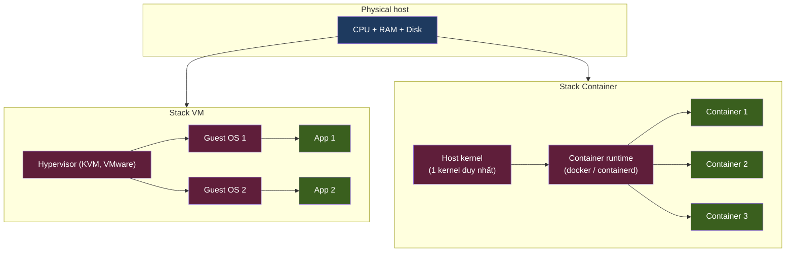
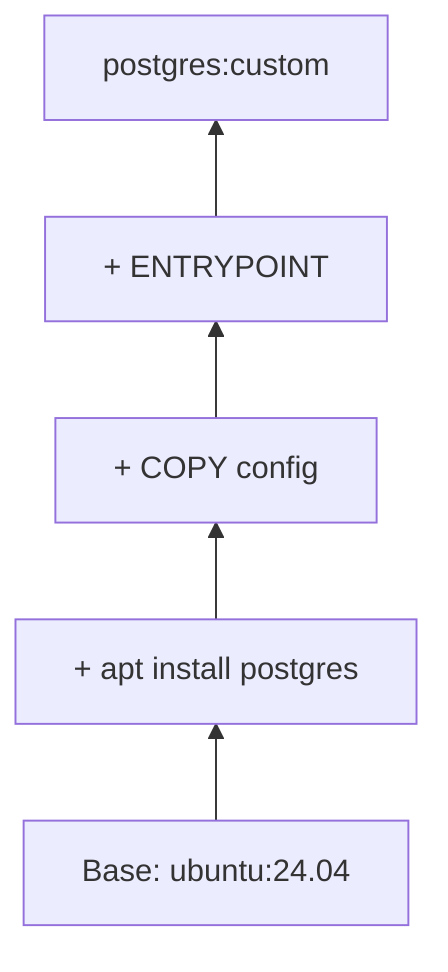

# KU 01/05 — Container vs VM: phòng trọ vs căn hộ

> VM = căn hộ riêng có bếp + WC + sàn riêng. Container = phòng trọ trong nhà chung — riêng giường, riêng tủ, **chung bếp + chung WC**. Khác nhau ở **mức cô lập** và **chi phí**.

**Module:** [01 — Foundations](./README.md)
**Đọc trong:** ~8 phút

---

## 🎯 Nó là gì?

**VM (Virtual Machine):**
- Mỗi VM có OS riêng (Linux của bạn), kernel riêng, driver riêng.
- Như căn hộ chung cư: tường ngăn cách hoàn toàn, có ổ điện riêng, đường ống riêng.
- Mỗi VM tốn ~500MB-1GB RAM cho OS, dù chỉ chạy 1 service nhỏ.

**Container:**
- Tất cả share **chung 1 kernel host**, chỉ tách bạch userspace.
- Như phòng trọ: chung mái nhà + hệ thống điện, nhưng phòng có khoá riêng, tủ riêng.
- 1 container có thể chỉ tốn 10-50MB RAM cho process.

> *Định nghĩa hàn lâm:* VM là máy ảo chạy đầy đủ OS độc lập trên hypervisor. Container là process Linux được cô lập bằng **namespaces** (PID, mount, network, user…) và giới hạn bằng **cgroups** (CPU, RAM, I/O), share kernel với host.

---

## 💡 Nó làm được gì?

**VM:**
- Chạy OS khác host (Windows VM trên macOS).
- Cô lập tuyệt đối kernel-level (security-sensitive).
- Live-migrate giữa host vật lý.

**Container:**
- Đóng gói app + dependency thành 1 image, chạy đâu cũng giống nhau.
- Start nhanh (~giây), VM mất ~phút.
- Pack 50-100 container 1 host, VM thì 5-10.
- Layered image = chỉ download phần thay đổi.

---

## 🧩 Nó là mảnh ghép nào trong tổng thể?

→ VM có thêm tầng "Guest OS" — đó là chỗ tốn RAM thừa so với container.

---

## 🚀 Nó giúp ích gì?

Trong project này: **mọi data service đều chạy trong container** trên Ubuntu nodes của DSX Air. Vì sao?

- **Reproducibility:** Redpanda image cùng version → giống nhau mọi node.
- **Tốc độ:** Up Flink trong 10s, không phải boot OS.
- **Density:** 4-6 service / node 8GB RAM khả thi với container; với VM thì 2-3 service.
- **Network simulation:** DSX Air đã là VM (node = VM simulated). Container chạy trên đó → 2 lớp cô lập là đủ.

---

## ⏰ Khi nào dùng / KHÔNG dùng?

| Tình huống | Chọn |
|---|---|
| Cô lập security tuyệt đối (multi-tenant cloud) | VM |
| Chạy OS khác host | VM |
| Microservice / data platform | Container |
| Test reproducibility | Container |
| Edge / IoT (memory hạn chế) | Container |
| Sandbox cho code không tin tưởng | VM (hoặc gVisor — container hardened) |

**Hybrid:** trong project này = **VM (DSX Air node) + Container (Docker bên trong)**. Đó là pattern chuẩn của cloud hiện đại — EKS node là EC2 (VM), pod là container.

---

## 🤔 Vì sao chọn nó (vs alternatives)?

| Công nghệ | Cô lập | RAM overhead | Start time | Khi dùng |
|---|---|---|---|---|
| **VM** | Tuyệt đối (kernel riêng) | High (~1GB/VM) | Phút | Multi-tenant cloud, security boundary |
| **Container** (cái này) | Cao (namespace/cgroup) | Low (10-50MB) | Giây | Microservice, data platform |
| **gVisor / Kata** | Trung gian — container "có kernel" | Vừa | Vừa | Untrusted code |
| **WebAssembly (WASM)** | Cô lập runtime-level | Cực thấp | Ms | Plugin / edge function |

→ Container = sweet spot cho data platform.

---

## 🔧 Nó vận hành ra sao?

### Namespaces (cô lập view)

Process trong container "thấy":
- PID namespace: ID 1 là init của container, không thấy host process.
- Mount namespace: filesystem riêng (`/`, `/etc/...` của image).
- Network namespace: interface riêng, IP riêng.
- UTS namespace: hostname riêng.
- User namespace: UID mapping (UID 0 trong container ≠ root host).

### cgroups (giới hạn resource)

OS giới hạn:
- CPU: container A max 2 cores.
- Memory: container A max 4GB → vượt → SIGKILL (= exit code 137).
- I/O: max IOPS, bandwidth.
- PIDs: max 1024 process.

### Image layering

Mỗi lệnh `Dockerfile` = 1 layer. Pull image chỉ tải layer mới → bandwidth tiết kiệm.

---

## 🧠 Self-test

1. Bạn có 8GB RAM host. Chạy được bao nhiêu VM Ubuntu trống (mỗi cái ~1GB OS) vs bao nhiêu container Ubuntu?
2. Container A `docker run -m 512m` (limit 512MB RAM). App bên trong xài hết. Hiện tượng gì? (Exit code?)
3. Vì sao `docker pull` lần 2 nhanh hơn lần 1 nhiều dù cùng image?
4. Container có "kernel riêng" không? VM thì có?
5. DSX Air node là VM hay container? Trong DSX Air node, ta dùng VM hay container để chạy Redpanda?

---

## 🔗 Trong repo này

- Ansible playbook cài Docker engine: [`infra/ansible/playbooks/01-docker.yml`](../../infra/ansible/playbooks/01-docker.yml)
- Sizing memory cho container per service: [`docs/04-compute-platform.md`](../../docs/04-compute-platform.md)
- ADR-0008 time-multiplex (cũng nói về RAM budget mỗi container): [`adr/0008-time-multiplex-sessions.md`](../../adr/0008-time-multiplex-sessions.md)

---

## 📖 Đọc thêm (chính thống, hạn chế)

- "Container Networking" (Michael Hausenblas) — free O'Reilly book.
- Linux man `namespaces(7)` + `cgroups(7)` — chính thống.
