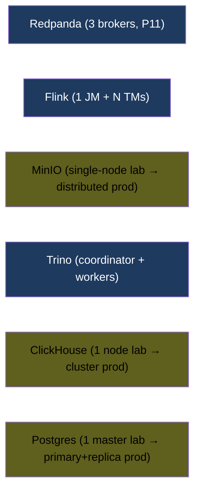
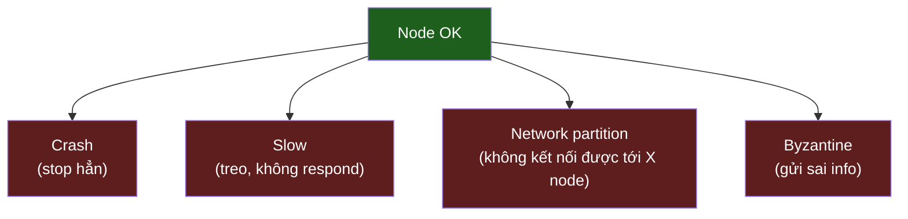

# KU 01/06 — Distributed system: nhóm bạn đi du lịch

> 1 người đi du lịch dễ. 5 người đi du lịch khó — phải đồng thuận, có người chậm, mất sóng. Đó là distributed system: nhiều node hợp tác mà mọi thứ có thể sai.

**Module:** [01 — Foundations](./README.md)
**Đọc trong:** ~10 phút

---

## 🎯 Nó là gì?

**1 người đi du lịch:**
- Quyết định nhanh: "ăn bún hay phở?"
- Không lạc đường vì biết mình đang ở đâu.
- Không "phối hợp" — chỉ 1 người.

**5 người đi du lịch:**
- "Ăn ở đâu?" → bỏ phiếu.
- Mất sóng → liên lạc đứt → 2 nhóm tách.
- 1 người ngủ quên → đợi vs đi tiếp?
- Đồng hồ mỗi người lệch vài phút → "ai trễ?" mơ hồ.

Đó là **distributed system**: nhiều "người" (node) hợp tác nhưng:
- Mạng có thể chậm / mất (mất sóng).
- Node có thể chết / treo (ngủ quên).
- Đồng hồ không khớp (KU 01/10).
- Quyết định cần đồng thuận (consensus — KU 01/09).

> *Định nghĩa hàn lâm:* Distributed system là tập hợp các node tự trị giao tiếp qua mạng để cùng đạt mục tiêu, đặc trưng bởi: **concurrency**, **partial failure**, **no global clock**.

---

## 💡 Nó làm được gì?

Distributed system mở ra khả năng:

- **Scale ngang:** thêm node = thêm khả năng (Kafka thêm broker, Trino thêm worker).
- **Fault tolerance:** 1 node chết, system vẫn chạy (3-broker Redpanda mất 1 vẫn OK).
- **Geographic distribution:** đặt node ở Singapore + US → giảm latency cho user 2 phía.
- **Resource pooling:** lakehouse trên 100 server vs 1 server "siêu khủng".

---

## 🧩 Nó là mảnh ghép nào trong tổng thể?

Trong project này, **mọi component đa node đều là distributed system**:

→ Trong lab, **đa số single-node** để tiết kiệm RAM. Trong production hầu hết sẽ multi-node.

---

## 🚀 Nó giúp ích gì?

Khi bạn hiểu mình đang ở "distributed system", bạn sẽ:

- **Không tin "ngay lập tức"** (mọi delay đều thật).
- **Thiết kế cho partial failure**: 1 node chết là chuyện thường.
- **Không tin clock** (đừng compare timestamp 2 server khác như compare cùng máy).
- **Idempotent everywhere** (KU 00/06 lại đắt giá).
- **Thiết kế cho mạng chậm** (timeout, retry, backoff).

---

## ⏰ Khi nào dùng / KHÔNG dùng?

Single-node nếu có thể là **tốt nhất**:
- Đơn giản hơn 10 lần.
- Nhanh hơn (không có network overhead).
- Ít failure mode hơn.

Chuyển sang distributed **chỉ khi**:
- Vượt khả năng 1 node mạnh nhất.
- Cần availability cao hơn (1 node = 1 SPOF).
- Cần đặt geographic gần user.

> **Quy tắc senior:** "Đừng đi distributed cho đến khi single-node thực sự không đủ." 90% startup chết vì over-engineering distributed quá sớm.

---

## 🤔 Vì sao chọn nó (vs alternatives)?

| Cách | Khi nào dùng |
|---|---|
| **Single-node** | Mặc định, đến khi không đủ |
| **Vertical scaling** (mua máy mạnh hơn) | Có ngân sách, chưa cần HA |
| **Distributed** | Khi vertical không đủ hoặc cần HA |
| **Serverless** (FaaS) | Workload sporadic |

→ Project này: lab = single-node để tiết kiệm credit. Production-inspired = giả vờ có distributed (3-broker burst test, Trino coordinator + worker).

---

## 🔧 Nó vận hành ra sao?

### 8 fallacies of distributed computing (Peter Deutsch, 1994)

Mọi engineer mới hay **giả định sai** 8 điều này:

1. The network is reliable. → **SAI**
2. Latency is zero. → **SAI**
3. Bandwidth is infinite. → **SAI**
4. The network is secure. → **SAI**
5. Topology doesn't change. → **SAI**
6. There is one administrator. → **SAI**
7. Transport cost is zero. → **SAI**
8. The network is homogeneous. → **SAI**

→ Senior **thiết kế cho mỗi cái đều sai**. Đó là toàn bộ project chaos catalog đang test.

### Modes of failure

Hệ thống "crash-stop" dễ thiết kế. Hệ thống chịu được "byzantine" (Bitcoin) khó nhất.

---

## 🧠 Self-test

1. Bạn có 1 quán phở. Mở rộng → 1 chi nhánh thứ 2 ở Q1. Bạn vừa biến quán thành "distributed system" — vấn đề mới nào xuất hiện? (3 vấn đề).
2. 8 fallacies — chọn 3 cái thấm nhất với project Kafka + Flink + Iceberg.
3. Vì sao "đừng đi distributed quá sớm" là lời khuyên đắt giá?
4. Trong lab này, đa phần là single-node. Vì sao 1 phase benchmark cố ý burst 3-broker?
5. "Byzantine failure" thường thấy ở đâu trong thực tế? Hệ thống nào trong project này CẦN xử lý byzantine?

---

## 🔗 Trong repo này

- 3-broker Redpanda cho burst test: [`adr/0002-redpanda-over-kafka.md`](../../adr/0002-redpanda-over-kafka.md)
- Chaos catalog test "partial failure": [`docs/16-failure-chaos-catalog.md`](../../docs/16-failure-chaos-catalog.md)
- Network failure storyline khai thác "the network is reliable = FALSE": [`docs/17-network-failure-storyline.md`](../../docs/17-network-failure-storyline.md)

---

## 📖 Đọc thêm (chính thống, hạn chế)

- Peter Deutsch — "8 Fallacies of Distributed Computing".
- Martin Kleppmann — DDIA ch. 8 "The Trouble with Distributed Systems".
